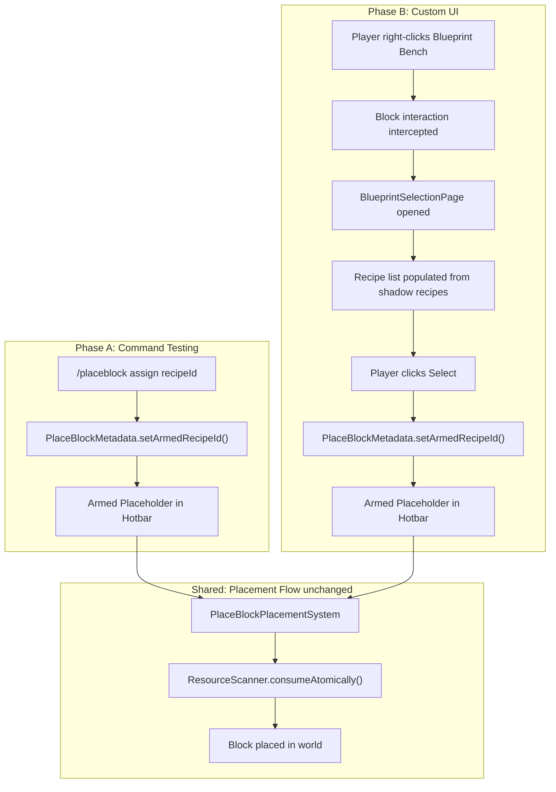
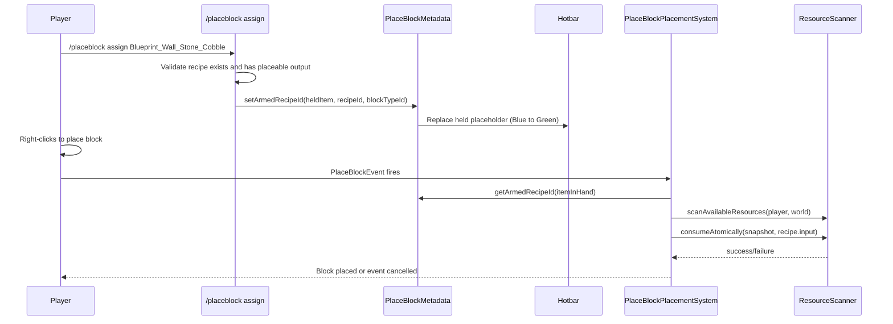
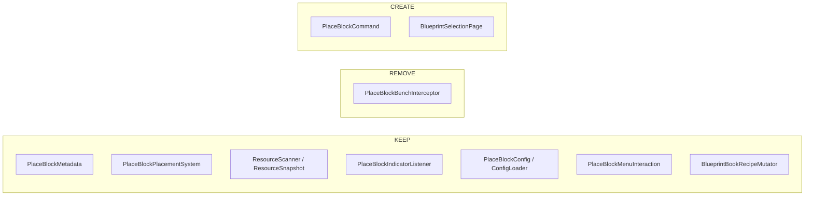

# Blueprint Bench Custom UI — Architectural Recommendation

> **Date:** 2026-04-23  
> **Status:** Recommendation (not full design doc — skeleton deferred until Phase B)  
> **Trigger:** StructuralCraftingWindow approach failed — client dims recipes when input doesn't match expected materials

## 1. Executive Summary

Abandon the `StructuralCraftingWindow` + `CraftRecipeEvent.Pre` interception approach. Replace with:

- **Phase A (immediate):** `/placeblock` command to test arming + placement pipeline without any UI
- **Phase B (production):** `InteractiveCustomUIPage` opened when player interacts with Blueprint Bench block, using `appendInline()` for UI layout

The interceptor (`PlaceBlockBenchInterceptor`) is removed. Shadow recipes and the mutator survive but change role. The placement pipeline (`PlaceBlockPlacementSystem`, `ResourceScanner`, `PlaceBlockMetadata`) is **completely unchanged**.

## 2. Phased Architecture



---

## 3. Phase A — Command-Based Assignment

### 3.1 Command Design

| Aspect | Decision |
|--------|----------|
| **Root command** | `/placeblock` (extends `AbstractCommandCollection`) |
| **Subcommands** | `assign <recipeId>`, `clear`, `list [category]`, `info` |
| **Registration** | `this.getCommandRegistry().registerCommand(new PlaceBlockCommand())` in `setup()` |
| **Tab completion** | `RequiredArg<String>` with `ArgTypes.STRING` — no autocomplete for recipe IDs in Phase A (would need custom `SingleArgumentType`). Can add later. |

### 3.2 `/placeblock assign <recipeId>` Flow



### 3.3 Command Behavior

**`/placeblock assign <recipeId>`**
- Guard: player must be holding a `Block_Placeholder` (Blue, Green, or Red)
- Guard: `recipeId` must resolve to a `CraftingRecipe` in the asset map
- Guard: recipe must have a placeable output (`Item.getBlockId() != null`)
- Accepts both shadow IDs (`Blueprint_Wall_Stone_Cobble`) and original IDs (`Wall_Stone_Cobble`) — if original ID given, prepend `Blueprint_` and look up shadow
- Calls `PlaceBlockMetadata.setArmedRecipeId()` on the held `ItemStack`
- Replaces the held item in the player's hotbar with the armed version
- Sends chat message: `"Armed: Wall_Stone_Cobble (requires: 48× Ingredient_Cobblestone)"`

**`/placeblock clear`**
- Guard: player must be holding an armed `Block_Placeholder`
- Calls `PlaceBlockMetadata.clearArmedRecipe()` on the held `ItemStack`
- Replaces held item with the unarmed version

**`/placeblock list [category]`**
- Lists all shadow recipe IDs (from `BlueprintBookRecipeMutator`), optionally filtered by bench category
- Shows recipe ID + output item name + input summary

**`/placeblock info`**
- If holding an armed placeholder: shows the armed recipe details
- If not: shows "Not holding an armed PlaceBlock"

### 3.4 Implementation Approach

The command needs access to the player's held item and the ability to replace it. Based on the existing `PreviewCommand` pattern:

```java
public class PlaceBlockCommand extends AbstractCommandCollection {
    public PlaceBlockCommand() {
        super("placeblock", "PlaceBlock building tool commands");
        addSubCommand(new AssignSubCommand());
        addSubCommand(new ClearSubCommand());
        addSubCommand(new ListSubCommand());
        addSubCommand(new InfoSubCommand());
    }
}
```

Each subcommand extends `AbstractPlayerCommand`, which gives access to `CommandContext`, `Store`, `Ref`, `PlayerRef`, and `World`.

### 3.5 What This Unblocks

Phase A lets us test the **entire placement pipeline** end-to-end:
1. Arm a placeholder via command
2. Walk to building location
3. Right-click to place → `PlaceBlockPlacementSystem` fires
4. Resources consumed from inventory/chests
5. Block placed in world
6. Indicator updates (Green → Red if resources depleted)

This validates Contracts #10, #11, #12, #13, #14 without any UI dependency.

---

## 4. Phase B — Custom UI Page

### 4.1 Base Class Decision

| Option | Verdict | Rationale |
|--------|---------|-----------|
| `InteractiveCustomUIPage<T>` | **RECOMMENDED** | Full control over layout, events, and behavior. Proven by 6+ engine features. |
| `ChoiceBasePage` | Rejected | Designed for simple choice lists. No support for input slot filtering or item grid display. |
| Raw `CustomUIPage` | Rejected | `InteractiveCustomUIPage` adds typed event handling for free. No reason to go lower. |

### 4.2 Page Design: `BlueprintSelectionPage`

```java
public class BlueprintSelectionPage 
    extends InteractiveCustomUIPage<BlueprintSelectionPage.SelectionEventData> {
    
    // Constructor receives: playerRef, list of eligible shadow recipes, held placeholder color
    // build() → constructs UI via appendInline() with:
    //   - Title: "Blueprint Bench"
    //   - Recipe list (scrollable) with item icons and names
    //   - "Select" button bound to Activating event
    //   - Affordable/unaffordable visual distinction
    // handleDataEvent() → receives selected recipe index
    //   - Arms the held placeholder via PlaceBlockMetadata
    //   - Closes the page
}
```

### 4.3 UI Layout Strategy

**Use `appendInline()` exclusively** — no `.ui` file dependency. This eliminates the key risk.

The inline markup syntax observed in engine code:
```
Label { Text: Hello; Style: (Alignment: Center); }
```

Based on `ItemRepairPage`'s fallback pattern:
```java
commandBuilder.appendInline("#ElementList", "Label { Text: %customUI.itemRepairPage.noItems; Style: (Alignment: Center); }");
```

The UI will be simpler than a full `StructuralCraftingWindow` but functional:
- A scrollable list of recipe entries (name + item icon)
- Green/gray text to distinguish affordable vs. unaffordable
- A "Select" button per recipe entry (bound to `Activating` event)
- No input slot in the custom page — the page opens only when holding a placeholder

### 4.4 How to Open the Page

**Two approaches, investigate both:**

**Option 1: Block interaction codec (preferred)**  
Register a new interaction type (like `PortableBenchInteraction`) on the Blueprint Bench block's item/interaction codec. When the player right-clicks the bench while holding a placeholder, open `BlueprintSelectionPage` instead of the standard bench.

This requires changing the bench block JSON to use a custom interaction type instead of (or alongside) the default bench interaction. The `PortableBenchInteraction` pattern proves this works — it opens a page via `player.getPageManager().setPageWithWindows()`.

**Option 2: Event interception**  
Listen for the bench's window opening event and replace the `StructuralCraftingWindow` with a custom page. More fragile but doesn't require modifying the bench block definition.

**Recommendation: Option 1** — cleaner, no race conditions.

### 4.5 Recipe Population

The recipe list comes from `BlueprintBookRecipeMutator`'s shadow recipes. At page construction:
1. Iterate `CraftingRecipe.getAssetMap()` for recipes with `Blueprint` bench requirement
2. For each recipe, check affordability via `ResourceScanner.canAfford()` against current inventory
3. Sort: affordable first, then alphabetical
4. Build the page with all recipes, visually distinguishing affordable vs. unaffordable

### 4.6 Handling "Select"

When the player clicks "Select" on a recipe entry:
1. `handleDataEvent()` receives the recipe index
2. Look up the recipe from the pre-built list
3. Get the player's held item (must still be a placeholder)
4. Call `PlaceBlockMetadata.setArmedRecipeId(heldItem, recipeId, blockTypeId)`
5. Replace the held item in the player's hotbar
6. Close the page: `player.getPageManager().setPage(ref, store, Page.None)`

**No resources consumed** — Contract #10 honored by design.

---

## 5. What Stays vs. What Changes



### Component-by-Component Analysis

| Component | Verdict | Rationale |
|-----------|---------|-----------|
| **`PlaceBlockMetadata`** | **KEEP — unchanged** | Core data model for arming/reading placeholders. Used by command, page, and placement system alike. |
| **`PlaceBlockPlacementSystem`** | **KEEP — unchanged** | Handles `PlaceBlockEvent`. Doesn't care HOW the placeholder got armed. |
| **`ResourceScanner` / `ResourceSnapshot`** | **KEEP — unchanged** | Used by placement system and (in Phase B) by the selection page for affordability filtering. |
| **`PlaceBlockIndicatorListener`** | **KEEP — unchanged** | Updates placeholder color based on resource availability. Orthogonal to arming source. |
| **`PlaceBlockConfig` / `PlaceBlockConfigLoader`** | **KEEP — unchanged** | Chest radius config used by ResourceScanner. |
| **`PlaceBlockMenuInteraction`** | **KEEP — repurpose in Phase B** | Currently a stub. In Phase B, this interaction can be the trigger that opens `BlueprintSelectionPage` when the player right-clicks the bench while holding a placeholder. Already registered as `"PlaceBlock_Menu"` codec. |
| **`BlueprintBookRecipeMutator`** | **KEEP — role changes** | Shadow recipes still needed as the canonical list of "what can be built." Phase B uses them to populate the selection page. The shadow recipes' `BenchRequirement` with `Blueprint` ID is still useful for filtering, even if no `StructuralCraftingWindow` reads them. |
| **`PlaceBlockBenchInterceptor`** | **REMOVE** | This entire class exists to intercept `CraftRecipeEvent.Pre` at the `StructuralCraftingWindow`. With the custom UI, there's no crafting event to intercept. All its reflection machinery (`BenchState`, `StructuralCraftingWindow.inputContainer`, `CraftingManager` position fields) becomes dead code. |

### Bench Block JSON

| Field | Current | Phase A | Phase B |
|-------|---------|---------|---------|
| `Bench.Type` | `"StructuralCrafting"` | **Keep** (bench still needs to be a valid bench for placement) | **Investigate**: May change to avoid engine auto-opening `StructuralCraftingWindow`. Could remove `Bench` entirely if the block uses a custom interaction instead. |
| `Bench.Id` | `"Blueprint"` | Keep | May become irrelevant if no `StructuralCraftingWindow` is involved |
| Shadow recipes | Exist with `BenchRequirement.Id = "Blueprint"` | Keep — used for recipe lookups | Keep — used to populate selection page |

### Registration Changes in `UnobstructedThirdPersonPlugin.setup()`

**Phase A:**
```java
// ADD:
this.getCommandRegistry().registerCommand(new PlaceBlockCommand());

// REMOVE (or comment out):
// this.getEntityStoreRegistry().registerSystem(new PlaceBlockBenchInterceptor());
```

**Phase B:** Additionally register the `BlueprintSelectionPage` opening logic (either via a modified `PlaceBlockMenuInteraction` or a new block interaction handler).

---

## 6. Risks and Unknowns

### Resolved by Phase A

| Risk | Status |
|------|--------|
| Can `PlaceBlockMetadata.setArmedRecipeId()` write metadata to an `ItemStack` and have the client see it? | **Test in Phase A** — command arms the placeholder and we see if the hotbar updates |
| Does `PlaceBlockPlacementSystem` correctly override the placed block type? | **Test in Phase A** — place an armed placeholder and check what block appears |
| Does `ResourceScanner.consumeAtomically()` work across inventory + chests? | **Test in Phase A** |

### Phase B Risks

| Risk | Severity | Mitigation |
|------|----------|------------|
| **R1: `appendInline()` expressiveness** — Can inline markup render item icons, scrollable lists, and styled buttons? Engine examples show `Label` and `#CheckBox` inline, but complex layouts are built from `.ui` files. | HIGH | Test inline markup incrementally. Start with a dead-simple "list of text + buttons" page. If inline is too limited, investigate reusing existing `.ui` templates (`Pages/WarpEntryButton.ui`, `Pages/DroppedItemSlot.ui`). |
| **R2: Plugin `.ui` file shipping** — Can plugins include `.ui` files that the client loads via `append("Pages/...")`? | MEDIUM | Test by placing a `.ui` file in the mod's resource path and calling `append()`. If it works, we can build rich templates. If not, `appendInline()` is the only path. |
| **R3: Bench block interaction override** — Can we prevent the engine from auto-opening `StructuralCraftingWindow` when the player right-clicks the bench, and open our custom page instead? | HIGH | Two approaches: (a) remove `Bench.Type` from the block JSON entirely, making it a plain block with a custom interaction; (b) intercept the window-open flow and replace it. Approach (a) is cleaner. |
| **R4: Held item access from custom page** — Can `handleDataEvent()` access and modify the player's held item? `InteractiveCustomUIPage` receives `Ref<EntityStore>` and `Store<EntityStore>`, from which `Player` component is accessible. | LOW | `Player` component → hotbar → held item. Same access pattern as `PortableBenchInteraction`. |
| **R5: Page + item container coordination** — If we need the placeholder in an "input slot" on the page (for visual consistency), we'd need `openCustomPageWithWindows()`. | MEDIUM | Phase B v1: skip input slot, require placeholder in hotbar. Phase B v2: add input slot via window hybrid if needed. |

### Key Unknown: Bench Interaction Override (R3)

This is the single biggest question for Phase B. The current bench block has `"Type": "StructuralCrafting"` which causes the engine to auto-open a `StructuralCraftingWindow`. To open our custom page instead, we likely need to:

1. **Remove `Bench` from the block JSON** — make it a regular block
2. **Add a custom block interaction** — either via the block's interaction codec or by listening for block-interact events
3. **Open `BlueprintSelectionPage`** from the interaction handler

The `PlaceBlockMenuInteraction` stub already exists and is registered as `"PlaceBlock_Menu"`. If this interaction codec can be attached to the bench block's JSON (as a block interaction, not an item interaction), it solves R3 cleanly.

**Investigation needed before Phase B implementation:** Can a block JSON define a custom interaction type that fires on right-click? The existing pattern (`SimpleBlockInteraction`) suggests yes, but the bench block's current `BenchBlock` component may override custom interactions.

---

## 7. Recommended Execution Order

### Phase A (do now)
1. Create `PlaceBlockCommand` with `assign`, `clear`, `list`, `info` subcommands
2. Register in `setup()`
3. Comment out `PlaceBlockBenchInterceptor` registration
4. **Test end-to-end**: arm → place → consume → indicator update

### Phase A.5 (investigate, no code)
1. Test `appendInline()` with a throwaway custom page — how much UI can we build inline?
2. Test whether plugins can ship `.ui` files
3. Test whether removing `Bench.Type` from the block JSON allows custom interaction to fire on right-click

### Phase B (after Phase A validates, and A.5 answers the unknowns)
1. Create `BlueprintSelectionPage` extending `InteractiveCustomUIPage`
2. Modify `PlaceBlockMenuInteraction` (or create new block interaction) to open the page
3. Modify bench block JSON to use custom interaction instead of `StructuralCrafting`
4. Remove `PlaceBlockBenchInterceptor.java`

---

## 8. Handoff

**Phase A is ready for implementation now.** The command follows the exact same patterns as `PreviewCommand` and `DebugCommand`. No new patterns needed.

→ **Implement Phase A**: Create `PlaceBlockCommand` with 4 subcommands, register it, comment out the interceptor.

Phase B requires investigation results from A.5 before a full design doc can be produced. The key blocker is R3 (bench interaction override).
