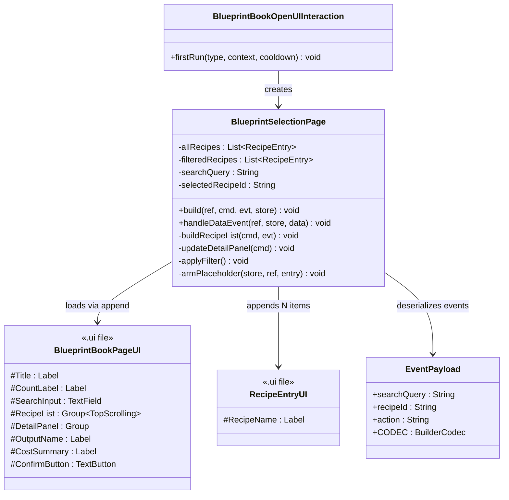
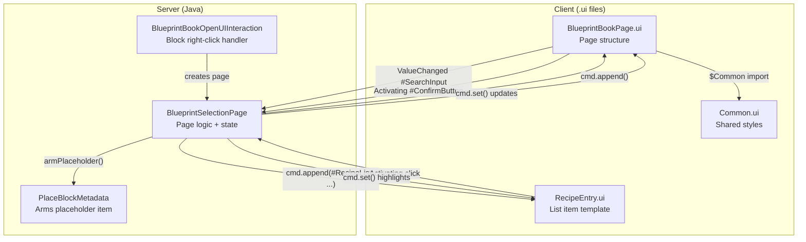
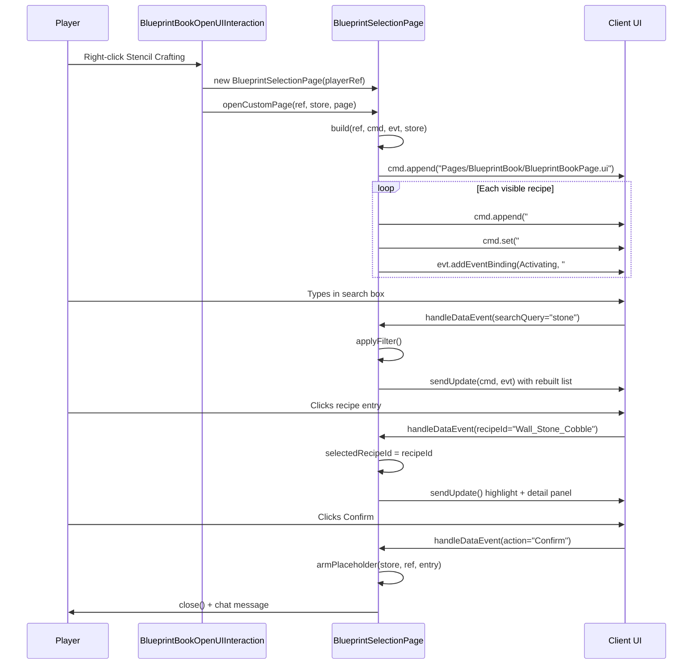

# Stencil Crafting Custom UI — Design Document

> **Date:** 2026-04-25
> **Status:** Ready for implementation
> **Supersedes:** Inline `appendInline()` UI in current `BlueprintSelectionPage.java`

## 1. Overview

Replace the current inline-markup UI in `BlueprintSelectionPage` with two custom `.ui` template files: a main page layout (`BlueprintBookPage.ui`) and a reusable recipe list entry (`RecipeEntry.ui`). The page lets players browse block-producing recipes, select one, and arm their held `Block_Placeholder` item with the selected recipe. This separates layout/styling concerns from Java server logic and makes the UI maintainable.

## 2. Design Priorities

1. **Simplicity** — Utility UI, not a AAA menu. Clean dark theme, functional layout, minimal moving parts.
2. **Separation of concerns** — `.ui` files own layout/styling; Java owns state, filtering, and event handling.
3. **Framework-native patterns** — Use `$Common.@TextField`, `$Common.@DefaultScrollbar`, `TextButton` styles from the engine rather than inventing custom ones.
4. **Testability** — Recipe filtering logic stays pure Java; UI is a thin presentation layer.

## 3. Component Diagram



## 4. Responsibility Map



## 5. Sequence Diagram



## 6. UI Layout Design

### 6.1 Visual Layout

```
┌──────────────────────────────────────────────────┐
│  Stencil Crafting                    [42 recipes]  │  ← Header (Title + CountLabel)
├──────────────────────────────────────────────────┤
│  🔍 Search recipes...                             │  ← SearchInput (TextField)
├──────────────────────────────────────────────────┤
│  ┌────────────────────────────────────────────┐  │
│  │ ▸ Wall_Stone_Cobble                        │  │  ← RecipeEntry (TextButton)
│  │   Wall_Stone_Brick                         │  │
│  │   Wall_Wood_Oak_Planks                     │  │
│  │   Fence_Wood_Oak                           │  │
│  │   Floor_Stone_Cobble                       │  │  ← Scrollable list
│  │   ...                                      │  │
│  └────────────────────────────────────────────┘  │
├──────────────────────────────────────────────────┤
│  Selected: Wall_Stone_Cobble                      │  ← DetailPanel
│  Places: Block_Wall_Stone_Cobble                  │     OutputName
│  Cost: 48× Ingredient_Cobblestone                 │     CostSummary
│                                                    │
│                              [ Confirm & Arm ]     │  ← ConfirmButton
└──────────────────────────────────────────────────┘
```

### 6.2 Color Palette

| Element | Color | Purpose |
|---------|-------|---------|
| Page background | `#141c26(0.98)` | Dark blue-gray, near-opaque |
| Header text | `#ffffff` | White, bold |
| Subtext / counts | `#6e7da1` | Muted blue-gray |
| Dividers | `#2b3542` | Subtle lines |
| Recipe entry default | `#96a9be` on transparent | Light text, no background |
| Recipe entry hovered | `#ffffff` on `#1e2a3a` | Brighten text, subtle highlight |
| Recipe entry selected | `#ffffff` on `#2a4a6a` | Blue highlight |
| Confirm button default | `#3a7bd5` | Blue accent |
| Confirm button hovered | `#4a8be5` | Lighter blue |
| Confirm button pressed | `#2a6bc5` | Darker blue |
| Detail panel labels | `#c8d6e5` | Readable light gray |

## 7. `.ui` File Contents

### 7.1 `BlueprintBookPage.ui`

**Path:** `src/main/resources/Common/UI/Custom/Pages/BlueprintBook/BlueprintBookPage.ui`
**Loaded via:** `commandBuilder.append("Pages/BlueprintBook/BlueprintBookPage.ui")`

```
// Stencil Crafting — main page layout
// Server populates #RecipeList dynamically via append() calls

$Common = "../../Common.ui";

// ── Styles ──

@HeaderStyle = LabelStyle(
    FontSize: 22, TextColor: #ffffff, RenderBold: true,
    HorizontalAlignment: Left, VerticalAlignment: Center
);

@CountStyle = LabelStyle(
    FontSize: 13, TextColor: #6e7da1,
    HorizontalAlignment: Right, VerticalAlignment: Center
);

@DetailLabelStyle = LabelStyle(
    FontSize: 14, TextColor: #c8d6e5,
    HorizontalAlignment: Left, VerticalAlignment: Center
);

@SubtextStyle = LabelStyle(
    FontSize: 12, TextColor: #6e7da1,
    HorizontalAlignment: Left, VerticalAlignment: Center
);

@ConfirmButtonStyle = TextButtonStyle(
    Default: (Background: #3a7bd5, LabelStyle: (FontSize: 15, TextColor: #ffffff,
              RenderBold: true, HorizontalAlignment: Center, VerticalAlignment: Center)),
    Hovered: (Background: #4a8be5, LabelStyle: (FontSize: 15, TextColor: #ffffff,
              RenderBold: true, HorizontalAlignment: Center, VerticalAlignment: Center)),
    Pressed: (Background: #2a6bc5, LabelStyle: (FontSize: 15, TextColor: #ffffff,
              RenderBold: true, HorizontalAlignment: Center, VerticalAlignment: Center))
);

@DisabledConfirmStyle = TextButtonStyle(
    Default: (Background: #2b3542, LabelStyle: (FontSize: 15, TextColor: #4a5568,
              RenderBold: true, HorizontalAlignment: Center, VerticalAlignment: Center)),
    Hovered: (Background: #2b3542, LabelStyle: (FontSize: 15, TextColor: #4a5568,
              RenderBold: true, HorizontalAlignment: Center, VerticalAlignment: Center)),
    Pressed: (Background: #2b3542, LabelStyle: (FontSize: 15, TextColor: #4a5568,
              RenderBold: true, HorizontalAlignment: Center, VerticalAlignment: Center))
);

// ── Page Root ──

Group {
    Anchor: (Width: 520, Height: 480);
    Background: #141c26(0.98);
    LayoutMode: Top;
    Padding: (Top: 16, Bottom: 16, Left: 20, Right: 20);

    // ── Header ──
    Group {
        Anchor: (Height: 40);
        LayoutMode: Left;

        Label #Title {
            Text: "Stencil Crafting";
            FlexWeight: 1;
            Style: @HeaderStyle;
        }

        Label #CountLabel {
            Text: "";
            Anchor: (Width: 120);
            Style: @CountStyle;
        }
    }

    // Divider
    Group { Anchor: (Height: 1); Background: #2b3542; }
    Group { Anchor: (Height: 8); }

    // ── Search Bar ──
    $Common.@TextField #SearchInput {
        Anchor: (Height: 34);
        PlaceholderText: "Search recipes...";
    }

    Group { Anchor: (Height: 8); }

    // ── Scrollable Recipe List ──
    Group #RecipeList {
        LayoutMode: TopScrolling;
        ScrollbarStyle: $Common.@DefaultScrollbar;
        FlexWeight: 1;
    }

    // Divider
    Group { Anchor: (Height: 8); }
    Group { Anchor: (Height: 1); Background: #2b3542; }
    Group { Anchor: (Height: 8); }

    // ── Detail Panel ──
    Group #DetailPanel {
        Anchor: (Height: 72);
        LayoutMode: Top;

        Label #OutputName {
            Text: "No recipe selected";
            Anchor: (Height: 20);
            Style: @DetailLabelStyle;
        }

        Label #CostSummary {
            Text: "";
            Anchor: (Height: 18);
            Style: @SubtextStyle;
        }

        Group { FlexWeight: 1; }
    }

    // ── Confirm Button ──
    Group {
        Anchor: (Height: 40);
        LayoutMode: Right;

        TextButton #ConfirmButton {
            Text: "Confirm & Arm";
            Anchor: (Width: 160, Height: 36);
            Style: @DisabledConfirmStyle;
        }
    }
}
```

### 7.2 `RecipeEntry.ui`

**Path:** `src/main/resources/Common/UI/Custom/Pages/BlueprintBook/RecipeEntry.ui`
**Loaded via:** `commandBuilder.append("#RecipeList", "Pages/BlueprintBook/RecipeEntry.ui")`

```
// Stencil Crafting — single recipe list entry
// Server sets #RecipeName.Text and applies SelectedStyle when active

@DefaultStyle = LabelStyle(
    FontSize: 14, TextColor: #96a9be,
    HorizontalAlignment: Left, VerticalAlignment: Center
);

@HoveredStyle = LabelStyle(
    FontSize: 14, TextColor: #ffffff,
    HorizontalAlignment: Left, VerticalAlignment: Center
);

@EntryStyle = TextButtonStyle(
    Default:  (Background: #141c26(0.0), LabelStyle: @DefaultStyle),
    Hovered:  (Background: #1e2a3a,      LabelStyle: @HoveredStyle),
    Pressed:  (Background: #1a2535,      LabelStyle: @HoveredStyle)
);

@SelectedStyle = TextButtonStyle(
    Default:  (Background: #2a4a6a, LabelStyle: (FontSize: 14, TextColor: #ffffff,
              RenderBold: true, HorizontalAlignment: Left, VerticalAlignment: Center)),
    Hovered:  (Background: #3a5a7a, LabelStyle: (FontSize: 14, TextColor: #ffffff,
              RenderBold: true, HorizontalAlignment: Left, VerticalAlignment: Center)),
    Pressed:  (Background: #1a3a5a, LabelStyle: (FontSize: 14, TextColor: #ffffff,
              RenderBold: true, HorizontalAlignment: Left, VerticalAlignment: Center))
);

TextButton {
    Anchor: (Height: 30);
    Style: @EntryStyle;
    Padding: (Left: 12, Right: 12);

    Label #RecipeName {
        Text: "";
        Style: @DefaultStyle;
    }
}
```

## 8. Java Integration

### 8.1 Changes to `build()`

Replace the current `appendInline()` block with `.ui` file loading:

```java
@Override
public void build(@NonNull Ref<EntityStore> ref,
                  @NonNull UICommandBuilder cmd,
                  @NonNull UIEventBuilder evt,
                  @NonNull Store<EntityStore> store) {

    // Load page template from .ui file
    cmd.append("Pages/BlueprintBook/BlueprintBookPage.ui");

    // Bind search input — ValueChanged fires on every keystroke
    evt.addEventBinding(
            CustomUIEventBindingType.ValueChanged,
            "#SearchInput",
            EventData.of("@SearchQuery", "#SearchInput.Value"),
            false
    );

    // Bind confirm button
    evt.addEventBinding(
            CustomUIEventBindingType.Activating,
            "#ConfirmButton",
            EventData.of("Action", "Confirm")
    );

    // Populate recipe list
    buildRecipeList(cmd, evt);

    // Set initial detail panel state
    updateDetailPanel(cmd);
}
```

### 8.2 Changes to `buildRecipeList()`

Replace `"Pages/BasicTextButton.ui"` with `"Pages/BlueprintBook/RecipeEntry.ui"` and use `#RecipeName.Text` instead of `.TextSpans`:

```java
private void buildRecipeList(UICommandBuilder cmd, UIEventBuilder evt) {
    cmd.clear("#RecipeList");

    int showing = Math.min(filteredRecipes.size(), PAGE_SIZE);
    for (int i = 0; i < showing; i++) {
        RecipeEntry entry = filteredRecipes.get(i);

        // Append recipe entry from .ui template
        cmd.append("#RecipeList", "Pages/BlueprintBook/RecipeEntry.ui");

        // Set the display name
        cmd.set("#RecipeList[" + i + "].#RecipeName.Text", entry.recipeId());

        // Highlight if selected
        if (entry.recipeId().equals(this.selectedRecipeId)) {
            cmd.set("#RecipeList[" + i + "].Style",
                    Value.ref("Pages/BlueprintBook/RecipeEntry.ui", "SelectedStyle"));
        }

        // Bind click event
        evt.addEventBinding(
                CustomUIEventBindingType.Activating,
                "#RecipeList[" + i + "]",
                EventData.of("RecipeId", entry.recipeId())
        );
    }

    // Update count label
    String countText = filteredRecipes.size() + " recipes";
    if (showing < filteredRecipes.size()) {
        countText = showing + " / " + filteredRecipes.size() + " recipes";
    }
    cmd.set("#CountLabel.Text", countText);
}
```

### 8.3 New `updateDetailPanel()` method

Replace the current `updateFooter()` with a richer detail panel:

```java
private void updateDetailPanel(UICommandBuilder cmd) {
    if (selectedRecipeId != null) {
        RecipeEntry entry = findEntry(selectedRecipeId);
        if (entry != null) {
            cmd.set("#OutputName.Text", "Places: " + entry.blockTypeId());

            // Build cost summary from recipe inputs
            CraftingRecipe recipe = CraftingRecipe.getAssetMap().getAsset(entry.recipeId());
            if (recipe != null) {
                StringBuilder cost = new StringBuilder("Cost: ");
                // TODO: iterate recipe.getInputs() and format "Nx ItemName, ..."
                cmd.set("#CostSummary.Text", cost.toString());
            }

            // Enable confirm button
            cmd.set("#ConfirmButton.Style",
                    Value.ref("Pages/BlueprintBook/BlueprintBookPage.ui", "ConfirmButtonStyle"));
        }
    } else {
        cmd.set("#OutputName.Text", "No recipe selected");
        cmd.set("#CostSummary.Text", "");
        // Disable confirm button (gray style)
        cmd.set("#ConfirmButton.Style",
                Value.ref("Pages/BlueprintBook/BlueprintBookPage.ui", "DisabledConfirmStyle"));
    }
}
```

### 8.4 Changes to `handleDataEvent()`

Rename `"Select"` action to `"Confirm"` and call `updateDetailPanel` instead of `updateFooter`:

```java
@Override
public void handleDataEvent(@NonNull Ref<EntityStore> ref,
                            @NonNull Store<EntityStore> store,
                            @NonNull EventPayload data) {
    UICommandBuilder cmd = new UICommandBuilder();
    UIEventBuilder evt = new UIEventBuilder();

    if (data.searchQuery != null) {
        this.searchQuery = data.searchQuery.trim();
        applyFilter();
        this.selectedRecipeId = null;
        buildRecipeList(cmd, evt);
        updateDetailPanel(cmd);
        sendUpdate(cmd, evt, false);

    } else if (data.recipeId != null) {
        this.selectedRecipeId = data.recipeId;
        buildRecipeList(cmd, evt);
        updateDetailPanel(cmd);
        sendUpdate(cmd, evt, false);

    } else if ("Confirm".equals(data.action)) {
        // Arm the placeholder — logic unchanged from current implementation
        armPlaceholder(store, ref);
    }
}
```

## 9. Selector Map

### `BlueprintBookPage.ui`

| Selector | Element | Purpose | Set by server |
|----------|---------|---------|---------------|
| `#Title` | Label | Page title | No (static) |
| `#CountLabel` | Label | "N recipes" or "N / M recipes" | Yes — `.Text` in `buildRecipeList()` |
| `#SearchInput` | TextField | Search input field | No (ValueChanged event bound) |
| `#RecipeList` | Group (TopScrolling) | Container for recipe entries | Yes — `clear()` + `append()` children |
| `#DetailPanel` | Group | Selected recipe detail area | No (children set individually) |
| `#OutputName` | Label | Shows target block type | Yes — `.Text` in `updateDetailPanel()` |
| `#CostSummary` | Label | Shows recipe ingredient costs | Yes — `.Text` in `updateDetailPanel()` |
| `#ConfirmButton` | TextButton | Arms the placeholder | Yes — `.Style` toggled enabled/disabled |

### `RecipeEntry.ui`

| Selector | Element | Purpose | Set by server |
|----------|---------|---------|---------------|
| `#RecipeName` | Label | Recipe display name | Yes — `.Text` per entry |
| (root) | TextButton | Clickable entry; `.Style` set to `SelectedStyle` when active | Yes — `.Style` on selection |

### Named style references

| File | Named Expression | Used for |
|------|-----------------|----------|
| `BlueprintBookPage.ui` | `@ConfirmButtonStyle` | Enabled confirm button |
| `BlueprintBookPage.ui` | `@DisabledConfirmStyle` | Disabled confirm button (no selection) |
| `RecipeEntry.ui` | `@EntryStyle` | Default recipe entry appearance |
| `RecipeEntry.ui` | `@SelectedStyle` | Highlighted/selected recipe entry |

## 10. Event Binding Map

| Event Type | Selector | Data Keys | Data Values | Bound in |
|------------|----------|-----------|-------------|----------|
| `ValueChanged` | `#SearchInput` | `@SearchQuery` | `#SearchInput.Value` (live) | `build()` |
| `Activating` | `#ConfirmButton` | `Action` | `"Confirm"` (static) | `build()` |
| `Activating` | `#RecipeList[i]` | `RecipeId` | recipe ID string (static per entry) | `buildRecipeList()` |

### Event codec

```java
public static class EventPayload {
    public static final BuilderCodec<EventPayload> CODEC = BuilderCodec.builder(EventPayload.class, EventPayload::new)
            .append(new KeyedCodec<>("@SearchQuery", Codec.STRING), (e, s) -> e.searchQuery = s, e -> e.searchQuery).add()
            .append(new KeyedCodec<>("RecipeId", Codec.STRING), (e, s) -> e.recipeId = s, e -> e.recipeId).add()
            .append(new KeyedCodec<>("Action", Codec.STRING), (e, s) -> e.action = s, e -> e.action).add()
            .build();

    String searchQuery;
    String recipeId;
    String action;
}
```

No changes to the existing `EventPayload` codec — the fields (`searchQuery`, `recipeId`, `action`) already cover all events. The only change is the `"Select"` action value becomes `"Confirm"`.

## 11. Package Structure

```
src/main/resources/Common/UI/Custom/
└── Pages/
    └── BlueprintBook/
        ├── BlueprintBookPage.ui          ← Main page layout
        └── RecipeEntry.ui                 ← Recipe list item template

src/main/java/com/UnobstructedThirdPerson/placeblock/ui/
├── BlueprintBookOpenUIInteraction.java   ← No changes
└── BlueprintSelectionPage.java            ← Modified: use .ui files instead of appendInline()
```

## 12. Integration Changes Required

| File | Change | Detail |
|------|--------|--------|
| `BlueprintSelectionPage.java` | **Modify `build()`** | Replace `appendInline()` call with `cmd.append("Pages/BlueprintBook/BlueprintBookPage.ui")`. Replace `#SelectButton` event binding with `#ConfirmButton`. |
| `BlueprintSelectionPage.java` | **Modify `buildRecipeList()`** | Replace `"Pages/BasicTextButton.ui"` with `"Pages/BlueprintBook/RecipeEntry.ui"`. Use `#RecipeName.Text` instead of `.TextSpans`. Use `Value.ref("Pages/BlueprintBook/RecipeEntry.ui", "SelectedStyle")` for selection highlight. |
| `BlueprintSelectionPage.java` | **Rename `updateFooter()` → `updateDetailPanel()`** | Expand to set `#OutputName.Text`, `#CostSummary.Text`, and toggle `#ConfirmButton.Style` between enabled/disabled styles. |
| `BlueprintSelectionPage.java` | **Modify `handleDataEvent()`** | Change `"Select".equals(data.action)` to `"Confirm".equals(data.action)`. Call `updateDetailPanel()` instead of `updateFooter()`. |
| `BlueprintSelectionPage.java` | **Remove `BUTTON_STYLE` / `BUTTON_STYLE_SELECTED` constants** | These referenced `Pages/BasicTextButton.ui` — no longer needed. |
| `BlueprintBookOpenUIInteraction.java` | **No changes** | Already creates `BlueprintSelectionPage` and opens it correctly. |
| `manifest.json` | **No changes** | Already has `"IncludesAssetPack": true`. |

### What can be deleted after migration

- The `BUTTON_STYLE` and `BUTTON_STYLE_SELECTED` static fields in `BlueprintSelectionPage.java`
- The `updateFooter()` method (replaced by `updateDetailPanel()`)

## 13. Open Questions

| # | Question | Impact |
|---|----------|--------|
| 1 | **Nested selector syntax**: Does `#RecipeList[i].#RecipeName.Text` work for setting text on a child element of an indexed entry? The engine uses `#RecipeList[i].TextSpans` (property on the root element). If nested `#Id` selectors don't work, we may need to flatten `RecipeEntry.ui` so the root TextButton itself displays the text. | May require simplifying `RecipeEntry.ui` to a single TextButton without a nested `#RecipeName` Label. |
| 2 | **Cost summary formatting**: How to iterate `CraftingRecipe` inputs? The recipe input API (`getInputs()`, `getMaterials()`) needs verification against decompiled code. | Affects `updateDetailPanel()` implementation. **RESOLVED:** `CraftingRecipe.getInput()` returns `MaterialQuantity[]`, and `CraftingManager.getInputMaterials(recipe, quantity)` returns `List<MaterialQuantity>`. Each `MaterialQuantity` has `getItemId()` and `getQuantity()`. |
| 3 | **Confirm button disable**: Does setting `.Style` on a TextButton to a style with identical Default/Hovered/Pressed states effectively "disable" it visually? Or should we use `Visible: false` and swap to a Label? | May need a fallback approach for the disabled state. |

## 14. Product Owner Violation Fixes (2026-04-25)

### Violation 1: Placeholder check must happen at UI-open time

**Problem:** The original design only checked for a held `Block_Placeholder` at Confirm time. The vision says the player "interacts with the bench while holding a Block_Placeholder item" — the UI should not open without one.

**Fix applied to `BlueprintBookOpenUIInteraction.java`:**
- Added `PlaceBlockMetadata.isPlaceBlock(heldItem)` check in `firstRun()` BEFORE opening the page
- If not holding a placeholder: sends `"§e[PlaceBlock] Hold a Block_Placeholder to use the Stencil Crafting."` and returns
- The Confirm-time check in `BlueprintSelectionPage.handleDataEvent()` remains as a safety net

### Violation 2: Affordability indicators on recipe entries

**Problem:** The design showed all recipes with identical styling regardless of whether the player can afford them. The vision requires "filtered by what the player can afford" with visual distinction.

**Fix applied:**

1. **`RecipeEntry.ui`** — Added `@UnaffordableStyle`:
   - Dimmed text color (`#4a5568` vs `#96a9be` for affordable)
   - Subtle hover (`#5a6578`) — still clickable but visually muted
   - Recipes are NOT hidden, just visually distinguished

2. **`BlueprintSelectionPage.java`** — New affordability check in `buildRecipeList()`:
   - Each `RecipeEntry` gains a `boolean affordable` field, computed at page-build and on search
   - Uses `CraftingManager.getInputMaterials(recipe, 1)` to get required materials
   - Uses `player.getInventory().getCombinedArmorHotbarStorage().canRemoveMaterials(materials)` for dry-run check
   - If unaffordable: `cmd.set("#RecipeList[i].Style", Value.ref("Pages/BlueprintBook/RecipeEntry.ui", "UnaffordableStyle"))`
   - Affordable recipes sort above unaffordable ones

3. **New named style references:**

| File | Named Expression | Used for |
|------|-----------------|----------|
| `RecipeEntry.ui` | `@UnaffordableStyle` | Dimmed entry for unaffordable recipes |

4. **Page constructor change:** `BlueprintSelectionPage` now accepts `Ref<EntityStore>` and `Store<EntityStore>` in addition to `PlayerRef`, so it can access inventory during `loadRecipes()` and `buildRecipeList()`.

## 15. Handoff Checklist

- [x] Component diagram included
- [x] Responsibility map included
- [x] Sequence diagram included
- [x] UI layout design with visual mockup
- [x] `.ui` file contents specified (BlueprintBookPage.ui + RecipeEntry.ui)
- [x] Java integration pseudocode for build(), buildRecipeList(), updateDetailPanel(), handleDataEvent()
- [x] Selector map — all `#Id` selectors documented with purpose and server usage
- [x] Event binding map — all events documented with data keys and values
- [x] All skeleton files created with TODO markers
- [x] Integration Changes Required section populated
- [x] Open Questions section populated
- [x] Product Owner violation fixes documented and applied
