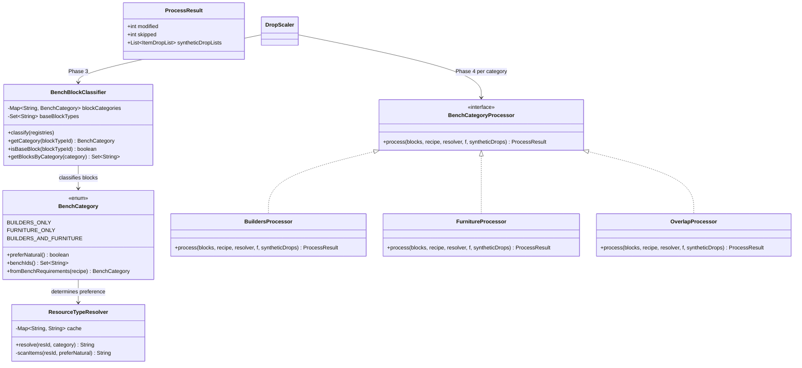
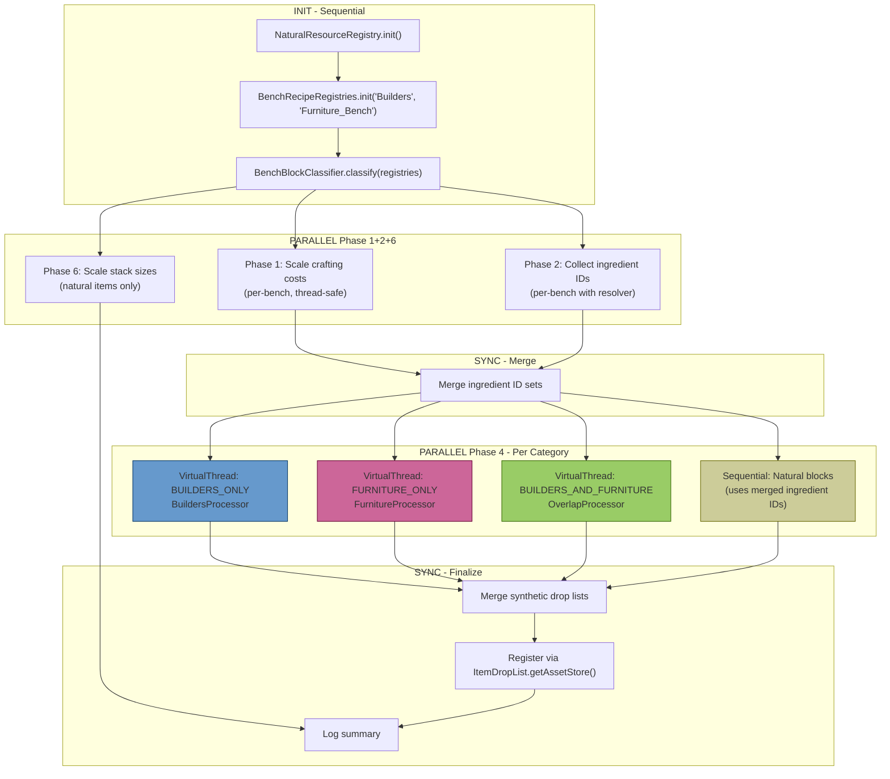
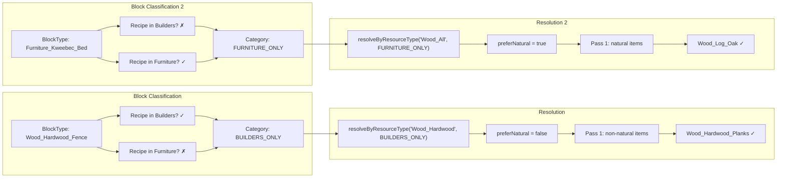
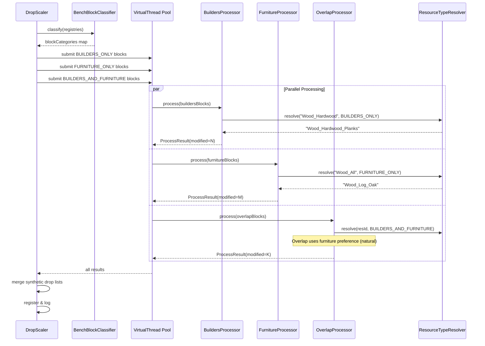

# Design: Bench-Filtered Category Processor System

## 1. Overview

Redesigns `DropScaler`'s recipe-block processing into a category-based system where blocks are partitioned by their bench requirements (`BUILDERS_ONLY`, `FURNITURE_ONLY`, `BUILDERS_AND_FURNITURE`) and processed in parallel on virtual threads. Each category has a dedicated `BenchCategoryProcessor` that controls how `ResourceTypeId` inputs resolve — Builders prefers non-natural items (planks), Furniture prefers natural items (trunks), and overlaps use furniture preference. A new `BenchBlockClassifier` partitions blocks into non-overlapping sets, and `ResourceTypeResolver` extracts the bench-aware resolution logic from `BenchRecipeRegistry`.

## 2. Design Priorities

1. **Scalability** — new bench types are added by creating a `BenchCategory` enum value and a `BenchCategoryProcessor` implementation
2. **Parallelism** — category partitions are independent; virtual threads process them concurrently
3. **No overlaps** — `BenchBlockClassifier` assigns each block exactly one category
4. **Correctness** — classification uses `isResourceTypeExclusivelyNatural` (checks ALL matching items), while drops use bench-specific preference (checks preferred items first)
5. **Engine alignment** — resolution uses exact `Item.getResourceTypes()` string equality

## 3. Component Diagram



## 4. Pipeline Flow



## 5. Resolution Strategy Per Category



## 6. Sequence Diagram — Parallel Processing



## 7. Package Structure

```
src/main/java/com/UnobstructedThirdPerson/resourcecollection/
├── BenchCategory.java              ← NEW: enum with BUILDERS_ONLY, FURNITURE_ONLY, BUILDERS_AND_FURNITURE
├── ResourceTypeResolver.java       ← NEW: bench-aware ResourceTypeId resolution + classification
├── BenchBlockClassifier.java       ← NEW: partitions blocks by bench category
├── BenchCategoryProcessor.java     ← NEW: interface for category-specific processing
├── AbstractBenchProcessor.java     ← NEW: shared recipe-block processing logic
├── BuildersProcessor.java          ← NEW: concrete processor for BUILDERS_ONLY
├── FurnitureProcessor.java         ← NEW: concrete processor for FURNITURE_ONLY
├── OverlapProcessor.java           ← NEW: concrete processor for BUILDERS_AND_FURNITURE
├── DropScaler.java                 ← MODIFY: orchestrate parallel category processing
├── BenchRecipeRegistry.java        ← MODIFY: remove resolveInputItemId/resolveByResourceType/allInputsNatural
├── BenchRecipeRegistries.java      ← MODIFY: add getRegistryForBlock()
├── NaturalResourceRegistry.java    ← unchanged
├── PlacementCostScaler.java        ← unchanged
├── AssetFieldAccessor.java         ← unchanged
└── ResourceConstants.java          ← unchanged
```

## 8. Integration Changes Required

| Existing File | Modification | Reason |
|---------------|-------------|--------|
| `BenchRecipeRegistry.java` | Remove `resolveInputItemId()`, `resolveByResourceType()`, `allInputsNatural()`. Keep `init()` but have it call `BenchBlockClassifier` for base-block classification instead of its own `allInputsNatural`. | Resolution logic moves to `ResourceTypeResolver`; classification moves to `BenchBlockClassifier` |
| `BenchRecipeRegistries.java` | Add `getRegistryForBlock(btId)` returning the `BenchRecipeRegistry` instance | Processors need to look up the registry to get the recipe |
| `DropScaler.java` | Replace the Phase 4 block-type loop with: (1) `BenchBlockClassifier.classify()`, (2) spawn virtual threads per category, (3) merge results. Update `collectIngredientItemIds()` to use `ResourceTypeResolver`. Remove `processRecipeBlock()` (moved to `AbstractBenchProcessor`). | Core pipeline restructure |

## 9. Execution Plan

### Phase 1: Create new types (no existing files modified)

1. `BenchCategory.java` — enum with `fromRecipe()` TODO ← **CREATED**
2. `ResourceTypeResolver.java` — static resolver with `resolveInputItemId()`, `resolveByResourceType()`, `isResourceTypeExclusivelyNatural()` TODOs ← **CREATED**
3. `BenchBlockClassifier.java` — classifier with `classify()`, `getBlocksByCategory()`, `getNonBaseBlocksByCategory()`, `allInputsExclusivelyNatural()` TODOs ← **CREATED**
4. `BenchCategoryProcessor.java` — interface with `ProcessResult` record ← **CREATED**
5. `AbstractBenchProcessor.java` — shared processing logic TODO ← **CREATED**
6. `BuildersProcessor.java` — returns `BUILDERS_ONLY` ← **CREATED**
7. `FurnitureProcessor.java` — returns `FURNITURE_ONLY` ← **CREATED**
8. `OverlapProcessor.java` — returns `BUILDERS_AND_FURNITURE` ← **CREATED**

### Phase 2: Implement TODOs in new types

1. `BenchCategory.fromRecipe()` — extract bench IDs, return appropriate category
2. `ResourceTypeResolver.resolveInputItemId()` — same as current but accepts `BenchCategory`
3. `ResourceTypeResolver.resolveByResourceType()` — two-pass with `category.preferNatural()`
4. `ResourceTypeResolver.isResourceTypeExclusivelyNatural()` — scan all items, short-circuit on non-natural
5. `BenchBlockClassifier.classify()` — partition blocks by bench requirements
6. `BenchBlockClassifier.getBlocksByCategory()` — filter by category value
7. `BenchBlockClassifier.getNonBaseBlocksByCategory()` — exclude base blocks
8. `BenchBlockClassifier.allInputsExclusivelyNatural()` — classification check
9. `AbstractBenchProcessor.process()` — port `processRecipeBlock` logic with `ResourceTypeResolver`

### Phase 3: Modify existing files

1. **`BenchRecipeRegistry.java`**: Remove `resolveInputItemId`, `resolveByResourceType`, `allInputsNatural`. Update `init()` base-block classification to use `BenchBlockClassifier`.
2. **`BenchRecipeRegistries.java`**: Add `getRegistryForBlock(btId)`.
3. **`DropScaler.java`**:
   - Add `BenchBlockClassifier classifier` field
   - Replace Phase 4 loop with:
     ```java
     // Classify blocks by bench category
     BenchBlockClassifier classifier = new BenchBlockClassifier();
     classifier.classify();

     // Create processors
     List<BenchCategoryProcessor> processors = List.of(
         new BuildersProcessor(),
         new FurnitureProcessor(),
         new OverlapProcessor()
     );

     // Process categories in parallel with virtual threads
     List<ProcessResult> results;
     try (var scope = new StructuredTaskScope.ShutdownOnFailure()) {
         List<Subtask<ProcessResult>> tasks = new ArrayList<>();
         for (BenchCategoryProcessor proc : processors) {
             Set<String> blocks = classifier.getNonBaseBlocksByCategory(proc.category());
             if (!blocks.isEmpty()) {
                 tasks.add(scope.fork(() ->
                     proc.process(blocks, f, ingredientItemIds)));
             }
         }
         scope.join();
         scope.throwIfFailed();
         results = tasks.stream()
             .map(Subtask::get)
             .toList();
     }

     // Merge synthetic drop lists from all categories
     for (ProcessResult r : results) {
         syntheticDropLists.addAll(r.syntheticDropLists());
         recipeModified += r.modified();
         recipeSkipped += r.skipped();
     }
     ```
   - Update `collectIngredientItemIds()` to pass `BenchCategory` to `ResourceTypeResolver`
   - Remove `processRecipeBlock()` method

### Phase 4: Update test infrastructure

1. **`AssetTestHelper.java`**: Implement `item()` overload with `ItemResourceType...` and `resourceType()` helper
2. **`TestDataSet.java`**: Add ResourceTypes to items, add fence recipe, remove BlockGroup infrastructure
3. **Test files**: Add category-specific assertions

### Phase 5: Run tests

Run `./gradlew test` and fix any failures.

## 10. Thread Safety Analysis

| Component | Thread Safety | Notes |
|-----------|--------------|-------|
| `BenchCategory` | Immutable enum | Safe |
| `ResourceTypeResolver` | Stateless static methods | Safe — reads from immutable post-init asset maps |
| `BenchBlockClassifier` | Immutable after `classify()` | Safe — built sequentially, then read-only |
| `AssetFieldAccessor` | Immutable after construction | Safe — `Field` objects are thread-safe for read |
| `AbstractBenchProcessor.process()` | Writes to block assets in its partition | Safe — each category has non-overlapping block sets |
| Synthetic drop lists | Per-processor local lists, merged post-join | Safe — no concurrent writes |
| `NaturalResourceRegistry` | Immutable after `init()` | Safe |
| `Item.getAssetMap()` | Read-only post-init | Safe |

The only concurrent writes are to `BlockType.getGathering()` via reflection, but each block type is processed by exactly one category (partitioned by `BenchBlockClassifier`), so no two threads touch the same block.

## 11. Extensibility

To add a new bench type (e.g. `ALCHEMY_BENCH`):

1. Add `ALCHEMY_ONLY(true, Set.of("Alchemy_Bench"))` to `BenchCategory`
2. Update `BenchCategory.fromRecipe()` to check for the new bench ID
3. Create `AlchemyProcessor extends AbstractBenchProcessor` that returns `BenchCategory.ALCHEMY_ONLY`
4. Add it to the processors list in `DropScaler`
5. Add overlap categories if needed (e.g. `BUILDERS_AND_ALCHEMY`)

No existing processor code changes. No existing test changes (unless testing the new category).

## 12. Open Questions

None — all design decisions resolved during discovery.
