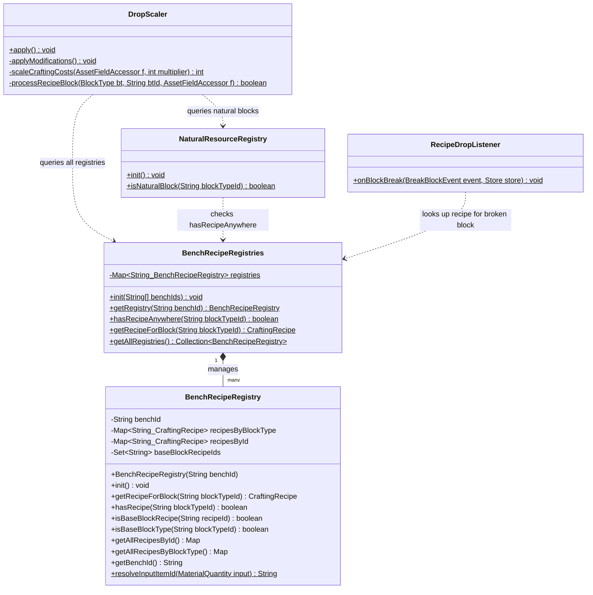
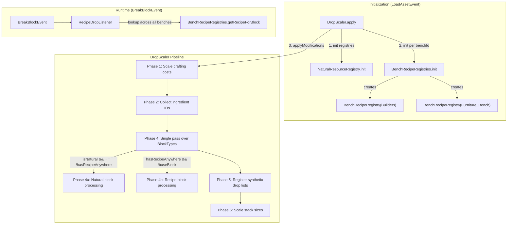
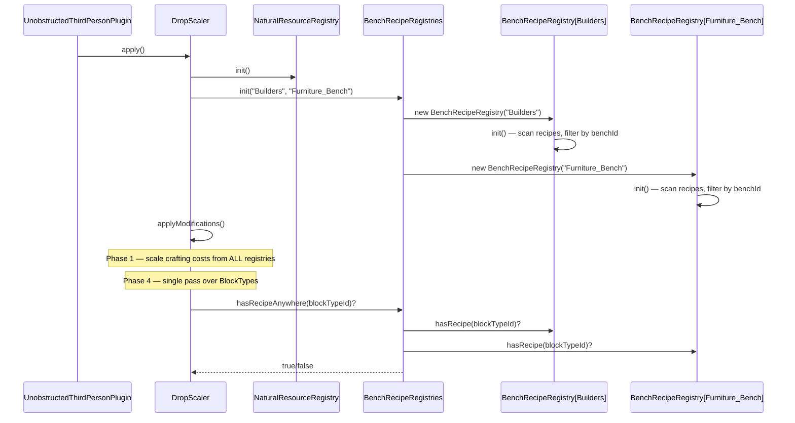

# Design: Parameterized Bench Recipe Registry

## 1. Overview

The current `BlockRecipeRegistry` filters recipes by `BenchType.StructuralCrafting`, which inadvertently excludes all Furniture Bench recipes (since the furniture bench declares `BenchType.Crafting` with `id="Furniture_Bench"`). This design replaces the single static registry with a **parameterized `BenchRecipeRegistry`** that filters by `BenchRequirement.id` instead of `BenchType`, and a **`BenchRecipeRegistries` coordinator** that manages one instance per configured bench and provides aggregate cross-bench queries.

The core principle: **one registry instance per workbench, same code, filtered by bench ID**.

## 2. Design Priorities

1. **Simplicity** — shared code via a single parameterized class; no per-bench subclasses
2. **Framework-native patterns** — matches the asset data model (`BenchRequirement.id` is the actual unique identifier)
3. **Extensibility** — adding a new bench is a one-line config change; per-bench behavior can be split later
4. **Testability** — instance-based registry is easier to test in isolation than static state

## 3. Component Diagram



## 4. Responsibility Map



## 5. Sequence Diagram



## 6. Package Structure

```
src/main/java/com/UnobstructedThirdPerson/resourcecollection/
├── BenchRecipeRegistry.java          ← NEW (replaces BlockRecipeRegistry)
├── BenchRecipeRegistries.java        ← NEW (static coordinator)
├── AssetFieldAccessor.java           (unchanged)
├── BreakBlockRecipeSystem.java       (unchanged)
├── DropScaler.java                   (modified — uses BenchRecipeRegistries)
├── NaturalResourceRegistry.java      (modified — uses BenchRecipeRegistries)
├── RecipeDropListener.java           (modified — uses BenchRecipeRegistries)
├── ResourceConstants.java            (unchanged)
├── BlockRecipeRegistry.java          ← DEPRECATED (thin facade, then delete)
├── CraftingCostModifier.java         ← DEAD CODE (already unused)
├── RecipeDropModifier.java           ← DEAD CODE (already unused)
├── NaturalDropModifier.java          ← DEAD CODE (already unused)
├── IngredientDropModifier.java       ← DEAD CODE (already unused)
├── PlacedBlockDropModifier.java      ← DEAD CODE (already unused)
├── NaturalStackSizeModifier.java     ← DEAD CODE (already unused)
└── BreakBlockNaturalSystem.java      ← DEAD CODE (already unused)
```

## 7. Integration Changes Required

### `DropScaler.java`
- Replace `BlockRecipeRegistry.init()` with `BenchRecipeRegistries.init("Builders", "Furniture_Bench")`
- Replace all `BlockRecipeRegistry.*` calls with `BenchRecipeRegistries.*` equivalents
- Phase 1 (`scaleCraftingCosts`): iterate `BenchRecipeRegistries.getAllRegistries()` instead of `BlockRecipeRegistry.getAllRecipesById()`
- Phase 4: use `BenchRecipeRegistries.hasRecipeAnywhere(btId)` and `BenchRecipeRegistries.isBaseBlockTypeAnywhere(btId)`
- `processRecipeBlock`: use `BenchRecipeRegistries.getRecipeForBlock(btId)` which searches all benches
- `collectIngredientItemIds`: iterate all registries

### `NaturalResourceRegistry.java`
- Replace `isCraftingBench(recipe)` filter with a bench-ID-based check using `BenchRecipeRegistries`, OR keep the self-contained filter but switch to checking `BenchRequirement.id` against the configured bench IDs
- Simplest: use `BenchRecipeRegistries.hasRecipeAnywhere(blockTypeId)` in the natural-vs-crafted classification

### `RecipeDropListener.java`
- Replace `BlockRecipeRegistry.getRecipeForBlock(blockTypeId)` with `BenchRecipeRegistries.getRecipeForBlock(blockTypeId)`
- Remove the duplicated `resolveByBlockGroup()` method; use `BenchRecipeRegistry.resolveInputItemId()` instead

### `BlockRecipeRegistry.java`
- Can be deleted once all callsites are migrated. Alternatively, convert to a thin facade that delegates to `BenchRecipeRegistries` for backward compatibility during migration.

### `AssetTestHelper.java` (test)
- Add overloaded `recipe()` method that accepts a `String benchId` parameter to construct `BenchRequirement` with the ID field set
- Update existing test data sets to use bench IDs

## 8. Open Questions

1. **Are there bench IDs beyond `"Builders"` and `"Furniture_Bench"` that should be included?** The `Workbench` and `Fieldcraft` benches produce items too (e.g., tools, workbenches themselves). If those items have `blockId` set, they'd need registries too. For now the design only covers the two requested benches, but adding more is trivial.

2. **Should `BenchRecipeRegistries.getRecipeForBlock()` have a priority order when multiple benches produce the same block?** Currently `BlockRecipeRegistry` uses `putIfAbsent`, so first-seen wins. The coordinator should define whether bench order matters. Recommendation: iterate in the order benches were registered; first match wins.

3. **`NaturalResourceRegistry` initialization order** — Currently `NaturalResourceRegistry.init()` runs before `BlockRecipeRegistry.init()` and has its own `isCraftingBench()` filter. After this change, it should run *after* `BenchRecipeRegistries.init()` so it can use `hasRecipeAnywhere()` instead of duplicating the bench filter logic. `DropScaler.apply()` already controls this order.
