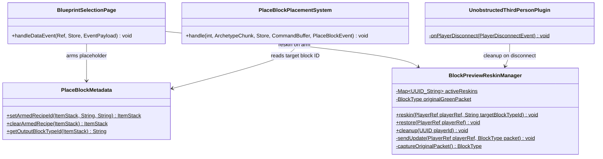
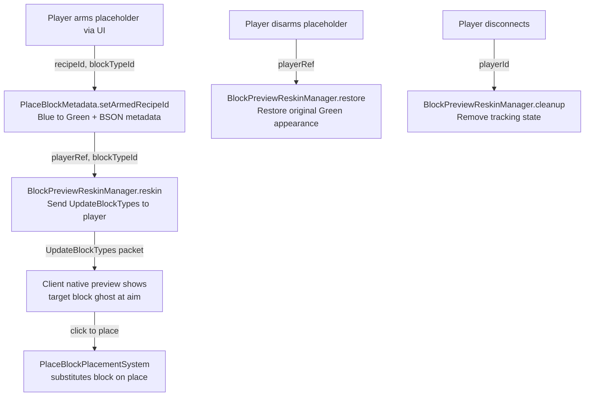
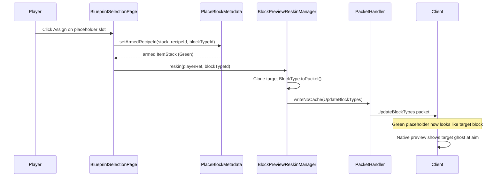

# Design: Block Preview Integration — UpdateBlockTypes Reskin

**Story:** S2604221125 — Block Preview Integration with Armed Placeholder  
**Date:** 2026-04-25

---

## 1. Overview

When a player arms a `Block_Placeholder` with a recipe (e.g., "Oak_Planks"), the engine's native block preview system should show a ghost of Oak_Planks — not the placeholder — at the aimed position. This is achieved by sending an `UpdateBlockTypes` packet to the player that reskins the Green placeholder's block type definition to match the target block's appearance. The client's built-in preview then renders the target block as a translucent ghost with zero server-side per-tick cost.

**Core principle:** One packet on arm, one packet on disarm. The engine does the rest.

## 2. Design Priorities

1. **Simplicity** — minimal new code; one new utility class + hooks in existing code
2. **Framework-native patterns** — leverage the client's built-in preview rendering
3. **Performance** — no per-tick raycast or packet spam; reskin is a one-shot packet
4. **Testability** — reskin logic isolated in a single static utility

## 3. Component Diagram



## 4. Responsibility Map



## 5. Sequence Diagram — Arm Flow



## 6. Component Descriptions

### BlockPreviewReskinManager (NEW)

Static utility class that manages per-player `UpdateBlockTypes` reskins of `Block_Placeholder_Green`. Pattern follows `PlaceholderTransparencyUtil` and `PreviewBlockSubCommand`.

**State:**
- `activeReskins: Map<UUID, String>` — tracks which player has an active reskin and what `targetBlockTypeId` it is (for idempotency and debugging)
- `originalGreenPacket: BlockType` — cached original packet of `Block_Placeholder_Green` for restoration (captured lazily on first use)

**Key behaviors:**
- `reskin()` — clones the target block's full `toPacket()` output, sends it as the Green placeholder's block type definition via `UpdateBlockTypes`. Idempotent: re-arming with the same block type skips the packet. Re-arming with a different block type just sends the new reskin (no restore needed first — the packet overwrites).
- `restore()` — sends `UpdateBlockTypes` with the original Green placeholder packet. Only sends if the player has an active reskin.
- `cleanup()` — removes player from tracking map. No packet needed (player is disconnecting).

### BlueprintSelectionPage (MODIFIED)

The `handleDataEvent()` method's `"Assign:"` action branch needs one addition: after arming the placeholder via `PlaceBlockMetadata.setArmedRecipeId()`, call `BlockPreviewReskinManager.reskin(playerRef, blockTypeId)`.

Requires resolving `PlayerRef` from the store (same pattern already used elsewhere in the class).

### UnobstructedThirdPersonPlugin (MODIFIED)

The `onPlayerDisconnect()` handler needs one line: `BlockPreviewReskinManager.cleanup(playerRef.getUuid())`.

### Block_Placeholder_Green.json (MODIFIED)

Add `PlacementSettings` with `BlockPreviewVisibility: Default` to explicitly enable native preview rendering. While the default may already work, being explicit prevents regressions if engine defaults change.

## 7. Interface Contracts

### BlockPreviewReskinManager

```java
/**
 * Reskins Block_Placeholder_Green for the given player so the client's native
 * block preview shows the target block's appearance instead of the placeholder.
 *
 * Sends an UpdateBlockTypes packet that replaces the Green placeholder's block
 * type definition with a clone of the target block's packet data.
 *
 * Idempotent: if the player already has a reskin for the same targetBlockTypeId,
 * no packet is sent. If the target differs, the new reskin overwrites the old.
 *
 * @param playerRef       the player to send the reskin to (non-null)
 * @param targetBlockTypeId the block type ID to reskin to, e.g. "Oak_Planks" (non-null)
 * @throws IllegalArgumentException if targetBlockTypeId is not in the asset map
 */
public static void reskin(@Nonnull PlayerRef playerRef, @Nonnull String targetBlockTypeId);

/**
 * Restores Block_Placeholder_Green to its original appearance for the given player.
 *
 * Sends an UpdateBlockTypes packet with the cached original Green placeholder packet.
 * No-op if the player has no active reskin.
 *
 * @param playerRef the player to restore (non-null)
 */
public static void restore(@Nonnull PlayerRef playerRef);

/**
 * Removes the player's tracking state without sending a packet.
 * Call on disconnect — the connection is closing so no packet is needed.
 *
 * @param playerId the player's UUID (non-null)
 */
public static void cleanup(@Nonnull UUID playerId);
```

## 8. Package Structure

```
src/main/java/com/UnobstructedThirdPerson/placeblock/
├── BlockPreviewReskinManager.java   ← NEW: reskin utility
├── PlaceBlockMetadata.java          ← existing (no changes)
├── PlaceBlockPlacementSystem.java   ← existing (no changes)
└── ui/
    └── BlueprintSelectionPage.java  ← MODIFIED: add reskin call

src/main/java/com/
└── UnobstructedThirdPersonPlugin.java  ← MODIFIED: add cleanup on disconnect

src/main/resources/Server/Item/Items/Tool/
└── Block_Placeholder_Green.json     ← MODIFIED: add PlacementSettings
```

## 9. Integration Changes Required

### BlueprintSelectionPage.java — Add reskin call after arming

In `handleDataEvent()`, in the `"Assign:"` branch, after:
```java
ItemStack armed = PlaceBlockMetadata.setArmedRecipeId(stack, entry.recipeId, entry.blockTypeId);
combined.setItemStackForSlot(slotIndex, armed);
```

Add:
```java
PlayerRef playerRef = store.getComponent(ref, PlayerRef.getComponentType());
if (playerRef != null) {
    BlockPreviewReskinManager.reskin(playerRef, entry.blockTypeId);
}
```

### UnobstructedThirdPersonPlugin.java — Add cleanup on disconnect

In `onPlayerDisconnect()`, add:
```java
BlockPreviewReskinManager.cleanup(playerRef.getUuid());
```

### Block_Placeholder_Green.json — Add PlacementSettings

Add to the `BlockType` section:
```json
"PlacementSettings": {
    "BlockPreviewVisibility": "Default"
}
```

### Future: Disarm flow

Wherever `PlaceBlockMetadata.clearArmedRecipe()` is called, also call:
```java
BlockPreviewReskinManager.restore(playerRef);
```

This is not yet implemented — there is no disarm UI action. Note this as a required pairing for the engineer.

## 10. Risks and Mitigations

| Risk | Severity | Mitigation |
|------|----------|------------|
| Reskin affects ALL Green placeholder instances in the world for that player | Low | Green placeholders are only created when arming; they're not naturally occurring. Blue is the default state. |
| `updateMapGeometry = true` may cause brief visual flicker | Low | Test with real client. Can try `false` if flicker is unacceptable — textures may still update without it. |
| `PlacementSettings` in JSON may not be recognized in inline `BlockType` | Low | The codec is registered on `BlockType.CODEC`; test on server startup. Fallback: remove the setting (default may already work). |
| Target block has `DrawType: Model` but Green placeholder is `DrawType: Cube` | Low | The reskin replaces the entire block type packet including `drawType`, so the client receives the correct geometry. |
| `toPacket()` uses a `SoftReference` cache on `BlockType` — cloning the cached packet | None | We use `new BlockType(packet)` copy constructor as shown in `PreviewBlockSubCommand`. |
| Multiple armed placeholders in inventory all show the same preview | Medium | All Green placeholders share one block type. The last-armed target wins the preview. This is acceptable for v1 — players typically arm one at a time. |

## 11. Open Questions

1. **Disarm trigger**: There is no disarm UI action yet. The `clearArmedRecipe()` method exists but isn't wired to a UI event. When this is built, `BlockPreviewReskinManager.restore()` must be called alongside it.
2. **Model blocks**: Will the reskin correctly render model-type blocks (e.g., fences, stairs) as previews? The packet includes `drawType` and model data, but this needs client testing.
3. **`updateMapGeometry` flag**: Is this needed for preview-only reskins? Setting it `true` follows the pattern in `PreviewBlockSubCommand`, but it may trigger unnecessary chunk remeshing. Worth testing with `false`.

## Handoff Checklist

- [x] Component diagram included
- [x] Responsibility map included
- [x] Sequence diagram included
- [x] All interfaces have Javadoc contracts
- [x] All skeleton files created with TODO markers
- [x] Integration Changes Required section populated
- [x] Open Questions section populated
- [x] Config changes documented
- [x] Risks and mitigations documented
