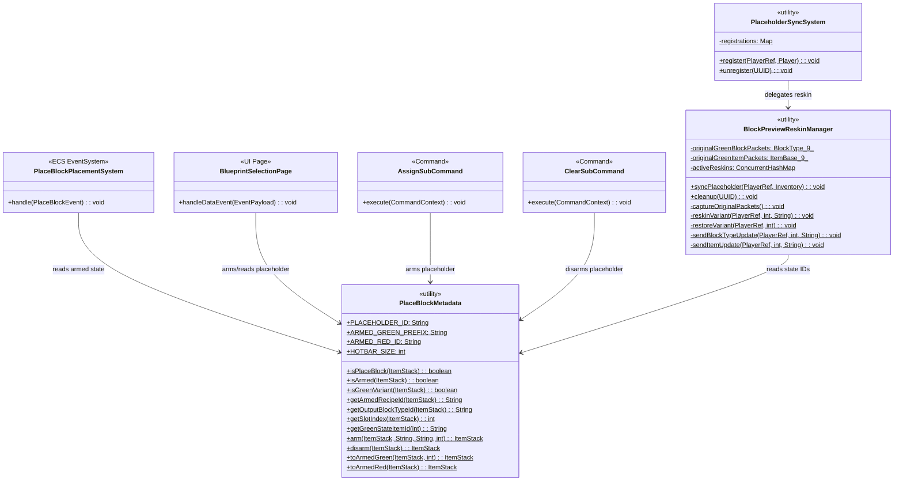
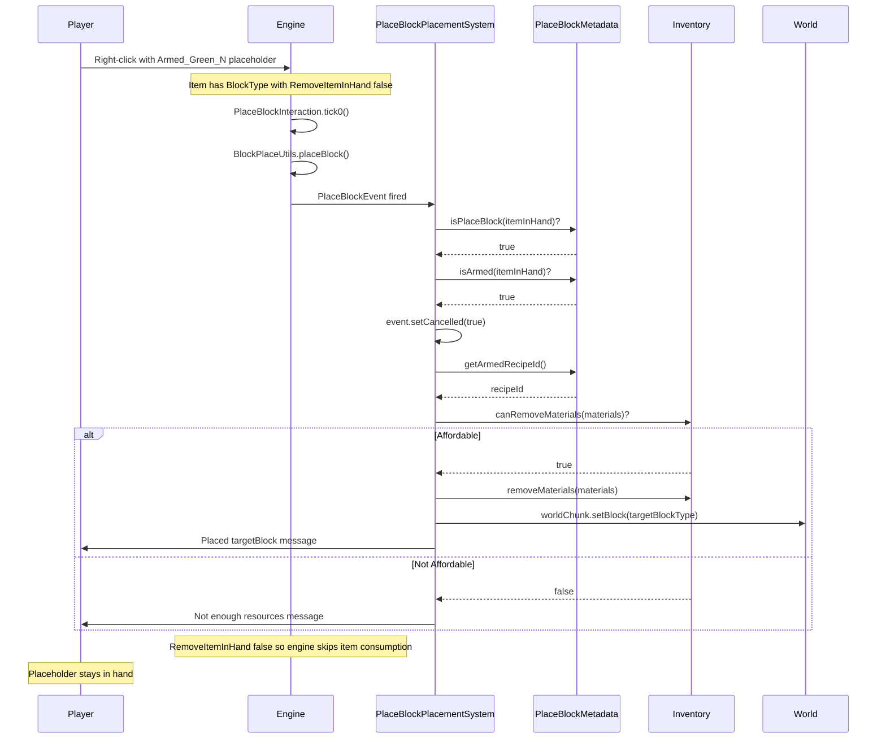

# Design: Container Placeholder Refactor — 12 Items → 1 Item × 11 States

> **Status:** Design  
> **Date:** 2026-04-26  
> **Scope:** Refactor the PlaceBlock placeholder from 12 separate item JSON files (1 base Blue + 9 Green slot variants + 1 Green base + 1 Red) to a single item JSON with 11 states using Hytale's Item State system.

---

## 1. Overview

The PlaceBlock placeholder is refactored from 12 separate registered items (`Block_Placeholder_Blue`, `Block_Placeholder_Green`, `Block_Placeholder_Green_0` through `_8`, `Block_Placeholder_Red`) to a **single item** (`Block_Placeholder`) with **11 JSON-defined states**: the stateless base (Blue), 9 armed Green slot states (`Armed_Green_0` through `Armed_Green_8`), and 1 armed Red state (`Armed_Red`).

**Why 9 Green states?** `UpdateBlockTypes` reskins by block type INDEX and the reskin is global per block type ID. Two hotbar slots armed with different recipes need different block type IDs to show independent ghost block previews. Each `Armed_Green_N` state defines its own inline `BlockType`, producing a unique block type index. 9 Green states = 9 independent block type indices = 9 independent previews across all hotbar slots.

**Why 1 Red state?** The Red state provides visual feedback that a recipe is unaffordable. Since the player can't place when unaffordable, per-slot previews are unnecessary — a single red cube is sufficient. All armed placeholders that become unaffordable switch to the shared `Armed_Red` state. The slot index is preserved in metadata (`SlotIndex`) so the placeholder can return to the correct `Armed_Green_N` when materials become available again.

The key enabling mechanism is `RemoveItemInHand: false` on the `PlaceBlock` interaction in armed states — the engine will not consume the placeholder on right-click, so the `PlaceBlockPlacementSystem` ECS handler retains full control over placement and resource consumption without the `SlotFilter.DENY` workaround currently protecting the active slot.

---

## 2. Design Priorities

1. **Simplicity** — Collapse 12 registered items and their JSON files to 1 item × 11 states in a single JSON file
2. **Correctness** — `RemoveItemInHand: false` eliminates the race between engine consumption and plugin cancellation; `SlotFilter` pattern becomes unnecessary
3. **Framework-native patterns** — Use Hytale's Item State system (`withState()`, state-level Interactions/BlockType/Quality overrides) the same way the bucket item does
4. **Per-slot independence** — 9 Green states with unique block type IDs enable independent ghost block previews across all hotbar slots via `UpdateBlockTypes`
5. **Extensibility** — Adding a 12th state (e.g., "cooldown") is a JSON-only change + one `withState()` call

---

## 3. Component Diagram



---

## 4. Responsibility Map

```mermaid
graph TB
    subgraph Arming
        UI[BlueprintSelectionPage / AssignSubCommand]
        UI -->|"arm(stack, recipeId, blockTypeId, slot)"| META[PlaceBlockMetadata]
        META -->|"withState Armed_Green_N + metadata"| STACK[New ItemStack]
        STACK -->|"setItemStackForSlot"| HOTBAR[Hotbar Container]
        HOTBAR -->|"changeEvent fires"| SYNC[PlaceholderSyncSystem]
        SYNC -->|"syncPlaceholder()"| RESKIN[BlockPreviewReskinManager]
        RESKIN -->|"UpdateBlockTypes per slot index"| CLIENT[Client sees per-slot preview]
    end

    subgraph Placement
        RCLICK[Player right-clicks] -->|"Engine fires PlaceBlockEvent"| PPS[PlaceBlockPlacementSystem]
        PPS -->|"event.setCancelled true"| CANCEL[Prevent placeholder placement]
        PPS -->|"removeMaterials()"| CONSUME[Consume recipe materials]
        CONSUME -->|"worldChunk.setBlock()"| PLACED[Target block placed in world]
        PPS -.->|"RemoveItemInHand false"| SAFE[Item stays in hand]
    end

    subgraph Affordability
        INV_CHANGE[Inventory changes] -->|"changeEvent"| SYNC2[PlaceholderSyncSystem]
        SYNC2 -->|"scan hotbar for armed placeholders"| SCAN[Per armed placeholder]
        SCAN -->|"check canRemoveMaterials"| AFFORD{Affordable?}
        AFFORD -->|"Yes + currently Red"| GREEN["toArmedGreen(slot) via SlotIndex metadata"]
        AFFORD -->|"No + currently Green"| RED["toArmedRed() preserving metadata"]
        GREEN -->|"setItemStackForSlot"| HOTBAR2[Hotbar updated]
        RED -->|"setItemStackForSlot"| HOTBAR2
    end
```



---

## 5. Sequence Diagram — Placement Flow with `RemoveItemInHand: false`



---

## 6. State Transition Matrix

| From | To | Trigger | Metadata Change |
|------|----|---------|-----------------|
| Base | Armed_Green_{slot} | Player selects recipe at bench | RecipeId, TargetBlockId, SlotIndex set |
| Armed_Green_{slot} | Armed_Red | `canRemoveMaterials()` fails | None (preserved) |
| Armed_Red | Armed_Green_{slot} | `canRemoveMaterials()` passes | SlotIndex read to determine target Green state |
| Armed_Green_{slot} | Base | Player clears recipe | Metadata cleared |
| Armed_Red | Base | Player clears recipe | Metadata cleared |
| Armed_Green_{slot} | Armed_Green_{slot2} | Placeholder moved between hotbar slots | SlotIndex updated |

**Notes:**
- `{slot}` is the hotbar slot index (0–8). Each `Armed_Green_N` has a unique block type index for independent `UpdateBlockTypes` reskins.
- When transitioning Armed_Red → Armed_Green_{slot}, the target slot is recovered from the `SlotIndex` metadata key stored on the ItemStack.
- The Armed_Green_{slot} → Armed_Green_{slot2} transition occurs when the player moves a placeholder to a different hotbar position. The system detects the slot mismatch and re-arms with the new slot's Green state to maintain correct block type ID binding.

---

## 7. JSON Structure — Single Placeholder Item with 11 States

### `Block_Placeholder.json`

```json
{
  "TranslationProperties": {
    "Name": "server.items.Block_Placeholder.name",
    "Description": "server.items.Block_Placeholder.description"
  },
  "Icon": "Icons/ItemsGenerated/Debug_Block.png",
  "Categories": ["Tool.PlaceBlock"],
  "ResourceTypes": [{ "Id": "PlaceBlock" }],
  "SubCategory": "BuildingTools",
  "MaxStack": 1,
  "Quality": "Tool",
  "PlayerAnimationsId": "Block",
  "BlockType": {
    "Material": "Solid",
    "DrawType": "Cube",
    "Opacity": "Transparent",
    "Textures": [{ "All": "BlockTextures/Editor_Empty.png", "Weight": 1 }],
    "Tint": ["#4488cc"],
    "BlockParticleSetId": "Stone",
    "BlockSoundSetId": "Stone"
  },
  "Interactions": {
    "Use": "PlaceBlock_Menu"
  },
  "State": {
    "Armed_Green_0": {
      "Variant": true,
      "Quality": "Uncommon",
      "Icon": "Icons/ItemsGenerated/Debug_Block.png",
      "BlockType": {
        "Material": "Solid",
        "DrawType": "Cube",
        "Opacity": "Transparent",
        "Textures": [{ "All": "BlockTextures/Editor_Empty.png", "Weight": 1 }],
        "Tint": ["#44cc66"],
        "BlockParticleSetId": "Stone",
        "BlockSoundSetId": "Stone",
        "PlacementSettings": {
          "BlockPreviewVisibility": "Default"
        }
      },
      "Interactions": {
        "Use": "PlaceBlock_Menu",
        "Secondary": {
          "Interactions": [{
            "Type": "PlaceBlock",
            "RemoveItemInHand": false
          }]
        }
      }
    },
    "Armed_Green_1": {
      "Variant": true,
      "Quality": "Uncommon",
      "Icon": "Icons/ItemsGenerated/Debug_Block.png",
      "BlockType": {
        "Material": "Solid",
        "DrawType": "Cube",
        "Opacity": "Transparent",
        "Textures": [{ "All": "BlockTextures/Editor_Empty.png", "Weight": 1 }],
        "Tint": ["#44cc66"],
        "BlockParticleSetId": "Stone",
        "BlockSoundSetId": "Stone",
        "PlacementSettings": {
          "BlockPreviewVisibility": "Default"
        }
      },
      "Interactions": {
        "Use": "PlaceBlock_Menu",
        "Secondary": {
          "Interactions": [{
            "Type": "PlaceBlock",
            "RemoveItemInHand": false
          }]
        }
      }
    },
    "Armed_Green_2": {
      "Variant": true,
      "Quality": "Uncommon",
      "Icon": "Icons/ItemsGenerated/Debug_Block.png",
      "BlockType": {
        "Material": "Solid",
        "DrawType": "Cube",
        "Opacity": "Transparent",
        "Textures": [{ "All": "BlockTextures/Editor_Empty.png", "Weight": 1 }],
        "Tint": ["#44cc66"],
        "BlockParticleSetId": "Stone",
        "BlockSoundSetId": "Stone",
        "PlacementSettings": {
          "BlockPreviewVisibility": "Default"
        }
      },
      "Interactions": {
        "Use": "PlaceBlock_Menu",
        "Secondary": {
          "Interactions": [{
            "Type": "PlaceBlock",
            "RemoveItemInHand": false
          }]
        }
      }
    },
    "Armed_Green_3": {
      "Variant": true,
      "Quality": "Uncommon",
      "Icon": "Icons/ItemsGenerated/Debug_Block.png",
      "BlockType": {
        "Material": "Solid",
        "DrawType": "Cube",
        "Opacity": "Transparent",
        "Textures": [{ "All": "BlockTextures/Editor_Empty.png", "Weight": 1 }],
        "Tint": ["#44cc66"],
        "BlockParticleSetId": "Stone",
        "BlockSoundSetId": "Stone",
        "PlacementSettings": {
          "BlockPreviewVisibility": "Default"
        }
      },
      "Interactions": {
        "Use": "PlaceBlock_Menu",
        "Secondary": {
          "Interactions": [{
            "Type": "PlaceBlock",
            "RemoveItemInHand": false
          }]
        }
      }
    },
    "Armed_Green_4": {
      "Variant": true,
      "Quality": "Uncommon",
      "Icon": "Icons/ItemsGenerated/Debug_Block.png",
      "BlockType": {
        "Material": "Solid",
        "DrawType": "Cube",
        "Opacity": "Transparent",
        "Textures": [{ "All": "BlockTextures/Editor_Empty.png", "Weight": 1 }],
        "Tint": ["#44cc66"],
        "BlockParticleSetId": "Stone",
        "BlockSoundSetId": "Stone",
        "PlacementSettings": {
          "BlockPreviewVisibility": "Default"
        }
      },
      "Interactions": {
        "Use": "PlaceBlock_Menu",
        "Secondary": {
          "Interactions": [{
            "Type": "PlaceBlock",
            "RemoveItemInHand": false
          }]
        }
      }
    },
    "Armed_Green_5": {
      "Variant": true,
      "Quality": "Uncommon",
      "Icon": "Icons/ItemsGenerated/Debug_Block.png",
      "BlockType": {
        "Material": "Solid",
        "DrawType": "Cube",
        "Opacity": "Transparent",
        "Textures": [{ "All": "BlockTextures/Editor_Empty.png", "Weight": 1 }],
        "Tint": ["#44cc66"],
        "BlockParticleSetId": "Stone",
        "BlockSoundSetId": "Stone",
        "PlacementSettings": {
          "BlockPreviewVisibility": "Default"
        }
      },
      "Interactions": {
        "Use": "PlaceBlock_Menu",
        "Secondary": {
          "Interactions": [{
            "Type": "PlaceBlock",
            "RemoveItemInHand": false
          }]
        }
      }
    },
    "Armed_Green_6": {
      "Variant": true,
      "Quality": "Uncommon",
      "Icon": "Icons/ItemsGenerated/Debug_Block.png",
      "BlockType": {
        "Material": "Solid",
        "DrawType": "Cube",
        "Opacity": "Transparent",
        "Textures": [{ "All": "BlockTextures/Editor_Empty.png", "Weight": 1 }],
        "Tint": ["#44cc66"],
        "BlockParticleSetId": "Stone",
        "BlockSoundSetId": "Stone",
        "PlacementSettings": {
          "BlockPreviewVisibility": "Default"
        }
      },
      "Interactions": {
        "Use": "PlaceBlock_Menu",
        "Secondary": {
          "Interactions": [{
            "Type": "PlaceBlock",
            "RemoveItemInHand": false
          }]
        }
      }
    },
    "Armed_Green_7": {
      "Variant": true,
      "Quality": "Uncommon",
      "Icon": "Icons/ItemsGenerated/Debug_Block.png",
      "BlockType": {
        "Material": "Solid",
        "DrawType": "Cube",
        "Opacity": "Transparent",
        "Textures": [{ "All": "BlockTextures/Editor_Empty.png", "Weight": 1 }],
        "Tint": ["#44cc66"],
        "BlockParticleSetId": "Stone",
        "BlockSoundSetId": "Stone",
        "PlacementSettings": {
          "BlockPreviewVisibility": "Default"
        }
      },
      "Interactions": {
        "Use": "PlaceBlock_Menu",
        "Secondary": {
          "Interactions": [{
            "Type": "PlaceBlock",
            "RemoveItemInHand": false
          }]
        }
      }
    },
    "Armed_Green_8": {
      "Variant": true,
      "Quality": "Uncommon",
      "Icon": "Icons/ItemsGenerated/Debug_Block.png",
      "BlockType": {
        "Material": "Solid",
        "DrawType": "Cube",
        "Opacity": "Transparent",
        "Textures": [{ "All": "BlockTextures/Editor_Empty.png", "Weight": 1 }],
        "Tint": ["#44cc66"],
        "BlockParticleSetId": "Stone",
        "BlockSoundSetId": "Stone",
        "PlacementSettings": {
          "BlockPreviewVisibility": "Default"
        }
      },
      "Interactions": {
        "Use": "PlaceBlock_Menu",
        "Secondary": {
          "Interactions": [{
            "Type": "PlaceBlock",
            "RemoveItemInHand": false
          }]
        }
      }
    },
    "Armed_Red": {
      "Variant": true,
      "Quality": "Developer",
      "Icon": "Icons/ItemsGenerated/Debug_Block.png",
      "BlockType": {
        "Material": "Solid",
        "DrawType": "Cube",
        "Opacity": "Transparent",
        "Textures": [{ "All": "BlockTextures/Editor_Empty.png", "Weight": 1 }],
        "Tint": ["#cc4444"],
        "BlockParticleSetId": "Stone",
        "BlockSoundSetId": "Stone",
        "PlacementSettings": {
          "BlockPreviewVisibility": "Default"
        }
      },
      "Interactions": {
        "Use": "PlaceBlock_Menu",
        "Secondary": {
          "Interactions": [{
            "Type": "PlaceBlock",
            "RemoveItemInHand": false
          }]
        }
      }
    }
  }
}
```

### Registered Asset IDs After Loading

| Asset | Registered ID | Type |
|-------|---------------|------|
| Base item | `Block_Placeholder` | Item |
| Base block type | `Block_Placeholder` | BlockType |
| Armed Green 0 item | `*Block_Placeholder_State_Armed_Green_0` | Item |
| Armed Green 0 block type | `*Block_Placeholder_State_Armed_Green_0` | BlockType |
| Armed Green 1 item | `*Block_Placeholder_State_Armed_Green_1` | Item |
| Armed Green 1 block type | `*Block_Placeholder_State_Armed_Green_1` | BlockType |
| Armed Green 2 item | `*Block_Placeholder_State_Armed_Green_2` | Item |
| Armed Green 2 block type | `*Block_Placeholder_State_Armed_Green_2` | BlockType |
| Armed Green 3 item | `*Block_Placeholder_State_Armed_Green_3` | Item |
| Armed Green 3 block type | `*Block_Placeholder_State_Armed_Green_3` | BlockType |
| Armed Green 4 item | `*Block_Placeholder_State_Armed_Green_4` | Item |
| Armed Green 4 block type | `*Block_Placeholder_State_Armed_Green_4` | BlockType |
| Armed Green 5 item | `*Block_Placeholder_State_Armed_Green_5` | Item |
| Armed Green 5 block type | `*Block_Placeholder_State_Armed_Green_5` | BlockType |
| Armed Green 6 item | `*Block_Placeholder_State_Armed_Green_6` | Item |
| Armed Green 6 block type | `*Block_Placeholder_State_Armed_Green_6` | BlockType |
| Armed Green 7 item | `*Block_Placeholder_State_Armed_Green_7` | Item |
| Armed Green 7 block type | `*Block_Placeholder_State_Armed_Green_7` | BlockType |
| Armed Green 8 item | `*Block_Placeholder_State_Armed_Green_8` | Item |
| Armed Green 8 block type | `*Block_Placeholder_State_Armed_Green_8` | BlockType |
| Armed Red item | `*Block_Placeholder_State_Armed_Red` | Item |
| Armed Red block type | `*Block_Placeholder_State_Armed_Red` | BlockType |

**Total: 22 registered asset IDs** (11 items + 11 block types) from a single JSON file.

### Why 9 Green States Need Separate BlockType Definitions

Each `Armed_Green_N` state must define its own inline `BlockType` because:
1. The client only shows a ghost block preview when the held item has a non-null `blockId`
2. `UpdateBlockTypes` reskins a specific block type INDEX — each Green state's block type has a unique index, enabling independent per-slot reskins
3. The `PlaceBlockEvent` only fires when the item has a `BlockType` — no block type = no placement trigger
4. Two hotbar slots armed with different recipes need different block type IDs to avoid global reskin interference

### Why `Quality` Must Be Specified Per State

Quality uses `.append()` not `.appendInherited()` in `Item.java`. If omitted from a state, it defaults to `null`, not the parent's Quality. Each state must explicitly declare its Quality.

### `RemoveItemInHand: false` — How It Works

From decompiled `BlockPlaceUtils.placeBlock()`:

```java
if (isAdventureMode && removeItemInHand) {
    // consume item — but removeItemInHand is false, so this is SKIPPED
}
```

The `PlaceBlock` interaction reads `RemoveItemInHand` from its codec config. Setting it to `false` means:
- The engine fires `PlaceBlockEvent` normally (our `PlaceBlockPlacementSystem` intercepts it)
- The engine does NOT consume the held item afterward
- Our system cancels the event (preventing the placeholder block from being placed in the world)
- Our system then consumes recipe materials from inventory and places the target block

**This eliminates the `SlotFilter.DENY` workaround entirely.** The current code protects the active hotbar slot via `SlotFilter.DENY` to prevent `removeMaterials()` from consuming the placeholder. With `RemoveItemInHand: false`, the engine never touches the placeholder, so the slot filter is unnecessary.

### Base State Has No `PlaceBlock` Interaction

The base (Blue/unarmed) state uses only `"Use": "PlaceBlock_Menu"`. It has no `Secondary` interaction and no `PlaceBlock` interaction. Right-clicking opens the menu. The `PlaceBlockEvent` will not fire for the base state because the interaction chain does not include `PlaceBlock`.

Wait — the base state still has a `BlockType`. Will the engine fire `PlaceBlockEvent` regardless of the interaction config?

**Answer: No.** `PlaceBlockEvent` is fired from within `PlaceBlockInteraction.tick0()` → `BlockPlaceUtils.placeBlock()`. It only fires when a `PlaceBlock` interaction is active. The base state's `Use: PlaceBlock_Menu` triggers `PlaceBlockMenuInteraction`, not `PlaceBlockInteraction`. The base state's `BlockType` exists solely so the client shows *something* when the item is held (the blue-tinted cube), but placement is not available.

---

## 8. Changes Required Per Java File

### 8.1 `PlaceBlockMetadata.java` — REWRITE

**Current:** 12 constants, variant indexing (`GREEN_VARIANT_PREFIX`, `getVariantItemId`, `toVariant`, `toBaseGreen`), recipe ID ↔ metadata via `BsonDocument`.  
**New:**

| Change | Detail |
|--------|--------|
| Replace all item ID constants | `PLACEHOLDER_ID = "Block_Placeholder"`, `ARMED_GREEN_PREFIX = "*Block_Placeholder_State_Armed_Green_"`, `ARMED_RED_ID = "*Block_Placeholder_State_Armed_Red"`, `HOTBAR_SIZE = 9` |
| `isPlaceBlock()` | Check `id.equals(PLACEHOLDER_ID) \|\| id.startsWith(ARMED_GREEN_PREFIX) \|\| id.equals(ARMED_RED_ID)` |
| `isArmed()` | Check `id.startsWith(ARMED_GREEN_PREFIX) \|\| id.equals(ARMED_RED_ID)` |
| `isGreenVariant()` | Check `id.startsWith(ARMED_GREEN_PREFIX)` |
| `arm(stack, recipeId, blockTypeId, hotbarSlot)` | Set metadata (RecipeId, TargetBlockId, SlotIndex), then `stack.withState("Armed_Green_" + hotbarSlot)`. Returns new ItemStack |
| `disarm(stack)` | Clear metadata, create `new ItemStack(PLACEHOLDER_ID, ...)` to return to base |
| `toArmedGreen(stack, slot)` | Swap to `Armed_Green_{slot}` preserving metadata. For Red → Green recovery |
| `toArmedRed(stack)` | Swap to `Armed_Red` preserving metadata. For Green → Red affordability transition |
| `getSlotIndex(stack)` | Parse slot number from item ID suffix (for Green states) or from `SlotIndex` metadata key (for Red state) |
| `getGreenStateItemId(slot)` | Returns `ARMED_GREEN_PREFIX + slot` |

### 8.2 `BlockPreviewReskinManager.java` — SAME 9-SLOT LOGIC, NEW IDs

**Current:** Manages 9 `originalVariantPackets[]` and 9 `originalVariantItemPackets[]`. Loops over 9 hotbar slots. Per-slot reskin/restore logic.  
**New:**

| Change | Detail |
|--------|--------|
| Arrays remain 9-element | `originalGreenBlockPackets[9]`, `originalGreenItemPackets[9]` — one per `Armed_Green_N` state |
| `captureOriginalPackets()` | Loop 0–8, lookup `*Block_Placeholder_State_Armed_Green_{i}` block type and item assets |
| `reskinVariant()` / `restoreVariant()` | Same per-slot logic, new variant ID format (`*Block_Placeholder_State_Armed_Green_{i}` instead of `Block_Placeholder_Green_{i}`) |
| `sendBlockTypeUpdate()` | Lookup numeric index of `*Block_Placeholder_State_Armed_Green_{i}`, send `UpdateBlockTypes` with target block's textures |
| `sendItemUpdate()` | Same, with state-based variant ID |
| Per-player state unchanged | `activeReskins` remains `ConcurrentHashMap<UUID, Map<Integer, String>>` — per-slot tracking, same as current 9-variant approach |

### 8.3 `PlaceholderSyncSystem.java` — ADD AFFORDABILITY LOGIC

**Current:** Registers change listeners, delegates to `BlockPreviewReskinManager.syncHotbar()`.  
**New:**

| Change | Detail |
|--------|--------|
| Add affordability check | On inventory change, scan hotbar for armed placeholders. For each: check `canRemoveMaterials()` |
| Green → Red transition | If unaffordable + currently Green → `PlaceBlockMetadata.toArmedRed(stack)`, then `setItemStackForSlot` |
| Red → Green transition | If affordable + currently Red → read `SlotIndex` from metadata, `PlaceBlockMetadata.toArmedGreen(stack, slotIndex)`, then `setItemStackForSlot` |
| Idempotency guard | Only call `setItemStackForSlot` if state actually changed. Prevents infinite loop from container change events |
| Slot index in metadata | `SlotIndex` metadata key stored on arm, preserved across Green ↔ Red transitions. Used to recover the correct `Armed_Green_N` state |
| Rename delegation | Call `BlockPreviewReskinManager.syncPlaceholder()` instead of `syncHotbar()` |
| Keep same lifecycle | `register()` / `unregister()` unchanged |

### 8.4 `PlaceBlockPlacementSystem.java` — REMOVE SLOTFILTER

**Current:** Sets `SlotFilter.DENY` on active hotbar slot before `removeMaterials()`, clears it in `finally`.  
**New:**

| Change | Detail |
|--------|--------|
| Remove `SlotFilter.DENY` block entirely | With `RemoveItemInHand: false`, the engine never consumes the placeholder. `removeMaterials()` won't match it because the placeholder has no material overlap with recipe inputs. The `try/finally` with `setSlotFilter`/`clearSlotFilter` is dead code |
| Remove `SlotFilter` and `FilterActionType` imports | No longer needed |
| Remove `hotbar`, `activeSlot` local variables | Only `container` needed — no slot-level protection required |
| `isPlaceBlock()` / `isArmed()` calls unchanged | Just reference the new constants transparently (PlaceBlockMetadata API is the same) |

### 8.5 `BlueprintSelectionPage.java` — UPDATE ARM CALL

**Current:** Calls `PlaceBlockMetadata.setArmedRecipeId()`, iterates all placeholders in combined inventory.  
**New:**

| Change | Detail |
|--------|--------|
| Replace `setArmedRecipeId()` with `arm()` | `PlaceBlockMetadata.arm(stack, recipeId, blockTypeId, hotbarSlot)` — now includes hotbar slot parameter |
| Hotbar slot resolution | Determine which hotbar slot the placeholder is in, pass as `hotbarSlot` parameter |
| Update `isPlaceBlock()` calls | No change needed — API is the same |

### 8.6 `AssignSubCommand.java` — UPDATE ARM CALL

| Change | Detail |
|--------|--------|
| Replace `PlaceBlockMetadata.setArmedRecipeId()` with `arm()` | Includes hotbar slot: `arm(stack, recipeId, blockTypeId, hotbarSlot)` |

### 8.7 `ClearSubCommand.java` — UPDATE DISARM CALL

| Change | Detail |
|--------|--------|
| Replace `PlaceBlockMetadata.clearArmedRecipe()` with `disarm()` | Returns base state item |

### 8.8 `PlaceBlockBenchInterceptor.java` — UPDATE ARM CALL (if re-enabled)

Currently disabled (`// this.getEntityStoreRegistry().registerSystem(new PlaceBlockBenchInterceptor())`). If re-enabled:

| Change | Detail |
|--------|--------|
| Replace `PlaceBlockMetadata.setArmedRecipeId()` with `arm()` | Same pattern, includes hotbar slot |

### 8.9 `UnobstructedThirdPersonPlugin.java` — NO CHANGE

Registration calls are to `PlaceholderSyncSystem` and `BlockPreviewReskinManager` which keep the same public API shapes (`register`, `unregister`, `cleanup`).

### 8.10 `PlaceBlockIndicatorListener.java` — DELETE

This file is a stub (all methods are `// TODO`). Its purpose — affordability-driven quality switching — is now handled by the state system directly. `PlaceholderSyncSystem` will own the `Armed_Green_N` ↔ `Armed_Red` state transition on inventory change.

### 8.11 `PlaceBlockConfig.java` / `PlaceBlockConfigLoader.java` — UPDATE

| Change | Detail |
|--------|--------|
| `placeholderItemId` field | Update default/expected value from `"Block_Placeholder_Green"` to `"Block_Placeholder"` |

### 8.12 `InfoSubCommand.java` / `ListSubCommand.java` — MINOR

| Change | Detail |
|--------|--------|
| Display text | Update any references to variant IDs (e.g., `Block_Placeholder_Green_0`) to reflect state-based IDs (e.g., `*Block_Placeholder_State_Armed_Green_0`) |

---

## 9. Package Structure

No new files. This is a consolidation refactor. The final structure:

```
src/main/resources/Server/Item/Items/Tool/
└── Block_Placeholder.json              ← REWRITTEN (single file with 11 states)

src/main/java/com/UnobstructedThirdPerson/placeblock/
├── PlaceBlockMetadata.java             ← REWRITTEN
├── BlockPreviewReskinManager.java      ← SIMPLIFIED
├── PlaceholderSyncSystem.java          ← UPDATED (affordability transitions)
├── PlaceBlockPlacementSystem.java      ← SIMPLIFIED (remove SlotFilter)
├── PlaceBlockMenuInteraction.java      ← NO CHANGE
├── PlaceBlockBenchInterceptor.java     ← MINOR (if re-enabled)
├── PlaceBlockConfig.java               ← MINOR
├── PlaceBlockConfigLoader.java         ← NO CHANGE
├── BlueprintBenchRecipeMutator.java    ← NO CHANGE
└── ui/
    └── BlueprintSelectionPage.java     ← MINOR (arm() rename)

src/main/java/com/UnobstructedThirdPerson/command/placeblock/subcommands/
├── AssignSubCommand.java               ← MINOR (arm() rename)
├── ClearSubCommand.java                ← MINOR (disarm() rename)
├── InfoSubCommand.java                 ← MINOR (display text)
└── ListSubCommand.java                 ← MINOR (display text)
```

---

## 10. Files to DELETE

### JSON Files (9 slot variants + individual Blue/Red/Green)

| File | Reason |
|------|--------|
| `Server/Item/Items/Tool/Block_Placeholder_Green.json` | Replaced by base state in `Block_Placeholder.json` |
| `Server/Item/Items/Tool/Block_Placeholder_Green_0.json` | Per-slot variant — eliminated |
| `Server/Item/Items/Tool/Block_Placeholder_Green_1.json` | Per-slot variant — eliminated |
| `Server/Item/Items/Tool/Block_Placeholder_Green_2.json` | Per-slot variant — eliminated |
| `Server/Item/Items/Tool/Block_Placeholder_Green_3.json` | Per-slot variant — eliminated |
| `Server/Item/Items/Tool/Block_Placeholder_Green_4.json` | Per-slot variant — eliminated |
| `Server/Item/Items/Tool/Block_Placeholder_Green_5.json` | Per-slot variant — eliminated |
| `Server/Item/Items/Tool/Block_Placeholder_Green_6.json` | Per-slot variant — eliminated |
| `Server/Item/Items/Tool/Block_Placeholder_Green_7.json` | Per-slot variant — eliminated |
| `Server/Item/Items/Tool/Block_Placeholder_Green_8.json` | Per-slot variant — eliminated |
| `Server/Item/Items/Tool/Block_Placeholder_Blue.json` | Replaced by base state (Quality: Tool, blue tint) |
| `Server/Item/Items/Tool/Block_Placeholder_Red.json` | Replaced by `Armed_Red` state |

**Total: 12 JSON files deleted**, replaced by 1.

### Java Files

| File | Reason |
|------|--------|
| `PlaceBlockIndicatorListener.java` | Stub with all-TODO methods. Affordability logic moves to `PlaceholderSyncSystem` |

---

## 11. Migration Path

### Phase 1: JSON + PlaceBlockMetadata (can be tested standalone)

1. Create `Block_Placeholder.json` with the 11-state structure (section 7)
2. Delete the 12 old JSON files
3. Rewrite `PlaceBlockMetadata.java` with new constants and state-based methods
4. **Test:** `/give Block_Placeholder` — verify base item appears blue, with PlaceBlock_Menu interaction

### Phase 2: Arming + State Transitions

5. Update `AssignSubCommand` and `ClearSubCommand` to use new `arm()` / `disarm()` API
6. Update `BlueprintSelectionPage` to use `arm()` with hotbar slot parameter
7. **Test:** `/placeblock assign Cobble_Wall` — verify item switches to `Armed_Green_N` state (green quality, N = hotbar slot)
8. **Test:** `/placeblock clear` — verify item returns to base (blue quality)
9. **Test:** Arm placeholders in slots 0 and 3 with different recipes — verify different state IDs (`Armed_Green_0`, `Armed_Green_3`)

### Phase 3: Reskin Manager

10. Update `BlockPreviewReskinManager` for 9-slot state reskin (`Armed_Green_0` through `Armed_Green_8`)
11. Update `PlaceholderSyncSystem` to call `syncPlaceholder()` and add affordability state transitions
12. **Test:** Arm placeholder in slot 0 → verify ghost preview shows target block, not placeholder cube
13. **Test:** Arm two slots with different recipes → verify each shows independent ghost preview
14. **Test:** Drop required materials → verify state switches to Armed_Red
15. **Test:** Re-acquire materials → verify state switches back to correct `Armed_Green_N` (via SlotIndex metadata)

### Phase 4: SlotFilter Removal

16. Remove the `SlotFilter.DENY` block from `PlaceBlockPlacementSystem`
17. Remove `hotbar`, `activeSlot` local variables
18. **Test:** Place a block with armed placeholder → verify placeholder stays in hand AND materials consumed
19. **Test:** Place when unaffordable → verify placement denied, placeholder remains

### Phase 5: Cleanup

20. Delete `PlaceBlockIndicatorListener.java`
21. Update `PlaceBlockConfig` / config JSON if needed
22. Update `InfoSubCommand` / `ListSubCommand` display strings
23. Full integration test pass — verify all 9 hotbar slots can hold independently armed placeholders

### Rollback

Each phase is independently revertible via git. Phase 1 (JSON changes) is the only phase that breaks backward compatibility with existing player inventories — any player holding `Block_Placeholder_Green_3` will have an invalid item. This is acceptable for a development environment. For a production system, a migration script would scan player inventories and convert old item IDs to the new base ID with appropriate metadata.

---

## 12. Risk Assessment

| ID | Risk | Severity | Mitigation |
|----|------|----------|------------|
| R1 | `RemoveItemInHand: false` on a `PlaceBlock` interaction type might not be supported (only tested on `PlaceFluid` in the bucket) | **High** | Decompiled source shows `PlaceBlockInteraction` has the same `removeItemInHand` codec field as `PlaceFluidInteraction`. The field is read in `BlockPlaceUtils.placeBlock()` which both interactions call. **Test in Phase 1** by manually adding `RemoveItemInHand: false` to a test block item |
| R2 | `PlaceBlockEvent` might not fire when `RemoveItemInHand: false` | **Medium** | Event is fired BEFORE the `removeItemInHand` check in `BlockPlaceUtils.placeBlock()`. The decompiled flow is: create event → invoke → check cancelled → if not cancelled, then check removeItemInHand. Our system cancels, so the removeItemInHand path is never reached regardless. **But** verify the interaction chain still reaches `placeBlock()` when RemoveItemInHand=false |
| R3 | `Secondary` interaction on armed states might conflict with `Use: PlaceBlock_Menu` | **Low** | Hytale resolves `Use` and `Secondary` independently. `Use` fires on the Use key (likely middle-click or key bind), `Secondary` fires on right-click. The bucket already uses `Secondary` for fluid placement alongside other interactions |
| R4 | Players with existing `Block_Placeholder_Green_X` items in inventory will have broken items after migration | **Low (dev env)** | Development environment only. `/clear` and re-give. Document in release notes if shipped |
| R5 | State-generated block type IDs (`*Block_Placeholder_State_Armed_Green_0` through `_8`) might not work with `UpdateBlockTypes` | **Medium** | Each generated ID is a standard entry in `BlockType.getAssetMap()` with a unique numeric index. `UpdateBlockTypes` works on numeric block type indices, not string IDs. As long as `getIndex()` resolves each generated ID to a valid index, per-slot reskinning works. **Test in Phase 3** with two slots armed to different recipes |
| R6 | `removeMaterials()` might accidentally match the placeholder item as a material | **Very Low** | Placeholder has `ResourceTypes: [PlaceBlock]`. No crafting recipe uses `PlaceBlock` as an input material. Even without SlotFilter, the placeholder would never be consumed by `removeMaterials()` |
| R7 | Affordability state switch (`Armed_Green_N` ↔ `Armed_Red`) triggers a container change event → infinite loop | **Medium** | `PlaceholderSyncSystem` must check whether the state actually needs changing before calling `setItemStackForSlot`. If the item is already in the correct state, skip. This is the same idempotency pattern `BlockPreviewReskinManager.reskinVariant()` already uses |
| R8 | Multiple armed placeholders in hotbar all switch to `Armed_Red` simultaneously — `SlotIndex` metadata must be preserved per-item to recover the correct Green state | **Low** | `SlotIndex` is stored in the ItemStack's metadata (BsonDocument), not globally. Each placeholder carries its own `SlotIndex`. When affordability is restored, each Red placeholder reads its own `SlotIndex` to determine which `Armed_Green_N` to return to |

---

## 13. Interaction with `RemoveItemInHand: false` — Detailed Flow

### Current Flow (without `RemoveItemInHand: false`)

```
1. Player right-clicks → engine resolves PlaceBlock interaction from item's Interactions
2. PlaceBlockInteraction.tick0() → BlockPlaceUtils.placeBlock()
3. placeBlock() creates PlaceBlockEvent, invokes on entity store
4. PlaceBlockPlacementSystem.handle():
   a. Checks isPlaceBlock() → true
   b. event.setCancelled(true)
   c. Checks affordability
   d. SlotFilter.DENY on active slot ← WORKAROUND
   e. removeMaterials() from inventory
   f. SlotFilter clear ← WORKAROUND
   g. worldChunk.setBlock(targetBlockType)
5. placeBlock() sees event.isCancelled() → returns WITHOUT consuming item
   (The SlotFilter was protection against a scenario that doesn't actually happen)
```

### New Flow (with `RemoveItemInHand: false`)

```
1. Player right-clicks → engine resolves PlaceBlock interaction from Armed_Green_N state
2. PlaceBlockInteraction.tick0() → BlockPlaceUtils.placeBlock()
   (removeItemInHand = false, read from state's interaction config)
3. placeBlock() creates PlaceBlockEvent, invokes on entity store
4. PlaceBlockPlacementSystem.handle():
   a. Checks isPlaceBlock() → true
   b. event.setCancelled(true)
   c. Checks affordability
   d. removeMaterials() from inventory (NO SlotFilter needed)
   e. worldChunk.setBlock(targetBlockType)
5. placeBlock() sees event.isCancelled() → returns WITHOUT consuming item
   (Even if it weren't cancelled: removeItemInHand=false means the engine
    skips the consumption code path in the else branch too)
```

**The key insight:** `RemoveItemInHand: false` provides **defense in depth**. Even if our plugin fails to cancel the event (bug, exception, load order issue), the engine still won't consume the placeholder. The cancellation and `RemoveItemInHand: false` are independent protections that both prevent item loss.

---

## 14. Multi-Recipe Per Hotbar — Design Decision

### Why 9 Green States Instead of 1?

`UpdateBlockTypes` reskins a block type by its numeric INDEX, and that reskin is global per block type ID for a given player. If all armed placeholders shared a single `Armed_Green` block type ID, arming slot 3 with "Cobble_Wall" would reskin the ghost preview for ALL armed placeholders — including slot 0 which is armed with "Oak_Planks".

**9 Green states = 9 independent block type indices.** Each `Armed_Green_N` state defines its own inline `BlockType` in the JSON. The engine registers each as a separate block type with a unique numeric index. `BlockPreviewReskinManager` can now send `UpdateBlockTypes` targeting `*Block_Placeholder_State_Armed_Green_0` independently of `*Block_Placeholder_State_Armed_Green_3`, producing independent ghost previews per hotbar slot.

### Why Not Collapse to 1 Green + 1 Red?

A simpler 3-state design (base + 1 Green + 1 Red) was considered but rejected because:

1. **Ghost preview interference** — Two armed placeholders in different hotbar slots would show the same ghost preview (the last-reskinned block), confusing the player about which recipe each slot holds
2. **Core UX promise** — The PlaceBlock system's value proposition is "arm multiple hotbar slots with different building recipes for fast switching". Collapsing to one-recipe-at-a-time undermines this
3. **No API workaround** — `UpdateBlockTypes` has no per-slot scoping. The only way to get independent previews is separate block type IDs, which means separate states

### Why 1 Red State Is Sufficient

The Red state doesn't need per-slot variants because:

1. **No placement when unaffordable** — The player can't place anyway, so the ghost preview's appearance is irrelevant
2. **Single visual cue** — A red cube in any slot communicates "this recipe is unaffordable" regardless of which recipe it is
3. **Slot recovery via metadata** — When materials become available again, the `SlotIndex` metadata key tells `PlaceholderSyncSystem` which `Armed_Green_N` state to return to

---

## 15. Open Questions

| # | Question | Impact |
|---|----------|--------|
| 1 | Does the base state (unarmed, no `Secondary` interaction) still show a ghost preview when aiming at a surface? If so, it shows the blue placeholder cube, which may confuse players | UX — may want to set `"BlockPreviewVisibility": "Hidden"` on the base state's BlockType, or remove BlockType from base entirely (but then the item has no 3D model when held) |
| 2 | Can `ItemStack.withState()` be called on a state variant to switch to a sibling state? (e.g., `Armed_Green_3` → `Armed_Red` directly, without going through base) | If yes, simplifies affordability transitions. If no, must go base → target state. The item-state-system research says children inherit `stateToBlock`, so `withState()` on a child SHOULD work for sibling transitions |
| 3 | Does `withState()` support state names with numeric suffixes (e.g., `"Armed_Green_0"`)? The bucket uses simple state names like `"Water"`. State names with underscores and digits may need testing | If state names are restricted to alphanumeric-only, a naming convention change may be required (e.g., `"ArmedGreen0"` instead of `"Armed_Green_0"`) |
| 4 | When a placeholder in `Armed_Red` state recovers to `Armed_Green_N`, does the `BlockPreviewReskinManager` need to re-send `UpdateBlockTypes` for that slot? Or does the cached reskin persist from the previous Green state? | If reskins are cleared when state changes (because the item ID changes from `*..._Armed_Red` to `*..._Armed_Green_N`), the reskin manager must re-apply on every Green recovery |

---

## 16. Handoff Checklist

- [x] Component diagram included
- [x] Responsibility map included
- [x] All interfaces have contracts described (PlaceBlockMetadata API table, BlockPreviewReskinManager API table)
- [x] All changes described with TODO markers per file (section 8)
- [x] Integration Changes Required section populated (section 8, per-file)
- [x] Open Questions section populated (section 15)
- [x] JSON structure fully specified (section 7)
- [x] State Transition Matrix included (section 6)
- [x] Files to delete listed (section 10)
- [x] Migration path with phases (section 11)
- [x] Risk assessment (section 12)
- [x] `RemoveItemInHand: false` interaction documented (section 13)
