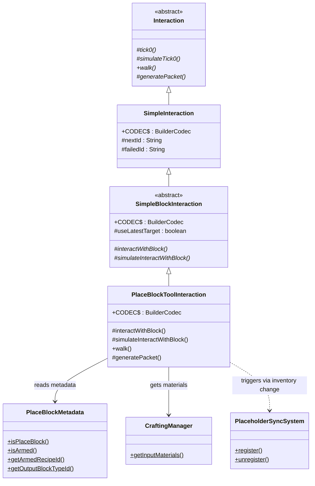
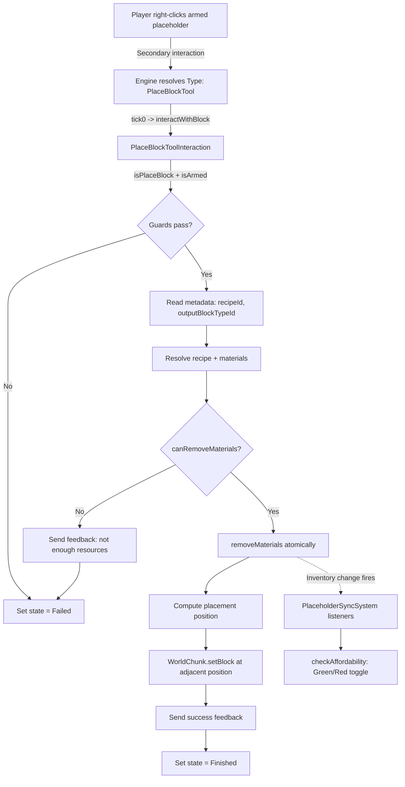
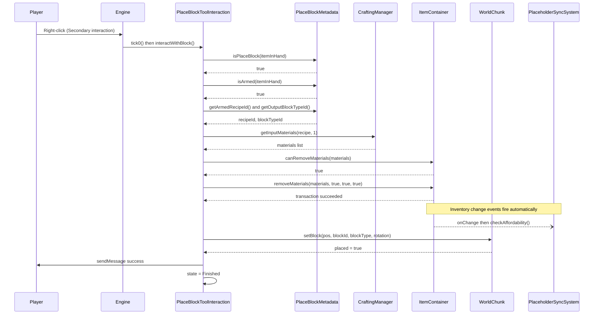

# Design: Custom PlaceBlock Tool Interaction

## 1. Overview

`PlaceBlockToolInteraction` is a custom `SimpleBlockInteraction` subclass that replaces the current `PlaceBlockPlacementSystem` (event interception of `PlaceBlockEvent`) with a direct interaction handler. When the player right-clicks with an armed placeholder, the engine dispatches directly to this interaction — no `PlaceBlock` interaction is involved, no event is fired, and no slot restoration is needed. The core design principle is **direct dispatch**: the interaction owns the entire placement lifecycle.

## 2. Design Priorities

1. **Simplicity** — Eliminate the event-cancellation/slot-restoration/suppress-resume complexity of `PlaceBlockPlacementSystem`
2. **Framework-native patterns** — Use the engine's `SimpleBlockInteraction` extension point exactly as `OpenBenchPageInteraction`, `EnterPortalInteraction`, etc. do
3. **Testability** — Single method (`interactWithBlock`) with clear inputs, no hidden side effects
4. **Minimal surface area** — No new JSON fields, no new events, no new ECS systems

## 3. Component Diagram



## 4. Responsibility Map



## 5. Sequence Diagram



## 6. CODEC Definition

**No custom JSON fields.** All runtime data (recipe ID, output block type) lives in `ItemStack.getMetadata()` (BSON), read via `PlaceBlockMetadata`. The CODEC inherits everything from `SimpleBlockInteraction.CODEC`:

```java
public static final BuilderCodec<PlaceBlockToolInteraction> CODEC =
    BuilderCodec.builder(PlaceBlockToolInteraction.class,
        PlaceBlockToolInteraction::new, SimpleBlockInteraction.CODEC)
    .build();
```

Inherited fields from `SimpleBlockInteraction.CODEC` → `SimpleInteraction.CODEC` → `Interaction.ABSTRACT_CODEC`:

| Field | Source | Used? |
|-------|--------|-------|
| `UseLatestTarget` | `SimpleBlockInteraction` | Possibly — see Open Questions §8 |
| `Next` | `SimpleInteraction` | No (single-shot interaction) |
| `Failed` | `SimpleInteraction` | No |
| `ViewDistance`, `RunTime`, etc. | `Interaction.ABSTRACT_CODEC` | Defaults are fine |

## 7. `interactWithBlock()` — Method Signature & Logic Flow

### Signature

```java
@Override
protected void interactWithBlock(
        @Nonnull World world,
        @Nonnull CommandBuffer<EntityStore> commandBuffer,
        @Nonnull InteractionType type,
        @Nonnull InteractionContext context,
        @Nullable ItemStack itemInHand,
        @Nonnull Vector3i targetBlock,
        @Nonnull CooldownHandler cooldownHandler)
```

### Logic Flow

```
1. Guard: itemInHand == null → state = Failed, return
2. Guard: !PlaceBlockMetadata.isPlaceBlock(itemInHand) → state = Failed, return
3. Guard: !PlaceBlockMetadata.isArmed(itemInHand) → state = Failed, return

4. Resolve entity: Ref<EntityStore> ref = context.getEntity()
5. Resolve store: Store<EntityStore> store = ref.getStore()
6. Resolve Player: store.getComponent(ref, Player.getComponentType())
7. Resolve PlayerRef: store.getComponent(ref, PlayerRef.getComponentType())
8. Guard: player == null → state = Failed, return

9. Read metadata:
   - String recipeId = PlaceBlockMetadata.getArmedRecipeId(itemInHand)
   - String outputBlockTypeId = PlaceBlockMetadata.getOutputBlockTypeId(itemInHand)
   - Guard: either null → state = Failed, return

10. Resolve assets:
    - BlockType targetBlockType = BlockType.getAssetMap().getAsset(outputBlockTypeId)
    - int targetBlockId = BlockType.getAssetMap().getIndex(outputBlockTypeId)
    - CraftingRecipe recipe = CraftingRecipe.getAssetMap().getAsset(recipeId)
    - Guard: any null → state = Failed, return

11. Get materials: List<MaterialQuantity> materials = CraftingManager.getInputMaterials(recipe, 1)

12. Get container: ItemContainer container = inventory.getCombinedBackpackStorageHotbar()

13. Affordability check: container.canRemoveMaterials(materials)
    - If false → playerRef.sendMessage("Not enough resources") → state = Failed, return

14. Atomic consumption: container.removeMaterials(materials, true, true, true)
    - If !txn.succeeded() → state = Failed, return
    - NOTE: This triggers inventory change events → PlaceholderSyncSystem
      listeners fire → checkAffordability runs → Green/Red transitions happen
      automatically. No suppress/resume needed.

15. Compute placement position from targetBlock (see Open Questions §8)

16. Place block: world.getChunkIfInMemory(chunkIndex) → worldChunk.setBlock(...)

17. Send feedback: playerRef.sendMessage("Placed " + outputBlockTypeId)

18. Set state = Finished
```

## 8. Accessing Player/Inventory from InteractionContext

Within `interactWithBlock()`, the `InteractionContext` provides the entity reference. The standard access pattern (proven in `PortableBenchInteraction`, `OpenBenchPageInteraction`, `EnterPortalInteraction`, etc.):

```java
// Entity reference
Ref<EntityStore> ref = context.getEntity();
Store<EntityStore> store = ref.getStore();

// Player component → Inventory
Player player = store.getComponent(ref, Player.getComponentType());
Inventory inventory = player.getInventory();

// PlayerRef → sendMessage, getUuid
PlayerRef playerRef = store.getComponent(ref, PlayerRef.getComponentType());
```

`itemInHand` is already provided as a parameter to `interactWithBlock()` — it's read by `SimpleBlockInteraction.tick0()` from `inventory.getItemInHand()` before the call.

## 9. Registration Code for `setup()`

In `UnobstructedThirdPersonPlugin.setup()`, add after the existing `PlaceBlock_Menu` registration:

```java
// Register custom PlaceBlockTool interaction type (replaces PlaceBlockPlacementSystem)
this.getCodecRegistry(Interaction.CODEC)
        .register("PlaceBlockTool", PlaceBlockToolInteraction.class, PlaceBlockToolInteraction.CODEC);
```

Also **remove** the `PlaceBlockPlacementSystem` registration:

```java
// DELETE this line:
this.getEntityStoreRegistry().registerSystem(new PlaceBlockPlacementSystem());
```

## 10. Updated JSON for Armed States

All 10 armed states (`Armed_Green_0` through `Armed_Green_8` and `Armed_Red`) change their `Secondary` interaction from:

```json
"Secondary": {
  "Interactions": [{
    "Type": "PlaceBlock",
    "RemoveItemInHand": false
  }]
}
```

to:

```json
"Secondary": {
  "Interactions": [{
    "Type": "PlaceBlockTool"
  }]
}
```

**Why no `RemoveItemInHand: false`?** That field is defined on `PlaceBlockInteraction.CODEC`, not on `SimpleBlockInteraction.CODEC`. `SimpleBlockInteraction` never touches the held item — the custom code in `interactWithBlock()` is fully in control of inventory mutations. The placeholder stays in the slot because nothing removes it.

**Ghost preview preserved:** The `BlockType` section on each armed state is unchanged. The client shows the ghost preview based on `item.blockId` (from `BlockType`), completely independent of the interaction type. Confirmed by the bucket pattern (`PlaceFluid` + `BlockType` shows ghost).

## 11. Package Structure

```
src/main/java/com/UnobstructedThirdPerson/placeblock/
├── PlaceBlockToolInteraction.java     # NEW — custom SimpleBlockInteraction subclass
├── PlaceBlockMetadata.java            # UNCHANGED — metadata API
├── BlockPreviewReskinManager.java     # UNCHANGED — reskin manager
├── PlaceholderSyncSystem.java         # MODIFIED — remove suppress/resume
├── PlaceBlockPlacementSystem.java     # DELETE — replaced by PlaceBlockToolInteraction
├── PlaceBlockBenchInterceptor.java    # UNCHANGED (already disabled)
├── PlaceBlockMenuInteraction.java     # UNCHANGED
├── PlaceBlockConfigLoader.java        # UNCHANGED
├── StencilBookRecipeMutator.java   # UNCHANGED
└── ui/
    └── StencilBookOpenUIInteraction.java  # UNCHANGED
```

## 12. Files to Create, Modify, and Delete

### Create

| File | Purpose |
|------|---------|
| `src/main/java/com/UnobstructedThirdPerson/placeblock/PlaceBlockToolInteraction.java` | Custom `SimpleBlockInteraction` subclass with placement + resource consumption logic |

### Modify

| File | Change |
|------|--------|
| `src/main/java/com/UnobstructedThirdPersonPlugin.java` | Add `PlaceBlockToolInteraction` registration; remove `PlaceBlockPlacementSystem` registration; remove `PlaceBlockPlacementSystem` import |
| `src/main/resources/Server/Item/Items/Tool/Block_Placeholder.json` | Change all 10 armed state `Secondary` interactions from `{"Type": "PlaceBlock", "RemoveItemInHand": false}` to `{"Type": "PlaceBlockTool"}` |
| `src/main/java/com/UnobstructedThirdPerson/placeblock/PlaceholderSyncSystem.java` | Remove `suppressSync()`, `resumeSync()`, and `suppressed` ConcurrentHashMap (dead code after `PlaceBlockPlacementSystem` is deleted) |

### Delete

| File | Reason |
|------|--------|
| `src/main/java/com/UnobstructedThirdPerson/placeblock/PlaceBlockPlacementSystem.java` | Entirely replaced by `PlaceBlockToolInteraction` |

## 13. Integration Changes Required

| Existing File | Change | Detail |
|---------------|--------|--------|
| `UnobstructedThirdPersonPlugin.java` | Add import | `import com.UnobstructedThirdPerson.placeblock.PlaceBlockToolInteraction;` |
| `UnobstructedThirdPersonPlugin.java` | Add registration | `.register("PlaceBlockTool", PlaceBlockToolInteraction.class, PlaceBlockToolInteraction.CODEC)` in `setup()` |
| `UnobstructedThirdPersonPlugin.java` | Remove registration | Delete `this.getEntityStoreRegistry().registerSystem(new PlaceBlockPlacementSystem());` |
| `UnobstructedThirdPersonPlugin.java` | Remove import | Delete `import ...PlaceBlockPlacementSystem;` |
| `PlaceholderSyncSystem.java` | Remove method | `suppressSync(UUID)` — only called by `PlaceBlockPlacementSystem` |
| `PlaceholderSyncSystem.java` | Remove method | `resumeSync(UUID, PlayerRef, Inventory)` — only called by `PlaceBlockPlacementSystem` |
| `PlaceholderSyncSystem.java` | Remove field | `suppressed` ConcurrentHashMap — only used by suppress/resume |
| `PlaceholderSyncSystem.java` | Remove guard | `if (suppressed.containsKey(playerId)) return;` in both change event lambdas |
| `Block_Placeholder.json` | Change 10 interaction blocks | `Armed_Green_0..8` and `Armed_Red` Secondary interactions |

## 14. Open Questions

### Q1: Placement Position — `targetBlock` Is the Clicked Block, Not the Adjacent Air Block

**Critical.** `SimpleBlockInteraction` provides `targetBlock` = the existing block the player right-clicked ON. But we need to place at the ADJACENT air block (where the ghost preview shows). The old `PlaceBlockPlacementSystem` received this from `PlaceBlockEvent.getTargetBlock()`, which was computed internally by `PlaceBlockInteraction` (a separate class that does NOT extend `SimpleBlockInteraction`).

**Investigation needed:**
- Does `context.getClientState()` expose `blockFace` (integer face index)? If so, compute `targetBlock + faceOffset[blockFace]`.
- Does setting `"UseLatestTarget": true` in JSON cause `SimpleBlockInteraction.tick0()` to read `clientState.blockPosition`, which might be the ghost position (adjacent)?
- Can we read `context.getClientState().blockFace` or equivalent to compute offset?

**Fallback:** If face info is unavailable, consider extending `Interaction` directly (not `SimpleBlockInteraction`) and replicating the client state handling from `PlaceBlockInteraction` — but this is significantly more complex.

### Q2: Block Rotation

The old system read `event.getRotation()` from `PlaceBlockEvent`. With `SimpleBlockInteraction`, there's no rotation parameter in `interactWithBlock()`. Options:
- Default to rotation index `0` (no rotation) — acceptable for most structural blocks
- Read from `context.getClientState()` if rotation data is available
- Accept as a known limitation in v1

### Q3: `checkAffordability` Timing After Material Consumption

When `removeMaterials()` modifies inventory, the `PlaceholderSyncSystem` change listeners fire synchronously. This calls `checkAffordability()` which may transition Green → Red. Since this happens DURING `interactWithBlock()` (before `setBlock`), the item in the hotbar may change state mid-interaction. Verify this doesn't cause issues with the interaction chain.

**Expected:** Safe, because `itemInHand` is already captured as a parameter (a snapshot), and the interaction state is set to `Finished` after `setBlock`. The item state change (Green → Red) is purely visual and doesn't affect the in-progress placement.

## 15. Handoff Checklist

- [x] Component diagram included
- [x] Responsibility map included
- [x] All interfaces have Javadoc contracts
- [x] All skeleton files created with TODO markers
- [x] Integration Changes Required section populated
- [x] Open Questions section populated
- [x] CODEC definition documented
- [x] `interactWithBlock()` logic flow documented
- [x] Player/Inventory access pattern documented
- [x] Registration code documented
- [x] Updated JSON snippet documented
- [x] Files to create/modify/delete listed
