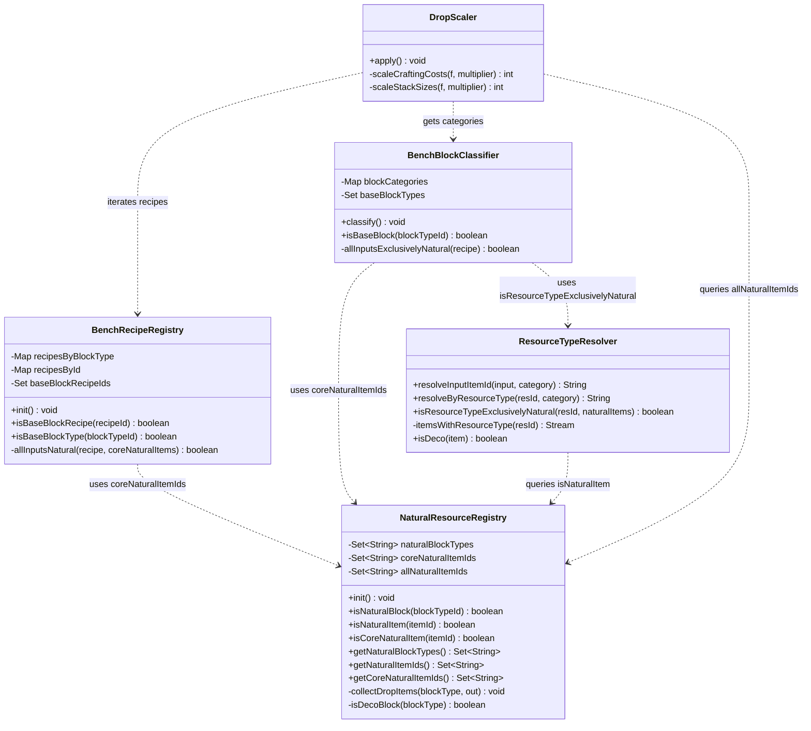
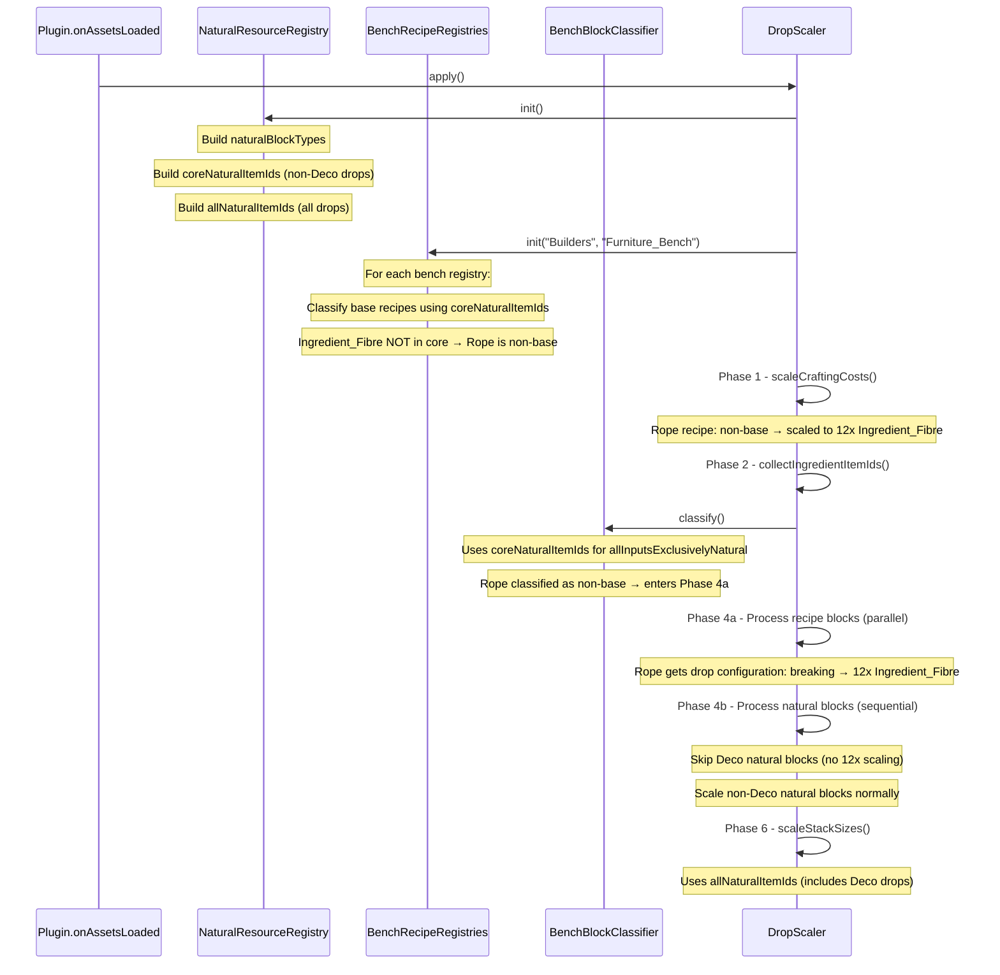

# Design: Deco-Aware Natural Resource Registry

## 1. Overview

The economy pipeline currently treats ALL non-craftable blocks equally when building the natural resource item set. Deco blocks (items with `Blocks.Deco` category) — such as decorative plants that drop `Ingredient_Fibre` — pollute the `naturalItemIds` set, causing downstream misclassification. Specifically, `Deco_Rope`'s recipe (input: `1x Ingredient_Fibre`) is incorrectly classified as a "base block recipe" because `Ingredient_Fibre` appears in `naturalItemIds` via Deco plant drops.

This design introduces a **two-tier natural item set** so that Deco drops are tracked but don't influence base-recipe classification, while preserving stack size scaling for all natural drops.

## 2. Design Priorities

1. **Correctness** — Deco block recipes (Rope) must get cost scaling and drop configuration
2. **Simplicity** — Minimal changes to existing pipeline structure; no new classes
3. **Backward compatibility** — Non-Deco pipeline behavior unchanged
4. **Testability** — Two-tier sets can be verified by inspecting registry state

## 3. Component Diagram

## 4. Responsibility Map

```mermaid
graph TB
    subgraph "NaturalResourceRegistry.init()"
        A[Iterate all BlockTypes] --> B{Has crafting recipe?}
        B -->|Yes| C[Skip - not natural]
        B -->|No| D{Is Deco block?}
        D -->|Yes| E[Add to naturalBlockTypes]
        E --> F[Add drops to allNaturalItemIds ONLY]
        D -->|No| G[Add to naturalBlockTypes]
        G --> H[Add drops to BOTH coreNaturalItemIds AND allNaturalItemIds]
    end

    subgraph "Base Classification uses coreNaturalItemIds"
        I[BenchRecipeRegistry.allInputsNatural] --> J{Input has direct itemId?}
        J -->|Yes| K{itemId in coreNaturalItemIds?}
        K -->|Yes| L[Input is natural]
        K -->|No| M[Input is NOT natural - recipe is non-base]
        J -->|No - ResourceTypeId| N[ResourceTypeResolver.isResourceTypeExclusivelyNatural]
        N --> O{All matching non-Deco items in coreNaturalItemIds?}
        O -->|Yes| L
        O -->|No| M
    end

    subgraph "Phase 1 Cost Scaling"
        P[Iterate all recipes] --> Q{isBaseBlockRecipe?}
        Q -->|Yes - all inputs core-natural| R[SKIP - inputs already drop 12x]
        Q -->|No| S[Scale inputs x12]
    end

    subgraph "Phase 4b Natural Block Processing"
        T[Iterate natural blocks] --> U{Is Deco block?}
        U -->|Yes| V[SKIP - Deco blocks stay at vanilla drops]
        U -->|No| W[Scale drops x12]
    end

    subgraph "Phase 6 Stack Size Scaling"
        X[Iterate allNaturalItemIds] --> Y[Scale stack sizes x12]
    end
```

## 5. Sequence Diagram

## 6. Changes Required

No new files. All changes are modifications to existing classes.

### 6.1 NaturalResourceRegistry.java

| Change | Description |
|--------|-------------|
| New field | `coreNaturalItemIds` — items dropped by non-Deco natural blocks |
| Rename field | `naturalItemIds` → `allNaturalItemIds` (or keep name, add `coreNaturalItemIds` alongside) |
| Modify `init()` | Check `isDecoBlock()` before routing drops to one or both item sets |
| New method | `isDecoBlock(BlockType)` — checks if the block's item has `Blocks.Deco` category |
| New method | `getCoreNaturalItemIds()` — returns the core set |
| New method | `isCoreNaturalItem(String)` — queries the core set |
| Existing `getNaturalItemIds()` | Returns `allNaturalItemIds` (all drops including Deco) — no API break |

### 6.2 BenchRecipeRegistry.java

| Change | Description |
|--------|-------------|
| Modify `init()` line 82 | Change `NaturalResourceRegistry.getNaturalItemIds()` → `NaturalResourceRegistry.getCoreNaturalItemIds()` |

### 6.3 BenchBlockClassifier.java

| Change | Description |
|--------|-------------|
| Modify `allInputsExclusivelyNatural()` line 140 | Change `NaturalResourceRegistry.getNaturalItemIds()` → `NaturalResourceRegistry.getCoreNaturalItemIds()` |

### 6.4 ResourceTypeResolver.java

| Change | Description |
|--------|-------------|
| Change `isDeco()` visibility | `private` → `static` package-private (used by NaturalResourceRegistry) |

No change to `isResourceTypeExclusivelyNatural` — it already filters Deco items via `itemsWithResourceType()`, and the `naturalItems` parameter passed by callers will now be `coreNaturalItemIds`.

### 6.5 DropScaler.java

| Change | Description |
|--------|-------------|
| Modify Phase 4b loop | Add `isDecoBlock` check — skip Deco natural blocks (stay at vanilla drops) |
| Phase 6 `scaleStackSizes()` | No change — continues using `getNaturalItemIds()` (all items including Deco) |

## 7. Deco_Rope Walkthrough (After Fix)

1. **NaturalResourceRegistry.init()**: Deco plants (category `Blocks.Deco`) drop `Ingredient_Fibre`. Since they're Deco, `Ingredient_Fibre` goes into `allNaturalItemIds` but NOT `coreNaturalItemIds`.

2. **BenchRecipeRegistry.init()**: `Deco_Rope_Recipe_Generated_0` has input `1x Ingredient_Fibre`. `allInputsNatural()` checks `coreNaturalItemIds` — `Ingredient_Fibre` is NOT in core → recipe is **not base**.

3. **Phase 1**: Rope recipe is non-base → input scaled to `12x Ingredient_Fibre`.

4. **BenchBlockClassifier.classify()**: `allInputsExclusivelyNatural()` checks `coreNaturalItemIds` — `Ingredient_Fibre` not in core → `Deco_Rope` is **not a base block** → included in `getNonBaseBlocksByCategory()`.

5. **Phase 4a**: `Deco_Rope` processed by `BuildersProcessor` — breaking config set to drop `12x Ingredient_Fibre`.

6. **Phase 6**: `Ingredient_Fibre` is in `allNaturalItemIds` → stack size scaled to `1200`.

## 8. Open Questions

1. ~~**Deco natural blocks in Phase 4b**~~: **RESOLVED** — Only blocks with recipes get 12x scaling. Deco blocks without recipes (like `Deco_Moving_Box`) stay at vanilla drop rates. Deco blocks WITH recipes (like `Deco_Rope`) get full pipeline treatment (Phase 1 cost scaling + Phase 4a drop configuration).

2. **Diagnostic logging cleanup**: The existing diagnostic logging (`auditRopeRecipes`, Phase 1 SKIP logging, RTR-DEBUG) should be removed once this fix is verified.
