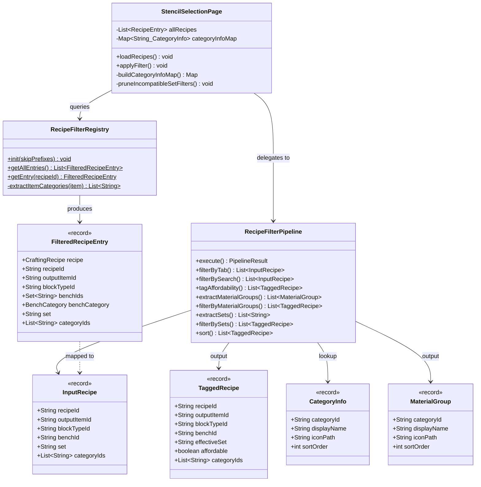
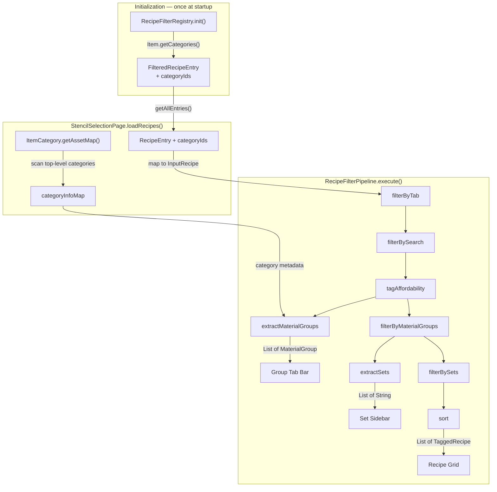
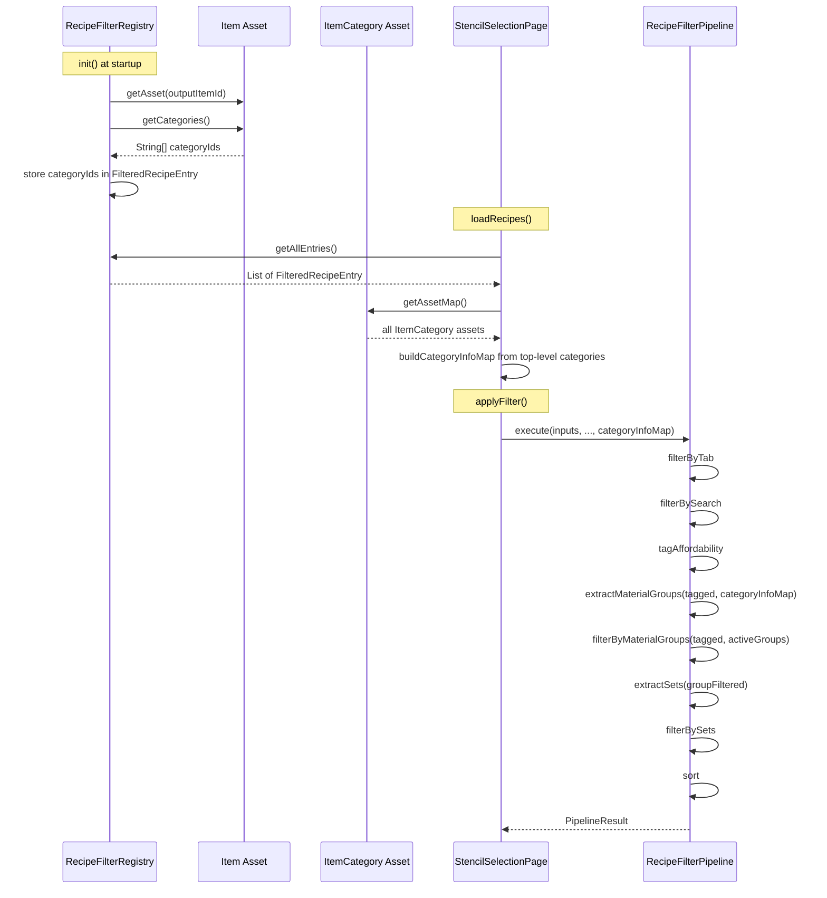

# Design: ItemCategory-Based Material Grouping

## 1. Overview

Replace the set-prefix-based material grouping in `RecipeFilterPipeline` with grouping derived from the game's `ItemCategory` asset system. Currently, material groups are inferred by extracting the prefix before `_` in `Item.set` names (e.g. `"Wood_Hardwood"` → group `"Wood"`). The new design resolves `Item.getCategories()` once at recipe registration time, carries the category IDs through the pipeline as immutable data, and uses `ItemCategory` metadata (icon, name, sort order) for the group tab bar. Sets remain as an orthogonal sidebar filter.

## 2. Design Priorities

1. **Pipeline purity** — the pipeline remains a pure function; all asset lookups happen at load time and are carried as data
2. **Single-lookup principle** — `Item.getCategories()` and `ItemCategory` metadata are resolved once, not per-frame
3. **Backward compatibility** — set-based sidebar filtering is preserved unchanged; sets and categories are orthogonal axes
4. **Simplicity** — minimal new types; existing records gain a field rather than being replaced by wrapper types
5. **Testability** — `CategoryInfo` map is injectable; pipeline stages remain independently testable

## 3. Component Diagram



## 4. Responsibility Map



### Pipeline Stage Reordering

The fundamental change is that **material group filtering now happens before set extraction**, not after. This reverses the dependency:

| Aspect | Current (set-prefix) | New (ItemCategory) |
|--------|---------------------|--------------------|
| Group source | Derived from set name prefix | Derived from `Item.getCategories()` |
| Stage order | extractSets → extractGroups → filterSetsByGroups → filterBySets | extractGroups → **filterByMaterialGroups** → extractSets → filterBySets |
| Set-group link | Set prefix must match group name | A set is visible if ≥1 recipe in it has the active category |
| Filtering target | Filters **sets** by prefix | Filters **recipes** by category membership |

**Current flow:**
```
tagged → extractSets(all) → extractMaterialGroups(sets)
       → filterSetsByMaterialGroups(sets, activeGroups) → visibleSets
       → filterBySets(tagged, visibleSets) → sort
```

**New flow:**
```
tagged → extractMaterialGroups(tagged, categoryInfoMap)
       → filterByMaterialGroups(tagged, activeGroups) → groupFiltered
       → extractSets(groupFiltered) → visibleSets
       → filterBySets(groupFiltered, activeSetFilters ∪ visibleSets) → sort
```

## 5. Sequence Diagram



## 6. Package Structure

No new files are created. All changes are modifications to existing files:

```
src/main/java/com/UnobstructedThirdPerson/
├── resourcecollection/
│   ├── FilteredRecipeEntry.java          ← add categoryIds field
│   └── RecipeFilterRegistry.java         ← add category extraction in init()
└── placeblock/ui/
    ├── RecipeFilterPipeline.java         ← update records, stages, add CategoryInfo
    └── StencilSelectionPage.java       ← update RecipeEntry, loadRecipes, applyFilter, prune
```

## 7. Integration Changes Required

### RecipeFilterPipeline.java

| Change | Description |
|--------|-------------|
| **`InputRecipe` record** | Add `List<String> categoryIds` parameter (never null, may be empty) |
| **`TaggedRecipe` record** | Add `List<String> categoryIds` parameter (carried through from InputRecipe) |
| **`MaterialGroup` record** | Replace `(groupName, representativeItemId)` with `(categoryId, displayName, iconPath, sortOrder)` |
| **New `CategoryInfo` record** | Add inner record `CategoryInfo(String categoryId, String displayName, String iconPath, int sortOrder)` — pipeline input metadata for known categories |
| **`execute()` signature** | Add `Map<String, CategoryInfo> categoryInfoMap` parameter |
| **`execute()` body** | Reorder stages: extractMaterialGroups before extractSets; add filterByMaterialGroups stage; remove filterSetsByMaterialGroups call |
| **`tagAffordability()`** | Carry `categoryIds` from InputRecipe to TaggedRecipe |
| **`extractMaterialGroups()`** | New signature: `(List<TaggedRecipe>, Map<String, CategoryInfo>, int)`. Collect distinct category IDs from recipes, look up metadata in map, sort by `sortOrder` |
| **New `filterByMaterialGroups()`** | `(List<TaggedRecipe>, Set<String>) → List<TaggedRecipe>`. Retain recipes where any `categoryId` is in `activeMaterialGroups`. Empty set = no filtering |
| **Remove `extractGroupPrefix()`** | No longer needed |
| **Remove `filterSetsByMaterialGroups()`** | Replaced by `filterByMaterialGroups()` |
| **`filterBySearch()`** | Optionally extend to match against category IDs (low priority, can defer) |

### FilteredRecipeEntry.java

| Change | Description |
|--------|-------------|
| **Add `categoryIds` field** | `@Nonnull List<String> categoryIds` — last parameter, immutable list of `ItemCategory` IDs from `Item.getCategories()` |

### RecipeFilterRegistry.java

| Change | Description |
|--------|-------------|
| **In `init()` loop** | After `Item outputItem = ...`, call `outputItem.getCategories()`. Convert `String[]` (nullable) to `List.of(...)` or `List.of()`. Pass to `FilteredRecipeEntry` constructor |
| **No reflection needed** | `Item.getCategories()` is a public getter (unlike `Item.set`) |

### StencilSelectionPage.java

| Change | Description |
|--------|-------------|
| **`RecipeEntry` record** | Add `List<String> categoryIds` field |
| **New field `categoryInfoMap`** | `Map<String, CategoryInfo>` — built once in `loadRecipes()` |
| **`loadRecipes()`** | Pass `fe.categoryIds()` to `RecipeEntry`. Call `buildCategoryInfoMap()` |
| **New `buildCategoryInfoMap()`** | Scan `ItemCategory.getAssetMap()`, collect top-level categories (those that exist as root entries), build `Map<String, CategoryInfo>` |
| **`applyFilter()`** | Pass `entry.categoryIds()` to `InputRecipe` constructor. Pass `categoryInfoMap` to `pipeline.execute()` |
| **`pruneIncompatibleSetFilters()`** | Replace prefix-based check with category-based: a set is compatible if any recipe in that set has the active category |
| **`activeMaterialGroups`** | Now contains `categoryId` strings instead of set-prefix strings |
| **`updateMaterialGroups()`** | Use `group.iconPath()` and `group.displayName()` instead of `group.groupName()` and `group.representativeItemId()` |

## 8. Open Questions

1. **Top-level category identification** — `ItemCategory.getAssetMap()` may return both parent and child categories. `buildCategoryInfoMap()` must only include top-level categories as group tabs. Strategy options:
   - Scan all categories; mark any ID that appears as a child of another as non-top-level
   - Only include categories that have a non-null `children` array
   - Hardcode a known set of top-level IDs (fragile, not recommended)
   - **Recommendation**: scan-and-exclude-children approach

2. **Multi-category grouping semantics** — When a recipe's item has `["Wood", "WoodPlanks"]`:
   - It contributes to discovering the `"Wood"` group (since `"WoodPlanks"` is a child, not top-level)
   - It matches the `"Wood"` group filter
   - If `"WoodPlanks"` were hypothetically top-level, the item would appear in BOTH groups — is this acceptable? (Yes, since filterByMaterialGroups checks ANY category match)

3. **Icon setting in UI** — Current `updateMaterialGroups()` only sets `.Visible` and `.TooltipText`. The new `iconPath` from `ItemCategory.getIcon()` needs a `.Icon` or `.Image` property on the tab button. Verify the UI template supports dynamic icon setting on `#MaterialGroups[n]`.

4. **`setDisplayLabel` behavior** — Currently strips the prefix before `_` (e.g. `"Wood_Hardwood"` → `"Hardwood"`). With category-based grouping, the set prefix may not semantically match the category. Confirm this display behavior is still desired, or if set names should display in full.

## 9. Handoff Checklist

- [x] Component diagram included
- [x] Responsibility map included
- [x] All interfaces have Javadoc contracts (see updated record definitions below)
- [x] All skeleton files created with TODO markers (modifications to existing files documented in §7 and §10)
- [x] Integration Changes Required section populated
- [x] Open Questions section populated
- [x] Task Decomposition section populated

## 10. Task Decomposition

### Wave 1 (no dependencies — can run in parallel)

#### Unit: FilteredRecipeEntry.java — add categoryIds field

- **Methods**: Update record constructor signature
- **Contract**: Add `@Nonnull List<String> categoryIds` as the last parameter. Represents the output item's `ItemCategory` IDs, resolved once at registration. Never null; empty list for items with no categories.
- **Dependencies**: none
- **Done when**: Record compiles with the new field; existing construction sites produce compile errors (expected — fixed in Wave 2)

#### Unit: RecipeFilterPipeline.CategoryInfo — new inner record

- **Methods**: New record `CategoryInfo(String categoryId, String displayName, String iconPath, int sortOrder)`
- **Contract**: Immutable metadata for a single top-level ItemCategory. Provided as pipeline input. `categoryId` is the ItemCategory asset ID. `displayName` is the localization key from `ItemCategory.getName()`. `iconPath` is the icon file path from `ItemCategory.getIcon()`. `sortOrder` is from `ItemCategory.getOrder()`.
- **Dependencies**: none
- **Done when**: Record compiles; no callers yet

#### Unit: RecipeFilterPipeline.MaterialGroup — update record fields

- **Methods**: Replace `(String groupName, String representativeItemId)` with `(String categoryId, String displayName, String iconPath, int sortOrder)`
- **Contract**: Represents a material group tab backed by an ItemCategory. `categoryId` is used for matching against `activeMaterialGroups`. `displayName` is the tooltip/label. `iconPath` points to the category icon. `sortOrder` controls tab ordering.
- **Dependencies**: none
- **Done when**: Record compiles; existing callers produce compile errors (expected)

#### Unit: RecipeFilterPipeline.InputRecipe — add categoryIds field

- **Methods**: Add `List<String> categoryIds` as last parameter
- **Contract**: Never null. Empty list for uncategorized items. Contains all ItemCategory IDs from the output item (both parent and child categories as raw strings).
- **Dependencies**: none
- **Done when**: Record compiles; existing construction sites produce compile errors (expected)

#### Unit: RecipeFilterPipeline.TaggedRecipe — add categoryIds field

- **Methods**: Add `List<String> categoryIds` as last parameter
- **Contract**: Carried through from `InputRecipe.categoryIds()` during `tagAffordability()`. Same semantics.
- **Dependencies**: none
- **Done when**: Record compiles; existing callers produce compile errors (expected)

---

### Wave 2 (depends on Wave 1)

#### Unit: RecipeFilterRegistry.java — extract categories during init

- **Methods**: Modify the loop body in `init()`; add private helper `extractItemCategories(Item)`
- **Contract**: After resolving the output `Item`, call `item.getCategories()`. Convert `null` → `List.of()`, non-null `String[]` → `List.of(array)`. Pass the resulting immutable list to the `FilteredRecipeEntry` constructor.
- **Dependencies**: Wave 1 (FilteredRecipeEntry new signature)
- **Done when**: `init()` populates `categoryIds` on every entry. No reflection needed (`getCategories()` is public). Log line showing category count.

#### Unit: RecipeFilterPipeline — tagAffordability carries categoryIds

- **Methods**: Update `tagAffordability()` to pass `recipe.categoryIds()` to the `TaggedRecipe` constructor
- **Contract**: categoryIds are carried through unchanged from InputRecipe to TaggedRecipe.
- **Dependencies**: Wave 1 (InputRecipe and TaggedRecipe new fields)
- **Done when**: TaggedRecipe instances have correct categoryIds after tagging

#### Unit: RecipeFilterPipeline — new extractMaterialGroups

- **Methods**: Replace `extractMaterialGroups(List<TaggedRecipe>, List<String>, int)` with `extractMaterialGroups(List<TaggedRecipe>, Map<String, CategoryInfo>, int)`
- **Contract**: Collect all distinct category IDs present on any tagged recipe. For each ID that exists as a key in `categoryInfoMap`, create a `MaterialGroup` from the `CategoryInfo`. Sort by `sortOrder` (ascending), then by `categoryId` as tiebreaker. Cap at `maxGroups`. Ignore category IDs not in the map (child categories, unknown categories).
- **Dependencies**: Wave 1 (CategoryInfo, MaterialGroup, TaggedRecipe.categoryIds)
- **Done when**: Returns correctly sorted groups derived from recipe categories, not set prefixes

#### Unit: RecipeFilterPipeline — new filterByMaterialGroups

- **Methods**: New method `filterByMaterialGroups(List<TaggedRecipe>, Set<String>) → List<TaggedRecipe>`
- **Contract**: If `activeMaterialGroups` is null or empty, return a copy of the input (no filtering). Otherwise, retain recipes where at least one entry in `recipe.categoryIds()` is contained in `activeMaterialGroups` (case-sensitive, since category IDs are asset IDs).
- **Dependencies**: Wave 1 (TaggedRecipe.categoryIds)
- **Done when**: Recipes are correctly filtered by category membership

#### Unit: RecipeFilterPipeline — update execute() flow

- **Methods**: Update `execute()` signature (add `Map<String, CategoryInfo> categoryInfoMap`) and reorder stages
- **Contract**: New stage order:
  1. `filterByTab`
  2. `filterBySearch`
  3. `tagAffordability`
  4. `extractMaterialGroups(tagged, categoryInfoMap, 25)` → `currentGroups`
  5. `filterByMaterialGroups(tagged, activeMaterialGroups)` → `groupFiltered`
  6. `extractSets(affordableOnly ? filterByAffordability(groupFiltered) : groupFiltered)` → `visibleSets`
  7. `filterBySets(groupFiltered, effectiveSetFilter)` → `setFiltered`
  8. `sort` → `displayedRecipes`
- **Dependencies**: Wave 1 (all record changes), Wave 2 (new/updated pipeline stages)
- **Done when**: `execute()` uses the new flow; `filterSetsByMaterialGroups` and `extractGroupPrefix` are unused

#### Unit: RecipeFilterPipeline — remove deprecated methods

- **Methods**: Delete `extractGroupPrefix()` and `filterSetsByMaterialGroups()`
- **Contract**: These methods are replaced by `filterByMaterialGroups()` and category-based `extractMaterialGroups()`. No callers should remain after Wave 3.
- **Dependencies**: Wave 2 (execute no longer calls them), Wave 3 (StencilSelectionPage no longer calls extractGroupPrefix)
- **Done when**: Methods removed, no compile errors

---

### Wave 3 (depends on Wave 2)

#### Unit: StencilSelectionPage.java — update data model and pipeline integration

- **Methods**: `RecipeEntry` record, `loadRecipes()`, `applyFilter()`, `buildCategoryInfoMap()`, `pruneIncompatibleSetFilters()`, `updateMaterialGroups()`
- **Contract**:
  - **`RecipeEntry`**: Add `List<String> categoryIds` field
  - **`buildCategoryInfoMap()`**: New private method. Scans `ItemCategory.getAssetMap()`, identifies top-level categories (those whose ID does not appear as a child of another category), creates `CategoryInfo` for each. Returns `Map<String, CategoryInfo>`.
  - **`loadRecipes()`**: Pass `fe.categoryIds()` to `RecipeEntry`. Call `buildCategoryInfoMap()` and store result in field `categoryInfoMap`.
  - **`applyFilter()`**: Pass `entry.categoryIds()` to `InputRecipe`. Pass `categoryInfoMap` to `pipeline.execute()`.
  - **`pruneIncompatibleSetFilters()`**: Replace prefix-based logic with: for each active set filter, check if any recipe in `allRecipes` with that set also has a category in `activeMaterialGroups`. Remove filters that have no matching recipes.
  - **`updateMaterialGroups()`**: Use `group.displayName()` for tooltip text. Use `group.iconPath()` for icon (requires verifying UI template supports it). Use `group.categoryId()` for matching against `activeMaterialGroups`.
- **Dependencies**: Wave 2 (pipeline API changes, FilteredRecipeEntry.categoryIds)
- **Done when**: Full pipeline integration works end-to-end. Group tabs show ItemCategory-based groups. Set sidebar correctly reflects sets within the active category group.

---

### Wave 4 (integration — depends on Wave 3)

#### Unit: Integration validation and cleanup

- **Files**: All four files listed above; UI template if icon support needs changes
- **Contract**: Wire all changes together. Verify:
  - Recipes with null categories appear as uncategorized (no group tab, controlled by showUncategorized toggle)
  - Recipes with multiple categories appear in the correct group (first top-level category)
  - Set sidebar correctly narrows when a group is selected
  - Set filters prune correctly when switching groups
  - `activeMaterialGroups` in saved preferences contains category IDs (not set prefixes) — verify backward compatibility or migration
  - `setDisplayLabel()` still produces readable labels
  - Max 25 groups enforced
- **Dependencies**: All Wave 3 units
- **Done when**: Full build passes. Manual smoke test confirms group tabs, set filtering, and recipe grid all work correctly with category-based grouping.

---

## Appendix: Updated Record Definitions

### RecipeFilterPipeline.CategoryInfo (NEW)

```java
/**
 * Immutable metadata for a top-level ItemCategory, provided as pipeline input.
 * Built once during {@code loadRecipes()} from {@code ItemCategory.getAssetMap()}.
 *
 * @param categoryId   the ItemCategory asset ID (e.g. "Wood", "Rock")
 * @param displayName  the localization key from {@code ItemCategory.getName()}
 * @param iconPath     the icon file path from {@code ItemCategory.getIcon()}
 * @param sortOrder    the display order from {@code ItemCategory.getOrder()}
 */
public record CategoryInfo(
        String categoryId,
        String displayName,
        String iconPath,
        int sortOrder
) {}
```

### RecipeFilterPipeline.InputRecipe (MODIFIED)

```java
/**
 * A recipe entering the pipeline. Contains only registry-sourced data;
 * no affordability information.
 *
 * @param recipeId      recipe asset ID (e.g. "Wood_Hardwood_Planks")
 * @param outputItemId  output item asset ID
 * @param blockTypeId   output block type ID
 * @param benchId       primary bench ID for tab grouping
 * @param set           {@code Item.set} value; may be {@code null}
 * @param categoryIds   ItemCategory IDs from {@code Item.getCategories()};
 *                      never null, may be empty. Contains both parent and child
 *                      category IDs as raw strings.
 */
public record InputRecipe(
        String recipeId,
        String outputItemId,
        String blockTypeId,
        String benchId,
        @Nullable String set,
        List<String> categoryIds
) {}
```

### RecipeFilterPipeline.TaggedRecipe (MODIFIED)

```java
/**
 * A recipe exiting the pipeline, enriched with affordability and a
 * guaranteed non-null {@code effectiveSet}.
 *
 * @param recipeId      recipe asset ID
 * @param outputItemId  output item asset ID
 * @param blockTypeId   output block type ID
 * @param benchId       primary bench ID
 * @param effectiveSet  never null; equals original set or {@link #UNCATEGORIZED_SET}
 * @param affordable    {@code true} if the player can craft this recipe
 * @param categoryIds   ItemCategory IDs carried through from InputRecipe;
 *                      never null, may be empty
 */
public record TaggedRecipe(
        String recipeId,
        String outputItemId,
        String blockTypeId,
        String benchId,
        String effectiveSet,
        boolean affordable,
        List<String> categoryIds
) {}
```

### RecipeFilterPipeline.MaterialGroup (MODIFIED)

```java
/**
 * A material group tab backed by an ItemCategory.
 *
 * @param categoryId   the ItemCategory asset ID used for filtering
 * @param displayName  the localization key for the tab label/tooltip
 * @param iconPath     the icon file path for the tab button
 * @param sortOrder    the display order (from {@code ItemCategory.getOrder()})
 */
public record MaterialGroup(
        String categoryId,
        String displayName,
        String iconPath,
        int sortOrder
) {}
```

### FilteredRecipeEntry (MODIFIED)

```java
/**
 * @param recipe        the original CraftingRecipe asset
 * @param recipeId      recipe asset ID
 * @param outputItemId  output item asset ID
 * @param blockTypeId   output item's block type ID (never null)
 * @param benchIds      all matching bench requirement IDs (immutable, never empty)
 * @param benchCategory the classified bench category, or null
 * @param set           the Item.set value, or null
 * @param categoryIds   ItemCategory IDs from Item.getCategories(); never null,
 *                      immutable, may be empty
 */
public record FilteredRecipeEntry(
        @Nonnull CraftingRecipe recipe,
        @Nonnull String recipeId,
        @Nonnull String outputItemId,
        @Nonnull String blockTypeId,
        @Nonnull Set<String> benchIds,
        @Nullable BenchCategory benchCategory,
        @Nullable String set,
        @Nonnull List<String> categoryIds
) {}
```

### Updated execute() Signature

```java
/**
 * Executes the full filter pipeline.
 *
 * <p>Stages run sequentially:
 * <pre>
 * allRecipes → filterByTab → filterBySearch → tagAffordability
 *            → extractMaterialGroups (→ currentGroups)
 *            → filterByMaterialGroups (→ groupFiltered)
 *            → extractSets (→ visibleSets)
 *            → filterBySets → sort (→ displayedRecipes)
 * </pre>
 *
 * @param allRecipes             complete recipe list from the registry
 * @param activeTab              current bench tab; "All" = no tab filter
 * @param activeMaterialGroups   selected category IDs; empty = show all groups
 * @param activeSetFilters       selected set names; empty = show all sets
 * @param searchQuery            search text; empty/null = no search filter
 * @param checker                affordability checker; null = all affordable
 * @param affordableOnly         when true, unaffordable recipes excluded
 * @param showUncategorized      when true, uncategorized recipes included
 * @param categoryInfoMap        top-level category metadata; keys are category IDs
 * @return pipeline result
 */
public PipelineResult execute(
        List<InputRecipe> allRecipes,
        String activeTab,
        Set<String> activeMaterialGroups,
        Set<String> activeSetFilters,
        String searchQuery,
        @Nullable AffordabilityChecker checker,
        boolean affordableOnly,
        boolean showUncategorized,
        Map<String, CategoryInfo> categoryInfoMap
) {
    // TODO: implement reordered pipeline flow per §4
}
```

### New Pipeline Stage: filterByMaterialGroups

```java
/**
 * Filters recipes to those whose output item has at least one category
 * matching the active material groups.
 *
 * <p>If {@code activeMaterialGroups} is null or empty, all recipes pass
 * through (no filtering). Otherwise, a recipe is retained if any entry
 * in {@code recipe.categoryIds()} is contained in {@code activeMaterialGroups}.
 *
 * @param recipes              tagged recipe list
 * @param activeMaterialGroups selected category IDs; empty = no filtering
 * @return new list containing only matching recipes
 */
List<TaggedRecipe> filterByMaterialGroups(List<TaggedRecipe> recipes,
                                          Set<String> activeMaterialGroups) {
    // TODO: implement category-based recipe filtering
}
```

### Impact on Set Filtering

Sets and categories are **orthogonal**:
- **Categories** drive the group tab bar (horizontal axis)
- **Sets** drive the sidebar filter buttons (vertical axis)

When a material group is selected:
1. `filterByMaterialGroups` retains only recipes whose item has that category
2. `extractSets` derives sets from those filtered recipes — the sidebar shows only sets that have ≥1 recipe in the active category
3. Set filters narrow within the already-category-filtered recipes

This means a set like `"Wood_Hardwood"` only appears in the sidebar when the `"Wood"` category group is active (assuming hardwood items have the `"Wood"` category). When `"Rock"` is selected, `"Wood_Hardwood"` disappears from the sidebar entirely.

→ @Engineer implement docs/Plans/design-itemcategory-grouping.md
