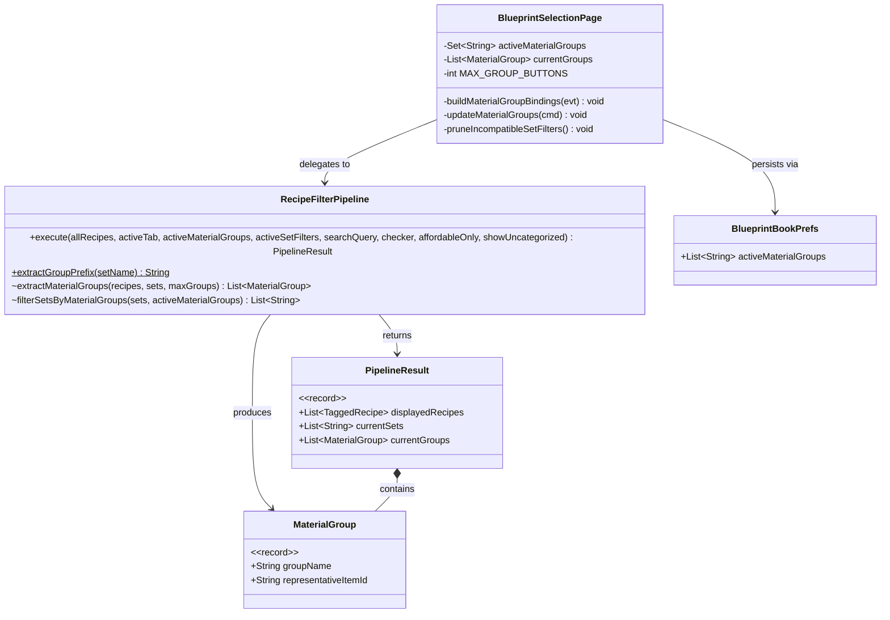
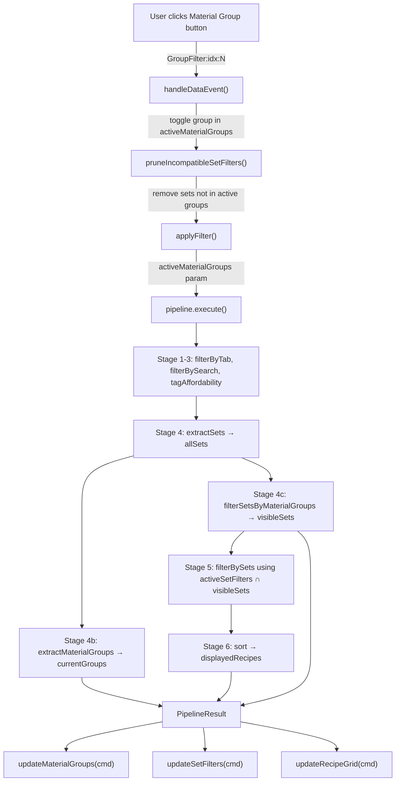
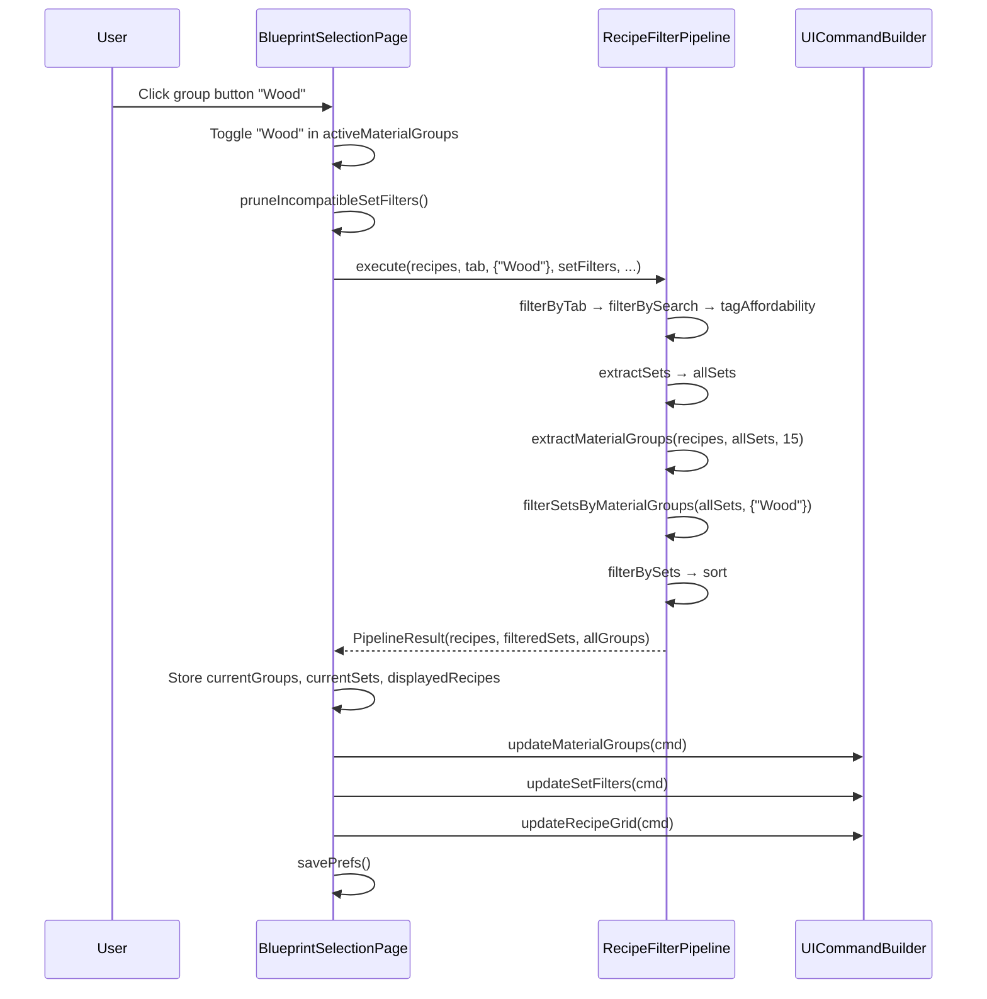

# Design: Material Group Pre-Filter

## 1. Overview

The Material Group Pre-Filter adds a horizontal row of icon buttons above the set filter sidebar in the Stencil Crafting UI. Each button represents a **material group** auto-derived from set name prefixes (e.g., "Wood" from `Wood_Hardwood`, "Rock" from `Rock_Shale_Brick`). Selecting one or more groups filters the set sidebar to only show matching sets, acting as a two-tier filter: groups → sets → recipes.

This reduces cognitive load when the set list grows large (20+ sets across multiple material families) by letting players narrow to a material family before picking individual sets.

## 2. Design Priorities

1. **Pipeline purity** — the pipeline remains a pure function; material groups are derived at execution time from input data, never stored as state on the pipeline
2. **Framework-native patterns** — uses ItemIcon for group icons (the only proven icon approach from plugin `.ui` files), append-based UI initialization, and `cmd.set()` updates
3. **Simplicity** — minimal new types; groups are a lightweight projection of existing set data, not a separate domain concept
4. **Testability** — all group extraction and filtering logic lives in the pipeline as pure static/instance methods, fully unit-testable
5. **Consistency** — reuses existing FILTER_ACTIVE/FILTER_INACTIVE visual patterns and the same append → bind → set lifecycle

## 3. Component Diagram



## 4. Responsibility Map



## 5. Sequence Diagram — Group Toggle Interaction



## 6. Pipeline Changes

### 6.1 New Record: `MaterialGroup`

Inner record on `RecipeFilterPipeline`:

```java
public record MaterialGroup(
    String groupName,            // prefix before first '_' (e.g. "Wood", "Rock")
    String representativeItemId  // first alphabetical outputItemId from any set in the group
) {}
```

### 6.2 Updated `PipelineResult`

Add `currentGroups` field. This list is always derived from **all** qualifying sets (before group filtering), so the group bar always shows the full set of available groups regardless of which groups are currently selected.

```java
public record PipelineResult(
    List<TaggedRecipe> displayedRecipes,
    List<String> currentSets,           // sets visible in sidebar (after group filtering)
    List<MaterialGroup> currentGroups   // all available groups (for group bar)
) {}
```

### 6.3 New Methods

| Method | Visibility | Pure | Description |
|--------|-----------|------|-------------|
| `extractGroupPrefix(String setName)` | `static` package-private | Yes | Returns text before the first `_`, or the full string if no `_` exists. Returns `null` for null/empty input. |
| `extractMaterialGroups(List<TaggedRecipe> recipes, List<String> sets, int maxGroups)` | package-private | Yes | Groups sets by prefix, picks a representative item (first alphabetical `outputItemId` from any recipe in any set of the group), sorts alphabetically, caps at `maxGroups`. |
| `filterSetsByMaterialGroups(List<String> sets, Set<String> activeMaterialGroups)` | package-private | Yes | Returns a new list containing only sets whose prefix matches any active group. Empty `activeMaterialGroups` = no filtering (all sets pass). |

### 6.4 Updated `execute()` Signature

```java
public PipelineResult execute(
    List<InputRecipe> allRecipes,
    String activeTab,
    Set<String> activeMaterialGroups,   // ← NEW (empty = show all groups)
    Set<String> activeSetFilters,
    String searchQuery,
    @Nullable AffordabilityChecker checker,
    boolean affordableOnly,
    boolean showUncategorized
)
```

### 6.5 Updated Pipeline Flow

```
allRecipes
  → filterByTab
  → filterBySearch
  → tagAffordability
  → extractSets                        → allSets
  → extractMaterialGroups(allSets)     → currentGroups      (always from allSets)
  → filterSetsByMaterialGroups(allSets, activeMaterialGroups) → visibleSets
  → filterBySets(tagged, effectiveSetFilter ∩ visibleSets)
  → sort
  → PipelineResult(displayedRecipes, visibleSets, currentGroups)
```

The `effectiveSetFilter` intersection logic: if `activeSetFilters` is non-empty, intersect it with `visibleSets` so that only sets matching **both** the group filter and the user's explicit set selections are active. If `activeSetFilters` is empty, use `visibleSets` as the effective filter (same as existing "All" behavior).

## 7. UI Layout

### 7.1 Where the Group Bar Goes

Inside the existing sidebar column (164px wide, `LayoutMode: TopScrolling`), insert a new `Group #MaterialGroups` container **above** the `#SetFilters` group and below the `#UncategorizedToggle` spacer:

```
Group { Anchor: (Width: 164); LayoutMode: TopScrolling; ...
    TextButton #AffordableToggle { ... }
    Group { Anchor: (Height: 2); }
    TextButton #UncategorizedToggle { ... }
    Group { Anchor: (Height: 2); }

    // ── NEW: Material Group Bar ──
    Group #MaterialGroups {
        LayoutMode: LeftCenterWrap;
        Padding: (Left: 2, Right: 2, Bottom: 4);
    }

    Group { Anchor: (Height: 2); }          // spacer

    // Existing set filters
    Group #SetFilters { LayoutMode: Top; }
}
```

### 7.2 MaterialGroupButton.ui Component

New file: `src/main/resources/Common/UI/Custom/Pages/BlueprintBook/MaterialGroupButton.ui`

Each button is 30×30px. At 164px sidebar width with 2px left/right padding = 160px usable → 5 buttons per row (30px each + 2px implicit wrap spacing). 15 buttons = 3 rows ≈ 96px tall.

Structure follows the proven RecipeIconCell pattern:
- Outer Group for sizing
- Inner `#GroupFrame` Group for active/inactive background color
- `ItemIcon #GroupIcon` for the representative item icon
- Transparent `TextButton #GroupBtn` for click handling and hover feedback

The server controls active/inactive state by setting `#GroupFrame.Background` to the active color (`#2a4a6a`) or transparent (`#141c26(0.0)`).

### 7.3 Slot Budget

Server appends `1 + MAX_GROUP_BUTTONS` (16) MaterialGroupButton instances during `build()`:
- Index 0: "All" button (always visible when groups exist; shows a generic icon or first group's representative)
- Indices 1–15: per-group buttons

The "All" button at index 0 has no ItemIcon content; instead the inner frame shows a small "ALL" label or uses a known icon. **Open Question**: what icon to use for the "All" group button (see §10).

## 8. Page Controller Changes

### 8.1 New Constants

```java
private static final int MAX_GROUP_BUTTONS = 15;
```

### 8.2 New State Fields

```java
private final Set<String> activeMaterialGroups = new TreeSet<>(String.CASE_INSENSITIVE_ORDER);
private List<RecipeFilterPipeline.MaterialGroup> currentGroups = new ArrayList<>();
```

### 8.3 Event Handling

New action prefix: `"GroupFilter:"`. Payload patterns:
- `"GroupFilter:All"` — clear `activeMaterialGroups` (show all groups)
- `"GroupFilter:idx:N"` — toggle group at index N in `currentGroups`

In `handleDataEvent()`, add a new branch:

```java
} else if (data.action != null && data.action.startsWith("GroupFilter:")) {
    // Parse group filter action
    // Toggle group in activeMaterialGroups
    // Call pruneIncompatibleSetFilters()
    // Call applyFilter()
    // Update UI: updateMaterialGroups + updateSetFilters + updateRecipeGrid + updateDetailPanel
    // Call savePrefs()
}
```

### 8.4 New Methods

| Method | Responsibility |
|--------|---------------|
| `buildMaterialGroupBindings(UIEventBuilder evt)` | Bind Activating events for `#MaterialGroups[0]` ("All") and `#MaterialGroups[1..MAX_GROUP_BUTTONS]` (per-group). Called once in `build()`. |
| `updateMaterialGroups(UICommandBuilder cmd)` | For each group slot: set Visible, set `#GroupIcon.ItemId`, set `#GroupFrame.Background` (active/inactive color). Hide unused slots. Update "All" button state. |
| `pruneIncompatibleSetFilters()` | After group selection changes, remove any entries from `activeSetFilters` whose group prefix is not in `activeMaterialGroups` (when `activeMaterialGroups` is non-empty). Preserves set selections that are still valid under the new group filter. |

### 8.5 Updated `applyFilter()`

Pass `activeMaterialGroups` to `pipeline.execute()` and store `currentGroups` from the result:

```java
RecipeFilterPipeline.PipelineResult result = pipeline.execute(
    inputs, activeTab, activeMaterialGroups, activeSetFilters, searchQuery,
    checker, affordabilityEnabled, showUncategorized);

this.displayedRecipes = result.displayedRecipes();
this.currentSets = result.currentSets();
this.currentGroups = result.currentGroups();
```

### 8.6 Updated `build()`

Add to initialization sequence (after existing `for` loops that append SetFilterButton instances):

```java
// Material group buttons: 1 "All" + MAX_GROUP_BUTTONS indexed buttons
for (int i = 0; i < 1 + MAX_GROUP_BUTTONS; i++) {
    cmd.append("#MaterialGroups", "Pages/BlueprintBook/MaterialGroupButton.ui");
}
```

Add binding call: `buildMaterialGroupBindings(evt);`

Add initial state call: `updateMaterialGroups(cmd);`

### 8.7 Updated Event Flows

Every existing flow that calls `updateSetFilters(cmd)` should also call `updateMaterialGroups(cmd)` because group availability depends on the same data:
- Tab switch → `updateMaterialGroups` + `updateSetFilters` + `updateRecipeGrid`
- Search → same
- Affordability toggle → same
- Uncategorized toggle → same

Group toggle is a new flow:
- Group toggle → `pruneIncompatibleSetFilters` + `applyFilter` → `updateMaterialGroups` + `updateSetFilters` + `updateRecipeGrid` + `updateDetailPanel`

### 8.8 Updated `onDismiss()`

Clear group button visibility to prevent stale tooltips:

```java
for (int i = 0; i < 1 + MAX_GROUP_BUTTONS; i++) {
    cmd.set("#MaterialGroups[" + i + "].Visible", false);
}
```

## 9. Prefs Changes

### 9.1 BlueprintBookPrefs — New Field

```java
List<String> activeMaterialGroups = new ArrayList<>();
```

### 9.2 BlueprintBookPrefs — Updated CODEC

Add a new codec entry:

```java
.append(new KeyedCodec<>("ActiveMaterialGroups", new ArrayCodec<>(Codec.STRING, String[]::new), true),
    (p, v) -> p.activeMaterialGroups = Arrays.asList(v),
    p -> p.activeMaterialGroups.toArray(new String[0])).add()
```

### 9.3 BlueprintSelectionPage — Load/Save

**Load** (in `build()`):
```java
this.activeMaterialGroups.clear();
this.activeMaterialGroups.addAll(prefs.activeMaterialGroups);
```

**Save** (in `savePrefs()`):
```java
prefs.activeMaterialGroups = new ArrayList<>(this.activeMaterialGroups);
```

## 10. Package Structure

```
src/main/
├── java/com/UnobstructedThirdPerson/placeblock/ui/
│   ├── RecipeFilterPipeline.java          ← MODIFIED: new record, methods, updated execute()
│   ├── BlueprintSelectionPage.java        ← MODIFIED: new state, events, update methods
│   ├── BlueprintBookPrefs.java           ← MODIFIED: new field + codec entry
│   └── BlueprintBookPrefsStore.java      ← UNCHANGED
│
└── resources/Common/UI/Custom/Pages/BlueprintBook/
    ├── BlueprintBookPage.ui              ← MODIFIED: add #MaterialGroups container
    ├── MaterialGroupButton.ui             ← NEW: icon button component
    ├── SetFilterButton.ui                 ← UNCHANGED
    └── RecipeIconCell.ui                  ← UNCHANGED
```

## 11. Integration Changes Required

### RecipeFilterPipeline.java

| Change | Description |
|--------|-------------|
| Add `MaterialGroup` record | Inner public record with `groupName` and `representativeItemId` fields |
| Update `PipelineResult` record | Add third field: `List<MaterialGroup> currentGroups` |
| Add `extractGroupPrefix()` | Static package-private method: prefix extraction |
| Add `extractMaterialGroups()` | Package-private method: derive groups from tagged recipes + sets |
| Add `filterSetsByMaterialGroups()` | Package-private method: filter sets by active groups |
| Update `execute()` signature | Add `Set<String> activeMaterialGroups` parameter (3rd position, after `activeTab`) |
| Update `execute()` body | Call new methods between extractSets and filterBySets; pass `visibleSets` to filterBySets; construct PipelineResult with 3 fields |

### BlueprintSelectionPage.java

| Change | Description |
|--------|-------------|
| Add `MAX_GROUP_BUTTONS = 15` constant | At class level |
| Add `activeMaterialGroups` field | `Set<String>`, TreeSet with CASE_INSENSITIVE_ORDER |
| Add `currentGroups` field | `List<RecipeFilterPipeline.MaterialGroup>` |
| Add `buildMaterialGroupBindings()` | Bind Activating events for all group button slots |
| Add `updateMaterialGroups()` | Set visibility, icon, and background for each group slot |
| Add `pruneIncompatibleSetFilters()` | Remove set selections whose group is not in activeMaterialGroups |
| Update `build()` | Append MaterialGroupButton instances, call `buildMaterialGroupBindings`, call `updateMaterialGroups`, load `activeMaterialGroups` from prefs |
| Update `handleDataEvent()` | Add `"GroupFilter:"` action branch |
| Update `applyFilter()` | Pass `activeMaterialGroups` to `pipeline.execute()`, store `currentGroups` |
| Update `savePrefs()` | Persist `activeMaterialGroups` |
| Update `onDismiss()` | Clear group button visibility |
| Update all flows that call `updateSetFilters` | Also call `updateMaterialGroups` |

### BlueprintBookPrefs.java

| Change | Description |
|--------|-------------|
| Add `activeMaterialGroups` field | `List<String>`, default empty |
| Update CODEC | Add `"ActiveMaterialGroups"` string array codec entry |

### BlueprintBookPage.ui

| Change | Description |
|--------|-------------|
| Add `#MaterialGroups` container | Insert `Group #MaterialGroups { LayoutMode: LeftCenterWrap; ... }` between the `#UncategorizedToggle` spacer and the `#SetFilters` group, with a 2px spacer below |

## 12. Skeleton Code

### 12.1 New Methods on RecipeFilterPipeline

```java
/**
 * A material group derived from set name prefixes.
 *
 * @param groupName            the prefix before the first '_' in set names (e.g. "Wood", "Rock")
 * @param representativeItemId the first alphabetical outputItemId from any recipe
 *                             belonging to any set in this group; used as the icon
 */
public record MaterialGroup(
    String groupName,
    String representativeItemId
) {}

/**
 * Extracts the material group prefix from a set name.
 *
 * <p>Returns the substring before the first underscore. If the set name
 * contains no underscore, returns the full string. Returns {@code null}
 * for null or empty input.
 *
 * @param setName raw set name (e.g. "Wood_Hardwood", "Furniture_Temple")
 * @return group prefix (e.g. "Wood", "Furniture"), or null
 */
static String extractGroupPrefix(String setName) {
    throw new UnsupportedOperationException("TODO: extract prefix before first '_'");
}

/**
 * Derives material groups from the available sets and their recipes.
 *
 * <p>For each unique group prefix found in {@code sets}:
 * <ol>
 *   <li>Collects all sets sharing that prefix</li>
 *   <li>Finds the first alphabetical {@code outputItemId} from any recipe
 *       whose {@code effectiveSet} is in that group's sets</li>
 *   <li>Creates a {@link MaterialGroup} with the prefix and representative item</li>
 * </ol>
 *
 * <p>Groups are sorted alphabetically by name and capped at {@code maxGroups}.
 * Groups with no matching recipes (no representative item found) are excluded.
 *
 * @param recipes    tagged recipes (post-affordability, pre-set-filtering)
 * @param sets       all available set names (from {@link #extractSets})
 * @param maxGroups  maximum number of groups to return
 * @return sorted list of material groups, each with a representative item
 */
List<MaterialGroup> extractMaterialGroups(List<TaggedRecipe> recipes,
                                          List<String> sets,
                                          int maxGroups) {
    throw new UnsupportedOperationException(
        "TODO: group sets by prefix, find representative item per group, sort, cap at maxGroups");
}

/**
 * Filters the set list to only include sets whose group prefix matches
 * one of the active material groups.
 *
 * <p>If {@code activeMaterialGroups} is null or empty, all sets pass through
 * (equivalent to "All" groups selected).
 *
 * @param sets                  all available sets
 * @param activeMaterialGroups  selected group prefixes; empty = no filtering
 * @return new list containing only sets matching the active groups
 */
List<String> filterSetsByMaterialGroups(List<String> sets,
                                        Set<String> activeMaterialGroups) {
    throw new UnsupportedOperationException(
        "TODO: filter sets whose extractGroupPrefix() is in activeMaterialGroups");
}
```

### 12.2 New Methods on BlueprintSelectionPage

```java
/**
 * Binds click events for all material group button slots.
 *
 * <p>Index 0 is the "All" button (action: "GroupFilter:All").
 * Indices 1–MAX_GROUP_BUTTONS are per-group buttons (action: "GroupFilter:idx:N"
 * where N is the 0-based index into {@code currentGroups}).
 *
 * <p>Called once during {@link #build}. Events are never re-bound.
 *
 * @param evt the event builder for the current build cycle
 */
private void buildMaterialGroupBindings(UIEventBuilder evt) {
    throw new UnsupportedOperationException(
        "TODO: bind Activating events for #MaterialGroups[0..MAX_GROUP_BUTTONS]");
}

/**
 * Updates the visual state of all material group button slots.
 *
 * <p>For each group in {@code currentGroups} (up to MAX_GROUP_BUTTONS):
 * <ul>
 *   <li>Sets {@code #MaterialGroups[i+1].Visible} to true</li>
 *   <li>Sets {@code #MaterialGroups[i+1] #GroupIcon.ItemId} to the representative item</li>
 *   <li>Sets {@code #MaterialGroups[i+1] #GroupFrame.Background} to active or inactive color</li>
 * </ul>
 *
 * <p>The "All" button at index 0 is visible when any groups exist and active when
 * {@code activeMaterialGroups} is empty.
 *
 * <p>Hides all unused slots beyond the current group count.
 *
 * @param cmd the command builder for the current update cycle
 */
private void updateMaterialGroups(UICommandBuilder cmd) {
    throw new UnsupportedOperationException(
        "TODO: set visibility, icon, and active/inactive background for each group slot");
}

/**
 * Removes entries from {@code activeSetFilters} that are incompatible
 * with the current {@code activeMaterialGroups} selection.
 *
 * <p>A set filter is incompatible if its group prefix is not contained
 * in {@code activeMaterialGroups}. When {@code activeMaterialGroups} is
 * empty (all groups selected), no pruning occurs.
 *
 * <p>This preserves the user's set selections when they narrow the group
 * filter, only removing sets that would be invisible in the sidebar.
 */
private void pruneIncompatibleSetFilters() {
    throw new UnsupportedOperationException(
        "TODO: iterate activeSetFilters, remove those whose prefix is not in activeMaterialGroups");
}
```

## 13. Open Questions

1. **"All" group button icon** — What should the "All" button display? Options: (a) no icon, just a small "ALL" label inside the frame; (b) use `RecipesIcon.png` as a generic icon; (c) use the representative item from the first group. Recommendation: option (b) using `"../../Common/RecipesIcon.png"` as background on the inner frame, with no ItemIcon.

2. **Dynamic Group.Background via cmd.set()** — Confirm that `cmd.set("#MaterialGroups[N] #GroupFrame.Background", "#2a4a6a")` works at runtime to change a Group's background color. If not, the fallback is toggling two overlapping groups (one with active color, one transparent) via `.Visible`. The Engineer should test this first.

3. **Tooltip for group buttons** — Should group buttons show a tooltip with the group name? ItemIcon's `ShowItemTooltip: true` shows the item tooltip, not the group name. A custom tooltip would require additional UI work. Recommendation: set `ShowItemTooltip: true` on the ItemIcon so users see the representative item name as a hint; defer custom group-name tooltips to a later iteration.

4. **Tab switch behavior** — When the user switches bench tabs, should `activeMaterialGroups` be preserved or cleared? The existing behavior clears `activeSetFilters` on tab switch. Recommendation: also clear `activeMaterialGroups` on tab switch for consistency, since different tabs may have completely different material groups.

5. **Single-set groups** — If a material group contains only one set (e.g., "Furniture" → "Furniture_Temple"), should it still appear in the group bar? Recommendation: yes, include it for consistency. The user can always click "All" to see everything.

## 14. Handoff Checklist

- [x] Component diagram included
- [x] Responsibility map included
- [x] Sequence diagram included
- [x] All new methods have Javadoc contracts
- [x] All skeleton methods use `throw new UnsupportedOperationException("TODO")`
- [x] MaterialGroupButton.ui skeleton created
- [x] Integration Changes Required section populated with per-file change tables
- [x] Pipeline execute() signature change documented
- [x] PipelineResult record change documented
- [x] Prefs CODEC change documented
- [x] BlueprintBookPage.ui insertion point documented
- [x] Open Questions section populated (5 items)
- [x] Event payload format documented (`"GroupFilter:All"`, `"GroupFilter:idx:N"`)
- [x] Pruning logic for set filter compatibility documented
