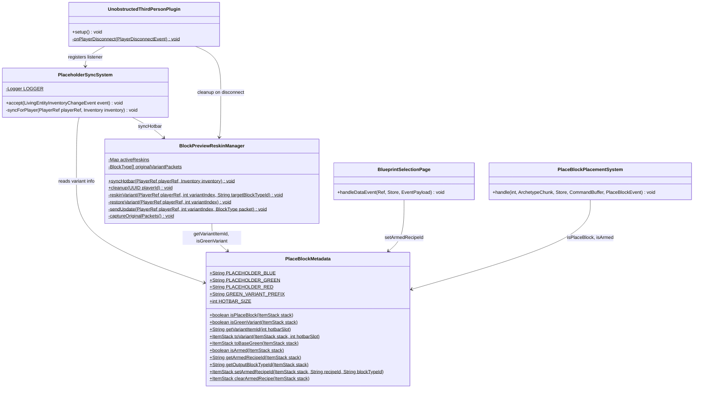
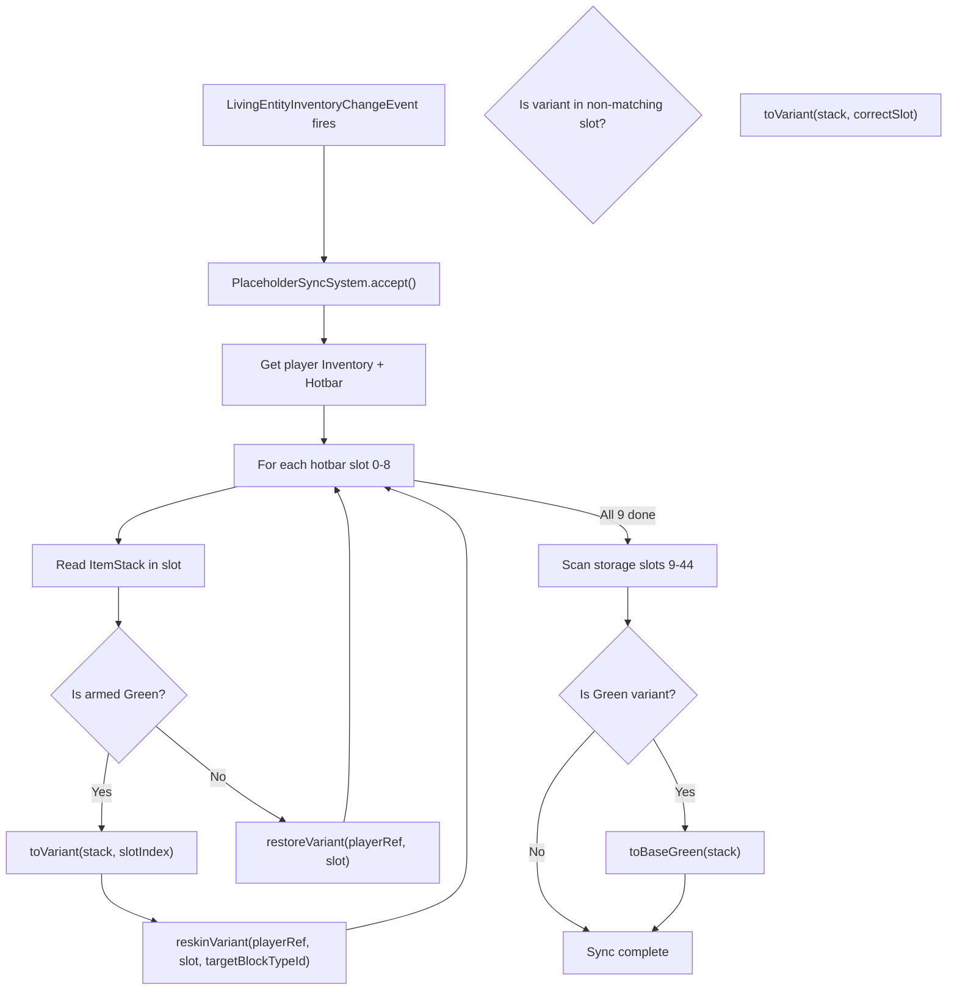
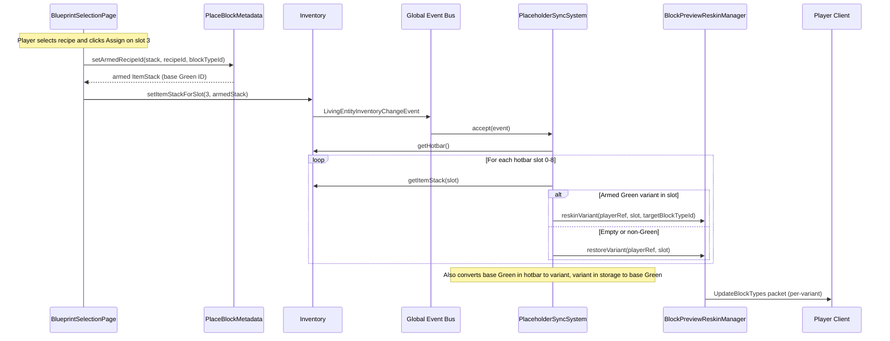

# Design: Multi-Variant Placeholder Block Preview

**Date:** 2026-04-26  
**Supersedes:** design-block-preview-reskin.md (single-variant reskin)

---

## 1. Overview

The current `Block_Placeholder_Green` reskin system uses a single block type ID shared by all armed placeholders. Reskinning it to show a target block's ghost affects every Green placeholder for that player simultaneously. This design introduces 9 distinct Green variants (`Block_Placeholder_Green_0` through `_8`), one per hotbar slot, so each armed placeholder can be independently reskinned to show its own target block preview.

**Core principle:** Slot N always uses variant `_N`. The sync system converts item IDs on inventory change, and reskins each variant's block type independently.

## 2. Design Priorities

1. **Correctness** — each hotbar slot shows its own target block preview, never leaking to other slots
2. **Simplicity** — one sync entry point (`syncHotbar`) replaces separate `reskin`/`restore` calls
3. **Framework-native patterns** — leverages `LivingEntityInventoryChangeEvent` on the global bus
4. **Performance** — only sends `UpdateBlockTypes` packets when a variant's target actually changes
5. **Data preservation** — BSON metadata (recipeId, targetBlockTypeId) survives all variant conversions

## 3. Component Diagram



## 4. Responsibility Map



## 5. Sequence Diagram

### Primary flow: Player arms a placeholder via Blueprint Bench UI



## 6. Package Structure

```
src/main/java/com/UnobstructedThirdPerson/placeblock/
├── BlockPreviewReskinManager.java    (MODIFY — full rewrite)
├── PlaceBlockMetadata.java           (MODIFY — add variant methods)
├── PlaceBlockPlacementSystem.java    (MODIFY — minimal, via isPlaceBlock change)
├── PlaceholderSyncSystem.java        (NEW — global event listener)
├── ui/
│   └── BlueprintSelectionPage.java   (MODIFY — remove direct reskin call)

src/main/resources/Server/Item/Items/Tool/
├── Block_Placeholder_Green.json      (KEEP — base template, no longer used at runtime)
├── Block_Placeholder_Green_0.json    (NEW)
├── Block_Placeholder_Green_1.json    (NEW)
├── Block_Placeholder_Green_2.json    (NEW)
├── Block_Placeholder_Green_3.json    (NEW)
├── Block_Placeholder_Green_4.json    (NEW)
├── Block_Placeholder_Green_5.json    (NEW)
├── Block_Placeholder_Green_6.json    (NEW)
├── Block_Placeholder_Green_7.json    (NEW)
└── Block_Placeholder_Green_8.json    (NEW)
```

## 7. Component Descriptions & Interface Contracts

### 7.1 PlaceBlockMetadata (MODIFY)

**New constants:**
- `GREEN_VARIANT_PREFIX = "Block_Placeholder_Green_"` — prefix for all 9 variants
- `HOTBAR_SIZE = 9`

**New methods:**

| Method | Contract |
|--------|----------|
| `isGreenVariant(ItemStack)` | Returns `true` if the item ID matches `Block_Placeholder_Green_N` for any N in 0-8, OR if it equals the base `Block_Placeholder_Green`. Does NOT include Blue or Red. |
| `getVariantItemId(int hotbarSlot)` | Returns `"Block_Placeholder_Green_{hotbarSlot}"`. Precondition: `0 <= hotbarSlot <= 8`. |
| `toVariant(ItemStack, int hotbarSlot)` | Returns a new `ItemStack` with the variant item ID for the given slot, preserving quantity and BSON metadata. If the stack is already the correct variant, returns it unchanged. |
| `toBaseGreen(ItemStack)` | Returns a new `ItemStack` with `PLACEHOLDER_GREEN` as item ID, preserving quantity and BSON metadata. Used when moving an armed placeholder from hotbar to storage. |

**Modified methods:**

| Method | Change |
|--------|--------|
| `isPlaceBlock(ItemStack)` | Must also return `true` for all 9 Green variants (`Block_Placeholder_Green_0` through `_8`). |
| `setArmedRecipeId(ItemStack, String, String)` | **No change** — still returns base `PLACEHOLDER_GREEN`. The sync system handles variant conversion. |

### 7.2 BlockPreviewReskinManager (MODIFY — full rewrite)

**Removed:** `reskin()`, `restore()`, `originalGreenPacket`, single-variant `sendUpdate()`.

**New state:**
- `activeReskins: Map<UUID, Map<Integer, String>>` — player UUID → (variant index → current target block type ID). Uses `ConcurrentHashMap` outer, regular `HashMap` inner (inner only accessed under outer's per-key lock).
- `originalVariantPackets: protocol.BlockType[9]` — lazily captured, one per variant. Immutable after capture.

**New methods:**

| Method | Contract |
|--------|----------|
| `syncHotbar(PlayerRef, Inventory)` | **Main entry point.** For each hotbar slot 0-8: (1) reads the ItemStack, (2) if armed Green → ensures it's the correct variant via `toVariant`, writes back if needed, reskins that variant's block type, (3) if not armed Green → restores that variant if previously reskinned. Also scans storage slots and reverts any Green variants to base Green via `toBaseGreen`. Idempotent per variant — skips packets when the current reskin target matches. |
| `cleanup(UUID)` | Removes all tracking state for the player. No packets sent (connection is closing). |
| `reskinVariant(PlayerRef, int, String)` | (private) Sends `UpdateBlockTypes` for variant N with the target block's packet data. Updates tracking map. Skips if already reskinned to same target. |
| `restoreVariant(PlayerRef, int)` | (private) Sends `UpdateBlockTypes` for variant N with the original cached packet. Removes from tracking map. No-op if not currently reskinned. |
| `sendUpdate(PlayerRef, int, BlockType)` | (private) Builds and sends the `UpdateBlockTypes` packet for variant index N. Resolves the numeric block type ID from `Block_Placeholder_Green_N`. |
| `captureOriginalPackets()` | (private) Lazily captures `toPacket()` for all 9 variants into `originalVariantPackets[]`. Called once on first `syncHotbar`. |

### 7.3 PlaceholderSyncSystem (NEW)

Global event listener registered on `LivingEntityInventoryChangeEvent`. Bridges inventory changes to `BlockPreviewReskinManager.syncHotbar()`.

| Method | Contract |
|--------|----------|
| `accept(LivingEntityInventoryChangeEvent)` | Extracts `PlayerRef` and `Inventory` from the event. Calls `BlockPreviewReskinManager.syncHotbar(playerRef, inventory)`. |

**Threading:** Runs on the global event bus dispatch thread. `BlockPreviewReskinManager` uses `ConcurrentHashMap` for thread safety.

### 7.4 BlueprintSelectionPage (MODIFY)

**Change in `handleDataEvent` "Assign:" branch:**
- Remove the direct `BlockPreviewReskinManager.reskin(this.playerRef, entry.blockTypeId)` call.
- The `setItemStackForSlot()` call fires `LivingEntityInventoryChangeEvent`, which triggers `PlaceholderSyncSystem` → `syncHotbar()` automatically.

### 7.5 UnobstructedThirdPersonPlugin (MODIFY)

**In `setup()`:**
- Add: `this.getEventRegistry().registerGlobal(LivingEntityInventoryChangeEvent.class, new PlaceholderSyncSystem());`

**In `onPlayerDisconnect()`:**
- No change needed — already calls `BlockPreviewReskinManager.cleanup(playerRef.getUuid())`.

### 7.6 JSON Configs (NEW — 9 files)

9 files: `Block_Placeholder_Green_0.json` through `Block_Placeholder_Green_8.json`.

Each is identical to the existing `Block_Placeholder_Green.json`. The only thing that differs is the file name (which becomes the item ID and block type ID in Hytale's asset system). All 9 reuse the same interaction `"PlaceBlock_Menu"`, texture, tint, categories, and resource types.

The base `Block_Placeholder_Green.json` is kept for backward compatibility (the `setArmedRecipeId` method still returns it, and the sync system converts it to a variant when it appears in the hotbar).

## 8. Data Flow — Key Scenarios

### Scenario A: Player arms placeholder in hotbar slot 3

1. `BlueprintSelectionPage.handleDataEvent` calls `PlaceBlockMetadata.setArmedRecipeId(stack, recipeId, "Oak_Planks")` → returns `ItemStack("Block_Placeholder_Green", 1, {RecipeId: "...", TargetBlockId: "Oak_Planks"})`
2. `combined.setItemStackForSlot(3, armed)` fires `LivingEntityInventoryChangeEvent`
3. `PlaceholderSyncSystem.accept()` → `BlockPreviewReskinManager.syncHotbar(playerRef, inventory)`
4. `syncHotbar` iterates hotbar slots 0-8:
   - Slot 3: armed Green → `toVariant(stack, 3)` → `ItemStack("Block_Placeholder_Green_3", 1, metadata)` → writes back to slot 3 → `reskinVariant(playerRef, 3, "Oak_Planks")` → sends `UpdateBlockTypes` mapping `Block_Placeholder_Green_3`'s numeric ID to Oak_Planks' packet data
   - Other slots: empty/non-Green → `restoreVariant` (no-op if not previously reskinned)
5. Client renders Oak_Planks ghost preview when slot 3 is selected

### Scenario B: Player moves armed placeholder from slot 3 to slot 7

1. Inventory move fires `LivingEntityInventoryChangeEvent`
2. `syncHotbar` iterates:
   - Slot 3: now empty → `restoreVariant(playerRef, 3)` → sends `UpdateBlockTypes` restoring `Block_Placeholder_Green_3` to original
   - Slot 7: armed Green → `toVariant(stack, 7)` → `ItemStack("Block_Placeholder_Green_7", ...)` → `reskinVariant(playerRef, 7, "Oak_Planks")` → sends `UpdateBlockTypes` for variant 7
3. Client shows Oak_Planks ghost only when slot 7 is selected

### Scenario C: Player moves armed placeholder from hotbar to storage

1. Inventory move fires event
2. `syncHotbar`:
   - Hotbar: slot where it was is now empty → `restoreVariant` for that slot
   - Storage scan: finds Green variant → `toBaseGreen(stack)` → `ItemStack("Block_Placeholder_Green", ...)` → writes back to storage slot
3. Metadata (recipeId, targetBlockTypeId) preserved. Item shows as base Green in storage (no variant suffix).

### Scenario D: Player moves armed placeholder from storage to hotbar slot 5

1. Inventory move fires event
2. `syncHotbar`:
   - Slot 5: armed base Green detected → `toVariant(stack, 5)` → `ItemStack("Block_Placeholder_Green_5", ...)` → writes back → `reskinVariant(playerRef, 5, targetBlockTypeId)`
3. Client shows target block ghost when slot 5 is selected

### Scenario E: Player disconnects

1. `onPlayerDisconnect` calls `BlockPreviewReskinManager.cleanup(playerRef.getUuid())`
2. All tracking state for the player removed. No packets sent.

## 9. Integration Changes Required

| File | Location | Change |
|------|----------|--------|
| `PlaceBlockMetadata.java` | `isPlaceBlock()` | Add recognition of all 9 Green variants |
| `PlaceBlockMetadata.java` | Class body | Add `GREEN_VARIANT_PREFIX`, `HOTBAR_SIZE`, `isGreenVariant()`, `getVariantItemId()`, `toVariant()`, `toBaseGreen()` |
| `BlockPreviewReskinManager.java` | Entire file | Full rewrite: single-variant → multi-variant tracking and sync |
| `BlueprintSelectionPage.java` | `handleDataEvent` "Assign:" branch | Remove `BlockPreviewReskinManager.reskin(...)` call (sync system handles it) |
| `UnobstructedThirdPersonPlugin.java` | `setup()` | Register `PlaceholderSyncSystem` as global listener for `LivingEntityInventoryChangeEvent` |
| `UnobstructedThirdPersonPlugin.java` | Import section | Add import for `PlaceholderSyncSystem` and `LivingEntityInventoryChangeEvent` |

## 10. Risk Assessment

| Risk | Impact | Likelihood | Mitigation |
|------|--------|------------|------------|
| **R1: `setItemStackForSlot` on hotbar doesn't fire `LivingEntityInventoryChangeEvent`** | Sync never triggers | Medium | Test immediately. Fallback: call `syncHotbar` explicitly after arming in `BlueprintSelectionPage`. |
| **R2: Recursive event loop** — `syncHotbar` writes items back (variant conversion), which fires another `LivingEntityInventoryChangeEvent` | Infinite loop / stack overflow | Medium | Guard: if item is already the correct variant, skip the write. `syncHotbar` should be idempotent — second invocation finds everything already correct and makes zero writes. |
| **R3: Original packet capture timing** — variants may not be loaded in the asset map when `captureOriginalPackets()` is first called | Null packet cache | Low | Call `captureOriginalPackets()` lazily on first `syncHotbar`, which happens after player connects (assets already loaded). Log severe warning if any variant is missing. |
| **R4: Thread safety** — `syncHotbar` may be called concurrently for the same player if multiple inventory events fire rapidly | Race condition on tracking map / item writes | Medium | Outer `ConcurrentHashMap` provides per-key safety. Consider synchronizing on the player's tracking map for the inner operations. |
| **R5: 9 `UpdateBlockTypes` packets per sync** | Network overhead | Low | Idempotent check: only send packets for variants whose target actually changed. Typical case: 0-2 packets per sync. |
| **R6: `CombinedItemContainer` vs raw `ItemContainer` writes** | `setItemStack` may not work on combined container | Medium | Use `inventory.getHotbar()` (raw `ItemContainer`) for hotbar writes and `inventory.getStorage()` for storage writes, not the combined view. |

## 11. Open Questions

1. **Does `LivingEntityInventoryChangeEvent` provide enough context to identify which player's inventory changed?** — Need to verify the event exposes a path to `PlayerRef` or entity `Ref`. If not, the sync system may need to use `SwitchActiveSlotEvent` (ECS) as a complement.
2. **Can we write to `ItemContainer` from within a `LivingEntityInventoryChangeEvent` handler without causing issues?** — Writing back a variant-converted item while handling the event that the original write triggered. If blocked, may need to defer the write via a tick scheduler.
3. **Should base `Block_Placeholder_Green.json` be removed from the item registry?** — Currently kept for backward compat, but if players can somehow obtain it directly (e.g., creative mode), it would bypass variant assignment. Consider removing it once migration is confirmed.

## Handoff Checklist

- [x] Component diagram included
- [x] Responsibility map included
- [x] Sequence diagram included
- [x] All interface contracts documented (method signatures, preconditions, postconditions)
- [x] Skeleton file created with TODO markers: `PlaceholderSyncSystem.java`
- [x] Integration Changes Required section populated
- [x] Open Questions section populated
- [x] Risk assessment populated
- [x] Data flow scenarios documented (5 scenarios)
- [x] JSON config requirements documented (9 files needed)

---

→ **@Engineer** implement `docs/Plans/design-multi-variant-placeholder.md`
