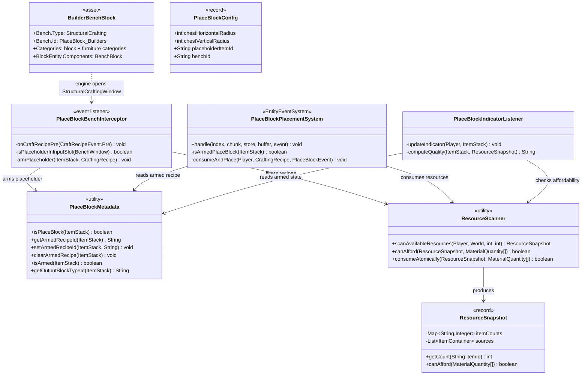
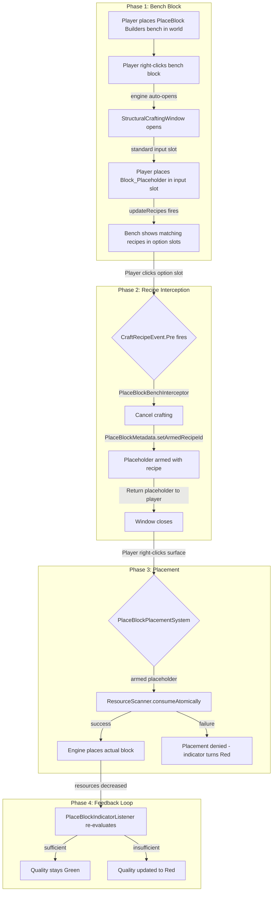
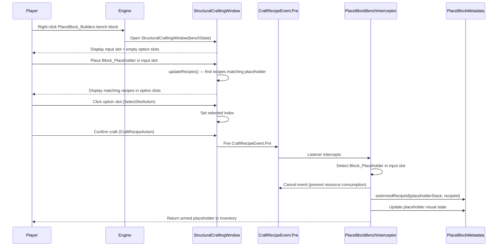
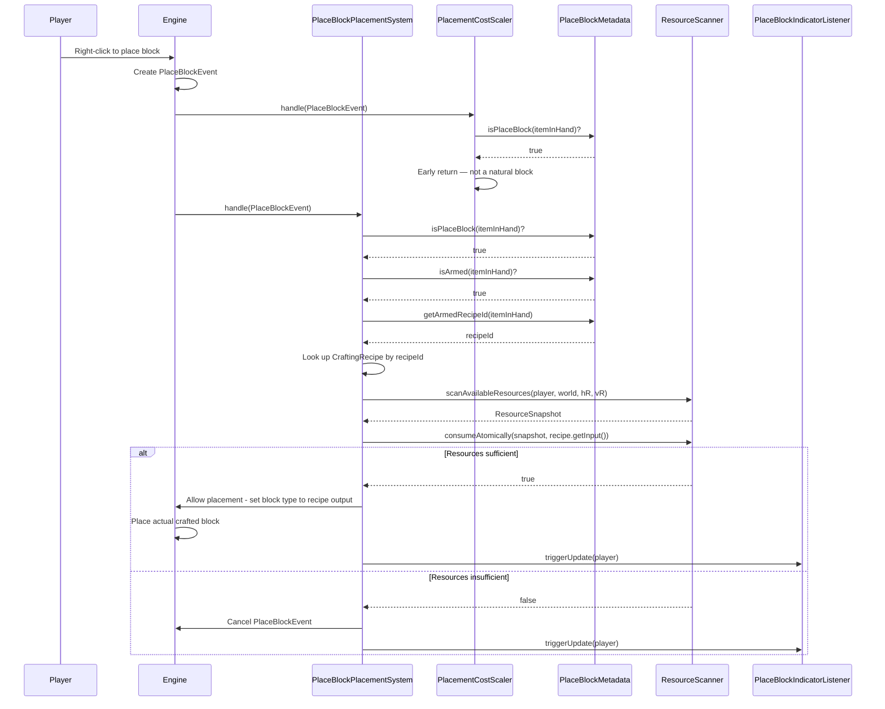
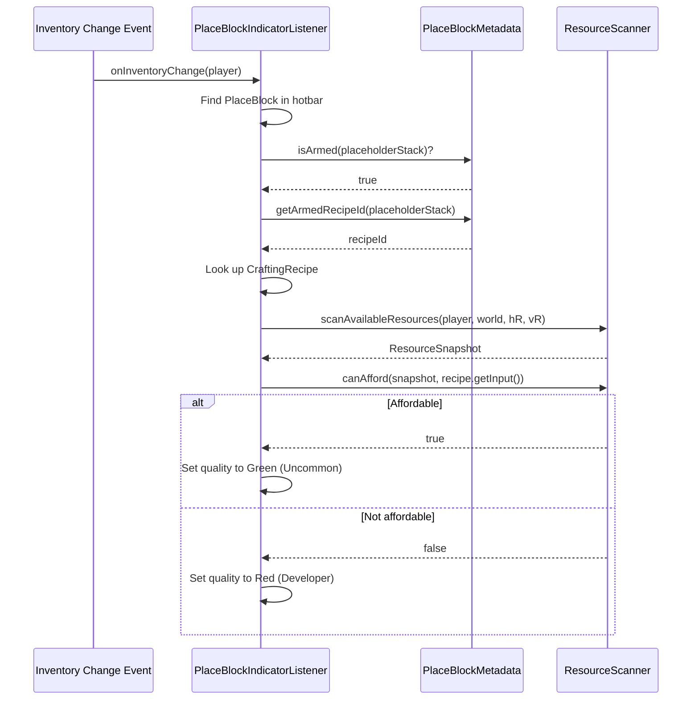
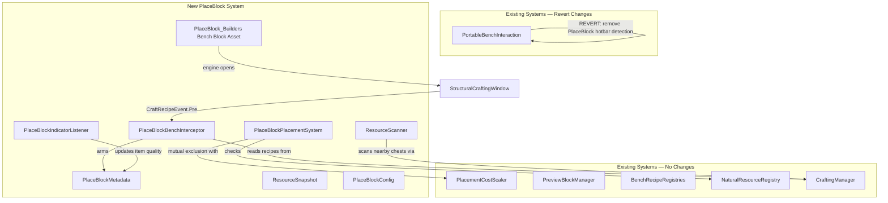

# PlaceBlock Building Tool — System Design

> **Revision 2** (2026-04-22): Redesigned around a dedicated bench block. Removed all PortableBench references. Previous design incorrectly routed through `PortableBenchInteraction` (F-press on portable bench tool).

## 1. Overview

The PlaceBlock Building Tool gives players a **select-then-build** workflow at a **dedicated workbench block** (`Bench_PlaceBlock_Builders`). The player places this bench in the world, right-clicks it to open a `StructuralCraftingWindow`, puts a `Block_Placeholder` in the input slot, selects a recipe to "arm" the placeholder, then places blocks in-world — consuming scaled recipe inputs atomically from inventory and nearby chests at placement time. The system leverages the engine's native bench/window infrastructure rather than building a custom window.

## 2. Design Priorities

1. **Correctness** — Contracts #10–#14 are non-negotiable. Atomic consumption, mutual exclusion, and indicator truthfulness must be provably correct.
2. **Engine-native patterns** — Use the real `StructuralCraftingWindow` opened by the engine when a player right-clicks a bench block. No custom window class for the bench UI. Intercept crafting behavior via `CraftRecipeEvent.Pre`.
3. **Modularity** — Each phase is independently testable. Phase 1 is asset-only (no plugin code). Phase 2 introduces the first Java component.
4. **Minimal surface area** — Removed `PlaceBlockSelectorWindow`, `PlaceBlockMenuInteraction` (bench-opening role), and `PortableBenchInteraction` dependency. The engine handles bench window lifecycle.
5. **Testability** — Each component can be tested in isolation with minimal mocking.

## 3. New Bench Block Asset Design

The new bench block is cloned from `Bench_Builders` with a distinct `Bench.Id` and expanded categories to include both block and furniture recipes.

### Target JSON: `Bench_PlaceBlock_Builders.json`

```json
{
  "BlockType": {
    "Bench": {
      "Type": "StructuralCrafting",
      "Id": "PlaceBlock_Builders",
      "AllowBlockGroupCycling": true,
      "AlwaysShowInventoryHints": true,
      "HeaderCategories": ["WoodPlanks", "OrnatePlanks", "DecorativePlanks"],
      "Categories": [
        "WoodPlanks", "OrnatePlanks", "DecorativePlanks",
        "Bricks", "Decorative", "Ornate", "Smooth",
        "Stairs", "HalfSlab", "SmoothHalfSlab",
        "Beam", "Platform", "Roof", "Pillar", "Wall", "Gate", "Ladder",
        "Door", "Chair", "Table", "Bed", "Shelf", "Lamp", "Rug",
        "Curtain", "Banner", "Fence", "FenceGate"
      ]
    },
    "BlockEntity": {
      "Components": {
        "BenchBlock": {}
      }
    }
  }
}
```

### Key Differences from `Bench_Builders`

| Field | `Bench_Builders` | `Bench_PlaceBlock_Builders` | Rationale |
|-------|-------------------|-----------------------------|-----------|
| `Bench.Id` | `"Builders"` | `"PlaceBlock_Builders"` | Distinct bench ID so recipes can target this bench specifically via `BenchRequirement`, and so `CraftRecipeEvent.Pre` can identify the bench |
| `Categories` | ~30 block categories | Same + furniture categories (Door, Chair, Table, Bed, etc.) | Supports both block AND furniture recipe categories per requirement |
| `BlockEntity.Components` | `BenchBlock` | `BenchBlock` | Same — engine needs this to recognize it as a bench |

### Recipe Compatibility

Existing recipes with `BenchRequirement.Id = "Builders"` will NOT automatically appear at this bench. Two options:

- **Option A (Recommended):** Add a second `BenchRequirement` entry to existing recipes: `{"Id": "PlaceBlock_Builders", "Type": "StructuralCrafting", "Categories": [...]}`. This is asset-only work — modify recipe JSONs.
- **Option B:** Use the same `Bench.Id` as `"Builders"` but accept that the bench is then indistinguishable from the standard Builders Bench for recipe matching and event interception. This simplifies recipe compatibility but complicates the `CraftRecipeEvent.Pre` hook (cannot filter by bench ID alone).

**Decision: Option A** — separate bench ID, explicit recipe tagging. This gives clean event filtering and allows recipes to be selectively exposed at this bench.

## 4. Component Diagram



### What Changed from Rev 1

- **Removed:** `PlaceBlockSelectorWindow` — no custom window needed; the engine opens a real `StructuralCraftingWindow`
- **Removed:** `PlaceBlockMenuInteraction` opening the window — the engine handles bench interaction natively
- **Removed:** `PortableBenchInteraction` dependency — no hotbar detection, no F-press flow
- **Removed:** `PortableBenchConfig` dependency — bench categories are defined in the asset JSON, not in plugin config
- **Added:** `BuilderBenchBlock` (asset) — the new bench block placed in the world
- **Added:** `PlaceBlockBenchInterceptor` — intercepts `CraftRecipeEvent.Pre` when the placeholder is in the input slot

## 5. Responsibility Map



## 6. Sequence Diagrams

### 6a. Bench Interaction + Recipe Selection (Phase 1–2)



### 6b. Right-Click Placement (Phase 3)



### 6c. Rarity Indicator Updates (Phase 4)



## 7. Hook Point Analysis: Intercepting Bench Crafting

When the player places a `Block_Placeholder` in the input slot of the new bench and clicks a recipe output, the engine fires `CraftRecipeEvent.Pre` before consuming resources. This is the interception point.

### Option A: `CraftRecipeEvent.Pre` Listener (Recommended)

| Aspect | Detail |
|--------|--------|
| **Trigger** | Engine fires `CraftRecipeEvent.Pre` when player confirms a craft at ANY bench |
| **Filter** | Check: (1) bench ID is `"PlaceBlock_Builders"`, (2) input slot contains `Block_Placeholder` |
| **Action** | Cancel the event (prevent resource consumption + output creation), arm the placeholder via `PlaceBlockMetadata`, return placeholder to player inventory, close window |
| **Confidence** | HIGH — `CraftRecipeEvent.Pre`/`.Post` are documented in the Hytale engine; event cancellation is standard |

### Option B: Custom Window Override

Replace the engine's `StructuralCraftingWindow` with a custom subclass that overrides action handling.

| Aspect | Detail |
|--------|--------|
| **Trigger** | Would need to intercept window opening (e.g., `OpenBenchPageInteraction`) to inject a custom window |
| **Filter** | N/A — custom window handles everything |
| **Action** | Override `handleAction()` to intercept `CraftRecipeAction` |
| **Confidence** | LOW — requires intercepting the engine's bench-to-window lifecycle, which is internal to `OpenBenchPageInteraction` and `BenchWindow` constructors. Very fragile. |

### Option C: `OpenBenchPageInteraction` Interception

Intercept the interaction that opens the bench UI and substitute a different window.

| Aspect | Detail |
|--------|--------|
| **Trigger** | Player right-clicks bench block → `OpenBenchPageInteraction` fires |
| **Filter** | Check bench block type |
| **Action** | Cancel default window opening, create and open custom window |
| **Confidence** | MEDIUM — `OpenBenchPageInteraction` is registered as a codec, but intercepting and replacing it requires understanding the full interaction chain |

**Decision: Option A.** `CraftRecipeEvent.Pre` is the least invasive hook. The engine handles all window lifecycle (opening, rendering, input validation, recipe display). We only intercept at the moment of crafting to cancel consumption and arm the placeholder instead.

### Placeholder in Input Slot: Will `updateRecipes()` Match It?

The engine's `StructuralCraftingWindow.getMatchingRecipes()` finds recipes where the input `MaterialQuantity` matches the item in the input slot. For the `Block_Placeholder` to show recipes:

- **If recipes use `ItemId` matching:** The placeholder's item ID must match recipe inputs. This won't work for most recipes (they expect specific block items).
- **If recipes use `ResourceTypeId` matching:** The placeholder could be assigned a `ResourceType` that many recipes accept.
- **Alternative: Custom `ResourceTypeId`** — Give `Block_Placeholder` a `ResourceTypeId` like `"PlaceBlock_Any"`, and add `"PlaceBlock_Any"` as an input option to recipes at this bench. This is asset-only work.

**Risk R9 (new):** The `Block_Placeholder` may not match any recipe inputs in the standard `updateRecipes()` flow. If it doesn't match, the option slots will be empty and no recipes will be displayed. This must be validated in Phase 1. See Risk Register.

## 8. Integration Points



### Integration Details

| Existing System | Integration Point | Direction | Description |
|---|---|---|---|
| `PortableBenchInteraction` | **REVERT** | Revert to original | Remove lines 87–93 that detect `PlaceBlock` in hotbar and open `PlaceBlockSelectorWindow`. Restore original behavior (always opens `PortableBenchWindow`). |
| `PlacementCostScaler` | `handle()` early-exit | Mutual | `PlacementCostScaler` must early-exit when `PlaceBlockMetadata.isPlaceBlock(itemInHand)` returns true. `PlaceBlockPlacementSystem` must early-exit when the item is NOT a PlaceBlock. |
| `CraftRecipeEvent.Pre` | Event listener | New → Engine | `PlaceBlockBenchInterceptor` registers a listener for `CraftRecipeEvent.Pre`, filters by bench ID `"PlaceBlock_Builders"`, and cancels if placeholder is in input slot. |
| `CraftingManager` | Read-only query | New → Existing | Recipe lookup for resolving armed recipe inputs at placement time. `CraftingManager.getContainersAroundBench()` uses KDTree spatial index for nearby chest discovery. |
| `PreviewBlockManager` | Read-only reuse (Phase 3) | New → Existing | Shows ghost blocks when the player aims at a surface while holding an armed placeholder. |
| `NaturalResourceRegistry` | Read-only query | New → Existing | `PlaceBlockPlacementSystem` may need to verify the output block is NOT natural. |

## 9. Package Structure

```
src/main/java/com/UnobstructedThirdPerson/placeblock/
├── PlaceBlockMetadata.java           # Phase 2 — Item state read/write (armed recipe, quality)
├── PlaceBlockConfig.java             # Phase 2 — Config record (chest radius, placeholder item ID, bench ID)
├── PlaceBlockConfigLoader.java       # Phase 2 — Loads config from JSON resource
├── PlaceBlockBenchInterceptor.java   # Phase 2 — CraftRecipeEvent.Pre listener, arms placeholder
├── ResourceScanner.java              # Phase 3 — Scans inventory + nearby chests, atomic consumption
├── ResourceSnapshot.java             # Phase 3 — Immutable snapshot of available resources
├── PlaceBlockPlacementSystem.java    # Phase 3 — ECS event system on PlaceBlockEvent
├── PlaceBlockIndicatorListener.java  # Phase 4 — Inventory change listener, quality updater
└── PlaceBlockMenuInteraction.java    # Phase 3 — Preview interaction (tick-based ghost block display)

assets/
└── Server/Block/BlockTypes/Benches/
    └── Bench_PlaceBlock_Builders.json  # Phase 1 — New bench block asset
```

### Files to Remove or Revert

| File | Action | Reason |
|---|---|---|
| `PlaceBlockSelectorWindow.java` | **Delete** | Replaced by engine's native `StructuralCraftingWindow`. No custom window needed. |
| `PortableBenchInteraction.java` | **Revert** | Remove PlaceBlock hotbar detection (lines 87–93) and `PlaceBlockSelectorWindow` import. Restore original PortableBench-only behavior. |

## 10. Integration Changes Required

| File | Change | Phase |
|---|---|---|
| `PortableBenchInteraction.java` | **REVERT:** Remove PlaceBlock hotbar scanning (lines 87–93), remove `PlaceBlockMetadata` and `PlaceBlockSelectorWindow` imports | Phase 1 |
| `PlaceBlockSelectorWindow.java` | **DELETE:** Entire file — no longer needed | Phase 1 |
| `UnobstructedThirdPersonPlugin.java` | Register `PlaceBlockBenchInterceptor` as `CraftRecipeEvent.Pre` listener | Phase 2 |
| `PlacementCostScaler.java` | Add early-exit guard: `if (PlaceBlockMetadata.isPlaceBlock(itemInHand)) return;` | Phase 3 |
| Recipe JSONs (block + furniture) | Add `BenchRequirement` entry for `"PlaceBlock_Builders"` bench to recipes that should appear at this bench | Phase 1 (asset work) |
| `placeblock_config.json` | Add `benchId: "PlaceBlock_Builders"`, `chestHorizontalRadius`, `chestVerticalRadius`, `placeholderItemId` | Phase 2 |

## 11. Contract Enforcement Matrix

| Contract | Enforced By | Mechanism |
|---|---|---|
| #10 (No consumption at selection) | `PlaceBlockBenchInterceptor` | Cancels `CraftRecipeEvent.Pre` — engine never reaches resource deduction. Interceptor only calls `PlaceBlockMetadata.setArmedRecipeId()`. |
| #11 (Atomic consumption) | `ResourceScanner.consumeAtomically()` | Check-then-deduct pattern: verify all inputs available across all containers, then remove in one pass. If any `removeItemStack` fails after verification, log error and cancel placement. |
| #12 (Mutual exclusion) | `PlacementCostScaler` + `PlaceBlockPlacementSystem` | Both check `PlaceBlockMetadata.isPlaceBlock(itemInHand)` — PCS exits if true, PBPS exits if false. The item identity (placeholder vs. natural block) is the discriminator. |
| #13 (Indicator truthfulness) | `PlaceBlockIndicatorListener` | Updates on: inventory change event, post-placement callback, recipe selection. Always re-scans resources from live state. |
| #14 (Indistinguishable blocks) | `PlaceBlockPlacementSystem` | The `PlaceBlockEvent`'s target block type is set to the recipe's output block type. The engine places that block type — no metadata is attached. |

## 12. Risk Register

| # | Risk | Impact | Mitigation |
|---|---|---|---|
| R1 | **Item state persistence across relog** — Can `ItemStack` carry custom data (armed recipe ID) that persists when the player logs out and back in? | Contract #10 violated if state is lost — player loses their recipe selection | **Investigate:** Test whether `ItemStack.getData()` / NBT-like fields persist. If not, investigate `ItemStack` subclass or companion ECS component. |
| R2 | **Placeholder icon transformation** — Can an `ItemStack`'s displayed icon be changed at runtime to show a different block's texture? | Phase 2 blocked if the engine doesn't support runtime icon override | **Investigate:** Check if `Item.getIcon()` is mutable or if a different item must be swapped. The `Quality` field IS mutable — icon may not be. Fallback: swap the entire `ItemStack`. |
| R3 | **PlaceBlockEvent block type override** — Can the handler change which block type is placed (from placeholder to recipe output)? | Phase 3 blocked if `PlaceBlockEvent` doesn't allow target block override | **Investigate:** May need to cancel the event and place the block manually via `World.setBlock()`. |
| R4 | **Chest scanning at player position** — Can we enumerate nearby chests within a radius of the player? | Resource scanning in the field won't work without this | **Investigate:** `CraftingManager.getContainersAroundBench()` uses a KDTree spatial index. Check if this can be called with arbitrary coordinates (player position) rather than only bench position. If not, manual block-entity iteration is needed. |
| R5 | **Inventory change event scope** — Does `LivingEntityInventoryChangeEvent` fire for chest interactions and item pickups? | Contract #13 incomplete if some change sources are missed | **Investigate:** Confirmed it fires for all inventory container changes (storage, hotbar, armor, utility, tools, backpack). Chest container changes need separate investigation. |
| R6 | **Quality field write-back** — Can `ItemStack.setQuality()` update a held item's quality in real-time so the client reflects the color change? | Phase 4 visual feedback doesn't work | **Investigate:** The `Quality: "Developer"` field exists on placeholder assets. Test if modifying quality and invalidating the slot container triggers a client-side re-render. |
| R7 | **Concurrent chest access** — Two players sharing chests could both pass affordability checks, then both consume, causing over-deduction | Economy integrity — one player loses resources | **Accept:** Per contract anti-patterns, no reservation system. `consumeAtomically` uses sequential remove calls — if a remove fails mid-transaction, log and deny. |
| R8 | **Block preview integration** — Does the engine's own block preview system conflict with `PreviewBlockManager` ghost blocks? | Visual glitches or duplicate ghost blocks | **Investigate:** Determine if the engine has a native placement preview that should be used instead. |
| R9 | **Placeholder recipe matching** — Will the `Block_Placeholder` item match any recipes in `StructuralCraftingWindow.getMatchingRecipes()`? The engine matches input slot items against recipe `MaterialQuantity` inputs (by `ItemId`, `ResourceTypeId`, or `TagIndex`). If `Block_Placeholder` doesn't match, option slots will be empty. | Phase 1 blocked — bench appears functional but shows no recipes when placeholder is inserted | **Investigate (Phase 1):** Place `Block_Placeholder` in the bench input slot and check if any recipes appear. If not, options: (a) add a custom `ResourceTypeId` to the placeholder and to recipe inputs, (b) use a wildcard matching approach, or (c) intercept `updateRecipes()` — but this requires a custom window (rejected). Most likely: recipe input assets must be modified to accept the placeholder's item/resource type. |
| R10 | **CraftRecipeEvent.Pre cancellation** — Does cancelling `CraftRecipeEvent.Pre` cleanly prevent resource consumption AND output creation? Does the input slot item remain? | If cancellation doesn't prevent consumption, Contract #10 is violated. If the input slot item is consumed despite cancellation, the placeholder is lost. | **Investigate (Phase 2):** Test event cancellation at a standard bench. Place item in input, attempt craft, cancel in Pre listener — verify input item remains and no output is created. |
| R11 | **Returning the placeholder post-interception** — After cancelling the craft event, the placeholder is still in the bench's input slot (a `SimpleItemContainer`). How do we return it to the player's inventory and close the window? | Player loses their placeholder if we can't extract it from the bench input slot | **Investigate (Phase 2):** The `StructuralCraftingWindow` holds a reference to `inputContainer`. After cancelling, we may need to: (a) remove the item from `inputContainer` and add to player inventory, (b) close the window (which may auto-return input items — vanilla bench behavior returns input items on close). |

## 13. Phase Plan

### Phase 1: Bench Block Asset + Verification (Asset-only — NO Java code)

**Goal:** Create the `Bench_PlaceBlock_Builders` bench block asset, place it in the world, and verify the engine opens a `StructuralCraftingWindow` when right-clicked.

**Deliverables:**
- `Bench_PlaceBlock_Builders.json` — cloned from `Bench_Builders`, new bench ID, expanded categories
- Modified recipe JSONs — add `BenchRequirement` for `"PlaceBlock_Builders"` to target recipes
- **Revert** `PortableBenchInteraction.java` — remove PlaceBlock hotbar detection code

**Testable:**
1. Place `Bench_PlaceBlock_Builders` in the world → bench block appears
2. Right-click bench → `StructuralCraftingWindow` opens with category tabs
3. Category tabs match the configured categories (block + furniture)
4. Place `Block_Placeholder` in input slot → observe whether recipes appear (validates R9)
5. Place a normal block item in input slot → recipes appear normally
6. `PortableBenchInteraction` opens `PortableBenchWindow` normally (no PlaceBlock detection)

**Does NOT require:** Any Java code changes (except PortableBenchInteraction revert). Pure asset validation.

---

### Phase 2: Recipe Interception + Placeholder Arming

**Goal:** When the player crafts at the PlaceBlock bench with a `Block_Placeholder` in the input slot, cancel the craft and arm the placeholder instead.

**Components:**
- `PlaceBlockBenchInterceptor` — `CraftRecipeEvent.Pre` listener
- `PlaceBlockMetadata` — full implementation: `setArmedRecipeId()`, `getArmedRecipeId()`, `isArmed()`, `getOutputBlockTypeId()`, `clearArmedRecipe()`
- `PlaceBlockConfig` + `PlaceBlockConfigLoader` — bench ID, placeholder item ID, chest radius

**Risks to resolve first:** R1 (item state persistence), R2 (icon transformation), R9 (placeholder recipe matching), R10 (event cancellation behavior), R11 (placeholder return)

**Testable:**
1. Place `Block_Placeholder` in bench input → select recipe → craft → placeholder is armed (not consumed)
2. Armed placeholder shows recipe information (visual or metadata)
3. No resources consumed from inventory (Contract #10)
4. Normal crafting at the same bench (without placeholder) works unchanged
5. Crafting at OTHER benches is unaffected (interceptor filters by bench ID)
6. Re-arm with different recipe → recipe ID updates
7. Clear recipe → placeholder returns to unarmed state

**Does NOT require:** Resource consumption, placement, indicators

---

### Phase 3: Block Preview + Right-Click Placement + Resource Consumption

**Goal:** Armed placeholder shows ghost block at aim position. Right-click places the actual block and consumes resources atomically.

**Components:**
- `ResourceScanner` — scans player inventory + nearby chests within radius
- `ResourceSnapshot` — immutable snapshot of item counts and container references
- `PlaceBlockPlacementSystem` — `EntityEventSystem<PlaceBlockEvent>`, consumes resources and places block
- `PlaceBlockMenuInteraction` — extended to show preview via `PreviewBlockManager` when armed

**Integration:**
- `PlacementCostScaler` gets early-exit guard for PlaceBlock items (Contract #12)
- `PlaceBlockPlacementSystem` registered in plugin setup

**Risks to resolve first:** R3 (block type override), R4 (chest scanning), R8 (preview integration)

**Testable:**
1. Arm placeholder → aim at surface → ghost block appears
2. Right-click with sufficient resources → block placed, resources consumed from inventory
3. Right-click with sufficient resources in nearby chests → resources consumed from chests too
4. Right-click with insufficient resources → placement denied, nothing consumed
5. Place a natural block → `PlacementCostScaler` fires (not `PlaceBlockPlacementSystem`)
6. Place via armed placeholder → `PlaceBlockPlacementSystem` fires (not `PlacementCostScaler`)
7. Break a PlaceBlock-placed block → same drops as a normally-placed block of the same type

**Does NOT require:** Rarity indicators, inventory event listeners

---

### Phase 4: Rarity Indicators + Inventory Event Listeners

**Goal:** Placeholder quality dynamically reflects resource availability — Blue (unarmed), Green (armed + affordable), Red (armed + unaffordable).

**Components:**
- `PlaceBlockIndicatorListener` — listens to `LivingEntityInventoryChangeEvent`, re-evaluates affordability, updates quality

**Integration:**
- Registers via `eventRegistry.registerGlobal(LivingEntityInventoryChangeEvent.class, ...)` or world-scoped
- Post-placement callback from `PlaceBlockPlacementSystem` triggers re-evaluation

**Risks to resolve first:** R5 (inventory event scope), R6 (quality field write-back)

**Testable:**
1. Unarmed placeholder → Blue quality
2. Arm with affordable recipe → Green quality
3. Arm with unaffordable recipe → Red quality
4. Place blocks until resources insufficient → Green transitions to Red
5. Pick up resources → Red transitions to Green

## 14. Open Questions

1. **Placeholder recipe matching (R9 — blocking for Phase 1):** Will the engine's `StructuralCraftingWindow.getMatchingRecipes()` find any recipes when `Block_Placeholder` is in the input slot? If not, the bench will appear empty. Must validate with the actual bench block before Phase 2 begins. If no match, consider adding a custom `ResourceTypeId` to the placeholder asset.

2. **CraftRecipeEvent.Pre access to bench context (R10):** Does the `CraftRecipeEvent.Pre` event provide access to the bench ID and the window's input container? We need to: (a) identify the bench, (b) read the input slot, (c) identify the recipe being crafted. If the event only provides the recipe and player, we may need to query the player's open window.

3. **Block preview approach:** Should the PlaceBlock tool use `PreviewBlockManager` (server-side ghost blocks) or does the engine provide a native client-side block preview?

4. **Recipe output quantity > 1:** If a recipe produces 3× of a block, does a single right-click place 1 block (consuming 1/3 of the recipe cost) or 3 blocks? Needs product decision.

5. **Bench block appearance:** Should the `Bench_PlaceBlock_Builders` use the same visual model as `Bench_Builders` or a distinct one? Distinct visual helps players identify the tool bench at a glance. This is an art asset question.

6. **`Assign_Bench` interaction codec:** Still registered in the plugin. With the new bench-block approach, what is this codec's role? May be vestigial from the PortableBench design. Consider removing if unused.

## Handoff Checklist

- [x] Component diagram included
- [x] Responsibility map included
- [x] All interfaces have doc contracts (in skeleton code — to be created)
- [ ] All skeleton files created with TODO markers
- [x] Integration Changes Required section populated
- [x] Open Questions section populated
- [x] Hook point analysis included
- [x] New bench block asset JSON specified
- [x] Phase plan updated (Phase 1 is asset-only, no Java code)
- [x] Risk register updated (PortableBench risks removed, bench-specific risks R9–R11 added)
