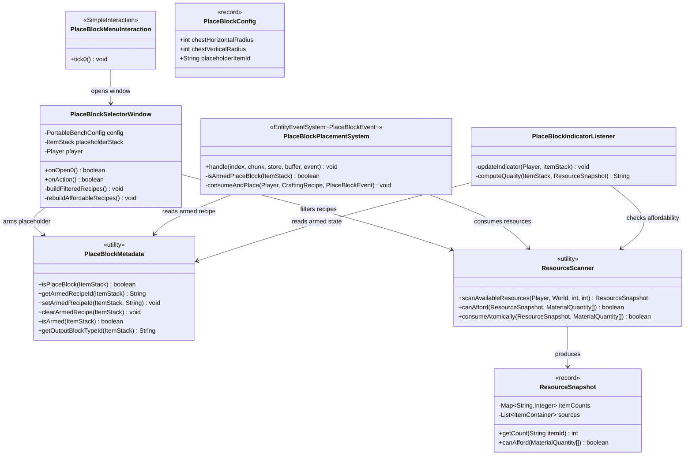
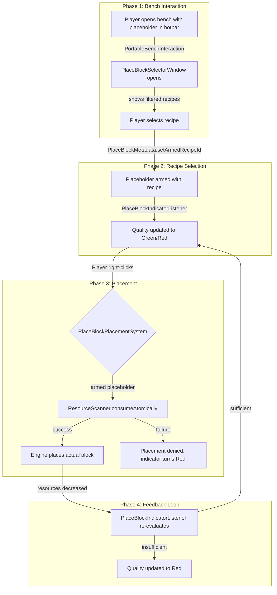
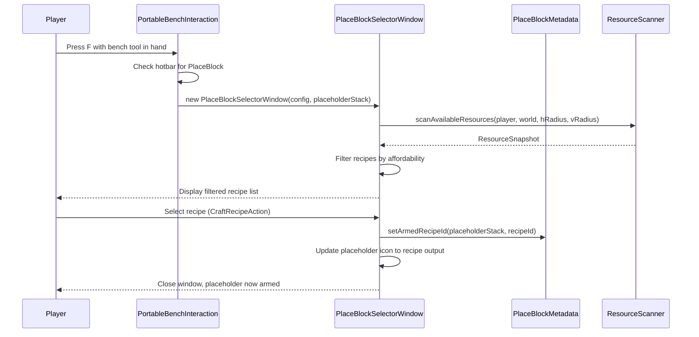
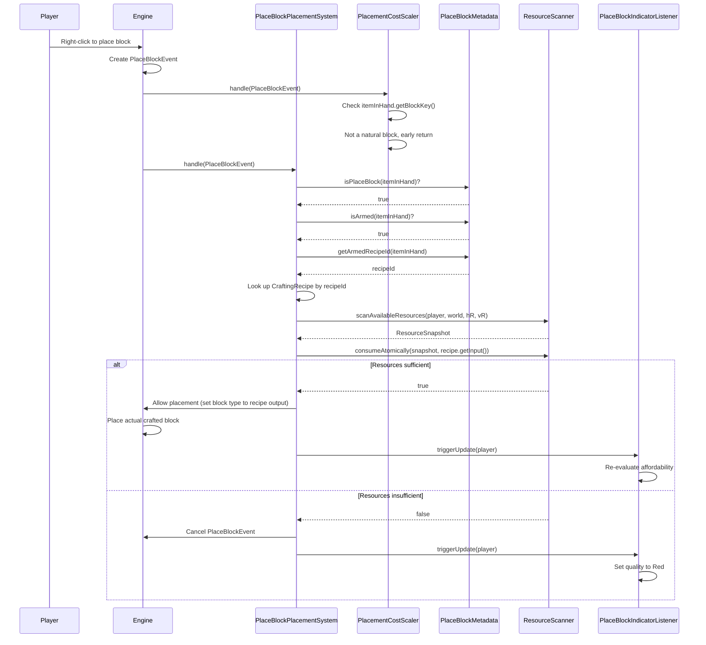
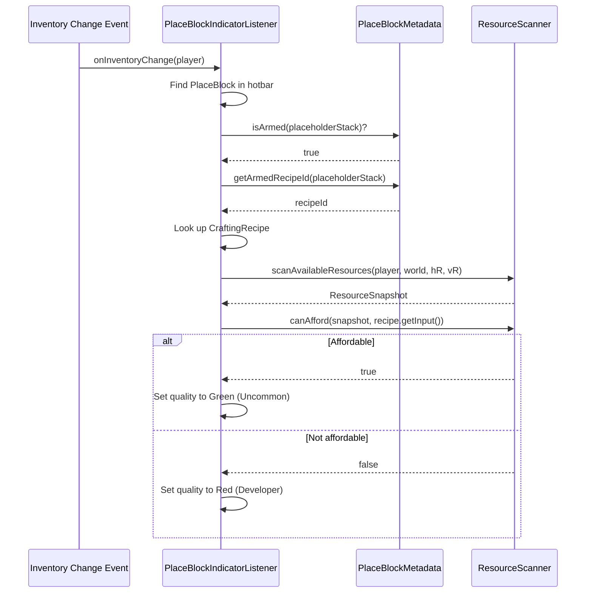
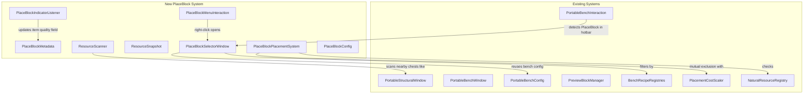

# PlaceBlock Building Tool — System Design

## 1. Overview

The PlaceBlock Building Tool gives players a **select-then-build** workflow at the Builders Bench. Instead of crafting blocks into inventory and placing them, the player selects a recipe to "arm" a placeholder tool, previews placement in-world, and places the actual crafted block on right-click — consuming scaled recipe inputs atomically from inventory and nearby chests. The system is designed around **deferred consumption** (Contract #10) and **mutual exclusion** with `PlacementCostScaler` (Contract #12).

## 2. Design Priorities

1. **Correctness** — Contracts #10–#14 are non-negotiable. Atomic consumption, mutual exclusion, and indicator truthfulness must be provably correct.
2. **Modularity** — Each phase is independently testable. Phase 1 components must not depend on Phase 3 code existing.
3. **Reuse** — The resource scanning and recipe filtering patterns from `PortableBenchWindow` / `PortableStructuralWindow` are reused, not reimplemented.
4. **Framework-native patterns** — Follow existing ECS event system, `SimpleInteraction`, `Window`, and item state patterns already established in the codebase.
5. **Testability** — Each component can be tested in isolation with minimal mocking.

## 3. Component Diagram



## 4. Responsibility Map



## 5. Sequence Diagrams

### 5a. Bench Recipe Selection



### 5b. Right-Click Placement



### 5c. Rarity Indicator Updates



## 6. Integration Points



### Integration Details

| Existing System | Integration Point | Direction | Description |
|---|---|---|---|
| `PortableBenchInteraction` | Already modified | Existing → New | Lines 87–93 detect `PlaceBlock` in hotbar and open `PlaceBlockSelectorWindow` instead of `PortableBenchWindow` |
| `PlacementCostScaler` | `handle()` early-exit | Mutual | `PlacementCostScaler` must early-exit when `PlaceBlockMetadata.isPlaceBlock(itemInHand)` returns true. `PlaceBlockPlacementSystem` must early-exit when the item is NOT a PlaceBlock. |
| `PortableBenchConfig` | Read-only reuse | New → Existing | `PlaceBlockSelectorWindow` receives the same `PortableBenchConfig` to access bench categories and recipe IDs |
| `BenchRecipeRegistries` | Read-only query | New → Existing | Recipe lookup for filtering and for resolving armed recipe inputs at placement time |
| `PreviewBlockManager` | Read-only reuse (Phase 3) | New → Existing | `PlaceBlockMenuInteraction.tick0()` uses `PreviewBlockManager` to show ghost blocks when the player aims at a surface |
| `NaturalResourceRegistry` | Read-only query | New → Existing | `PlaceBlockPlacementSystem` may need to verify the output block is NOT natural (non-block recipes already filtered at selection time) |

## 7. Package Structure

```
src/main/java/com/UnobstructedThirdPerson/placeblock/
├── PlaceBlockMetadata.java          # Phase 1 — Item state read/write (armed recipe, quality)
├── PlaceBlockConfig.java            # Phase 1 — Config record (chest radius, placeholder item ID)
├── PlaceBlockConfigLoader.java      # Phase 1 — Loads config from JSON resource
├── PlaceBlockSelectorWindow.java    # Phase 1 — StructuralCrafting window for recipe browsing
├── PlaceBlockMenuInteraction.java   # Phase 1 — Right-click interaction (already registered as codec)
├── ResourceScanner.java             # Phase 3 — Scans inventory + nearby chests, atomic consumption
├── ResourceSnapshot.java            # Phase 3 — Immutable snapshot of available resources
├── PlaceBlockPlacementSystem.java   # Phase 3 — ECS event system on PlaceBlockEvent
└── PlaceBlockIndicatorListener.java # Phase 4 — Inventory change listener, quality updater
```

## 8. Integration Changes Required

| File | Change | Phase |
|---|---|---|
| `PlacementCostScaler.java` | Add early-exit guard: `if (PlaceBlockMetadata.isPlaceBlock(itemInHand)) return;` before the natural block check | Phase 3 |
| `UnobstructedThirdPersonPlugin.java` | Already registers `PlaceBlockMenuInteraction`, `PlaceBlockPlacementSystem` — no change needed unless `PlaceBlockIndicatorListener` requires separate registration | Phase 4 |
| `portable_benches.json` (or new `placeblock_config.json`) | Add `chestHorizontalRadius` and `chestVerticalRadius` fields for the resource scan range | Phase 1 |

## 9. Contract Enforcement Matrix

| Contract | Enforced By | Mechanism |
|---|---|---|
| #10 (No consumption at selection) | `PlaceBlockSelectorWindow` | `onAction()` only calls `PlaceBlockMetadata.setArmedRecipeId()` — no inventory mutation |
| #11 (Atomic consumption) | `ResourceScanner.consumeAtomically()` | Check-then-deduct pattern: verify all inputs available across all containers, then remove in one pass. If any `removeItemStack` fails after verification, the system is in an inconsistent state — log error and cancel placement. |
| #12 (Mutual exclusion) | `PlacementCostScaler` + `PlaceBlockPlacementSystem` | Both check `PlaceBlockMetadata.isPlaceBlock(itemInHand)` — PCS exits if true, PBPS exits if false. The item identity (placeholder vs. natural block) is the discriminator, not a shared flag. |
| #13 (Indicator truthfulness) | `PlaceBlockIndicatorListener` | Updates on: inventory change event, post-placement callback, recipe selection. Always re-scans resources from live state. |
| #14 (Indistinguishable blocks) | `PlaceBlockPlacementSystem` | The `PlaceBlockEvent`'s target block type is set to the recipe's output block type. The engine places that block type — no metadata is attached. |

## 10. Risk Register

| # | Risk | Impact | Mitigation |
|---|---|---|---|
| R1 | **Item state persistence across relog** — Can `ItemStack` carry custom data (armed recipe ID) that persists when the player logs out and back in? | Contract #10 violated if state is lost — player loses their recipe selection | **Investigate:** Test whether `ItemStack.getData()` / NBT-like fields persist. If not, investigate `ItemStack` subclass or companion ECS component. |
| R2 | **Placeholder icon transformation** — Can an `ItemStack`'s displayed icon be changed at runtime to show a different block's texture? | Phase 2 blocked if the engine doesn't support runtime icon override | **Investigate:** Check if `Item.getIcon()` is mutable or if a different item must be swapped. The `Quality` field IS mutable (used for rarity colors) — icon may not be. Fallback: swap the entire `ItemStack` to a different item that has the desired icon. |
| R3 | **PlaceBlockEvent block type override** — Can the handler change which block type is placed (from placeholder to recipe output)? | Phase 3 blocked if `PlaceBlockEvent` doesn't allow target block override | **Investigate:** `PlaceBlockEvent` has `setTargetBlock(Vector3i)` but no `setBlockType()`. May need to cancel the event and place the block manually via `World.setBlock()`. |
| R4 | **Chest scanning at player position** — Can we enumerate nearby chests within a radius of the player (not a bench block)? | Resource scanning in the field won't work without this | **Investigate:** `PortableStructuralWindow` already has `chestHorizontalRadius`/`chestVerticalRadius` fields but sets them to 0. Check if the engine's `MaterialExtraResourcesSection` can be used for this, or if manual block-entity iteration is required. |
| R5 | **Inventory change event scope** — Does `ItemContainer.registerChangeEvent()` fire for chest interactions and item pickups, or only direct inventory mutations? | Contract #13 incomplete if some change sources are missed | **Investigate:** `PortableBenchWindow` uses `container.registerChangeEvent()` for the Craftable tab — verify whether this fires on chest open/close and item pickup. May need additional event hooks. |
| R6 | **Quality field write-back** — Can `ItemStack.setQuality()` (or equivalent) update a held item's quality in real-time so the client reflects the color change? | Phase 4 visual feedback doesn't work | **Investigate:** The `Quality: "Developer"` field exists on placeholder assets. Test if modifying `ItemStack` quality and invalidating the slot container triggers a client-side re-render. |
| R7 | **Concurrent chest access** — Two players with armed placeholders sharing the same chests could both pass affordability checks, then both consume, causing over-deduction | Economy integrity — one player loses resources | **Accept:** Contract doc acknowledges this ("first to place gets the resources"). `consumeAtomically` uses sequential remove calls — if a remove fails mid-transaction, log and deny. No reservation system per contract anti-patterns. |
| R8 | **Block preview integration** — `PreviewBlockManager` sends `ServerSetBlock` packets for ghost blocks. Does the engine's own block preview system conflict with this? | Visual glitches or duplicate ghost blocks | **Investigate:** Determine if the engine has a native placement preview that should be used instead, or if `PreviewBlockManager` is the correct approach for armed-placeholder preview. |

## 11. Phase Plan

### Phase 1: Placeholder Asset + Bench Interaction

**Goal:** Player places `Block_Placeholder` in Builders Bench, sees recipe list filtered by available resources.

**Components:**
- `PlaceBlockMetadata` — `isPlaceBlock()` only (armed recipe methods are stubs)
- `PlaceBlockConfig` + `PlaceBlockConfigLoader` — chest radius config
- `PlaceBlockSelectorWindow` — Window extending `Window` (like `PortableBenchWindow`), showing recipes from `PortableBenchConfig` categories
- `PlaceBlockMenuInteraction` — wired to open `PlaceBlockSelectorWindow`

**Integration:**
- `PortableBenchInteraction` already detects PlaceBlock in hotbar and delegates to `PlaceBlockSelectorWindow`
- Recipe list populated from `BenchRecipeRegistries` / `CraftingPlugin`

**Testable:**
1. Place `Block_Placeholder` in hotbar, press F on a bench tool → `PlaceBlockSelectorWindow` opens
2. Recipe list shows all block-output recipes for the bench
3. Closing the window returns to normal gameplay
4. Without `Block_Placeholder` in hotbar, bench opens normally (`PortableBenchWindow`)

**Does NOT require:** Recipe selection logic, armed state, placement, indicators

---

### Phase 2: Recipe Selection + Transformation

**Goal:** Selecting a recipe arms the placeholder — stores the recipe ID and transforms the placeholder's visual.

**Components:**
- `PlaceBlockMetadata` — full implementation: `setArmedRecipeId()`, `getArmedRecipeId()`, `isArmed()`, `getOutputBlockTypeId()`, `clearArmedRecipe()`
- `PlaceBlockSelectorWindow` — `onAction()` handles `CraftRecipeAction`, calls `PlaceBlockMetadata.setArmedRecipeId()`

**Risks to resolve first:** R1 (item state persistence), R2 (icon transformation)

**Testable:**
1. Open bench with PlaceBlock → select a recipe → placeholder shows armed state
2. Re-open bench → select different recipe → placeholder changes
3. Clear recipe → placeholder returns to unarmed state
4. Log out with armed placeholder → log in → placeholder retains recipe (if R1 resolved)

**Does NOT require:** Resource consumption, placement, indicators

---

### Phase 3: Block Preview + Right-Click Placement + Resource Consumption

**Goal:** Armed placeholder shows ghost block at aim position. Right-click places the actual block and consumes resources atomically.

**Components:**
- `ResourceScanner` — scans player inventory + nearby chests within radius
- `ResourceSnapshot` — immutable snapshot of item counts and container references
- `PlaceBlockPlacementSystem` — `EntityEventSystem<PlaceBlockEvent>`, consumes resources and places block
- `PlaceBlockMenuInteraction` — extended to show preview via `PreviewBlockManager` when armed

**Integration:**
- `PlacementCostScaler` gets early-exit guard for PlaceBlock items (Contract #12)
- `PlaceBlockPlacementSystem` registered in plugin setup (already done)

**Risks to resolve first:** R3 (block type override), R4 (chest scanning), R8 (preview integration)

**Testable:**
1. Arm placeholder → aim at surface → ghost block appears (if preview works)
2. Right-click with sufficient resources → block placed, resources consumed from inventory
3. Right-click with sufficient resources in nearby chests → resources consumed from chests too
4. Right-click with insufficient resources → placement denied, nothing consumed
5. Place a natural block → `PlacementCostScaler` fires (not `PlaceBlockPlacementSystem`)
6. Place via armed placeholder → `PlaceBlockPlacementSystem` fires (not `PlacementCostScaler`)
7. Break a PlaceBlock-placed block → same drops as a normally-placed block of the same type

**Does NOT require:** Rarity indicators, inventory event listeners

---

### Phase 4: Rarity Indicators + Inventory Event Listeners

**Goal:** Placeholder quality dynamically reflects resource availability — Blue (unarmed), Green (armed + affordable), Red (armed + unaffordable).

**Components:**
- `PlaceBlockIndicatorListener` — listens to inventory change events, re-evaluates affordability, updates quality

**Integration:**
- Registers on `ItemContainer.registerChangeEvent()` (same pattern as `PortableBenchWindow.rebuildCraftableCategory()`)
- Post-placement callback from `PlaceBlockPlacementSystem` triggers re-evaluation

**Risks to resolve first:** R5 (inventory event scope), R6 (quality field write-back)

**Testable:**
1. Unarmed placeholder → Blue quality
2. Arm with affordable recipe → Green quality
3. Arm with unaffordable recipe → Red quality
4. Place blocks until resources insufficient → Green transitions to Red
5. Pick up resources → Red transitions to Green
6. Open/close chest (acquire items) → indicator updates (if R5 allows)

## 12. Open Questions

1. **Which interaction codec handles what?** `PlaceBlock_Menu` and `Assign_Bench` are both registered. Current design assumes `PlaceBlock_Menu` handles the right-click-while-holding-placeholder action (block preview + placement), and `Assign_Bench` may be unnecessary or handles bench-side operations. Needs clarification during Phase 1.

2. **Block preview approach:** Should the PlaceBlock tool use `PreviewBlockManager` (server-side `ServerSetBlock` ghost packets) or does the engine provide a native client-side block preview when the held item has a `blockId`? If native preview exists, Phase 3's preview work may be minimal.

3. **Chest entity discovery API:** The exact method for iterating block entities (chests) within a radius of a position needs investigation. The `PortableStructuralWindow` has the fields but hardcodes radius to 0.

4. **Unarmed placeholder placement behavior:** When an unarmed placeholder is right-clicked, should the engine be allowed to place a placeholder block in the world? Current design: `PlaceBlockPlacementSystem` cancels `PlaceBlockEvent` for unarmed placeholders. But do placeholder block assets even have placement logic? The asset has `Quality: "Developer"` — investigate whether the engine blocks placement for developer-quality items.

5. **Recipe output quantity > 1:** If a recipe produces 3× of a block, does a single right-click place 1 block (consuming 1/3 of the recipe cost) or 3 blocks? Current design assumes 1 block per click, with the full recipe cost consumed. This matches the contract ("right-click places the actual crafted block") but means the player "wastes" the extra 2 blocks if the recipe outputs 3. Needs product decision.
