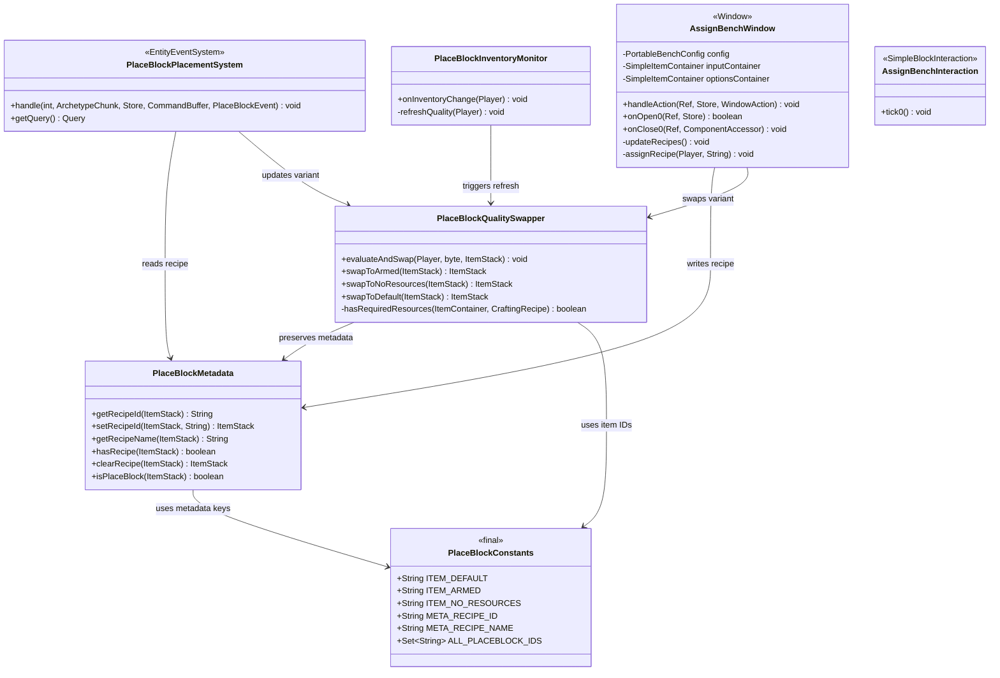
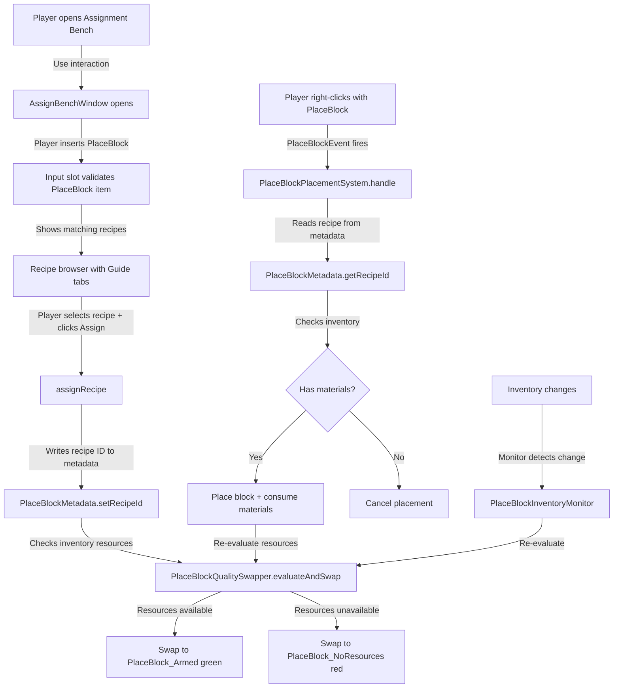
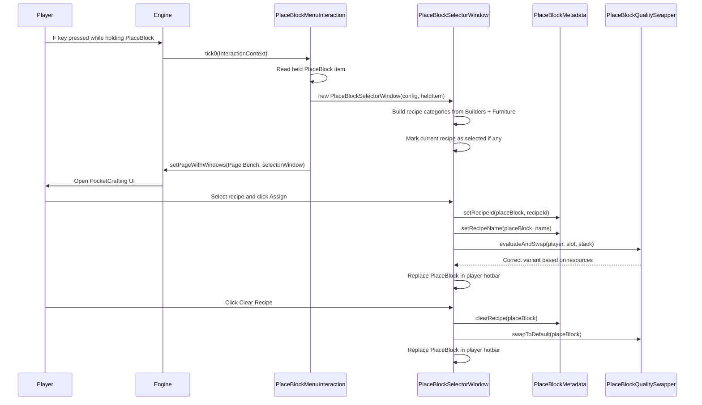
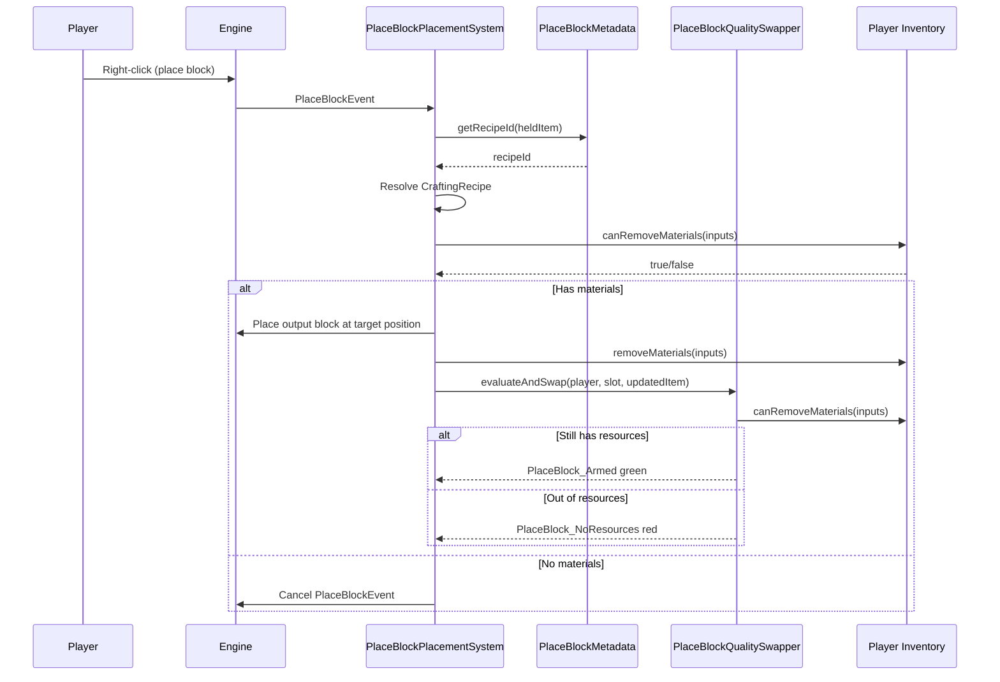
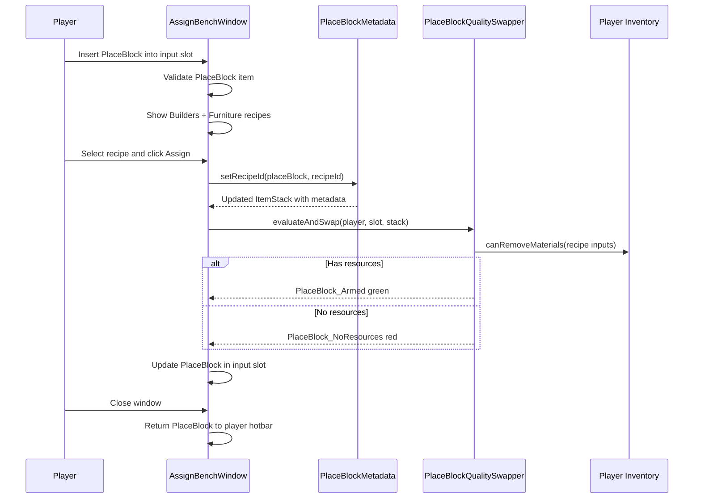

# Design: PlaceBlock System (Recipe-Armed Placement Tool)

## 1. Overview

A reusable placement tool system where a **PlaceBlock item** is "armed" with a crafting recipe and then used to place that recipe's output block repeatedly, consuming inventory resources per placement instead of consuming the tool itself. Recipe assignment happens via three routes: the PlaceBlock's own F-key menu, a physical **Assignment Bench** block, or the existing **Pocket Bench** item. Visual feedback uses three item quality variants (blue/green/red) to communicate tool state.

### Core Design Principle

**Separate the crafting concern from the placement concern.** The Pocket Bench handles standard crafting. The PlaceBlock handles repeated placement. The Assignment Bench and PlaceBlock menu handle recipe selection. Each has a single responsibility.

## 2. Design Priorities

1. **Simplicity** — minimal custom assets (3 item variants + 1 block), reuse existing bench models and window patterns
2. **Engine-native patterns** — `SimpleBlockInteraction` for placement, `PlaceBlockEvent` as fallback, BSON metadata for per-stack state
3. **Extensibility** — the same PlaceBlock system works with any bench type (Builders, Furniture, future benches) via config
4. **Existing code preservation** — Pocket Bench (`PortableBenchWindow`) is NOT rewritten; integration is via a thin wrapper

## 3. Component Diagram



## 4. Responsibility Map



## 5. Sequence Diagrams

### 5a. Recipe Assignment via PlaceBlock F-Key Menu



### 5b. Block Placement Flow



### 5c. Assignment via Physical Bench



## 6. Package Structure

```
src/main/java/com/UnobstructedThirdPerson/
├── placeblock/
│   ├── PlaceBlockConstants.java              # Item IDs, metadata keys, helper set
│   ├── PlaceBlockMetadata.java               # Read/write recipe data on ItemStack BSON metadata
│   ├── PlaceBlockQualitySwapper.java         # Swap between 3 item variants preserving metadata
│   ├── PlaceBlockPlacementSystem.java        # ECS PlaceBlockEvent handler for right-click placement
│   ├── PlaceBlockInventoryMonitor.java       # Monitors inventory changes to update quality state
│   ├── PlaceBlockMenuInteraction.java        # F-key interaction: opens recipe selector window
│   └── PlaceBlockSelectorWindow.java         # PocketCrafting window for recipe selection/assignment
├── assignbench/
│   ├── AssignBenchInteraction.java           # Block interaction: opens AssignBenchWindow
│   └── AssignBenchWindow.java                # StructuralCrafting window for bench-based assignment
├── portablebench/                            # EXISTING — minimal changes
│   ├── PortableBenchWindow.java              # (unchanged)
│   └── ... (all existing files unchanged)

src/main/resources/
├── Server/Item/
│   ├── Items/Tool/
│   │   ├── PlaceBlock_Default.json           # Quality: "Tool" (blue) — no recipe assigned
│   │   ├── PlaceBlock_Armed.json             # Quality: "Uncommon" (green) — recipe armed, resources OK
│   │   └── PlaceBlock_NoResources.json       # Quality: "Developer" (red) — recipe armed, no resources
│   ├── Block/
│   │   └── Bench_Assignment.json             # Block type: reuses existing bench model
│   ├── Interactions/
│   │   ├── PlaceBlock_Menu_Interaction.json  # F-key menu interaction definition
│   │   ├── PlaceBlock_Place_Interaction.json # Right-click placement interaction definition
│   │   └── Assign_Bench_Interaction.json     # Block interaction for assignment bench
│   └── RootInteractions/
│       ├── PlaceBlock_Menu.json              # Root interaction for F-key
│       ├── PlaceBlock_Place.json             # Root interaction for right-click
│       └── Assign_Bench.json                 # Root interaction for bench block
```

## 7. Item Variants — Quality-Based Visual Feedback

| Variant | Item ID | Quality | Highlight | State |
|---------|---------|---------|-----------|-------|
| Default | `PlaceBlock_Default` | `Tool` | Blue | No recipe assigned |
| Armed | `PlaceBlock_Armed` | `Uncommon` | Green | Recipe assigned, player has required resources |
| No Resources | `PlaceBlock_NoResources` | `Developer` | Red | Recipe assigned, player lacks required resources |

All three share the same icon asset (e.g., `Icons/ItemsGenerated/PlaceBlock.png`). They differ only in `Quality`, which controls the slot highlight color in the inventory/hotbar.

### Variant Swap Rules

- **Default → Armed**: Recipe assigned via any method AND `canRemoveMaterials(recipeInputs)` returns true
- **Default → NoResources**: Recipe assigned via any method AND `canRemoveMaterials(recipeInputs)` returns false
- **Armed → NoResources**: Inventory change makes resources insufficient
- **NoResources → Armed**: Inventory change makes resources sufficient
- **Armed/NoResources → Default**: Recipe cleared via menu or bench
- **Any → re-evaluate**: After every placement (resources may have been consumed)

### Metadata Schema (BSON on ItemStack)

| Key | Type | Description |
|-----|------|-------------|
| `placeblock_recipe_id` | String | The CraftingRecipe asset ID (e.g., `"Builders_WoodPlanks_Oak"`) |
| `placeblock_recipe_name` | String | Human-readable name for tooltip (e.g., `"Oak Planks"`) |

When metadata is empty or keys are absent, the PlaceBlock is in Default state.

## 8. Placement Mechanics

### Approach: PlaceBlockEvent Interception

The PlaceBlock item variants set `"blockId": "Debug_Block_Empty"` in their JSON, making the engine treat them as placeable and fire `PlaceBlockEvent` on right-click.

The `PlaceBlockPlacementSystem` (an `EntityEventSystem<EntityStore, PlaceBlockEvent>`) intercepts this event:

1. **Detect** — check if `event.getItemInHand()` is a PlaceBlock variant (via `PlaceBlockConstants.ALL_PLACEBLOCK_IDS`)
2. **Cancel immediately** — `event.cancel()` to prevent Debug_Block_Empty placement and item consumption
3. **Read recipe** — `PlaceBlockMetadata.getRecipeId(itemInHand)` → recipe ID from BSON metadata
4. **Resolve** — look up `CraftingRecipe` and determine output block type ID via `Item.getBlockId()`
5. **Check resources** — `container.canRemoveMaterials(recipeInputs)` against player inventory
6. **Place correct block** — use `WorldChunk.placeBlock()` API:
   ```java
   Vector3i pos = event.getTargetBlock();
   RotationTuple rot = event.getRotation();
   World world = store.getExternalData().getWorld();
   WorldChunk chunk = world.getNonTickingChunk(
       ChunkUtil.indexChunkFromBlock(pos.getX(), pos.getZ()));
   chunk.placeBlock(pos.getX(), pos.getY(), pos.getZ(),
       outputBlockTypeKey,
       rot.yaw(), rot.pitch(), rot.roll(), 0);
   ```
7. **Consume resources** — `container.removeMaterials(recipeInputs)` from inventory
8. **Re-evaluate quality** — call `PlaceBlockQualitySwapper.evaluateAndSwap()` to update the variant if resources are now depleted

> **Note:** `PlaceBlockEvent.itemInHand` is `final` — there is no setter to change the block type through the event. Cancel + manual place is the only viable approach.

### Important: PlaceBlock is Never Consumed

Unlike standard block placement where the engine removes 1 item from the stack, the PlaceBlock tool is **reusable**. The event cancellation prevents the engine from decrementing the stack. Only inventory resources (recipe inputs) are consumed.

## 9. Assignment Bench (Physical Block)

### Block Asset

Uses an existing bench model (e.g., Builders Bench model) with a new block type ID (`Bench_Assignment`). The block JSON defines:

```json
{
  "Model": "Models/Block/Bench_Builders.hbm",
  "Interactions": {
    "Use": "Assign_Bench"
  }
}
```

No `BlockEntity` required — the window is stateless (created fresh on each interaction). Recipe state lives in the PlaceBlock item's metadata, not in the bench block.

### Window Behavior

`AssignBenchWindow` extends `Window` with `WindowType.StructuralCrafting`, implementing `ItemContainerWindow` and `MaterialContainerWindow` (same pattern as `PortableStructuralWindow`):

- **Input slot (slot 0)**: Accepts only PlaceBlock items (validated by slot filter using `PlaceBlockMetadata.isPlaceBlock()`)
- **Options container (slots 1–64)**: Shows recipe outputs from both Builders and Furniture benches
- **Guide tabs**: All recipe categories displayed as read-only browsing tabs
- **Assign action**: When the player selects a recipe and triggers `CraftRecipeAction`, the handler writes the recipe ID to the PlaceBlock's metadata and swaps its quality variant — no materials are consumed, no output is produced
- **Clear action**: A special tab or recipe ID signals "clear recipe", resetting the PlaceBlock to Default state
- **On close**: Returns the (possibly modified) PlaceBlock from the input slot to the player's inventory

### Bench Config

The Assignment Bench's category/recipe definitions reuse `PortableBenchConfig` — it aggregates both Builders and Furniture bench categories. A new entry in `portable_benches.json`:

```json
{
  "benches": {
    "Bench_Assignment": {
      "benchId": "Assignment",
      "benchName": "server.items.Bench_Assignment.name",
      "categories": [
        { "id": "Blocks", "name": "Blocks", "icon": "", "recipeCategoryIds": ["WoodPlanks", "Bricks", "Decorative", "Smooth"] },
        { "id": "Structural", "name": "Structural", "icon": "", "recipeCategoryIds": ["Beam", "Platform", "Roof", "Pillar", "Wall"] },
        { "id": "Furniture", "name": "Furniture", "icon": "", "recipeCategoryIds": ["Table", "Chair", "Bench", "Stool", "Shelf"] }
      ]
    }
  }
}
```

## 10. PlaceBlock F-Key Menu (Self-Contained Assignment)

The PlaceBlock item has a `"Use": "PlaceBlock_Menu"` interaction that opens a `PlaceBlockSelectorWindow`. This is a `PocketCrafting` window (same pattern as `PortableBenchWindow`) that shows all available recipes from configured benches.

### Differences from standard PocketCrafting

| Aspect | PortableBenchWindow | PlaceBlockSelectorWindow |
|--------|-------------------|--------------------------|
| Action on recipe click | Crafts item (consumes materials, produces output) | Assigns recipe to PlaceBlock (no material cost) |
| Window purpose | Standard crafting | Recipe selection for the held PlaceBlock |
| Special tab | "Craftable" filter | "Clear Recipe" action |
| Item mutation | None | Writes metadata + swaps quality variant |

### Implementation

`PlaceBlockSelectorWindow` extends `Window` with `WindowType.PocketCrafting`. Its `handleAction` intercepts `CraftRecipeAction` and instead of crafting:

1. Reads the recipe ID from the action
2. Resolves the recipe name from the `CraftingRecipe` asset
3. Writes both to the PlaceBlock's metadata via `PlaceBlockMetadata`
4. Evaluates resource availability and swaps the PlaceBlock variant via `PlaceBlockQualitySwapper`
5. Replaces the PlaceBlock in the player's active hotbar slot

A "Clear Recipe" tab or a special sentinel recipe ID (`__clear__`) triggers `PlaceBlockMetadata.clearRecipe()` and swaps to Default.

## 11. Pocket Bench Integration (Optional Enhancement)

The existing `PortableBenchWindow` can optionally support PlaceBlock assignment **without being rewritten**. The approach:

### Strategy: Detect PlaceBlock in Inventory

In `PortableBenchInteraction.tick0()`, before creating the window:

1. Scan the player's hotbar for any PlaceBlock item
2. If found, create a `PlaceBlockSelectorWindow` instead of `PortableBenchWindow`
3. If not found, create the normal `PortableBenchWindow` (existing behavior)

This keeps `PortableBenchWindow` **completely unchanged**. The only modification is a small branch in `PortableBenchInteraction.tick0()` — approximately 10 lines of code.

### Alternative: Wrapper Window (more complex, more flexible)

Create `PortableBenchAssignWindow` that wraps `PortableBenchWindow` and adds an "Assign to PlaceBlock" category tab. When recipes on that tab are clicked, the wrapper assigns to the PlaceBlock instead of crafting. This approach lets the player both craft AND assign from the same window.

**Recommendation**: Start with the detection approach (simpler). Upgrade to the wrapper if players request both craft+assign in one window.

## 12. Registration in Plugin Entry Point

Add to `UnobstructedThirdPersonPlugin.setup()`:

```java
// Register PlaceBlock interaction types
this.getCodecRegistry(Interaction.CODEC)
    .register("PlaceBlock_Menu", PlaceBlockMenuInteraction.class, PlaceBlockMenuInteraction.CODEC);

// Register Assignment Bench block interaction
this.getCodecRegistry(Interaction.CODEC)
    .register("Assign_Bench", AssignBenchInteraction.class, AssignBenchInteraction.CODEC);

// Register PlaceBlock placement system (PlaceBlockEvent handler)
this.getEntityStoreRegistry().registerSystem(new PlaceBlockPlacementSystem());

// Register PlaceBlock inventory monitor
this.getEntityStoreRegistry().registerSystem(new PlaceBlockInventoryMonitor());
```

## 13. Integration Changes Required

| File | Change | Impact |
|------|--------|--------|
| `UnobstructedThirdPersonPlugin.java` | Add codec registrations for new interaction types + ECS systems | ~15 lines added |
| `PortableBenchInteraction.java` | Add PlaceBlock detection branch in `tick0()` (optional) | ~10 lines added |
| `portable_benches.json` | Add `Bench_Assignment` entry | Config only |
| `PortableBenchWindow.java` | **No changes** | Untouched |
| `PortableStructuralWindow.java` | **No changes** | Untouched |

## 14. Open Questions (Resolved)

| # | Question | Resolution |
|---|----------|------------|
| 1 | **PlaceBlockEvent cancellation + manual placement** — Does calling `event.cancel()` then manually placing a different block via world API work in the same tick? | **Yes — cancel + manual place is the correct approach.** `PlaceBlockEvent.itemInHand` is `final` — there is no setter to change the block type via the event. You can only modify position (`setTargetBlock`) and rotation (`setRotation`). The approach is: `event.cancel()` → `WorldChunk.placeBlock()` with the recipe's output block type → consume materials manually. Cancelling prevents both the placeholder block placement and the item consumption. |
| 2 | **ItemStack metadata network sync** — Does BSON metadata on `ItemStack` automatically sync to the client for tooltip rendering? | **Needs testing.** If metadata doesn't render in tooltips, fallback options: (a) use the item's `TranslationProperties.Description` override if one exists per-variant, or (b) send a chat message confirming the assignment. Test with a simple metadata write and observe client tooltip behavior. |
| 3 | **World.setBlockType() API** — What is the exact API for programmatically placing a block at a position with rotation? | **Resolved: `WorldChunk.placeBlock()`**. Signature: `boolean placeBlock(int x, int y, int z, String blockTypeKey, Rotation yaw, Rotation pitch, Rotation roll, int settings)`. Get the chunk via `world.getNonTickingChunk(ChunkUtil.indexChunkFromBlock(x, z))`. `placeBlock()` validates placement (checks target is empty/replaceable), resolves connected blocks, then calls `setBlock()` internally. Use `settings = 0` for standard placement. |
| 4 | **Placeholder block type** — Should `PlaceBlock_Placeholder` be a real block type or can `blockId` reference a non-existent type? | **Use `Debug_Block_Empty` as the `blockId`.** This existing debug block type makes the engine treat the PlaceBlock items as placeable (fires `PlaceBlockEvent` on right-click). The event is always cancelled, so the debug block is never actually placed. |
| 5 | **Inventory change events** — Is there a global inventory change event, or must we poll? | **Use `container.registerChangeEvent()` per player.** Register when the player equips a PlaceBlock to their active hotbar slot. Unregister when they switch away or disconnect. This matches the pattern already used by `PortableBenchWindow` for its Craftable tab. |
| 6 | **Uncommon quality existence** — If `"Uncommon"` ItemQuality doesn't exist in vanilla data, a custom quality JSON asset is needed. | **Uncommon exists in vanilla data.** Refers to the same rarity quality used by items like copper tools (e.g., Copper Hatchet). No custom quality asset needed. |
