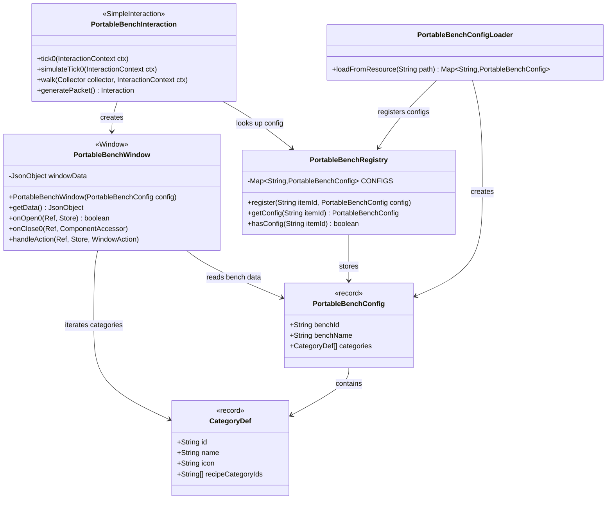
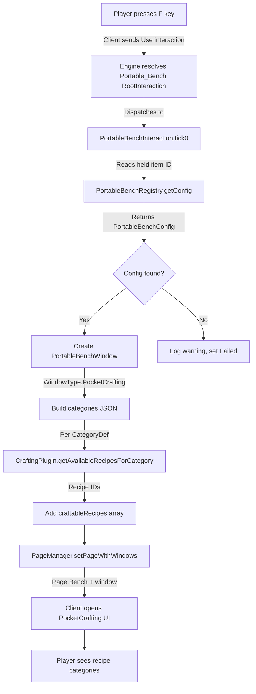
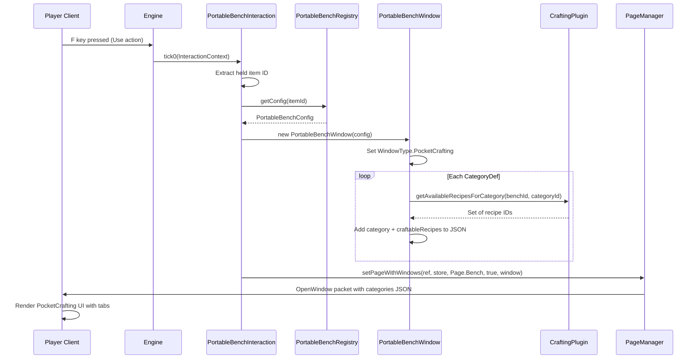

# Design: Portable Bench Tool (v2 — PocketCrafting)

## 1. Overview

A portable bench tool system that lets players open a crafting bench UI by pressing F (Use) while holding a configured item — no placed bench block required. The design registers a custom `Interaction` type via the plugin's codec registry and creates a blockless `Window` using `WindowType.PocketCrafting`, following the proven `FieldCraftingWindow` pattern. Category definitions and recipe mappings are loaded from a JSON config file at startup.

### v1 → v2 Migration: Why PocketCrafting?

**v1 used `WindowType.StructuralCrafting` (value 4), which crashed the client.** Root cause:

`WindowManager.openWindow()` builds the `OpenWindow` packet like this:
```java
InventorySection section = null;
if (window instanceof ItemContainerWindow icw) {
    section = icw.getItemContainer().toPacket();  // 65-slot container
}
ExtraResources extraResources = null;
if (window instanceof MaterialContainerWindow mcw) {
    extraResources = mcw.getExtraResourcesSection().toPacket();
}
return new OpenWindow(id, window.getType(), window.getData().toString(), section, extraResources);
```

The real `StructuralCraftingWindow` implements **both** `ItemContainerWindow` (65-slot container: 1 input + 64 outputs) and `MaterialContainerWindow` (nearby chest materials). Our `PortableBenchWindow extends Window` implements neither — both are `null` in the packet — causing the client's StructuralCrafting renderer to crash on null inventory data.

**Fix:** Switch to `WindowType.PocketCrafting` (value 1). This window type requires no inventory sections — the `OpenWindow` packet sends `null` for both, and the client's PocketCrafting renderer handles this gracefully. The UI shows a flat recipe list per category tab, which is the same pattern used by `FieldCraftingWindow`.

**Tradeoff:** Loses the structural input-slot-to-variant-grid UI. Players see category tabs with recipe lists instead. Recipes are still fully functional via `CraftingWindow.craftSimpleItem()`.

## 2. Design Priorities

1. **Correctness** — uses proven `PocketCrafting` pattern; no client crashes
2. **Extensibility** — JSON config file defines bench configs; add new benches without code changes
3. **Engine-native patterns** — follows `FieldCraftingWindow` and `Interaction.CODEC` conventions
4. **Testability** — config record and registry are decoupled from interaction/window logic

## 3. Component Diagram



## 4. Responsibility Map



## 5. Sequence Diagram



## 6. Package Structure

```
src/main/java/com/UnobstructedThirdPerson/
└── portablebench/
    ├── PortableBenchConfig.java          # Record: benchId, benchName, CategoryDef[]
    ├── PortableBenchConfig.CategoryDef   # Inner record: id, name, icon, recipeCategoryIds
    ├── PortableBenchRegistry.java        # Singleton registry: itemId → config
    ├── PortableBenchConfigLoader.java    # Reads portable_benches.json → registers configs
    ├── PortableBenchInteraction.java     # Custom Interaction: opens window on F press
    └── PortableBenchWindow.java          # Window subclass: blockless PocketCrafting

src/main/resources/
├── portable_benches.json                 # JSON config: bench definitions + categories
└── Server/Item/
    ├── Items/Tool/PortableBench_Builders.json
    ├── Interactions/Portable_Bench_Interaction.json
    └── RootInteractions/Portable_Bench.json
```

## 7. JSON Config Format

`portable_benches.json` maps item IDs to bench configs:

```json
{
  "benches": {
    "PortableBench_Builders": {
      "benchId": "Builders",
      "benchName": "server.items.Bench_Builders.name",
      "categories": [
        {
          "id": "Blocks",
          "name": "Blocks",
          "icon": "",
          "recipeCategoryIds": [
            "WoodPlanks", "OrnatePlanks", "DecorativePlanks",
            "Bricks", "Decorative", "Ornate", "Smooth"
          ]
        },
        {
          "id": "StairsSlabs",
          "name": "Stairs & Slabs",
          "icon": "",
          "recipeCategoryIds": ["Stairs", "HalfSlab", "SmoothHalfSlab"]
        }
      ]
    }
  }
}
```

Each UI category (`CategoryDef`) maps to one or more engine recipe category IDs. This lets the user group the 28 Builders bench categories into a manageable number of UI tabs. The `icon` field can reference an asset path (e.g., `Icons/CraftingCategories/Builders/Blocks.png`) or be left empty.

## 8. Window Data JSON (sent to client)

The `PortableBenchWindow.getData()` produces:

```json
{
  "type": 0,
  "id": "Builders",
  "name": "server.items.Bench_Builders.name",
  "categories": [
    {
      "id": "Blocks",
      "name": "Blocks",
      "icon": "",
      "craftableRecipes": ["recipe_id_1", "recipe_id_2", "..."]
    }
  ]
}
```

- `type`: `BenchType.Crafting.ordinal()` (0) — tells PocketCrafting renderer this is crafting-style
- `categories[].craftableRecipes`: populated at runtime from `CraftingPlugin.getAvailableRecipesForCategory(benchId, recipeCategoryId)` for all `recipeCategoryIds` in the `CategoryDef`

## 9. Item Asset

See `Server/Item/Items/Tool/PortableBench_Builders.json`.

Key fields:
- `"Interactions": { "Use": "Portable_Bench" }` — binds F key to custom interaction
- `"Categories": ["Tool.PortableBench"]` — item category for portable bench tools
- `"MaxStack": 1` — tools don't stack

## 10. Adding More Portable Benches

Add a new entry to `portable_benches.json`:

```json
{
  "benches": {
    "PortableBench_Furniture": {
      "benchId": "Furniture_Bench",
      "benchName": "server.items.Bench_Furniture.name",
      "categories": [
        {
          "id": "Storage",
          "name": "server.benchCategories.furniture.storage",
          "icon": "Icons/CraftingCategories/Furniture/Storage.png",
          "recipeCategoryIds": ["Furniture_Storage"]
        }
      ]
    }
  }
}
```

Then create the item asset JSON. No code changes needed — `PortableBenchConfigLoader` reads all entries at startup.

## 11. Integration Changes Required

| File | Change |
|---|---|
| `PortableBenchConfig.java` | Replace `String benchType`, `String[] categories` with `CategoryDef[] categories` inner record |
| `PortableBenchWindow.java` | Switch `WindowType.StructuralCrafting` → `PocketCrafting`, build categories JSON from `CategoryDef[]` + `CraftingPlugin` |
| `PortableBenchConfigLoader.java` | **New** — reads `portable_benches.json` via Gson |
| `UnobstructedThirdPersonPlugin.java` | Replace hardcoded config with `PortableBenchConfigLoader.loadAndRegister()` call |
| `PortableBenchConfigTest.java` | Update for new `CategoryDef` structure |
| `PortableBenchRegistryTest.java` | Update config construction |
| `Portable_Bench_Interaction.json` | Remove unused `"Id"` field |
| `Portable_Bench.json` | Remove unused `"Id"` field |

## 12. Open Questions (Resolved)

| # | Question | Resolution |
|---|---|---|
| 1 | StructuralCrafting without block entity? | **Impossible** — requires `ItemContainerWindow` + `MaterialContainerWindow`. Switched to PocketCrafting. |
| 2 | Recipe filtering? | Handled by `CraftingPlugin.getAvailableRecipesForCategory(benchId, categoryId)` at window construction time. |
| 3 | Crafting completion? | `CraftingWindow.craftSimpleItem()` routes items to player inventory — no block entity needed. |
| 4 | Window lifetime? | `Window` base class handles close on Escape/explicit dismiss. No block distance check since we don't extend `BlockWindow`. |
| 5 | Unknown JSON fields in item asset? | Engine logs `WARN: Unused key(s)` but does not crash. Custom fields in item JSON are safe. |

## 13. Open Questions (New)

1. **PocketCrafting icon rendering** — Does the client crash or show a blank when `icon` is empty string? If it crashes, a placeholder icon asset may be needed.
2. **Recipe compatibility** — `CraftingWindow.craftSimpleItem()` calls `craftingManager.craftItem()`. Verify this works for `StructuralCrafting`-type recipes (the bench type in the recipe's `BenchRequirement` is `StructuralCrafting`, not `Crafting`). The crafting manager may check bench type.
