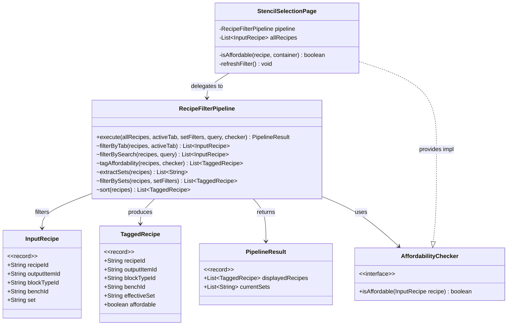
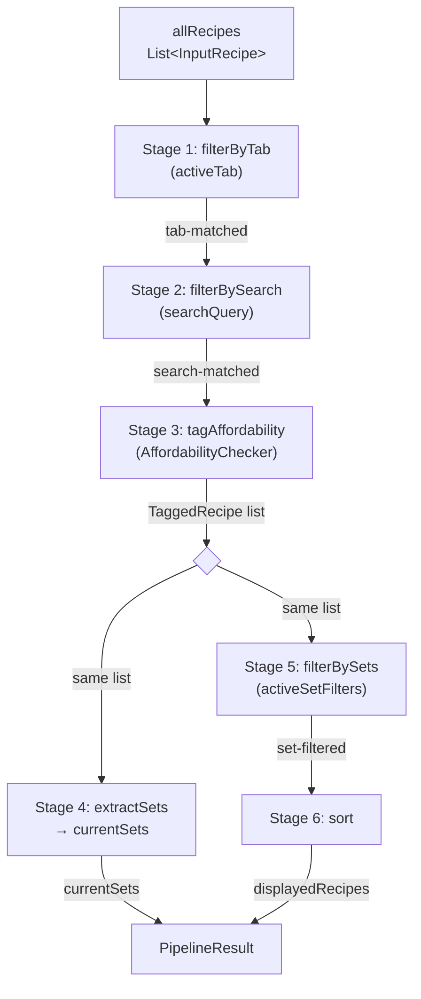
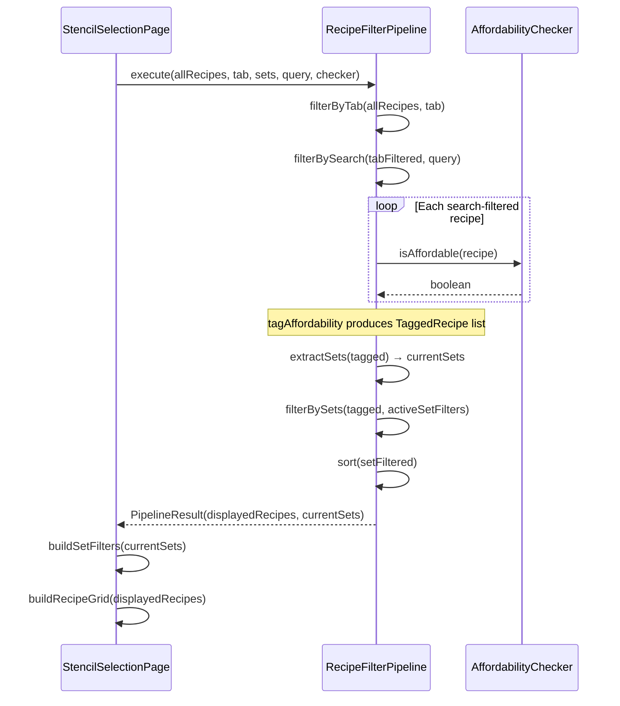

# Design: Recipe Filter Pipeline

## 1. Overview

`RecipeFilterPipeline` is a standalone, sequential filter pipeline that replaces the interleaved filtering logic currently split across `StencilSelectionPage.applyFilter()` and `buildRecipeList()`. Each stage has a single responsibility: take a list, produce a list. Affordability is computed **once** in a dedicated tagging stage, and both the sidebar set list (`currentSets`) and per-recipe dimming (`affordable`) derive from the same intermediate result.

The `CraftableFilter` enum (NONE / PARTIAL / FULL) is removed. The pipeline always computes affordability — unaffordable recipes are dimmed, never hidden.

## 2. Design Priorities

1. **Single responsibility per stage** — each stage does one thing: filter, tag, extract, or sort
2. **No redundant affordability checks** — `isAffordable()` runs once per recipe per pipeline execution
3. **Correctness** — `currentSets` and recipe filtering derive from the same tagged data
4. **Simplicity** — remove the CraftableFilter 3-mode dropdown; always tag, always dim
5. **Testability** — pipeline is a pure function (no UI state, no side effects); stages are package-private for unit testing

## 3. Component Diagram



## 4. Responsibility Map



### Stage details

| Stage | Method | Input | Output | Responsibility |
|-------|--------|-------|--------|----------------|
| 1 | `filterByTab` | `List<InputRecipe>`, `activeTab` | `List<InputRecipe>` | Retain recipes matching bench tab; pass all if `"All"` |
| 2 | `filterBySearch` | `List<InputRecipe>`, `searchQuery` | `List<InputRecipe>` | Retain recipes where recipeId, blockTypeId, or set contains query (case-insensitive); pass all if empty |
| 3 | `tagAffordability` | `List<InputRecipe>`, `AffordabilityChecker` | `List<TaggedRecipe>` | Convert to TaggedRecipe; normalize null `set` → `UNCATEGORIZED_SET`; compute `affordable` via checker (true if checker is null) |
| 4 | `extractSets` | `List<TaggedRecipe>` | `List<String>` | Collect unique `effectiveSet` values, sorted case-insensitive |
| 5 | `filterBySets` | `List<TaggedRecipe>`, `Set<String>` | `List<TaggedRecipe>` | Retain recipes whose `effectiveSet` is in `activeSetFilters`; pass all if filters is empty |
| 6 | `sort` | `List<TaggedRecipe>` | `List<TaggedRecipe>` | Sort by `effectiveSet` (alpha) → `affordable` first → `recipeId` (alpha) |

### Where key outputs are computed

- **`currentSets`** — Stage 4 (`extractSets`), derived from the Stage 3 output (post-affordability tagging, pre-set filtering). This means the sidebar always shows all sets present in the tab+search results.
- **`affordable` boolean** — Stage 3 (`tagAffordability`), computed once per recipe. The checker implementation in `StencilSelectionPage` calls `isAffordable()` which handles both raw material checks and BlockGroup interchangeability.

## 5. Sequence Diagram



## 6. Package Structure

```
src/main/java/com/UnobstructedThirdPerson/placeblock/ui/
├── RecipeFilterPipeline.java          # Pipeline class with nested records + interface
└── StencilSelectionPage.java        # Modified: delegates to pipeline, owns AffordabilityChecker impl
```

All new types (`InputRecipe`, `TaggedRecipe`, `PipelineResult`, `AffordabilityChecker`) are nested inside `RecipeFilterPipeline` to keep the public API surface small.

## 7. Integration Changes Required

### `StencilSelectionPage.java`

| Change | Description |
|--------|-------------|
| **Remove** `CraftableFilter` enum | No longer needed — affordability is always computed |
| **Remove** `craftableFilter` field | No longer needed |
| **Remove** `CraftableDropdown` binding in `build()` | Dropdown removed from UI |
| **Remove** `CraftableFilter` handling in `handleDataEvent()` | No dropdown events to handle |
| **Replace** `RecipeEntry` record | Use `RecipeFilterPipeline.InputRecipe` for `allRecipes`, `RecipeFilterPipeline.TaggedRecipe` for `displayedRecipes` |
| **Replace** `applyFilter()` body | Single call: `pipeline.execute(allRecipes, activeTab, activeSetFilters, searchQuery, checker)` → store `currentSets` and `displayedRecipes` from result |
| **Simplify** `buildRecipeList()` | Remove affordability computation loop — iterate `displayedRecipes` directly, read `affordable` from `TaggedRecipe` |
| **Adapt** `loadRecipes()` | Produce `List<InputRecipe>` instead of `List<RecipeEntry>` |
| **Keep** `isAffordable()` method | Wrap as `AffordabilityChecker` lambda: `recipe -> isAffordable(recipe, container)` |
| **Remove** `filteredRecipes` field | No longer needed — pipeline produces the final list |
| **Add** `RecipeFilterPipeline pipeline` field | Instantiate once, reuse across filter calls |

### `StencilBookPage.ui` (UI template)

| Change | Description |
|--------|-------------|
| **Remove** `#CraftableDropdown` | No longer needed |

### Set-less recipe handling

Recipes where `Item.set` is null are assigned `effectiveSet = "Uncategorized"` in Stage 3. This means:
- They appear in the sidebar under "Uncategorized"
- They are filterable like any other set
- They are never silently dropped

## 8. Open Questions

1. **"Uncategorized" label** — Is "Uncategorized" the right display name for set-less recipes, or should it be something else (e.g., "Other", "Misc")?
2. **Sidebar ordering** — Should "Uncategorized" appear at the end of the set list, or alphabetically? Current design sorts alphabetically.
3. **Empty pipeline result** — If all recipes are filtered out (e.g., search matches nothing), should the sidebar show no sets or retain the full set list? Current design: no sets (derived from same data).

## 9. Handoff Checklist

- [x] Component diagram included
- [x] Responsibility map included
- [x] All interfaces have Javadoc contracts
- [x] All skeleton files created with TODO markers
- [x] Integration Changes Required section populated
- [x] Open Questions section populated
