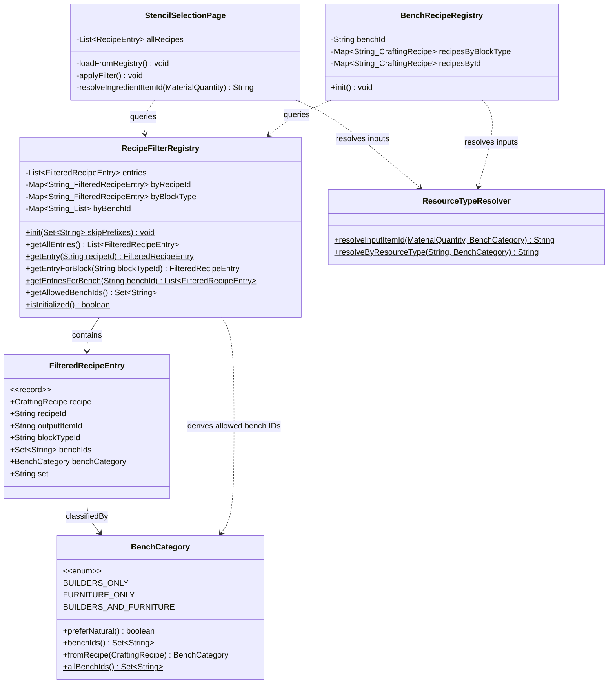
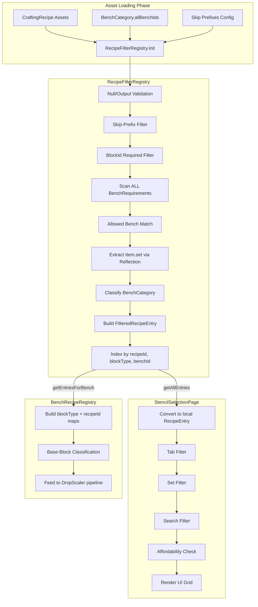
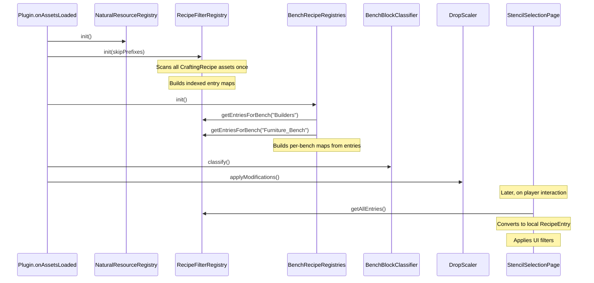

# Design: RecipeFilterRegistry

## 1. Overview

RecipeFilterRegistry is a shared, read-only registry that scans all `CraftingRecipe` assets exactly once, applies common validation and bench-matching predicates, and stores the results as indexed `FilteredRecipeEntry` records. It eliminates the duplicated recipe scanning logic in `StencilSelectionPage` (UI) and `BenchRecipeRegistry` (DropScaler pipeline), fixes the single-BenchRequirement bug in the UI code, and establishes `BenchCategory` as the single source of truth for allowed bench IDs.

The registry is a **data provider only** — consumers layer their own concerns (UI filtering, base-block classification, etc.) on top of the shared entries.

## 2. Design Priorities

1. **Single source of truth** — bench IDs, skip-prefixes, and recipe scanning happen in one place
2. **Correctness** — BenchRequirement matching scans ALL entries (fixes StencilSelectionPage bug)
3. **Simplicity** — minimal new types; record-based entries, static registry pattern matching existing codebase conventions
4. **Testability** — predicate pipeline is decomposed into named static methods
5. **Framework-native patterns** — follows existing Hytale plugin conventions (static init, asset map iteration)

## 3. Component Diagram



## 4. Responsibility Map



## 5. Sequence Diagram



## 6. Package Structure

```
src/main/java/com/UnobstructedThirdPerson/
├── resourcecollection/
│   ├── RecipeFilterRegistry.java       ← NEW: shared registry
│   ├── FilteredRecipeEntry.java        ← NEW: shared record
│   ├── BenchCategory.java             ← MODIFIED: add allBenchIds()
│   ├── BenchRecipeRegistry.java       ← MODIFIED: reads from RecipeFilterRegistry
│   ├── BenchRecipeRegistries.java     ← MODIFIED: no longer passes bench IDs
│   ├── ResourceTypeResolver.java      ← UNCHANGED
│   ├── BenchBlockClassifier.java      ← UNCHANGED
│   ├── NaturalResourceRegistry.java   ← UNCHANGED
│   └── DropScaler.java                ← MODIFIED: init order
├── placeblock/
│   └── ui/
│       └── StencilSelectionPage.java ← MODIFIED: reads from RecipeFilterRegistry
```

The new files live in `resourcecollection` because:
- All related types (`BenchCategory`, `ResourceTypeResolver`, `BenchRecipeRegistry`) are already there
- The registry is a data-layer concern, not a UI concern
- `StencilSelectionPage` already imports from `resourcecollection` indirectly via the crafting API

## 7. Integration Changes Required

### 7.1 BenchCategory.java — add `allBenchIds()` static method

Add a static method that computes the union of all bench IDs across all enum constants. This becomes the single source of truth for which bench IDs are "allowed" system-wide.

```java
// ADD to BenchCategory enum
public static Set<String> allBenchIds() {
    // union of all enum constant benchIds()
}
```

### 7.2 DropScaler.apply() — add RecipeFilterRegistry.init() call

Insert `RecipeFilterRegistry.init(...)` between `NaturalResourceRegistry.init()` and `BenchRecipeRegistries.init(...)`. Remove the hardcoded bench ID strings from `BenchRecipeRegistries.init()`.

**Before:**
```java
NaturalResourceRegistry.init();
BenchRecipeRegistries.init("Builders", "Furniture_Bench");
```

**After:**
```java
NaturalResourceRegistry.init();
RecipeFilterRegistry.init(Set.of("Stencil_", "Salvage"));
BenchRecipeRegistries.init();  // no bench IDs — reads from RecipeFilterRegistry
```

### 7.3 BenchRecipeRegistries.init() — remove bench ID parameters

Change `init(String... benchIds)` to `init()`. Derive the bench list from `BenchCategory.allBenchIds()` instead of caller-provided strings. Each `BenchRecipeRegistry.init()` now reads from `RecipeFilterRegistry.getEntriesForBench(benchId)` instead of scanning assets.

### 7.4 BenchRecipeRegistry.init() — replace recipe scanning with registry query

Remove the `CraftingRecipe.getAssetMap()` iteration loop. Replace with:
```java
List<FilteredRecipeEntry> entries = RecipeFilterRegistry.getEntriesForBench(this.benchId);
for (FilteredRecipeEntry entry : entries) {
    byBlock.putIfAbsent(entry.blockTypeId(), entry.recipe());
    byId.put(entry.recipeId(), entry.recipe());
}
```

Base-block classification logic stays in `BenchRecipeRegistry` — it's a consumer-specific concern that depends on `NaturalResourceRegistry`.

### 7.5 StencilSelectionPage — replace loadRecipes() scanning

| Remove | Replace with |
|--------|-------------|
| `ALLOWED_BENCHES` constant | `RecipeFilterRegistry.getAllowedBenchIds()` |
| `ITEM_SET_FIELD` reflection + static block | Removed — `FilteredRecipeEntry.set()` already extracted |
| Recipe scanning loop in `loadRecipes()` | `RecipeFilterRegistry.getAllEntries()` iteration |
| `resolveIngredientItemId()` naive first-match | `ResourceTypeResolver.resolveInputItemId(mat, entry.benchCategory())` |

The local `RecipeEntry` record stays (it carries UI-specific `affordable` field). It's populated from `FilteredRecipeEntry`:
```java
for (FilteredRecipeEntry fe : RecipeFilterRegistry.getAllEntries()) {
    allRecipes.add(new RecipeEntry(
        fe.recipeId(), fe.outputItemId(), fe.blockTypeId(),
        fe.benchIds().iterator().next(), // primary bench for tab display
        fe.set(), true));
}
```

> **Note:** Tab display currently uses a single `benchId` per entry. With the new multi-bench `Set<String> benchIds`, a recipe belonging to both benches should appear under both tabs. The UI should iterate `benchIds` and create one `RecipeEntry` per bench, or the tab filter should check `benchIds.contains(activeTab)`. This is a UI decision — not a registry concern.

### 7.6 Items that can be deleted after migration

| File | What to remove |
|------|---------------|
| `StencilSelectionPage.java` | `ALLOWED_BENCHES` field, `ITEM_SET_FIELD` field + static block, `resolveIngredientItemId()` method, recipe scanning loop in `loadRecipes()` |
| `BenchRecipeRegistry.java` | `hasBenchId()` private method, recipe scanning loop in `init()` |
| `BenchRecipeRegistries.java` | `benchIds` parameter from `init()` |
| `DropScaler.java` | Hardcoded `"Builders", "Furniture_Bench"` strings |

## 8. Open Questions

1. **Tab display for multi-bench recipes**: When a recipe belongs to both Builders and Furniture_Bench, should it appear under both tabs, or only the primary bench? Current UI uses a single `benchId` per entry — this needs a UI decision.

2. **Skip-prefix extensibility**: The default set `{"Stencil_", "Salvage"}` covers both current consumers. Should additional prefixes be configurable at runtime, or is compile-time sufficient? Current design uses `Set<String>` parameter on `init()` which is flexible enough.

3. **Input validation predicate**: `StencilSelectionPage` requires at least one input with `itemId` or `resourceTypeId`. `BenchRecipeRegistry` does not check this explicitly (recipes without valid inputs would just produce empty cost data). Should the shared registry enforce this? Recommendation: yes — a recipe with no resolvable inputs is useless to both consumers.

4. **RecipeFilterRegistry lifecycle**: Currently designed as a static singleton (matching `BenchRecipeRegistries` pattern). If the plugin ever needs hot-reload of assets, this would need a `reset()` method. Not needed today.

## 9. Handoff Checklist

- [x] Component diagram included
- [x] Responsibility map included
- [x] All interfaces have Javadoc contracts
- [x] All skeleton files created with TODO markers
- [x] Integration Changes Required section populated
- [x] Open Questions section populated
