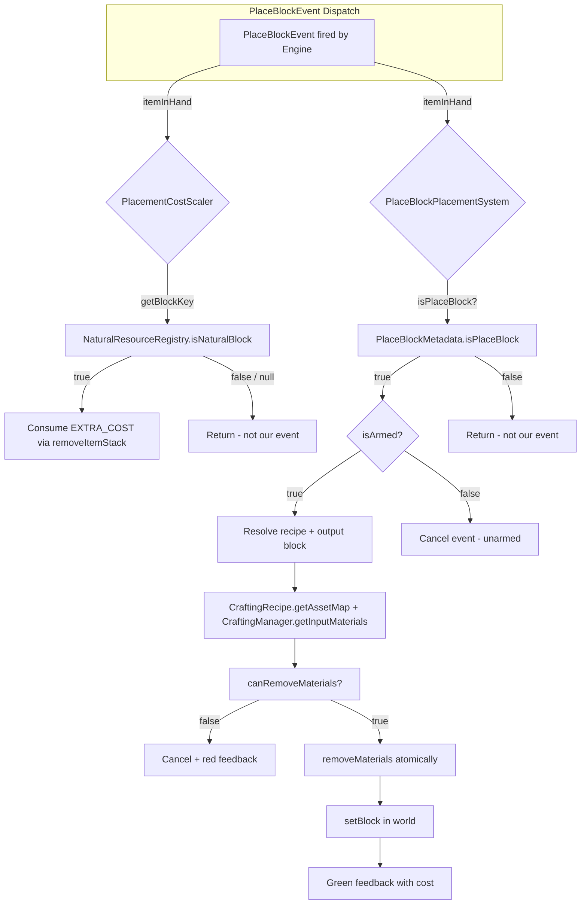
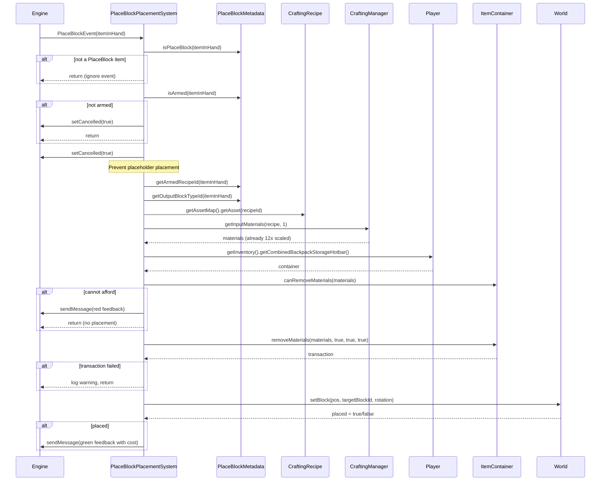

# Resource Consumption at Placement Time — Design

> **Stories:** S2604221200 (Inventory Availability Check), S2604221135 (Atomic Consumption), S2604221140 (Mutual Exclusion Verification)

## 1. Overview

This design adds resource consumption logic to `PlaceBlockPlacementSystem.handle()` so that placing an armed PlaceBlock placeholder deducts the recipe's material cost from the player's inventory before placing the output block. The consumption is atomic (all-or-nothing) and the costs are already 12× scaled by `BlueprintBookRecipeMutator` at recipe mutation time. Mutual exclusion with `PlacementCostScaler` is inherent and requires no code changes.

## 2. Design Priorities

1. **Correctness** — Atomic consumption: either all materials are consumed and the block is placed, or nothing happens.
2. **Simplicity** — Linear flow in one method, no new classes or helpers.
3. **Engine-native patterns** — Uses the same `canRemoveMaterials` → `removeMaterials` pattern as `PortableBenchWindow`.
4. **Safety** — Belt-and-suspenders: even after `canRemoveMaterials` passes, the transaction result is checked.

## 3. Responsibility Map



## 4. Sequence Diagram — Placement Flow



## 5. Insertion Point

The new consumption logic is inserted **after** resolving the target block type (the `BlockType targetBlockType` lookup) and **before** the `Vector3i pos = event.getTargetBlock()` line. Specifically:

```
  EXISTING: BlockType targetBlockType = BlockType.getAssetMap().getAsset(outputBlockTypeId);
  EXISTING: ... null check ...
  EXISTING: int targetBlockId = BlockType.getAssetMap().getIndex(outputBlockTypeId);
  
  ──── NEW: Recipe lookup ────
  ──── NEW: Get player + container ────
  ──── NEW: canRemoveMaterials check (return on failure) ────
  ──── NEW: removeMaterials atomic call (return on failure) ────
  
  EXISTING: Vector3i pos = event.getTargetBlock();
  EXISTING: ... placement logic ...
```

This ensures we only consume resources after all validation has passed (item is PlaceBlock, is armed, recipe is valid, output block type exists) but before any world mutation occurs.

## 6. Mutual Exclusion Verification (S2604221140)

**No code change is needed.** The two systems are inherently mutually exclusive:

| Check | PlacementCostScaler | PlaceBlockPlacementSystem |
|-------|---------------------|---------------------------|
| Guard | `itemInHand.getBlockKey()` → `NaturalResourceRegistry.isNaturalBlock(blockTypeId)` | `PlaceBlockMetadata.isPlaceBlock(itemInHand)` |
| Handles | Natural resource blocks (stone, wood, dirt, etc.) | Armed PlaceBlock placeholder items |
| Early-exit | Returns immediately if `getBlockKey()` is null or block is not in `NaturalResourceRegistry` | Returns immediately if item is not a PlaceBlock |

**Why no overlap is possible:**
- PlaceBlock placeholder items are custom items with NBT metadata. They do **not** have a `blockKey` that exists in `NaturalResourceRegistry`.
- `NaturalResourceRegistry` only contains vanilla natural blocks (stone, wood, sand, etc.). Placeholder items are synthetic crafting tools.
- Even if a placeholder item somehow had a `blockKey`, `NaturalResourceRegistry.isNaturalBlock()` would return `false` because placeholders are not registered there.
- Both systems run on the same ECS event dispatch thread, so there are no race conditions — each system processes the event independently and the guards ensure only one system takes action.

## 7. Complete Updated File

```java
package com.UnobstructedThirdPerson.placeblock;

import com.hypixel.hytale.component.Archetype;
import com.hypixel.hytale.component.ArchetypeChunk;
import com.hypixel.hytale.component.CommandBuffer;
import com.hypixel.hytale.component.Ref;
import com.hypixel.hytale.component.Store;
import com.hypixel.hytale.component.query.Query;
import com.hypixel.hytale.component.system.EntityEventSystem;
import com.hypixel.hytale.math.vector.Vector3i;
import com.hypixel.hytale.server.core.Message;
import com.hypixel.hytale.server.core.asset.type.blocktype.config.BlockType;
import com.hypixel.hytale.server.core.asset.type.blocktype.config.RotationTuple;
import com.hypixel.hytale.server.core.event.events.ecs.PlaceBlockEvent;
import com.hypixel.hytale.server.core.inventory.ItemStack;
import com.hypixel.hytale.server.core.universe.PlayerRef;
import com.hypixel.hytale.server.core.universe.world.World;
import com.hypixel.hytale.math.util.ChunkUtil;
import com.hypixel.hytale.server.core.universe.world.chunk.WorldChunk;
import com.hypixel.hytale.server.core.universe.world.storage.EntityStore;

// ── New imports for resource consumption ──
import com.hypixel.hytale.builtin.crafting.component.CraftingManager;
import com.hypixel.hytale.builtin.crafting.config.CraftingRecipe;
import com.hypixel.hytale.server.core.entity.entities.Player;
import com.hypixel.hytale.server.core.inventory.MaterialQuantity;
import com.hypixel.hytale.server.core.inventory.container.ItemContainer;
import com.hypixel.hytale.server.core.inventory.transaction.ListTransaction;
import com.hypixel.hytale.server.core.inventory.transaction.MaterialTransaction;

import javax.annotation.Nonnull;
import javax.annotation.Nullable;
import java.util.List;

/**
 * ECS event system that handles {@link PlaceBlockEvent} for armed PlaceBlock
 * placeholder items.
 *
 * <p><strong>Contract #12 — Mutual Exclusion:</strong> This system and
 * {@link com.UnobstructedThirdPerson.resourcecollection.PlacementCostScaler}
 * both subscribe to {@code PlaceBlockEvent}. They are mutually exclusive:
 * <ul>
 *   <li>This system handles events where the held item IS an armed PlaceBlock
 *       (checked via {@link PlaceBlockMetadata#isPlaceBlock(ItemStack)})</li>
 *   <li>{@code PlacementCostScaler} handles events where the held item is a
 *       natural resource block (checked via {@code NaturalResourceRegistry.isNaturalBlock(blockKey)})</li>
 *   <li>Placeholder items have no blockKey in NaturalResourceRegistry — overlap is impossible</li>
 *   <li>Both early-exit for events that aren't theirs</li>
 * </ul>
 *
 * <p><strong>Contract #11 — Atomic Consumption:</strong> When handling an armed
 * PlaceBlock placement, this system:
 * <ol>
 *   <li>Looks up the armed recipe via {@link CraftingRecipe#getAssetMap()}</li>
 *   <li>Gets material costs via {@link CraftingManager#getInputMaterials}
 *       (already 12× scaled by BlueprintBookRecipeMutator)</li>
 *   <li>Checks affordability via {@link ItemContainer#canRemoveMaterials}</li>
 *   <li>Consumes atomically via {@link ItemContainer#removeMaterials} (allOrNothing=true)</li>
 *   <li>If successful: places the recipe's output block type in the world</li>
 *   <li>If unsuccessful: cancels placement and sends feedback to the player</li>
 * </ol>
 *
 * <p><strong>Contract #14 — Indistinguishable Blocks:</strong> The placed block
 * must be the actual recipe output block type, not the placeholder. This requires
 * overriding the block type that the engine places (RISK R3).
 *
 * <p><strong>Threading:</strong> Runs on the entity store's event dispatch thread,
 * same as {@code PlacementCostScaler}. No external synchronization needed.
 *
 * <p>Registered in {@link com.UnobstructedThirdPersonPlugin#setup()} via
 * {@code getEntityStoreRegistry().registerSystem(new PlaceBlockPlacementSystem())}.
 */
public class PlaceBlockPlacementSystem extends EntityEventSystem<EntityStore, PlaceBlockEvent> {

    public PlaceBlockPlacementSystem() {
        super(PlaceBlockEvent.class);
    }

    @Override
    public void handle(int index,
                       @Nonnull ArchetypeChunk<EntityStore> archetypeChunk,
                       @Nonnull Store<EntityStore> store,
                       @Nonnull CommandBuffer<EntityStore> commandBuffer,
                       @Nonnull PlaceBlockEvent event) {

        ItemStack itemInHand = event.getItemInHand();
        if (itemInHand == null) return;

        // ── Guard: only handle PlaceBlock items ──
        if (!PlaceBlockMetadata.isPlaceBlock(itemInHand)) return;

        // ── Guard: must be armed with a recipe ──
        if (!PlaceBlockMetadata.isArmed(itemInHand)) {
            event.setCancelled(true);
            return;
        }

        // Cancel the event — we do NOT want the placeholder block placed in the world.
        // We'll manually place the target block type instead.
        event.setCancelled(true);

        // Resolve the armed recipe's output block type
        String recipeId = PlaceBlockMetadata.getArmedRecipeId(itemInHand);
        String outputBlockTypeId = PlaceBlockMetadata.getOutputBlockTypeId(itemInHand);
        if (outputBlockTypeId == null) {
            log("WARNING: Armed placeholder has no output block type ID.");
            return;
        }

        BlockType targetBlockType = BlockType.getAssetMap().getAsset(outputBlockTypeId);
        if (targetBlockType == null) {
            log("WARNING: Output block type '" + outputBlockTypeId + "' not found in asset map.");
            return;
        }

        int targetBlockId = BlockType.getAssetMap().getIndex(outputBlockTypeId);

        // ──────────────────────────────────────────────────────────────
        // Resource consumption: check affordability → consume atomically
        // Materials are already 12× scaled by BlueprintBookRecipeMutator.
        // ──────────────────────────────────────────────────────────────

        CraftingRecipe recipe = CraftingRecipe.getAssetMap().getAsset(recipeId);
        if (recipe == null) {
            log("WARNING: Recipe '" + recipeId + "' not found in asset map.");
            return;
        }

        List<MaterialQuantity> materials = CraftingManager.getInputMaterials(recipe, 1);

        Player player = archetypeChunk.getComponent(index, Player.getComponentType());
        if (player == null) {
            log("WARNING: Could not resolve Player component.");
            return;
        }

        ItemContainer container = player.getInventory().getCombinedBackpackStorageHotbar();

        // ── Affordability check ──
        if (!container.canRemoveMaterials(materials)) {
            Ref<EntityStore> ref = archetypeChunk.getReferenceTo(index);
            PlayerRef playerRef = store.getComponent(ref, PlayerRef.getComponentType());
            if (playerRef != null) {
                playerRef.sendMessage(Message.raw("§c[PlaceBlock] Not enough resources for " + outputBlockTypeId));
            }
            return;
        }

        // ── Atomic consumption (belt-and-suspenders) ──
        ListTransaction<MaterialTransaction> txn = container.removeMaterials(materials, true, true, true);
        if (!txn.succeeded()) {
            log("WARNING: removeMaterials failed after canRemoveMaterials passed for recipe '" + recipeId + "'");
            return;
        }

        // ──────────────────────────────────────────────────────────────
        // Place the target block in the world (existing logic, unchanged)
        // ──────────────────────────────────────────────────────────────

        // Get placement position and rotation from the event
        Vector3i pos = event.getTargetBlock();
        RotationTuple rotation = event.getRotation();
        int rotationIndex = rotation.index();

        // Place the target block in the world
        World world = store.getExternalData().getWorld();
        long chunkIndex = ChunkUtil.indexChunkFromBlock(pos.x, pos.z);
        WorldChunk worldChunk = world.getChunkIfInMemory(chunkIndex);
        if (worldChunk == null) {
            log("WARNING: Chunk not loaded at " + pos.x + ", " + pos.z);
            return;
        }

        boolean placed = worldChunk.setBlock(pos.x, pos.y, pos.z, targetBlockId, targetBlockType, rotationIndex, 0, 6);

        if (placed) {
            // Send feedback
            Ref<EntityStore> ref = archetypeChunk.getReferenceTo(index);
            PlayerRef playerRef = store.getComponent(ref, PlayerRef.getComponentType());
            if (playerRef != null) {
                playerRef.sendMessage(Message.raw("§a[PlaceBlock] Placed " + outputBlockTypeId
                        + " (recipe: " + recipeId + ", cost: " + materials.size() + " material types)"));
            }
        } else {
            log("WARNING: setBlock returned false at " + pos.x + ", " + pos.y + ", " + pos.z);
        }
    }

    @Nullable
    @Override
    public Query<EntityStore> getQuery() {
        return Archetype.empty();
    }

    private static void log(String msg) {
        System.out.println("[PlaceBlockPlacement] " + msg);
    }
}
```

## 8. Integration Changes Required

| File | Change | Reason |
|------|--------|--------|
| `PlaceBlockPlacementSystem.java` | Add 7 imports, insert ~30 lines of consumption logic, update Javadoc | Stories S2604221200, S2604221135, S2604221140 |

No other files need modification.

## 9. Open Questions

| # | Question | Impact |
|---|----------|--------|
| 1 | Should the feedback message list each material and quantity consumed, or just the count of material types? | UX polish only — current design shows material type count. Can be enhanced later by iterating `materials` list. |
| 2 | If `removeMaterials` fails after `canRemoveMaterials` passed (race condition in theory, impossible in single-thread ECS), should we attempt a rollback or just log? | Current design logs and returns. No rollback needed because `allOrNothing=true` means the transaction itself rolls back internally. |

## Handoff Checklist

- [x] Component diagram included (responsibility map)
- [x] Responsibility map included
- [x] Sequence diagram included
- [x] Complete updated file content provided
- [x] Insertion point documented
- [x] Mutual exclusion verification documented
- [x] Integration Changes Required section populated
- [x] Open Questions section populated

→ @Engineer implement `docs/Plans/design-resource-consumption.md`
