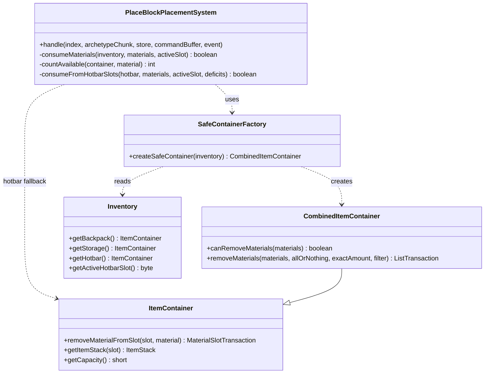
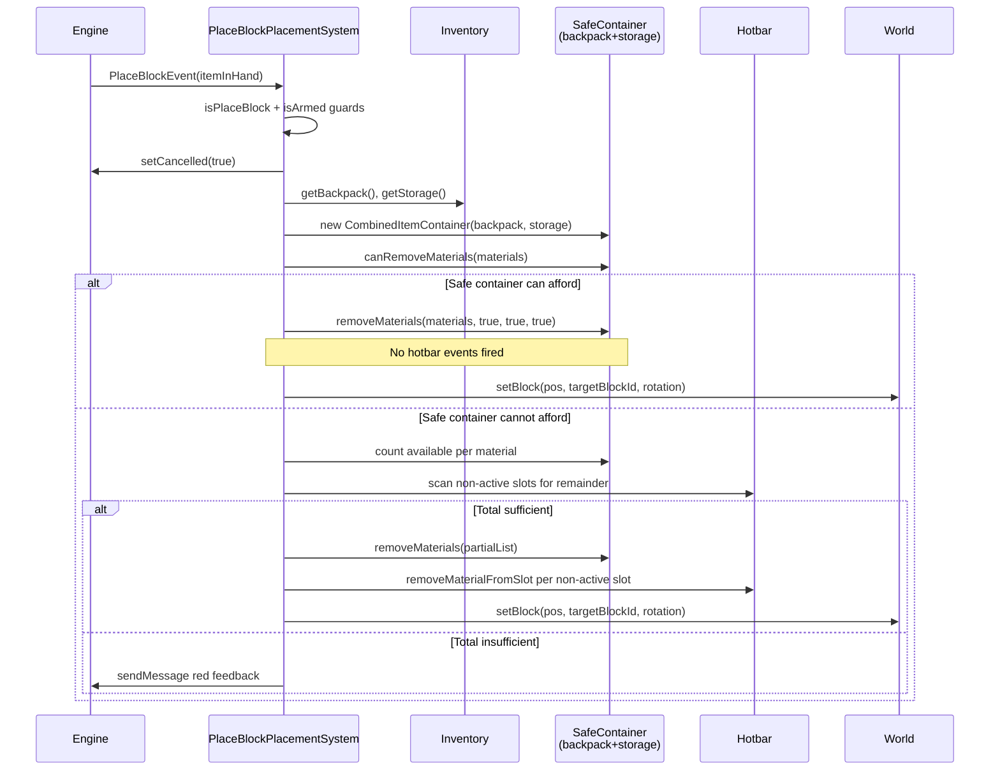
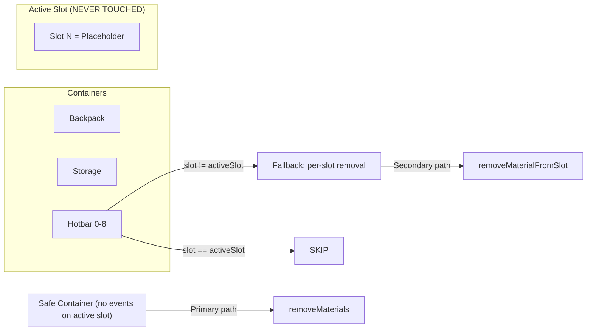

# Safe Resource Consumption at Placement Time — Design

> **Supersedes:** `design-resource-consumption.md` §5 (Insertion Point) — consumption strategy only.  
> **Scope:** `PlaceBlockPlacementSystem.handle()` resource consumption logic.

## 1. Overview

The current resource consumption in `PlaceBlockPlacementSystem` uses `getCombinedBackpackStorageHotbar().removeMaterials()` which includes the hotbar in the search space, followed by an unconditional `setItemStackForSlot(activeSlot, itemInHand)` restore. The restore write triggers a hotbar change event → `PlaceholderSyncSystem` → `BlockPreviewReskinManager.syncHotbar()` → `UpdateBlockTypes`/`UpdateItems` packets — causing the client to reload the held item's visual state on every placement. This design replaces the consumption strategy with a "safe container" approach that **never writes to the active hotbar slot**.

**Core design principle:** Construct a consumption container that excludes the hotbar entirely for the primary path; fall back to per-slot hotbar consumption (skipping the active slot) only when backpack+storage are insufficient.

## 2. Design Priorities

1. **No active-slot writes** — The placeholder's hotbar slot must never be written to during consumption. This is the hard constraint that prevents reskin flicker.
2. **Atomicity** — All-or-nothing: either all materials are consumed and the block is placed, or nothing changes.
3. **Full material availability** — Materials in non-active hotbar slots must remain usable for building.
4. **Simplicity** — Linear flow, no new classes beyond a trivial factory method.
5. **Engine-native patterns** — Uses `CombinedItemContainer`, `canRemoveMaterials`, `removeMaterials`, and `removeMaterialFromSlot` from the Hytale inventory API.

## 3. Root Cause Analysis

### Finding: The `setItemStackForSlot` restore is unnecessary

Tracing the engine's placement flow in `BlockPlaceUtils.placeBlock()`:

```
PlaceBlockEvent event = new PlaceBlockEvent(itemStack, blockPosition, targetRotation);
entityStore.invoke(ref, event);
if (event.isCancelled()) {
    targetBlockSection.invalidateBlock(...);   // ← returns here, no item removal
} else {
    // ... removeItemInHand logic only runs here ...
}
```

When `event.setCancelled(true)` is called (which `PlaceBlockPlacementSystem` does), the engine:
- Does **NOT** place any block
- Does **NOT** remove the held item
- Does **NOT** modify the hotbar

Since `removeMaterials` matches by `MaterialQuantity` (item type + quantity), and the placeholder is a custom tool item (`Block_Placeholder_Green_N`) that doesn't match any recipe material, `removeMaterials` will never consume the placeholder. **The `setItemStackForSlot` restore serves no purpose and is the direct cause of the flicker.**

### Finding: `syncHotbar` reskin is idempotent for the active slot

Even when `syncHotbar` is triggered by non-active hotbar slot changes, `reskinVariant` checks:
```java
String current = playerMap.get(variantIndex);
if (targetBlockTypeId.equals(current)) return; // idempotent skip
```
So a `syncHotbar` call from non-active slot changes does **not** send packets for the active slot (assuming the reskin is already current). No flicker from this path.

### Remaining concern: unnecessary `syncHotbar` invocations

If materials exist in non-active hotbar slots and `removeMaterials` consumes from them, the hotbar change event still fires, triggering `syncHotbar`. While idempotent for the active slot, `syncHotbar` iterates all 9 slots and may send restore packets for other variants. This is unnecessary overhead during rapid placement.

## 4. Recommended Approach: Safe Container with Hotbar Fallback

**Approach C+E Hybrid** — addresses all three findings.

### Phase 1: Delete the restore (zero-risk fix)

Remove the `setItemStackForSlot(activeSlot, itemInHand)` restore and the `activeSlot` variable. This alone eliminates the flicker.

**Lines to delete** from `PlaceBlockPlacementSystem.handle()`:
```java
byte activeSlot = inventory.getActiveHotbarSlot();           // DELETE
// ...
if (activeSlot >= 0) {                                       // DELETE
    inventory.getHotbar().setItemStackForSlot(activeSlot, itemInHand);  // DELETE
}                                                            // DELETE
```

### Phase 2: Safe container (avoids all hotbar events in common case)

Replace `getCombinedBackpackStorageHotbar()` with a custom `CombinedItemContainer(backpack, storage)` that excludes the hotbar entirely. This prevents hotbar change events from firing during material consumption.

**Primary path (covers ~95% of placements):**
1. `safeContainer = new CombinedItemContainer(inventory.getBackpack(), inventory.getStorage())`
2. `safeContainer.canRemoveMaterials(materials)` → if true: `safeContainer.removeMaterials(materials)` → done

**Fallback path (materials partially in hotbar non-active slots):**
1. Read-only affordability scan across backpack + storage + hotbar (excluding active slot)
2. If affordable: consume from backpack+storage first (partial, `allOrNothing=false`), then per-slot from hotbar non-active slots
3. If not affordable: deny with feedback

## 5. Component Diagram



## 6. Responsibility Map

```mermaid
graph TB
    subgraph Current["Current Flow - BROKEN"]
        E1[PlaceBlockEvent] --> CANCEL1[setCancelled true]
        CANCEL1 --> RM1["removeMaterials(combinedBackpackStorageHotbar)"]
        RM1 -->|"hotbar slot modified"| HCE1["Hotbar ChangeEvent fires"]
        HCE1 --> SYNC1["syncHotbar() → reskin packets"]
        RM1 --> RESTORE["setItemStackForSlot(activeSlot)"]
        RESTORE -->|"active slot written"| HCE2["Hotbar ChangeEvent fires"]
        HCE2 --> SYNC2["syncHotbar() → reskin packets"]
        SYNC2 --> FLICKER["CLIENT FLICKER"]
    end

    subgraph Fixed["Fixed Flow - PROPOSED"]
        E2[PlaceBlockEvent] --> CANCEL2[setCancelled true]
        CANCEL2 --> RM2["removeMaterials(safeContainer)"]
        RM2 -->|"backpack/storage only"| NOHOTBAR["No hotbar events"]
        NOHOTBAR --> PLACE[setBlock in world]
    end
```



## 7. Sequence Diagram — Consumption Flow



## 8. Container Topology



## 9. Detailed Algorithm — `consumeMaterials`

This is the replacement for the current consumption block in `handle()`. It returns `true` if consumption succeeded.

### Step 1: Build safe container
```
safeContainer = new CombinedItemContainer(inventory.getBackpack(), inventory.getStorage())
```

### Step 2: Try primary path
```
if safeContainer.canRemoveMaterials(materials):
    txn = safeContainer.removeMaterials(materials, allOrNothing=true, exactAmount=true, filter=true)
    return txn.succeeded()
```

### Step 3: Hotbar fallback — affordability scan
For each `MaterialQuantity m` in `materials`:
1. Count available in safeContainer: iterate slots, sum quantities matching `m`'s material
2. Compute deficit: `m.getQuantity() - availableInSafe`
3. If deficit > 0: scan hotbar slots 0-8 (skipping `activeSlot`), sum matching quantities
4. If `availableInSafe + availableInHotbar < m.getQuantity()` → return false (cannot afford)

### Step 4: Hotbar fallback — two-pass consumption
1. Build `safePartialList`: for each material, `min(availableInSafe, needed)` as a `MaterialQuantity`
2. `safeContainer.removeMaterials(safePartialList, allOrNothing=true, exactAmount=true, filter=true)`
3. For each material with remaining deficit:
   - Iterate hotbar slots 0-8, skip `activeSlot`
   - For each matching slot: `hotbar.removeMaterialFromSlot(slot, new MaterialQuantity(material, min(deficit, slotQuantity)))`
   - Subtract removed quantity from deficit
4. If all deficits reach 0 → return true

### Atomicity guarantee
The affordability scan in Step 3 is a read-only check that verifies total availability before any writes occur. Since the system runs on the ECS event dispatch thread (single-threaded per entity), no concurrent inventory modifications can occur between the scan and the consumption. Steps 2+3+4 form an atomic unit in practice.

## 10. APIs Used

| API | Container | Purpose |
|-----|-----------|---------|
| `inventory.getBackpack()` | `Inventory` | Get backpack `ItemContainer` for safe container |
| `inventory.getStorage()` | `Inventory` | Get storage `ItemContainer` for safe container |
| `inventory.getHotbar()` | `Inventory` | Get hotbar for fallback path |
| `inventory.getActiveHotbarSlot()` | `Inventory` | Identify slot to skip |
| `new CombinedItemContainer(bp, st)` | `CombinedItemContainer` | Construct hotbar-free container |
| `container.canRemoveMaterials(materials)` | `ItemContainer` | Read-only affordability check |
| `container.removeMaterials(materials, true, true, true)` | `ItemContainer` | Atomic multi-material removal |
| `container.getItemStack(slot)` | `ItemContainer` | Read slot for affordability scan |
| `container.removeMaterialFromSlot(slot, material)` | `ItemContainer` | Per-slot removal for hotbar fallback |
| `MaterialQuantity` (constructor or factory) | Inventory API | Build partial material lists |

## 11. Insertion Point

All changes are in `PlaceBlockPlacementSystem.handle()`, replacing the block between:
```
int targetBlockId = BlockType.getAssetMap().getIndex(outputBlockTypeId);
```
and:
```
Vector3i pos = event.getTargetBlock();
```

The existing code in that block is:
```java
// Lines 126-165 of PlaceBlockPlacementSystem.java
CraftingRecipe recipe = ...
List<MaterialQuantity> materials = ...
Player player = ...
Inventory inventory = player.getInventory();
ItemContainer container = inventory.getCombinedBackpackStorageHotbar();  // ← REPLACE
byte activeSlot = inventory.getActiveHotbarSlot();                       // ← MOVE (still needed for skip)

if (!container.canRemoveMaterials(materials)) { ... }                    // ← REPLACE
ListTransaction<MaterialTransaction> txn = container.removeMaterials(...)// ← REPLACE
if (activeSlot >= 0) {                                                   // ← DELETE
    inventory.getHotbar().setItemStackForSlot(activeSlot, itemInHand);   // ← DELETE
}                                                                        // ← DELETE
```

Replace with:
1. Recipe lookup + materials (unchanged)
2. Player + inventory resolution (unchanged)
3. `consumeMaterials(inventory, materials, inventory.getActiveHotbarSlot())` call
4. Remove all `setItemStackForSlot` restore logic

## 12. Integration Changes Required

| File | Change | Reason |
|------|--------|--------|
| `PlaceBlockPlacementSystem.java` | Replace consumption block (§11) | Core fix |
| `PlaceBlockPlacementSystem.java` | Remove `setItemStackForSlot` restore | Unnecessary; causes flicker |
| `PlaceBlockPlacementSystem.java` | Add `CombinedItemContainer` import | New container construction |
| `BlueprintSelectionPage.java` (line 199) | Consider using safe container for affordability display | Consistency (optional) |

**No other files need modification.** The `BlockPreviewReskinManager`, `PlaceholderSyncSystem`, and `PlaceBlockMetadata` are unchanged.

## 13. Approach Comparison (for the record)

| Approach | Flicker Fix | Hotbar Materials | Complexity | Recommended |
|----------|-------------|------------------|------------|-------------|
| **A: Snapshot/Restore** | ❌ Restore write causes flicker | ✅ Full | Low | No |
| **B: Exclude hotbar** | ✅ No hotbar events | ❌ Lost | Very Low | Acceptable fallback |
| **C: Two-pass** | ✅ Active slot skipped | ✅ Full | Medium | Part of recommendation |
| **D: Temp remove/restore** | ❌ Restore write causes flicker | ✅ Full | Low | No |
| **E: Custom container** | ✅ No hotbar events | ❌ Lost (alone) | Low | Part of recommendation |
| **C+E Hybrid** | ✅ No hotbar events (primary) | ✅ Full (fallback) | Medium | **Yes** |
| **F: Delete restore only** | ✅ No active-slot write | ⚠️ syncHotbar overhead | Trivial | Phase 1 only |

## 14. Open Questions

1. **MaterialQuantity construction** — Can we construct `MaterialQuantity` with a reduced quantity for partial lists? Need to verify constructor/factory availability. If not, the fallback path needs an alternative approach (e.g., building a temporary `SimpleItemContainer` snapshot).
2. **`removeMaterials` with `allOrNothing=false`** — Does this consume as much as possible and report remainder? If so, the fallback path can be simplified: consume with `allOrNothing=false` from safe container, then consume remainder per-slot from hotbar.
3. **Performance of ad-hoc `CombinedItemContainer`** — Construction is trivial (just stores array reference), but does the combined container's `registerChangeEvent` propagation cause issues when the container is short-lived? Since we only call `removeMaterials` (not `registerChangeEvent`), this should be safe — but worth verifying.

## 15. Handoff Checklist

- [x] Component diagram included
- [x] Responsibility map included
- [x] Sequence diagram included
- [x] Root cause analysis with engine code evidence
- [x] Algorithm specified with API calls
- [x] Insertion point identified with line references
- [x] Integration Changes Required section populated
- [x] Open Questions section populated
- [x] Approach comparison table for decision rationale
