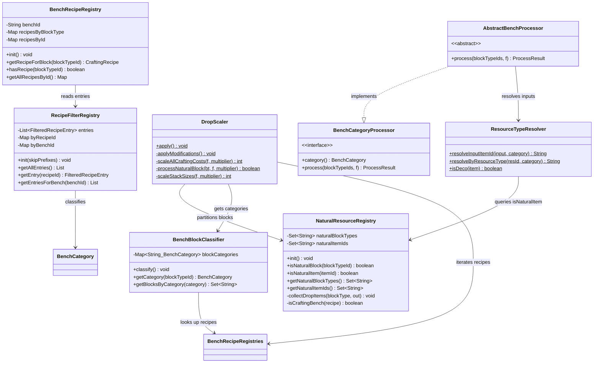
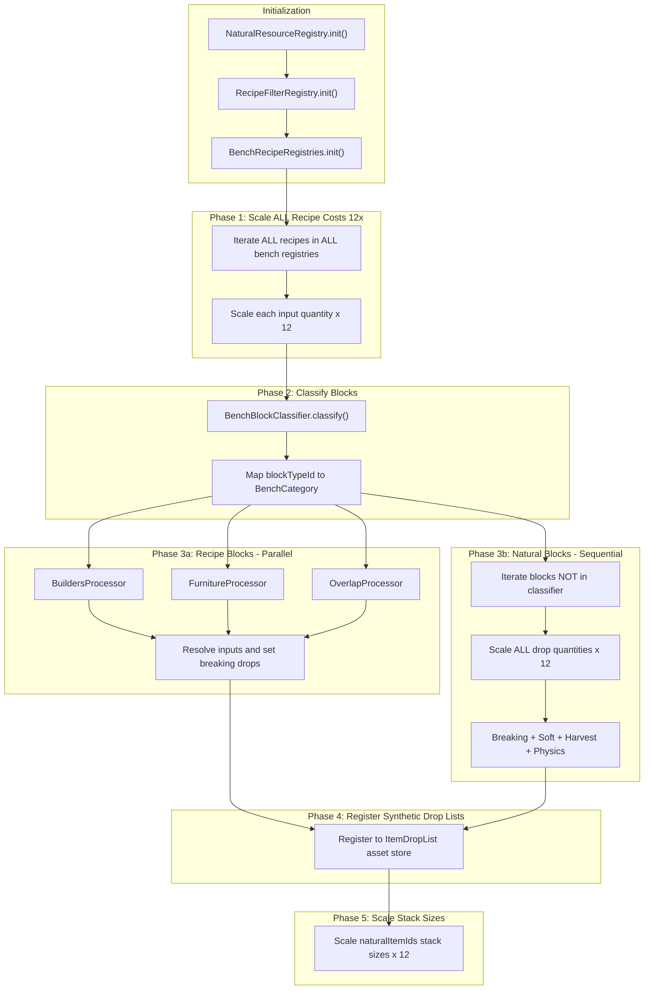
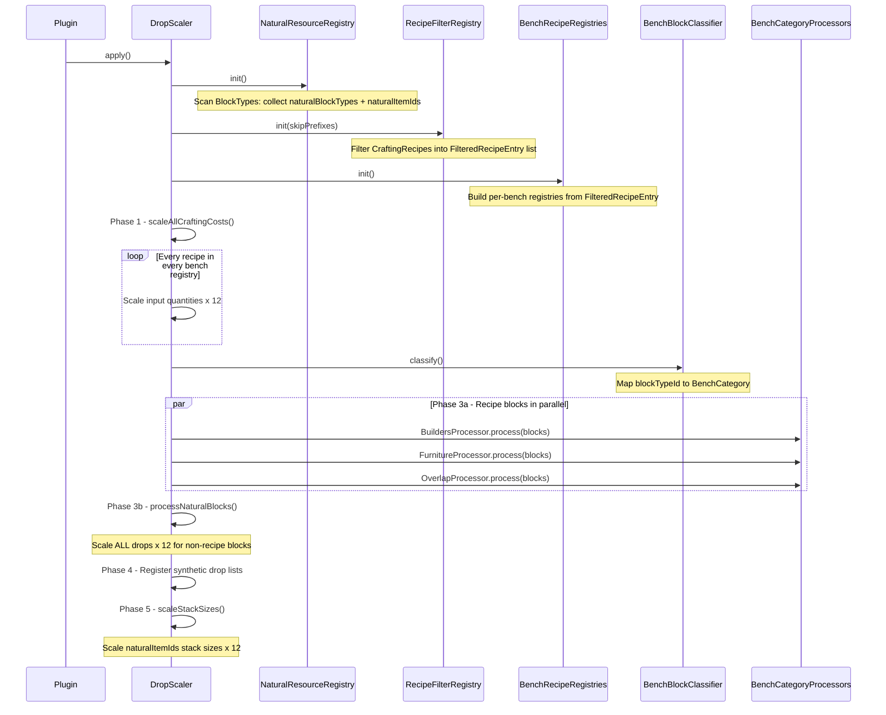
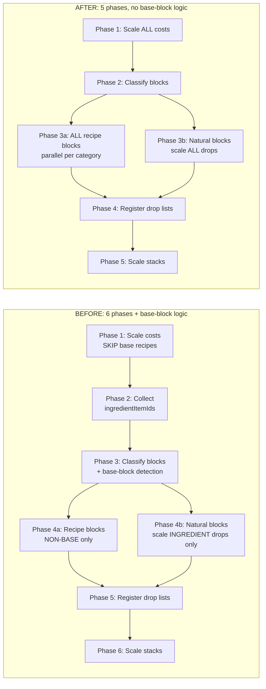

# Design: Simplified Economy Pipeline — Base Block Elimination

## 1. Overview

The 12× resource economy pipeline has accumulated persistent bugs around "base block" classification — the concept that recipes with ALL-natural inputs should be excluded from cost scaling. This design **eliminates the base block concept entirely**, replacing a broken dual-classification system with a simpler pipeline that scales ALL bench recipes uniformly. The core insight: since natural blocks already drop 12× (Contract #1), scaling a base recipe from `1 Rock → 1 Cobble` to `12 Rock → 12 Cobble` produces identical economics — the player still trades one natural block's drops for one batch of processed material.

## 2. Design Priorities

1. **Correctness** — fix the broken `NaturalResourceRegistry` (orphaned sets, unimplemented `isDecoBlock`) and eliminate the classification bugs that repeatedly misidentify recipes
2. **Simplicity** — remove the base block concept, two-tier natural item sets, and dual classification logic to reduce total system complexity by ~40%
3. **Testability** — fewer classification paths = fewer edge cases = simpler test matrix
4. **Framework-native patterns** — maintain the existing parallel-per-category processing model

## 3. Component Diagram



## 4. Responsibility Map



## 5. Sequence Diagram



## 6. Before vs. After Pipeline Comparison



## 7. Mathematical Proof: Base Block Elimination Is Safe

The concern was that scaling base recipes would break the economy. Here's why it's equivalent:

| Scenario | WITH base exclusion (current) | WITHOUT base exclusion (proposed) |
|----------|-------------------------------|-----------------------------------|
| 1 Rock block broken | 12 Rock items (Contract #1) | 12 Rock items (Contract #1) |
| Craft Cobble from Rock | 1 Rock → 1 Cobble (unscaled) | 12 Rock → 12 Cobble (scaled) |
| Net: rocks per cobble | 1 rock item = 1 cobble | 12 rock items = 12 cobble |
| **Cobble per natural block** | **12** | **12** |
| Cobble Wall recipe | 48 Cobble (4 × 12) | 48 Cobble (4 × 12) |
| Walls per natural block batch | 12 ÷ 48 = 0.25 (need 4 blocks) | 12 ÷ 48 = 0.25 (need 4 blocks) |
| Break Cobble Wall | Returns 48 Cobble | Returns 48 Cobble |

The ratio `natural drops / crafting cost` is identical in both cases. The intermediate inventory numbers differ (12 Rock → 12 Cobble vs 1 Rock → 1 Cobble, 12 times), but the player's purchasing power per natural block is the same.

## 8. Package Structure

No new packages or files. This is a simplification refactor affecting existing files:

```
src/main/java/com/UnobstructedThirdPerson/resourcecollection/
├── AbstractBenchProcessor.java    ← MODIFY: remove ingredientItemIds param
├── AssetFieldAccessor.java        ← NO CHANGE
├── BenchBlockClassifier.java      ← MODIFY: remove base-block logic
├── BenchCategory.java             ← NO CHANGE
├── BenchCategoryProcessor.java    ← MODIFY: remove ingredientItemIds param
├── BenchRecipeRegistries.java     ← MODIFY: remove base-block query methods
├── BenchRecipeRegistry.java       ← MODIFY: remove base-block classification
├── BuildersProcessor.java         ← NO CHANGE
├── DropScaler.java                ← MODIFY: simplify pipeline
├── FilteredRecipeEntry.java       ← NO CHANGE
├── FurnitureProcessor.java        ← NO CHANGE
├── NaturalResourceRegistry.java   ← MODIFY: fix broken init + simplify
├── OverlapProcessor.java          ← NO CHANGE
├── PlacementCostScaler.java       ← NO CHANGE
├── RecipeFilterRegistry.java      ← NO CHANGE
├── ResourceConstants.java         ← NO CHANGE
├── ResourceTypeResolver.java      ← MODIFY: remove isResourceTypeExclusivelyNatural
```

## 9. Integration Changes Required

### 9.1. `NaturalResourceRegistry.java` — FIX + SIMPLIFY

**Bug fix:** `init()` currently collects drops into an orphaned local `itemIds` set. The class fields `coreNaturalItemIds` and `allNaturalItemIds` are never populated (always empty sets). This breaks all downstream consumers.

**Changes:**

| Action | Detail |
|--------|--------|
| REMOVE field | `coreNaturalItemIds` — no longer needed |
| RENAME field | `allNaturalItemIds` → `naturalItemIds` |
| REMOVE method | `isCoreNaturalItem(String)` |
| REMOVE method | `getCoreNaturalItemIds()` |
| REMOVE method | `isDecoBlock(BlockType)` — was unimplemented (throws) |
| RENAME method | `getNaturalItemIds()` stays, but now returns the single `naturalItemIds` set |
| FIX method | `init()` — collect drops into the class field `naturalItemIds`, not a local variable |

**New `init()` contract:**
```java
/**
 * Builds the registry. After this call:
 *   - naturalBlockTypes contains every BlockType ID that has no
 *     non-Salvage crafting recipe at a registered bench
 *   - naturalItemIds contains every item ID that any natural block
 *     can drop via any gathering path or fallback block-item
 *
 * Must be called after assets load, before any pipeline phase.
 */
public static void init() {
    Set<String> blockTypes = new HashSet<>();
    Set<String> itemIds = new HashSet<>();

    // ... existing craftableBlockIds logic (unchanged) ...

    for (BlockType bt : allBlockTypes) {
        if (craftableBlockIds.contains(bt.getId())) continue;
        blockTypes.add(bt.getId());
        collectDropItems(bt, itemIds);  // <-- drops go into itemIds
    }

    naturalBlockTypes = Collections.unmodifiableSet(blockTypes);
    naturalItemIds = Collections.unmodifiableSet(itemIds);  // <-- FIX: assign to field
}
```

### 9.2. `BenchBlockClassifier.java` — SIMPLIFY

| Action | Detail |
|--------|--------|
| REMOVE field | `baseBlockTypes` |
| REMOVE method | `isBaseBlock(String)` |
| REMOVE method | `getNonBaseBlocksByCategory(BenchCategory)` |
| REMOVE method | `allInputsExclusivelyNatural(CraftingRecipe)` |
| KEEP method | `getBlocksByCategory(BenchCategory)` — now the only way to get blocks for a category |

**New `classify()` contract:**
```java
/**
 * Classifies every block that has a recipe in a registered bench
 * into a BenchCategory. No base-block distinction is made.
 *
 * After this call, getCategory(blockTypeId) returns the category
 * for any recipe block, and getBlocksByCategory(cat) returns the
 * full set of blocks for that category.
 */
public void classify() {
    Map<String, BenchCategory> categories = new HashMap<>();
    for (BlockType bt : allBlockTypes) {
        CraftingRecipe recipe = BenchRecipeRegistries.getRecipeForBlock(bt.getId());
        if (recipe == null) continue;
        BenchCategory category = BenchCategory.fromRecipe(recipe);
        if (category == null) continue;
        categories.put(bt.getId(), category);
    }
    this.blockCategories = Collections.unmodifiableMap(categories);
}
```

### 9.3. `BenchRecipeRegistry.java` — SIMPLIFY

| Action | Detail |
|--------|--------|
| REMOVE field | `baseBlockRecipeIds` |
| REMOVE method | `isBaseBlockRecipe(String)` |
| REMOVE method | `isBaseBlockType(String)` |
| REMOVE method | `allInputsNatural(CraftingRecipe, Set<String>)` |
| REMOVE import | `NaturalResourceRegistry` (no longer needed) |
| REMOVE import | `ResourceTypeResolver` (no longer needed) |

**New `init()` contract:**
```java
/**
 * Populates recipe maps from RecipeFilterRegistry entries for this bench.
 * No base-block classification is performed.
 */
public void init() {
    Map<String, CraftingRecipe> byBlock = new HashMap<>();
    Map<String, CraftingRecipe> byId = new HashMap<>();
    for (FilteredRecipeEntry entry : RecipeFilterRegistry.getEntriesForBench(this.benchId)) {
        byBlock.putIfAbsent(entry.blockTypeId(), entry.recipe());
        byId.put(entry.recipeId(), entry.recipe());
    }
    recipesByBlockType = Collections.unmodifiableMap(byBlock);
    recipesById = Collections.unmodifiableMap(byId);
}
```

### 9.4. `BenchRecipeRegistries.java` — SIMPLIFY

| Action | Detail |
|--------|--------|
| REMOVE method | `isBaseBlockTypeAnywhere(String)` |
| REMOVE method | `isBaseBlockRecipeAnywhere(String)` |

All other methods remain unchanged.

### 9.5. `ResourceTypeResolver.java` — SIMPLIFY

| Action | Detail |
|--------|--------|
| REMOVE method | `isResourceTypeExclusivelyNatural(String, Set<String>)` |
| REMOVE | `[RTR-DEBUG]` temp debug logging in `resolveByResourceType()` |

All other methods remain unchanged.

### 9.6. `BenchCategoryProcessor.java` — SIMPLIFY interface

| Action | Detail |
|--------|--------|
| CHANGE signature | `process(Set<String> blockTypeIds, AssetFieldAccessor f, Set<String> ingredientItemIds)` → `process(Set<String> blockTypeIds, AssetFieldAccessor f)` |
| UPDATE record | `ProcessResult` — no changes needed to the record itself |

### 9.7. `AbstractBenchProcessor.java` — MATCH interface

| Action | Detail |
|--------|--------|
| CHANGE signature | Remove `ingredientItemIds` parameter from `process()` |
| No logic change | The method body never referenced `ingredientItemIds` |

### 9.8. `DropScaler.java` — SIMPLIFY PIPELINE

**Phase 1 change:** Remove the `reg.isBaseBlockRecipe(recipeId)` skip check. Scale ALL recipes.

```java
// BEFORE:
if (reg.isBaseBlockRecipe(recipeId)) continue;

// AFTER:
// (line removed — scale all recipes uniformly)
```

**Phase 2 removal:** Delete `collectIngredientItemIds()` method entirely. The `ingredientItemIds` variable is no longer computed or passed to any method.

**Phase 3 (was Phase 3) change:** Call `classifier.getBlocksByCategory(proc.category())` instead of `classifier.getNonBaseBlocksByCategory(proc.category())`.

```java
// BEFORE:
Set<String> blocks = classifier.getNonBaseBlocksByCategory(proc.category());

// AFTER:
Set<String> blocks = classifier.getBlocksByCategory(proc.category());
```

**Phase 3a processors:** Remove `ingredientItemIds` from call site.

```java
// BEFORE:
futures.add(executor.submit(() -> proc.process(blocks, f, ingredientItemIds)));

// AFTER:
futures.add(executor.submit(() -> proc.process(blocks, f)));
```

**Phase 3b (was Phase 4b) change:** `processNaturalBlock` no longer takes `ingredientItemIds`. Simplify to scale ALL drop quantities × 12 unconditionally. Remove:
- `processIngredientConfig()` method
- `scaleDropListIngredients()` method

Replace with simpler `scaleAllDrops()` logic that multiplies every quantity by 12 regardless of whether the item is a recipe ingredient.

**New `processNaturalBlock` contract:**
```java
/**
 * Scales ALL drop quantities on a natural block by the multiplier.
 * Covers breaking, soft, harvest, and physics drop paths.
 *
 * For direct-quantity drops: multiply quantity field by multiplier.
 * For drop-list drops: multiply every ItemDrop's min/max quantities
 * by the multiplier.
 *
 * @return true if any modification was made
 */
private static boolean processNaturalBlock(
        BlockType bt, AssetFieldAccessor f, int multiplier,
        Set<Object> processedConfigs, Set<ItemDrop> processedDrops,
        Set<String> processedDropListIds, List<ItemDropList> syntheticDropLists) {
    // TODO: Clone gathering, scale ALL breaking/soft/harvest/physics drops × multiplier
    //       No ingredient filtering — scale every drop unconditionally.
}
```

### 9.9. `docs/product/vision.md` — UPDATE CONTRACTS

| Contract | Change |
|----------|--------|
| #3 | Reword: "ALL bench recipes cost 12×" (remove "blocks AND non-blocks" parenthetical — it's now truly all) |
| #6 | **REMOVE** entirely — "Base block recipes excluded from cost scaling" is eliminated |
| #7 | Reword: "Processed ingredients are NOT natural items" → "Processed ingredients (e.g. `Ingredient_Fibre`) are items crafted at a bench from natural drops. They are tracked in the economy but are not natural items." (Softer language since the concept is now informational, not load-bearing for classification) |
| Edge cases table | Remove the "base block" row. Add a new row explaining that base recipes ARE scaled and why the math works. |

### 9.10. Test files — UPDATE

| File | Change |
|------|--------|
| `TestDataSet.java` | Remove `baseBlockRecipeIds` field and its population logic |
| `BlockRecipeRegistryTest.java` | Remove `baseBlockRecipeIdentified()`, `nonBaseBlockRecipeIdentified()`, `isBaseBlockTypeWorks()` tests |
| `ResourceTypeResolverTest.java` | Remove `IsResourceTypeExclusivelyNatural` nested test class |
| `ResourceScalingIntegrationTest.java` | Remove `isBaseBlockTypeAnywhere` assertion. Add assertions that previously-base recipes ARE scaled. |
| `AssetTestHelper.java` | Remove `baseBlockRecipeIds` parameter from helper methods |

## 10. Open Questions — RESOLVED

| # | Question | Decision |
|---|----------|----------|
| 1 | **Should Deco natural blocks (Blocks.Deco) have their drops scaled 12x or stay at vanilla?** | **RESOLVED: Scale 12x.** Deco natural blocks are included in scaling. No `isDeco` filter in Phase 3b. |
| 2 | **Should the `[RTR-DEBUG]` temporary logging in ResourceTypeResolver be removed now or after validation?** | **RESOLVED: Remove now.** Clean up debug logging as part of the simplification. |
| 3 | **Should base block recipes (FullBlock 1:1 transitions) be excluded from scaling?** | **RESOLVED: No exception.** Scale ALL recipes 12x uniformly. 12 Trunk → 12 Planks, 12 Planks → 12 Decorative. Mathematically equivalent — same purchasing power per natural block. |
| 4 | **Should drop lists on natural blocks scale ALL items or only ingredients?** | **RESOLVED: Scale ALL items.** Every ItemDrop in a natural block's drop list has quantities scaled 12x, not just recipe ingredient items. |

## 11. Risk Assessment

| Change | Risk | Mitigation |
|--------|------|------------|
| Scale ALL recipes (including former base) | **LOW** — mathematically equivalent (see §7). Player gets same purchasing power per natural block. | Integration test: verify walls-per-rock ratio unchanged |
| Remove `ingredientItemIds` filtering in natural drops | **LOW** — scales ALL drops 12x. Blocks with non-ingredient drops (rare gems from ore) now also scale. This is correct for a 12x economy. | Verify no block has intentionally-unscaled rare drops |
| Fix NaturalResourceRegistry.init() | **MEDIUM** — the orphaned-set bug means the current system runs with empty natural item sets. Fixing this populates the set for the first time, which may reveal downstream assumptions that depended on the empty state. | Run full integration test after fix; inspect naturalItemIds for unexpected items |
| Remove base-block API from BenchRecipeRegistry/Registries | **LOW** — grep confirms all callers are in the pipeline (now removed) and test code (updated). No external consumers. | Compile check after removal |
| Update Product Vision contracts | **LOW** — documentation only; does not affect runtime | Review with stakeholder |

## 12. Migration Path

Execute in this order to maintain compilability at each step:

1. **Fix `NaturalResourceRegistry.init()`** — fix the orphaned `itemIds` set bug. Remove `coreNaturalItemIds`, `allNaturalItemIds`, `isDecoBlock()`, `isCoreNaturalItem()`, `getCoreNaturalItemIds()`. Rename remaining set to `naturalItemIds`. Compile check.

2. **Simplify `BenchRecipeRegistry`** — remove `baseBlockRecipeIds`, `isBaseBlockRecipe()`, `isBaseBlockType()`, `allInputsNatural()`. Remove `NaturalResourceRegistry` and `ResourceTypeResolver` imports. Compile check.

3. **Simplify `BenchRecipeRegistries`** — remove `isBaseBlockTypeAnywhere()`, `isBaseBlockRecipeAnywhere()`. Compile check.

4. **Simplify `BenchBlockClassifier`** — remove `baseBlockTypes`, `isBaseBlock()`, `getNonBaseBlocksByCategory()`, `allInputsExclusivelyNatural()`. Compile check.

5. **Simplify `ResourceTypeResolver`** — remove `isResourceTypeExclusivelyNatural()` and debug logging. Compile check.

6. **Simplify `BenchCategoryProcessor` + `AbstractBenchProcessor`** — remove `ingredientItemIds` from interface and implementation signatures. Compile check.

7. **Simplify `DropScaler`** — remove base-block skip in Phase 1, remove `collectIngredientItemIds()`, change `getNonBaseBlocksByCategory` → `getBlocksByCategory`, remove `ingredientItemIds` from processor call sites, simplify `processNaturalBlock` to scale all drops, remove `processIngredientConfig` and `scaleDropListIngredients`. Compile check.

8. **Update tests** — remove base-block test cases, update test data, add new assertions for uniform scaling.

9. **Update `docs/product/vision.md`** — remove Contract #6, reword #7, update edge cases table.

## 13. Handoff Checklist

- [x] Component diagram included
- [x] Responsibility map included
- [x] All interfaces have contract documentation
- [x] All skeleton contracts created with TODO markers
- [x] Integration Changes Required section populated (9 subsections)
- [x] Open Questions section populated (2 questions)
- [x] Risk assessment included
- [x] Migration path sequenced for compilability
- [x] Mathematical proof of equivalence included
- [x] Before/after pipeline comparison included
- [x] Test file changes documented

---

→ @engineer implement `docs/Plans/design-simplified-economy-pipeline.md`

Follow the migration path in §12 for ordering. Each step should compile independently. Run existing tests after step 7 to catch regressions; update tests in step 8.
