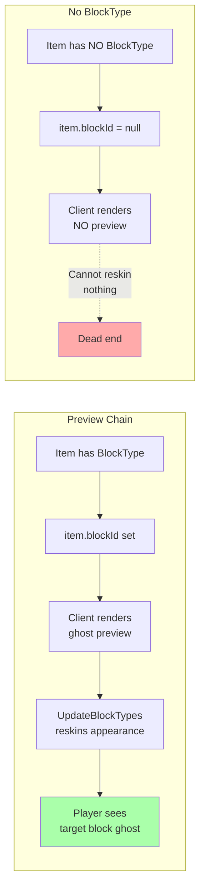
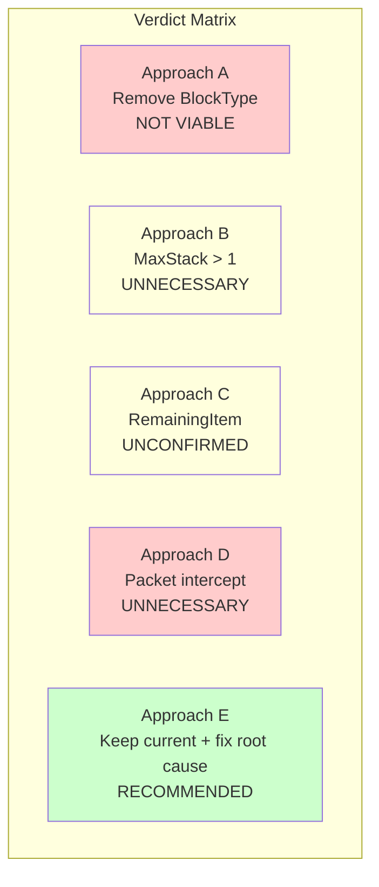

# Evaluation: PlaceBlock Placeholder — Block-Type Item vs Tool Item Refactor

> **Status:** Architecture evaluation  
> **Date:** 2026-04-26  
> **Scope:** Evaluate whether the PlaceBlock placeholder should be refactored from a block-type item to a non-block tool/container item.

---

## 1. Critical Finding: The Stated Premise Is Incorrect

The request states:

> **The root problem: the engine consumes the held item as part of block placement, and cancelling the event doesn't prevent this.**

This contradicts the project's own documented research. From the **R3 Risk Investigation** (decompiled `BlockPlaceUtils.placeBlock()`):

```java
PlaceBlockEvent event = new PlaceBlockEvent(itemStack, blockPosition, targetRotation);
entityStore.invoke(ref, event);
if (event.isCancelled()) {
    targetBlockSection.invalidateBlock(...);
    // Returns here — NO item consumption, NO block placement
} else {
    if (isAdventureMode && removeItemInHand) {
        // Item consumption happens HERE — only when NOT cancelled
    }
}
```

**`event.setCancelled(true)` DOES prevent item consumption.** The decompiled source is unambiguous: item removal is inside the `else` branch. Cancellation exits before reaching it.

The **actual problem** was identified in `design-safe-resource-consumption.md`: the `setItemStackForSlot` restore call (written to "restore" a supposedly consumed placeholder) was triggering a hotbar change event → `PlaceholderSyncSystem` → `BlockPreviewReskinManager.syncHotbar()` → `UpdateBlockTypes`/`UpdateItems` packets → visual flicker. That doc concluded:

> **The `setItemStackForSlot` restore serves no purpose and is the direct cause of the flicker.**

The `SlotFilter.DENY` issue mentioned in the request is about a *different* problem: preventing `removeMaterials()` from consuming the placeholder tool alongside recipe materials during the plugin's own resource consumption logic. This is already solved in the current code via the `setSlotFilter`/`clearSlotFilter` pattern in `PlaceBlockPlacementSystem`.

**Implication:** All four proposed approaches attempt to solve a problem that doesn't exist. The correct fix is already designed in `design-safe-resource-consumption.md`: remove the unnecessary restore and use a safe container.

---

## 2. Approach-by-Approach Evaluation

### Approach A: Remove BlockType, Use Custom Interaction — NOT VIABLE

**Verdict: ❌ Breaks two critical systems. Would require a near-complete rewrite.**

#### Problem 1: Ghost preview requires `BlockType`

The client's native block preview system is driven by `item.blockId`, which is set from the `BlockType` section of the item JSON:

```java
// Item.java — toPacket()
if (this.blockId != null) {
    packet.blockId = BlockType.getAssetMap().getIndexOrDefault(this.blockId, 1);
}
```

The client renders a ghost preview **only** when the held item has a non-null `blockId`. The `UpdateBlockTypes` reskinning system (`BlockPreviewReskinManager`) changes *what an existing block type looks like* — it does not create previews from nothing.



Without `BlockType`, the only preview option is the `ServerSetBlock` approach (`PreviewBlockManager`), which has:
- **Latency**: Server must raycast every tick to find aim position
- **Opaque ghosts**: `ServerSetBlock` shows a solid block, not a translucent preview
- **CPU cost**: Per-tick raycast per player holding the tool
- **Dual system maintenance**: Must track and restore every block the ghost overwrites

#### Problem 2: `PlaceBlockEvent` would never fire

The current placement flow depends on the client recognizing the item as a block item and sending a placement packet:

```mermaid
graph TB
    subgraph "Current Flow - with BlockType"
        A[Player right-clicks<br/>holding placeholder] --> B{Client sees<br/>BlockType?}
        B -->|Yes| C[Client sends<br/>placement packet]
        B -->|Yes| D[Client sends<br/>interaction request]
        C --> E[GamePacketHandler<br/>BlockPlaceUtils.placeBlock]
        E --> F[PlaceBlockEvent fired]
        F --> G[PlaceBlockPlacementSystem<br/>cancels event]
        G --> H[Manual setBlock<br/>with target block type]
        D --> I[PlaceBlockMenuInteraction<br/>tick0 - stub]
    end

    subgraph "Approach A Flow - without BlockType"
        A2[Player right-clicks<br/>holding tool] --> B2{Client sees<br/>BlockType?}
        B2 -->|No| D2[Client sends<br/>interaction request ONLY]
        D2 --> I2[PlaceBlockMenuInteraction<br/>must handle placement]
        I2 --> H2[Manual setBlock<br/>from interaction handler]
    end

    style B fill:#fdd
    style B2 fill:#fdd
    style F fill:#dfd
    style I2 fill:#ffd
```



Without `BlockType`, the client sends **no placement packet**. `GamePacketHandler` never calls `BlockPlaceUtils.placeBlock()`. `PlaceBlockEvent` never fires. `PlaceBlockPlacementSystem` becomes dead code.

**All placement logic would need to move into `PlaceBlockMenuInteraction.tick0()`.** But `PlaceBlockMenuInteraction` extends `SimpleInteraction` (`WaitForDataFrom.None`), which means it receives **no block target position** from the client. You'd need to:

1. Change `PlaceBlockMenuInteraction` to extend `SimpleBlockInteraction` (`WaitForDataFrom.Client`) to receive block target data
2. Reimplement placement validation, rotation handling, and block state management
3. Reimplement resource consumption logic currently in `PlaceBlockPlacementSystem`
4. Lose the `PlaceBlockEvent` integration (other systems listening to this event won't fire)

This is a near-complete rewrite of the placement pipeline for zero benefit.

#### What interaction event would a non-block tool use?

If `BlockType` is removed, right-click fires `PlaceBlock_Menu` via the `Interactions.Use` field (already configured). The `PlaceBlockMenuInteraction.tick0()` method runs. However:
- It gets **no block position data** (extends `SimpleInteraction`, not `SimpleBlockInteraction`)
- It runs in the **interaction system**, not the ECS event system — different threading model
- Contract #12 (mutual exclusion with `PlacementCostScaler`) would need to be redesigned

---

### Approach B: Set MaxStack > 1 — UNNECESSARY

**Verdict: ⚠️ Solves a non-existent problem. Introduces visual clutter.**

Since `event.setCancelled(true)` already prevents item consumption, setting `MaxStack: 2` is unnecessary. It would also:
- Show "x2" on the item in the hotbar (confusing UX)
- Require maintaining stack size after each placement
- Interact unpredictably with the variant system (9 Green variants × stack management)
- Not address the actual issue (visual flicker from unnecessary restore)

---

### Approach C: TransformOnPlace / RemainingItem — UNCONFIRMED API

**Verdict: ⚠️ No evidence this API exists in Hytale.**

The decompiled source and API research docs show no equivalent to Minecraft's `craftingRemainingItem` or bucket-style transform mechanism. The `Item` class has no `remainingItem`, `transformOnUse`, or similar field. The `ItemStack.withState()` method exists but is for item state variants (e.g., tool durability states), not for "use and transform" patterns.

Without confirming this API exists, this approach is speculative and not actionable.

---

### Approach D: Packet-Level Intercept — UNNECESSARY AND RISKY

**Verdict: ❌ Solves a non-existent problem with the highest-risk approach.**

Since the engine does NOT consume the item when the event is cancelled, intercepting inventory update packets is unnecessary. Additionally:
- Packet interception introduces race conditions and ordering dependencies
- The `GamePacketHandler` is not designed for plugin-level packet filtering
- Any future engine updates to the packet format would silently break this
- This would be the most fragile, hardest-to-debug approach

---

## 3. Recommended Approach: Keep BlockType, Fix Root Cause

**Verdict: ✅ The current architecture is correct. Fix the identified root cause.**



The current architecture is sound:

| Mechanism | Status | Purpose |
|-----------|--------|---------|
| `BlockType` on placeholder | ✅ Keep | Enables native ghost preview + `UpdateBlockTypes` reskinning |
| `event.setCancelled(true)` | ✅ Working | Prevents both block placement AND item consumption |
| `PlaceBlockPlacementSystem` | ✅ Working | Cancels event, places target block, consumes recipe materials |
| `BlockPreviewReskinManager` | ✅ Working | Reskins placeholder's block type to show target block ghost |
| `SlotFilter.DENY` | ✅ Working | Prevents `removeMaterials()` from consuming the placeholder tool |
| `setItemStackForSlot` restore | ❌ Remove | Unnecessary — causes visual flicker. Cancellation already prevents consumption |

### Action Items

1. **Remove the `setItemStackForSlot` restore** from `PlaceBlockPlacementSystem` — this is the root cause of the visual flicker, and `design-safe-resource-consumption.md` already prescribes this fix
2. **Implement the Safe Container pattern** from `design-safe-resource-consumption.md` — constructs a consumption container that excludes the active hotbar slot, eliminating the need for restore writes entirely
3. **No architectural changes needed** — the block-type item pattern is working as designed

### Why the Current Architecture Is Actually Correct

The placeholder being a block-type item is not a bug — it's a feature:

1. **Native ghost preview**: The client's built-in translucent preview works because the item has `blockId`. The `UpdateBlockTypes` reskinning makes it show the target block. No latency, no per-tick server raycast, no opaque ghosts.
2. **`PlaceBlockEvent` integration**: The engine's event system provides validated block position, rotation, and the complete placement context. `PlaceBlockPlacementSystem` gets all of this for free.
3. **Mutual exclusion with `PlacementCostScaler`**: Both systems subscribe to `PlaceBlockEvent` with clean guards (Contract #12). Moving placement to an interaction handler would break this pattern.
4. **Engine-native patterns**: The cancel-and-replace pattern (cancel event → manual `setBlock`) is a documented, decompiled, confirmed engine pattern (R3). Fighting it is unnecessary.

---

## 4. Answering the Specific Questions

### Q1: Does the ghost block preview require the item to have a `BlockType`?

**Yes.** The client renders a ghost preview only when `item.blockId != null`, which requires a `BlockType` section in the item JSON. `UpdateBlockTypes` reskinning changes the *appearance* of an existing block type — it cannot create a preview for an item that has no block type reference. Without `BlockType`, the only preview option is `ServerSetBlock` (opaque, latency, CPU-intensive).

### Q2: What interaction event would a non-block tool use for right-click?

The `Interactions.Use` field already maps to the `PlaceBlock_Menu` RootInteraction, which routes to `PlaceBlockMenuInteraction.tick0()`. This fires regardless of whether the item has `BlockType`. However, `PlaceBlockMenuInteraction` extends `SimpleInteraction` (`WaitForDataFrom.None`), so it receives **no block target position from the client**. To handle placement, it would need to be changed to extend `SimpleBlockInteraction` (`WaitForDataFrom.Client`), and all placement, validation, and resource consumption logic would need to be reimplemented inside the interaction handler — losing the `PlaceBlockEvent` integration.

---

## 5. Open Questions

| # | Question | Impact |
|---|----------|--------|
| 1 | Has `design-safe-resource-consumption.md` Phase 1 (remove the restore) been implemented yet? | If not, this is the highest-priority fix — trivial change, eliminates the visual flicker |
| 2 | Is the user observing actual item count decrease (stack drops from 1 to 0), or visual flicker/reload? | If count decreases, there may be a second consumption path not documented in R3 — needs investigation with debug logging |
| 3 | Was the consumption observation made in Adventure mode or Creative mode? | `removeItemInHand` only executes `if (isAdventureMode && removeItemInHand)` — Creative mode never consumes |

---

## 6. Summary

The proposed refactor from block-type to tool item is **not recommended**. It would break the native ghost preview system, kill the `PlaceBlockEvent` pipeline, and require a near-complete rewrite of the placement system — all to solve a problem that the decompiled engine source shows doesn't exist. The correct fix is the one already designed in `design-safe-resource-consumption.md`: remove the unnecessary `setItemStackForSlot` restore and use a safe container for recipe material consumption.
