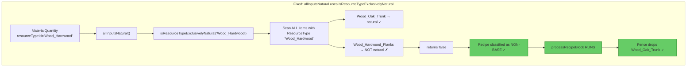
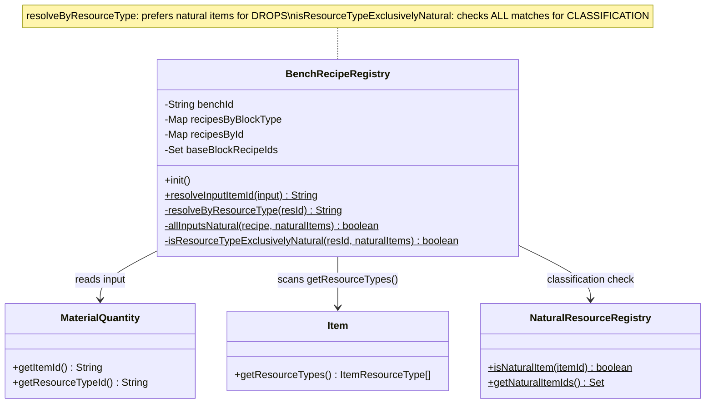
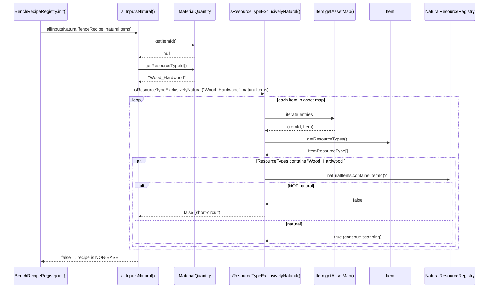

# Fix Plan: Separate Classification from Drop Resolution

## 1. Overview

The refactor to `resolveByResourceType()` introduced a regression: recipes whose **all** inputs use `ResourceTypeId` and resolve to a natural item are misclassified as "base block" recipes. This causes their blocks to skip `processRecipeBlock`, so they drop themselves instead of their crafting ingredients. The fix separates the two concerns — **drop resolution** (which item to drop) vs. **base-block classification** (is this recipe's input exclusively natural?) — by adding a dedicated `isResourceTypeExclusivelyNatural()` check used only during `init()`.

## 2. Design Priorities

1. **Correctness** — a recipe is base-block only when every matching item for each ResourceTypeId input is natural
2. **Minimal blast radius** — only `allInputsNatural` changes; `resolveByResourceType` and `resolveInputItemId` are untouched
3. **Testability** — add a fence-like single-ResourceTypeId recipe to test data to prevent future regression

## 3. Root Cause

```mermaid
graph TB
    subgraph "Current: allInputsNatural uses resolveInputItemId"
        MQ["MaterialQuantity\nresourceTypeId='Wood_Hardwood'"]
        RII["resolveInputItemId(mq)"]
        RRT["resolveByResourceType('Wood_Hardwood')"]
        P1["Pass 1: natural items only"]
        TRUNK["Wood_Oak_Trunk\nResourceTypes includes 'Wood_Hardwood'\n✓ natural"]
        RET["returns 'Wood_Oak_Trunk'"]
        AIN["allInputsNatural()"]
        NAT["naturalItems.contains('Wood_Oak_Trunk') → true"]
        BASE["Recipe classified as BASE BLOCK ✗"]
        SKIP["processRecipeBlock SKIPPED"]
        SELF["Fence drops ITSELF ✗"]
    end

    MQ --> RII --> RRT --> P1 --> TRUNK --> RET
    RET --> AIN --> NAT --> BASE --> SKIP --> SELF

    style BASE fill:#f66,stroke:#900
    style SKIP fill:#f66,stroke:#900
    style SELF fill:#f66,stroke:#900
```



`resolveByResourceType("Wood_Hardwood")` prefers natural items (Pass 1), finds `Wood_Oak_Trunk` (natural, declares `ResourceType: "Wood_Hardwood"`), returns it. `allInputsNatural()` sees a natural item → classifies the fence recipe as base-block → `processRecipeBlock` is skipped → fence drops itself.

The real game has **both** natural items (trunk) and crafted items (planks) declaring `"Wood_Hardwood"`. A recipe using `ResourceTypeId: "Wood_Hardwood"` accepts *either*, so it is NOT a base-block recipe — it accepts crafted items.

## 4. Fix



## 5. Component Diagram



## 6. Sequence Diagram — Classification Flow



## 7. Affected Files

| File | Change | Dependencies |
|------|--------|-------------|
| `src/main/.../BenchRecipeRegistry.java` | Add `isResourceTypeExclusivelyNatural()`, modify `allInputsNatural()` | None |
| `src/test/.../TestDataSet.java` | Add fence recipe + block + item with ResourceTypeId input | Blocked by production fix |
| `src/test/.../BlockRecipeRegistryTest.java` | Add test: fence with ResourceTypeId NOT classified as base | Blocked by test data |
| `src/test/.../ResourceScalingIntegrationTest.java` | Add test: fence drops ingredient not itself | Blocked by test data |

## 8. Execution Plan

### Phase 1: Production Code — Add classification method

**File:** `BenchRecipeRegistry.java`

**Step 1.1:** Add `isResourceTypeExclusivelyNatural()`:

```java
/**
 * Returns {@code true} only if EVERY item in the asset map that declares
 * the given ResourceTypeId is a natural item. Returns {@code false} if
 * any non-natural item matches, or if no item matches at all.
 *
 * <p>This is stricter than {@link #resolveByResourceType(String)}, which
 * picks the first natural match for drop resolution. Classification must
 * check ALL matches because the engine allows ANY matching item to satisfy
 * the recipe at craft time.
 */
private static boolean isResourceTypeExclusivelyNatural(
        @Nonnull String resId, @Nonnull Set<String> naturalItems) {
    boolean foundAny = false;
    for (var entry : Item.getAssetMap().getAssetMap().entrySet()) {
        Item item = entry.getValue();
        if (item == null) continue;
        ItemResourceType[] types = item.getResourceTypes();
        if (types == null) continue;
        for (ItemResourceType rt : types) {
            if (resId.equals(rt.id)) {
                foundAny = true;
                if (!naturalItems.contains(entry.getKey())) return false;
                break; // no need to check other resource types on same item
            }
        }
    }
    return foundAny;
}
```

**Step 1.2:** Modify `allInputsNatural()` to use the new method for ResourceTypeId inputs instead of `resolveInputItemId()`:

```java
private static boolean allInputsNatural(@Nonnull CraftingRecipe recipe,
                                        @Nonnull Set<String> naturalItems) {
    MaterialQuantity[] inputs = recipe.getInput();
    if (inputs == null || inputs.length == 0) return false;
    for (MaterialQuantity mq : inputs) {
        if (mq == null) continue;
        String itemId = mq.getItemId();
        if (itemId != null && !"Empty".equals(itemId)) {
            // Direct ItemId: check if the specific item is natural
            if (!naturalItems.contains(itemId)) return false;
        } else {
            String resId = mq.getResourceTypeId();
            if (resId == null) return false;
            // ResourceTypeId: ALL matching items must be natural
            if (!isResourceTypeExclusivelyNatural(resId, naturalItems)) return false;
        }
    }
    return true;
}
```

**Verify:** Compile. No caller changes needed — `allInputsNatural` is private.

### Phase 2: Test Data — Add fence-like recipe

**File:** `TestDataSet.java`

**Step 2.1:** Add a fence block, item, and recipe that uses a single `ResourceTypeId` input (`"Wood_Hardwood"`). This models the real `Wood_Hardwood_Fence.json`:

```java
// Fields to add:
public final BlockType fenceHardwood;
public final BlockBreakingDropType fenceHardwoodBreaking;
public final Item itemFenceHardwood;
public final CraftingRecipe recipeFenceHardwood;

// In constructor:
fenceHardwoodBreaking = new BlockBreakingDropType("Woods", 0, 1, "Wood_Hardwood_Fence", null);
fenceHardwood = blockType("Wood_Hardwood_Fence",
        gathering(fenceHardwoodBreaking, null, null, null));
itemFenceHardwood = item("Wood_Hardwood_Fence", "Wood_Hardwood_Fence", true, 100);
recipeFenceHardwood = recipe("Wood_Hardwood_Fence",
        new MaterialQuantity[]{materialQtyResource("Wood_Hardwood", 1)},
        materialQty("Wood_Hardwood_Fence", 2),
        BenchType.StructuralCrafting, "Builders");

// In maps population:
blockTypes.put("Wood_Hardwood_Fence", fenceHardwood);
items.put("Wood_Hardwood_Fence", itemFenceHardwood);
recipes.put("Wood_Hardwood_Fence", recipeFenceHardwood);
buildersRecipesByBlockType.put("Wood_Hardwood_Fence", recipeFenceHardwood);
buildersRecipesById.put("Wood_Hardwood_Fence", recipeFenceHardwood);
```

**Important:** Do NOT add `"Wood_Hardwood_Fence"` to `baseBlockRecipeIds` — the fence is NOT a base block.

### Phase 3: Test Assertions

**File:** `BlockRecipeRegistryTest.java`

**Step 3.1:** Add test that verifies the fence with `ResourceTypeId` input is NOT classified as a base block recipe when `init()` runs:

```java
@Test
void resourceTypeIdRecipeNotClassifiedAsBase() {
    BenchRecipeRegistries.init("Builders");

    // Fence uses ResourceTypeId "Wood_Hardwood" which matches both
    // Wood_Oak_Trunk (natural) and Wood_Hardwood_Planks (non-natural).
    // Since non-natural items match, this is NOT a base block recipe.
    assertFalse(BenchRecipeRegistries.isBaseBlockRecipeAnywhere("Wood_Hardwood_Fence"),
            "Fence with ResourceTypeId input should NOT be a base block recipe");
}
```

**File:** `ResourceScalingIntegrationTest.java`

**Step 3.2:** Add tests to the `GenericResourceTypeRecipeDrops` nested class that verify the fence drops its resolved ingredient (not itself):

```java
@Test
void fenceWithResourceTypeIdDropsIngredient() {
    applyFullPipeline();
    var breaking = readGatheringBreaking(data.fenceHardwood.getGathering());
    assertNotEquals("Wood_Hardwood_Fence", breaking.getItemId(),
            "Fence should drop its ingredient, not itself");
    assertNotNull(breaking.getItemId(),
            "Fence (single ingredient) should use direct itemId, not dropList");
}

@Test
void fenceIsNotClassifiedAsBaseBlock() {
    applyFullPipeline();
    assertFalse(BenchRecipeRegistries.isBaseBlockTypeAnywhere("Wood_Hardwood_Fence"),
            "Fence with ResourceTypeId input should NOT be a base block type");
}
```

### Phase 4: Run Tests

Run `./gradlew test` and verify all tests pass.

## 9. What Does NOT Change

| Component | Reason |
|-----------|--------|
| `resolveByResourceType()` | Natural-preference for drops is correct — fence SHOULD drop trunk |
| `resolveInputItemId()` | Signature and behavior unchanged |
| `DropScaler.processRecipeBlock()` | Uses `resolveInputItemId()` — unchanged |
| `DropScaler.collectIngredientItemIds()` | Uses `resolveInputItemId()` — unchanged |
| `NaturalResourceRegistry` | No changes needed |
| `AssetTestHelper` | No changes needed |

## 10. Risks

| Risk | Mitigation |
|------|------------|
| A ResourceTypeId that ONLY matches natural items (e.g. hypothetical `"Rock"` type matching only `Rock_Stone`) would correctly classify its recipe as base-block. This is the intended behavior. | Verify with the `Rock_Stone` test data — it has `resourceType("Rock")` and is natural. If a recipe used `ResourceTypeId: "Rock"`, it would be base-block, which is correct. |
| Performance: `isResourceTypeExclusivelyNatural` scans all items per ResourceTypeId input during `init()` | One-time cost during asset loading. Negligible given the small number of ResourceTypeId inputs. |
| The fence's drop will be `Wood_Oak_Trunk` (natural preference in `resolveByResourceType`). This is semantically correct — the player built the fence from trunk wood. | Matches the engine's own resolution behavior. |

## 11. Open Questions

None — the fix is self-contained and does not require user input.
