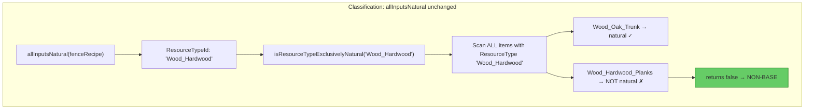
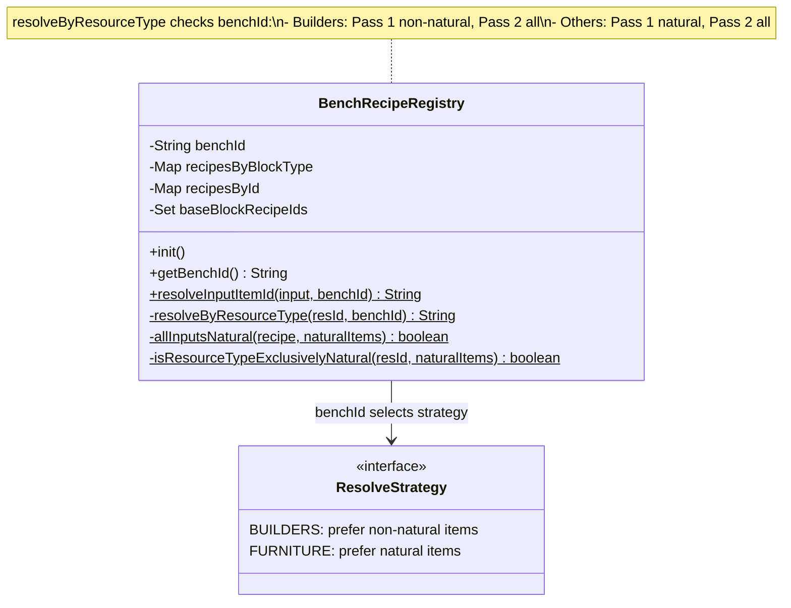
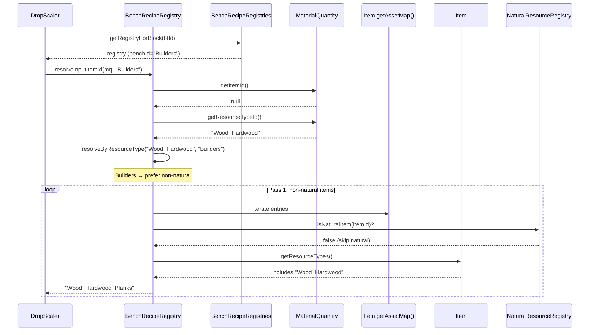

# Fix Plan: Bench-Specific ResourceTypeId Resolution

## 1. Overview

`resolveByResourceType()` needs bench-aware item preference. The Builders Bench should resolve `ResourceTypeId` inputs to **non-natural** items (planks/decorative/ornate — the FullBlocks set items) because those are the base materials the builder works with. The Furniture Bench should resolve to **natural** items (trunks/logs) because furniture recipes accept raw wood. Additionally, `allInputsNatural()` needs a separate `isResourceTypeExclusivelyNatural()` check so recipes with `ResourceTypeId` inputs that match both natural and non-natural items are never misclassified as base-block recipes.

## 2. Design Priorities

1. **Correctness** — each bench resolves to the item type its recipes logically consume
2. **Engine alignment** — both benches use `Item.getResourceTypes()` with exact string equality (confirmed by Hytale Expert — no difference in engine matching between bench types)
3. **Minimal blast radius** — `resolveInputItemId` gains a `benchId` parameter; callers updated to pass it
4. **Classification safety** — `allInputsNatural` uses exclusive-natural check, independent of drop resolution

## 3. Key Facts from Hytale Expert Research

- **Both benches use the same engine mechanism**: `CraftingManager.matches()` checks `item.getResourceTypes()` with exact string equality. No bench-specific logic exists in the engine.
- **BlockGroups are UI-only**: `FullBlocks_Hardwood` etc. are for client-side block cycling in the Builders Bench UI. They do NOT participate in `ResourceTypeId` resolution.
- **`Wood_All` is a literal string**: No wildcard/suffix matching. Items must explicitly declare `{"Id": "Wood_All"}` in their ResourceTypes.
- **`Wood_Hardwood_Planks` does NOT declare `Wood_All`**: Its ResourceTypes are `["Wood_Planks", "Fuel", "Charcoal", "Wood_Hardwood"]`. So `Wood_All` on the Furniture Bench correctly accepts only items that declare it (trunks), not planks.
- **`Wood_Oak_Trunk` declares both `Wood_All` AND `Wood_Hardwood`**: So for `Wood_Hardwood`, both trunk (natural) and planks (non-natural) match.

## 4. Resolution Strategy Per Bench


**Why this split makes sense:**
- Builders Bench recipes use ResourceTypeId to accept any block in a material family. A fence made from `Wood_Hardwood` should drop the planks block (the base buildable item), not the trunk you'd find in nature.
- Furniture Bench recipes use ResourceTypeId to accept raw materials. A bed requiring `Wood_All` should drop the natural wood you'd gather, not a crafted planks block.

## 5. Classification Fix

`allInputsNatural()` currently calls `resolveInputItemId()` which picks ONE item. Regardless of bench-specific preference, the classification must check whether the ResourceTypeId EXCLUSIVELY matches natural items:



## 6. Component Diagram



## 7. Sequence Diagram — Builders Bench Resolution



## 8. Affected Files

| File | Change | Reason |
|------|--------|--------|
| `BenchRecipeRegistry.java` | Add `benchId` param to `resolveInputItemId` and `resolveByResourceType`; implement bench-specific two-pass; add `isResourceTypeExclusivelyNatural`; modify `allInputsNatural` | Core fix |
| `BenchRecipeRegistries.java` | Add `getRegistryForBlock(btId)` returning the `BenchRecipeRegistry` (not just the recipe) | Callers need bench context |
| `DropScaler.java` | Update `processRecipeBlock` and `collectIngredientItemIds` to pass `benchId` to `resolveInputItemId` | Callers must provide bench context |
| `AssetTestHelper.java` | Implement `item()` overload with `ItemResourceType...` param; implement `resourceType()` helper | Test infrastructure for ResourceTypes |
| `TestDataSet.java` | Add ResourceTypes to items; add fence recipe/block/item; remove BlockGroup infrastructure | Test data accuracy |
| `BlockRecipeRegistryTest.java` | Add fence classification test | Verify non-base classification |
| `ResourceScalingIntegrationTest.java` | Add fence drop test; update Kweebec Bed assertions | Verify correct drops |

## 9. Execution Plan

### Phase 1: Production Code — BenchRecipeRegistry

**Step 1.1:** Change `resolveInputItemId` signature to accept `benchId`:

```java
@Nullable
public static String resolveInputItemId(@Nonnull MaterialQuantity input,
                                         @Nonnull String benchId) {
    String itemId = input.getItemId();
    if (itemId != null && !"Empty".equals(itemId)) {
        Item item = Item.getAssetMap().getAsset(itemId);
        return item != null ? itemId : null;
    }
    String resId = input.getResourceTypeId();
    if (resId != null) {
        return resolveByResourceType(resId, benchId);
    }
    return null;
}
```

**Step 1.2:** Implement `resolveByResourceType` with bench-specific preference:

```java
@Nullable
private static String resolveByResourceType(@Nonnull String resId,
                                             @Nonnull String benchId) {
    boolean preferNatural = !"Builders".equals(benchId);

    // Pass 1: preferred items (natural for Furniture, non-natural for Builders)
    for (var entry : Item.getAssetMap().getAssetMap().entrySet()) {
        Item item = entry.getValue();
        if (item == null) continue;
        boolean isNatural = NaturalResourceRegistry.isNaturalItem(entry.getKey());
        if (preferNatural != isNatural) continue;
        ItemResourceType[] types = item.getResourceTypes();
        if (types == null) continue;
        for (ItemResourceType rt : types) {
            if (resId.equals(rt.id)) return entry.getKey();
        }
    }
    // Pass 2: fallback to any item with a matching ResourceType
    for (var entry : Item.getAssetMap().getAssetMap().entrySet()) {
        Item item = entry.getValue();
        if (item == null) continue;
        ItemResourceType[] types = item.getResourceTypes();
        if (types == null) continue;
        for (ItemResourceType rt : types) {
            if (resId.equals(rt.id)) return entry.getKey();
        }
    }
    return null;
}
```

**Step 1.3:** Add `isResourceTypeExclusivelyNatural`:

```java
private static boolean isResourceTypeExclusivelyNatural(
        @Nonnull String resId, @Nonnull Set<String> naturalItems) {
    boolean foundAny = false;
    for (var entry : Item.getAssetMap().getAssetMap().entrySet()) {
        Item item = entry.getValue();
        if (item == null) continue;
        ItemResourceType[] types = item.getResourceTypes();
        if (types == null) continue;
        for (ItemResourceType rt : types) {
            if (resId.equals(rt.id)) {
                foundAny = true;
                if (!naturalItems.contains(entry.getKey())) return false;
                break;
            }
        }
    }
    return foundAny;
}
```

**Step 1.4:** Modify `allInputsNatural` to use dedicated classification logic:

```java
private static boolean allInputsNatural(@Nonnull CraftingRecipe recipe,
                                        @Nonnull Set<String> naturalItems) {
    MaterialQuantity[] inputs = recipe.getInput();
    if (inputs == null || inputs.length == 0) return false;
    for (MaterialQuantity mq : inputs) {
        if (mq == null) continue;
        String itemId = mq.getItemId();
        if (itemId != null && !"Empty".equals(itemId)) {
            if (!naturalItems.contains(itemId)) return false;
        } else {
            String resId = mq.getResourceTypeId();
            if (resId == null) return false;
            if (!isResourceTypeExclusivelyNatural(resId, naturalItems)) return false;
        }
    }
    return true;
}
```

### Phase 2: Production Code — BenchRecipeRegistries

**Step 2.1:** Add `getRegistryForBlock(btId)` to `BenchRecipeRegistries`:

```java
@Nullable
public static BenchRecipeRegistry getRegistryForBlock(@Nonnull String blockTypeId) {
    for (BenchRecipeRegistry reg : registries.values()) {
        if (reg.hasRecipe(blockTypeId)) return reg;
    }
    return null;
}
```

### Phase 3: Production Code — DropScaler

**Step 3.1:** Update `processRecipeBlock` to get the bench registry and pass `benchId`:

```java
private static boolean processRecipeBlock(BlockType bt, String btId, AssetFieldAccessor f,
                                           List<ItemDropList> syntheticDropLists) {
    BenchRecipeRegistry registry = BenchRecipeRegistries.getRegistryForBlock(btId);
    if (registry == null) return false;
    CraftingRecipe recipe = registry.getRecipeForBlock(btId);
    if (recipe == null) return false;
    String benchId = registry.getBenchId();
    // ... rest unchanged except:
    // String itemId = BenchRecipeRegistry.resolveInputItemId(mq);
    // becomes:
    // String itemId = BenchRecipeRegistry.resolveInputItemId(mq, benchId);
```

**Step 3.2:** Update `collectIngredientItemIds` to pass `benchId`:

```java
private static Set<String> collectIngredientItemIds() {
    Set<String> ids = new HashSet<>();
    for (BenchRecipeRegistry reg : BenchRecipeRegistries.getAllRegistries()) {
        String benchId = reg.getBenchId();
        for (CraftingRecipe recipe : reg.getAllRecipesById().values()) {
            MaterialQuantity[] inputs = recipe.getInput();
            if (inputs == null) continue;
            for (MaterialQuantity mq : inputs) {
                if (mq == null) continue;
                String resolved = BenchRecipeRegistry.resolveInputItemId(mq, benchId);
                if (resolved != null) ids.add(resolved);
            }
        }
    }
    return ids;
}
```

### Phase 4: Test Infrastructure — AssetTestHelper

**Step 4.1:** Implement `item()` overload with `ItemResourceType...`:

```java
public static Item item(String id, String blockId, boolean hasBlockType,
                        int maxStack, ItemResourceType... resourceTypes) {
    Item it = item(id, blockId, hasBlockType, maxStack);
    if (resourceTypes != null && resourceTypes.length > 0) {
        setField(Item.class, it, "resourceTypes", resourceTypes);
    }
    return it;
}
```

**Step 4.2:** Implement `resourceType()` helper:

```java
public static ItemResourceType resourceType(String id) {
    return new ItemResourceType(id, 1);
}
```

### Phase 5: Test Data — TestDataSet

**Step 5.1:** Add ResourceTypes to existing items:

| Item | ResourceTypes |
|------|---------------|
| `Rock_Stone` | `"Rock"` |
| `Wood_Log_Oak` | `"Wood_All"`, `"Wood_Trunk"`, `"Fuel"` |
| `Wood_Planks_Oak` | `"Wood_Planks"`, `"Wood_All"`, `"Fuel"` |
| `Wood_Blackwood_Planks` | `"Wood_Planks"`, `"Wood_All"` |
| `Wood_Hardwood_Planks` | `"Wood_Planks"`, `"Wood_All"`, `"Wood_Hardwood"` |

**Step 5.2:** Add fence recipe, block, and item:

```java
// Fields:
public final BlockType fenceHardwood;
public final BlockBreakingDropType fenceHardwoodBreaking;
public final Item itemFenceHardwood;
public final CraftingRecipe recipeFenceHardwood;

// Constructor:
fenceHardwoodBreaking = new BlockBreakingDropType("Woods", 0, 1, "Wood_Hardwood_Fence", null);
fenceHardwood = blockType("Wood_Hardwood_Fence",
        gathering(fenceHardwoodBreaking, null, null, null));
itemFenceHardwood = item("Wood_Hardwood_Fence", "Wood_Hardwood_Fence", true, 100);
recipeFenceHardwood = recipe("Wood_Hardwood_Fence",
        new MaterialQuantity[]{materialQtyResource("Wood_Hardwood", 1)},
        materialQty("Wood_Hardwood_Fence", 2),
        BenchType.StructuralCrafting, "Builders");

// Maps:
blockTypes.put("Wood_Hardwood_Fence", fenceHardwood);
items.put("Wood_Hardwood_Fence", itemFenceHardwood);
recipes.put("Wood_Hardwood_Fence", recipeFenceHardwood);
buildersRecipesByBlockType.put("Wood_Hardwood_Fence", recipeFenceHardwood);
buildersRecipesById.put("Wood_Hardwood_Fence", recipeFenceHardwood);
```

**Step 5.3:** Remove BlockGroup infrastructure (`blockGroups` map, `createBlockGroup`, `installBlockGroups` call) since BlockGroups are UI-only and not used by the resolution system.

### Phase 6: Test Assertions

**Step 6.1:** `BlockRecipeRegistryTest` — fence NOT classified as base:

```java
@Test
void resourceTypeIdRecipeNotClassifiedAsBase() {
    BenchRecipeRegistries.init("Builders");
    assertFalse(BenchRecipeRegistries.isBaseBlockRecipeAnywhere("Wood_Hardwood_Fence"),
            "Fence with ResourceTypeId should NOT be base (non-natural items also match)");
}
```

**Step 6.2:** `ResourceScalingIntegrationTest` — fence drops planks, bed drops trunk:

```java
@Test
void fenceDropsPlanksNotItself() {
    applyFullPipeline();
    var breaking = readGatheringBreaking(data.fenceHardwood.getGathering());
    assertEquals("Wood_Hardwood_Planks", breaking.getItemId(),
            "Builders Bench fence should drop the non-natural planks item");
    assertNotEquals("Wood_Hardwood_Fence", breaking.getItemId());
}

@Test
void kweebecBedResolvesWoodAllToNaturalItem() {
    applyFullPipeline();
    // Furniture Bench prefers natural items: Wood_Log_Oak has Wood_All
    var breaking = readGatheringBreaking(data.kweebecBed.getGathering());
    String dropListId = readBreakingDropListId(breaking);
    assertNotNull(dropListId,
            "Kweebec bed should have a synthetic drop list (Wood_All resolved to natural item)");
}
```

### Phase 7: Cleanup & Verify

- Remove `installBlockGroups` from `AssetTestHelper` if no longer called
- Remove `BlockGroup` imports from files that no longer need them
- Run `./gradlew test`

## 10. What Does NOT Change

| Component | Reason |
|-----------|--------|
| `NaturalResourceRegistry` | Classification of what's natural is unchanged |
| `PlacementCostScaler` | Unrelated system |
| `AssetFieldAccessor` | Reflection accessor, no logic change |
| Engine matching | We mirror engine's exact-equality; bench preference is our plugin's drop policy |

## 11. Risks

| Risk | Mitigation |
|------|------------|
| Unknown bench IDs in the future | Default to natural preference (same as current Furniture Bench behavior). Only `"Builders"` gets the non-natural preference. |
| Items with ResourceTypes but no natural/non-natural split (e.g. only natural items match `"Rock"`) | Pass 1 finds a match; pass 2 is never reached. Works correctly either way. |
| `processRecipeBlock` currently calls `BenchRecipeRegistries.getRecipeForBlock` — now needs to call `getRegistryForBlock` first | Small refactor; `getRegistryForBlock` returns the registry, then `registry.getRecipeForBlock(btId)` gets the recipe. |
| `allInputsNatural` no longer calls `resolveInputItemId` — might miss edge cases | The new logic is strictly more correct: direct ItemId → `naturalItems.contains()`; ResourceTypeId → `isResourceTypeExclusivelyNatural()`. Both are simpler and more deterministic. |

## 12. Open Questions

None — all questions resolved by Hytale Expert research:
- BlockGroups are UI-only, not resolution-related
- Both benches use same engine mechanism (`Item.getResourceTypes()` with exact equality)
- `Wood_All` is literal, not wildcard
- `Wood_Hardwood_Planks` does NOT have `Wood_All` (so `Wood_All` on Furniture Bench correctly excludes planks)
