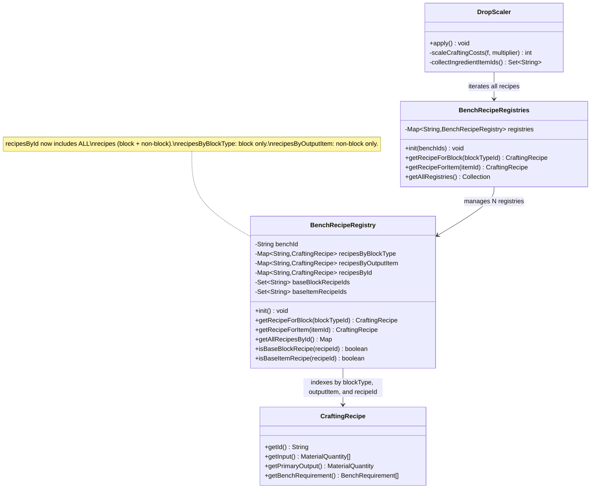
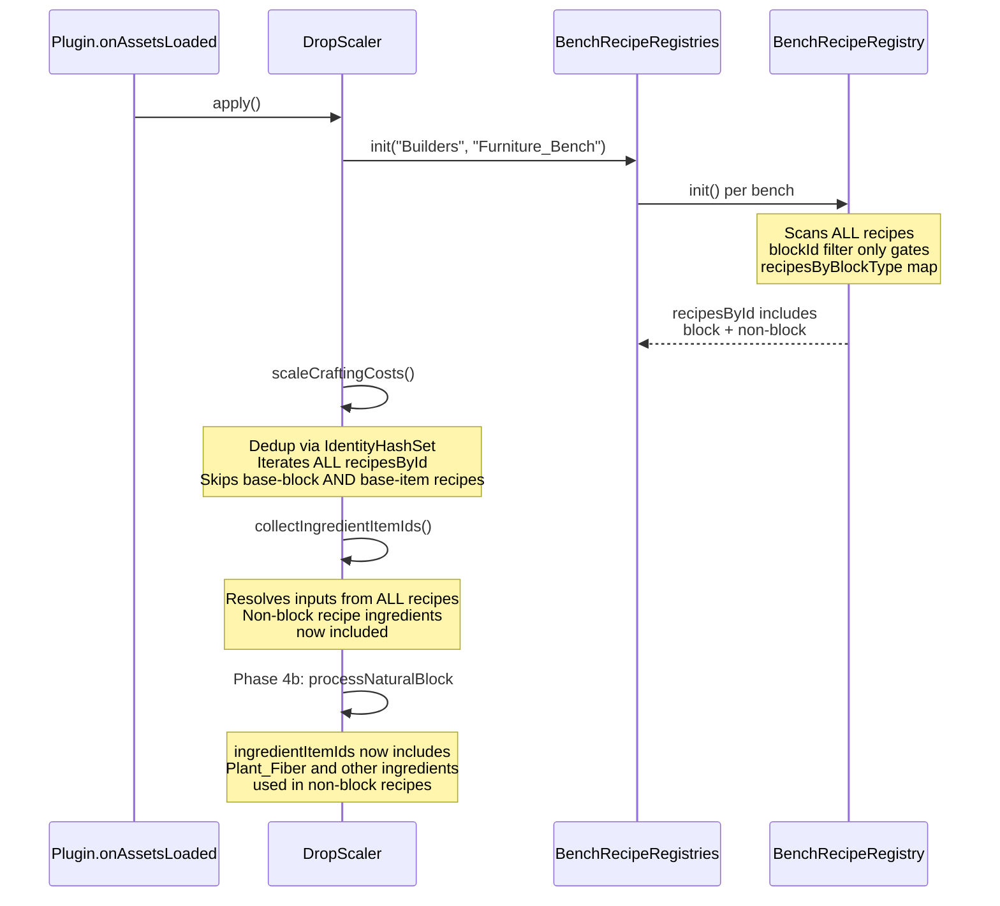

# Fix: Non-Block Recipe Scaling Gap

## 1. Overview

The 12x resource economy pipeline excludes all crafting recipes whose output item has no `blockId` (i.e., non-block items like Rope, Ingredient_Fibre, tools, consumables). This causes these recipes to remain at vanilla 1x cost while their natural resource inputs drop at 12x rate, making them trivially cheap to craft. A secondary pre-existing bug causes recipes belonging to multiple benches to be double-scaled (×144 instead of ×12).

## 2. Design Priorities

1. **Correctness** — All bench recipes (block and non-block) must have their input costs scaled by 12x
2. **No double-scaling** — Recipes appearing in multiple bench registries must only be scaled once
3. **Minimal change surface** — Extend existing `BenchRecipeRegistry` rather than creating new systems
4. **Backward compatibility** — Block-only consumers (`BenchBlockClassifier`, `AbstractBenchProcessor`) remain unaffected

## 3. Component Diagram



## 4. Responsibility Map

```mermaid
graph TB
    subgraph "Asset Load Pipeline"
        A[NaturalResourceRegistry.init] --> B[BenchRecipeRegistries.init]
        B --> C["Phase 1: scaleCraftingCosts<br/>(ALL recipesById — block + non-block)"]
        C --> D["Phase 2: collectIngredientItemIds<br/>(ALL recipesById — block + non-block)"]
        D --> E["Phase 3: BenchBlockClassifier<br/>(block-only — unchanged)"]
        E --> F["Phase 4a: Category Processors<br/>(block-only — unchanged)"]
        F --> G["Phase 4b: Natural Block Processing<br/>(uses expanded ingredientItemIds)"]
        G --> H["Phase 5: Register drop lists"]
        H --> I["Phase 6: Scale stack sizes"]
    end

    style C fill:#f96,stroke:#960,color:#000
    style D fill:#f96,stroke:#960,color:#000
    style G fill:#f96,stroke:#960,color:#000
```



Orange nodes are the phases affected by this fix. Phases 3, 4a, 5, 6 are unchanged.

## 5. Sequence Diagram



## 6. Package Structure

No new files. All changes are to existing files:

```
src/main/java/com/UnobstructedThirdPerson/resourcecollection/
├── BenchRecipeRegistry.java      ← MODIFY: split blockId gate, add recipesByOutputItem
├── BenchRecipeRegistries.java    ← MODIFY: add getRecipeForItem() aggregate query
├── DropScaler.java               ← MODIFY: add dedup guard in scaleCraftingCosts
└── (all other files unchanged)
```

## 7. Integration Changes Required

### 7.1 BenchRecipeRegistry.java — Split the blockId gate

**Current code (line ~70–82 of `init()`):**
```java
Item item = Item.getAssetMap().getAsset(outputItemId);
if (item == null) continue;
String blockTypeId = item.getBlockId();
if (blockTypeId == null || blockTypeId.isEmpty()) continue;  // ← GATES EVERYTHING
byBlock.putIfAbsent(blockTypeId, recipe);
byId.put(recipe.getId(), recipe);
```

**Required change:**
```java
Item item = Item.getAssetMap().getAsset(outputItemId);
if (item == null) continue;

// Always register in recipesById (block + non-block recipes)
byId.put(recipe.getId(), recipe);

String blockTypeId = item.getBlockId();
if (blockTypeId != null && !blockTypeId.isEmpty()) {
    // Block recipes also go into the block-type index
    byBlock.putIfAbsent(blockTypeId, recipe);
} else {
    // Non-block recipes go into the output-item index
    byItem.putIfAbsent(outputItemId, recipe);
}
```

**Additional changes in `init()`:**
- Add `Map<String, CraftingRecipe> byItem = new HashMap<>()` alongside `byBlock` and `byId`
- Store into new field `recipesByOutputItem`
- Classify base-item recipes: non-block recipes whose inputs are all natural should be tracked in a `baseItemRecipeIds` set and excluded from Phase 1 scaling (same logic as `baseBlockRecipeIds`)

**New methods:**
- `getRecipeForItem(String itemId)` — returns recipe from `recipesByOutputItem`
- `isBaseItemRecipe(String recipeId)` — checks `baseItemRecipeIds`

### 7.2 BenchRecipeRegistries.java — Add aggregate query

**New method:**
```java
@Nullable
public static CraftingRecipe getRecipeForItem(@Nonnull String itemId) {
    for (BenchRecipeRegistry reg : registries.values()) {
        CraftingRecipe recipe = reg.getRecipeForItem(itemId);
        if (recipe != null) return recipe;
    }
    return null;
}
```

### 7.3 DropScaler.scaleCraftingCosts — Fix double-scaling + include non-block

**Current code (line ~154–170):**
```java
private static int scaleCraftingCosts(AssetFieldAccessor f, int multiplier) {
    int modified = 0;
    for (BenchRecipeRegistry reg : BenchRecipeRegistries.getAllRegistries()) {
    for (var entry : reg.getAllRecipesById().entrySet()) {
        String recipeId = entry.getKey();
        CraftingRecipe recipe = entry.getValue();

        if (reg.isBaseBlockRecipe(recipeId)) continue;
        // ... scales inputs ...
    }
    }
    return modified;
}
```

**Required change:**
```java
private static int scaleCraftingCosts(AssetFieldAccessor f, int multiplier) {
    int modified = 0;
    Set<CraftingRecipe> alreadyScaled = Collections.newSetFromMap(new IdentityHashMap<>());
    for (BenchRecipeRegistry reg : BenchRecipeRegistries.getAllRegistries()) {
    for (var entry : reg.getAllRecipesById().entrySet()) {
        String recipeId = entry.getKey();
        CraftingRecipe recipe = entry.getValue();

        if (alreadyScaled.contains(recipe)) continue;            // dedup guard
        if (reg.isBaseBlockRecipe(recipeId)) continue;
        if (reg.isBaseItemRecipe(recipeId)) continue;             // skip base-item recipes too

        // ... scales inputs ...

        alreadyScaled.add(recipe);                                // mark as processed
    }
    }
    return modified;
}
```

### 7.4 No changes needed in:
- **NaturalResourceRegistry** — `blockId` filter correctly determines natural blocks
- **BenchBlockClassifier** — block-only by design
- **AbstractBenchProcessor / BuildersProcessor / FurnitureProcessor / OverlapProcessor** — block-only by design
- **PlacementCostScaler** — runtime block placement, unrelated
- **ResourceTypeResolver** — already generic
- **collectIngredientItemIds()** — automatically picks up non-block recipes once they're in `recipesById`

## 8. Open Questions

1. **Rope item ID**: The Hytale Expert found no confirmed standalone item called `"Rope"` in local asset data. The user should verify the exact item ID at runtime (check server logs or asset dumps). It may follow a pattern like `Rope_Wood` or `Rope_Hemp` as block items, or could be a pure item. If it's a block item, a different bug may be at play (check if it appears in `craftableBlockIds` and is incorrectly excluded from natural blocks).

2. **Plant_Fiber vs Ingredient_Fibre**: These are two distinct items in Hytale's asset data — `Plant_Fiber` is the raw natural drop (American spelling), `Ingredient_Fibre` is a processed crafting ingredient (British spelling, `Ingredient_` prefix). There is likely a conversion recipe `Plant_Fiber → Ingredient_Fibre` that is also a non-block recipe and would also be missed by the current system. The user should confirm whether the item they're seeing is `Plant_Fiber` or `Ingredient_Fibre`.

3. **Base-item recipe classification**: Should non-block recipes with all-natural inputs (e.g., `Plant_Fiber → Rope`) be treated as "base item recipes" and excluded from scaling, similar to how base block recipes (e.g., `Wood_Log → Planks`) are excluded? The current base-block logic skips scaling for recipes where all inputs are exclusively natural, because those recipes' outputs already drop at 12x from the natural block scaling. For non-block items this may differ — they don't have block drops, so their recipe cost probably SHOULD be scaled. **Recommendation: do NOT skip base-item recipes from Phase 1 scaling** unless the item itself is already being dropped at 12x from natural blocks.

4. **Scope of affected recipes**: A runtime audit should be performed to count how many non-block recipes exist across all registered benches. This will help validate the fix and ensure no unexpected items are being scaled. Add a log line in `BenchRecipeRegistry.init()` reporting the count of non-block recipes registered.
