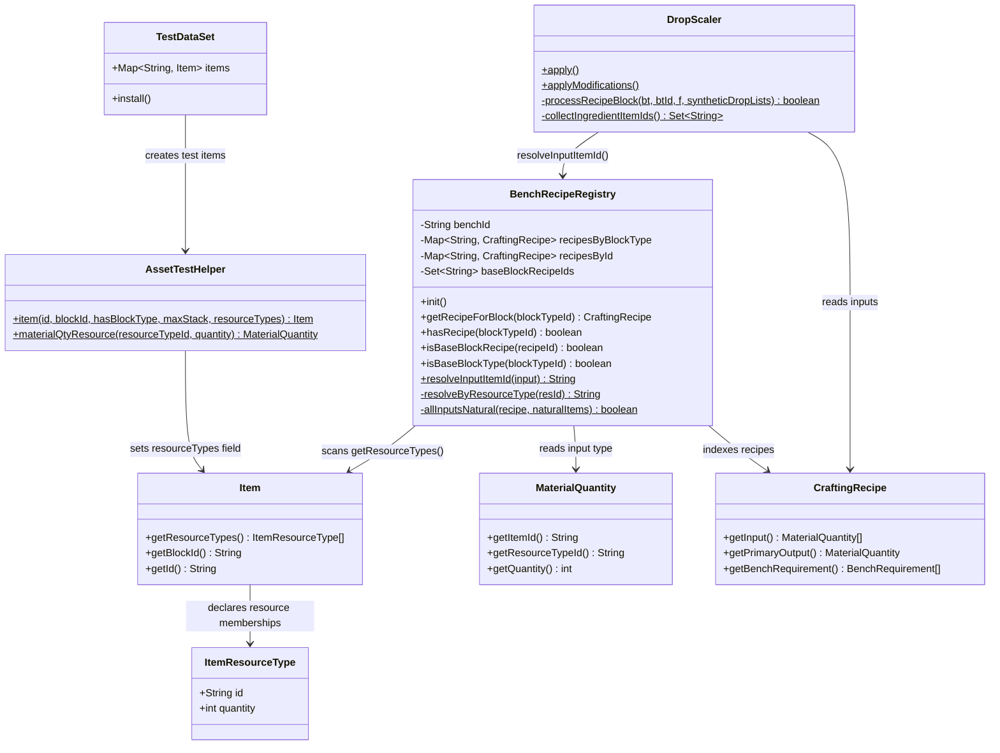
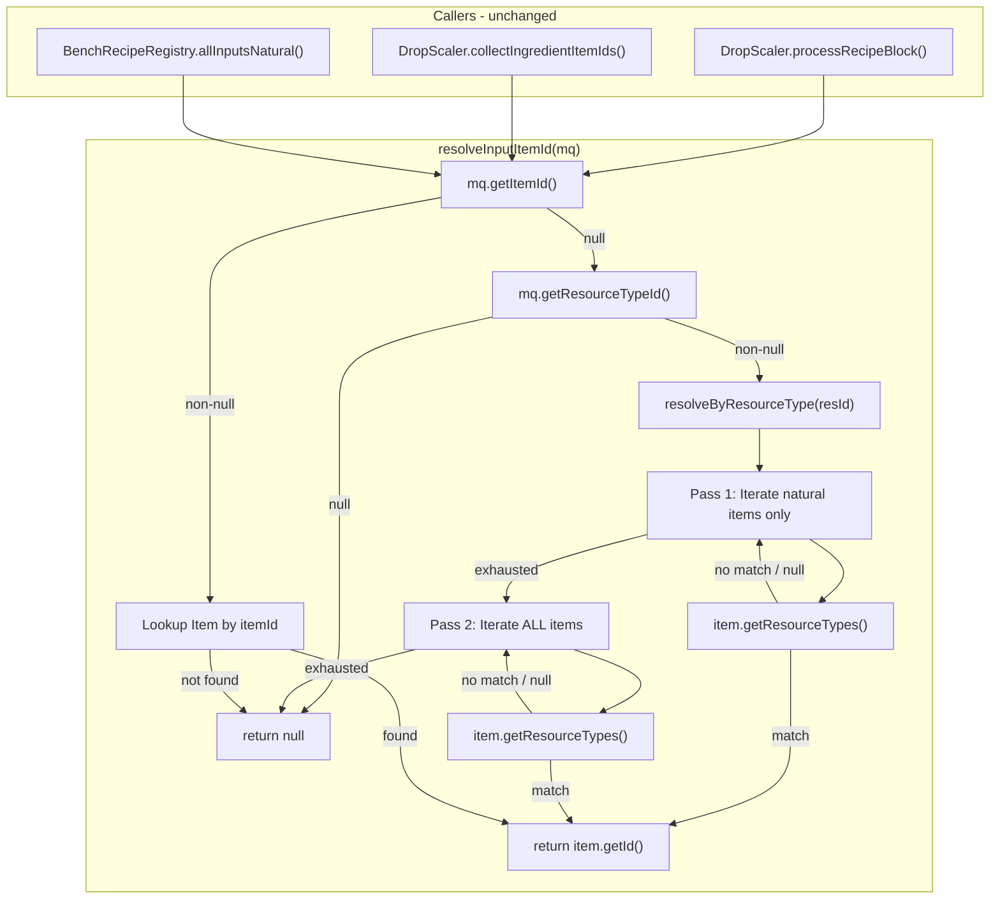
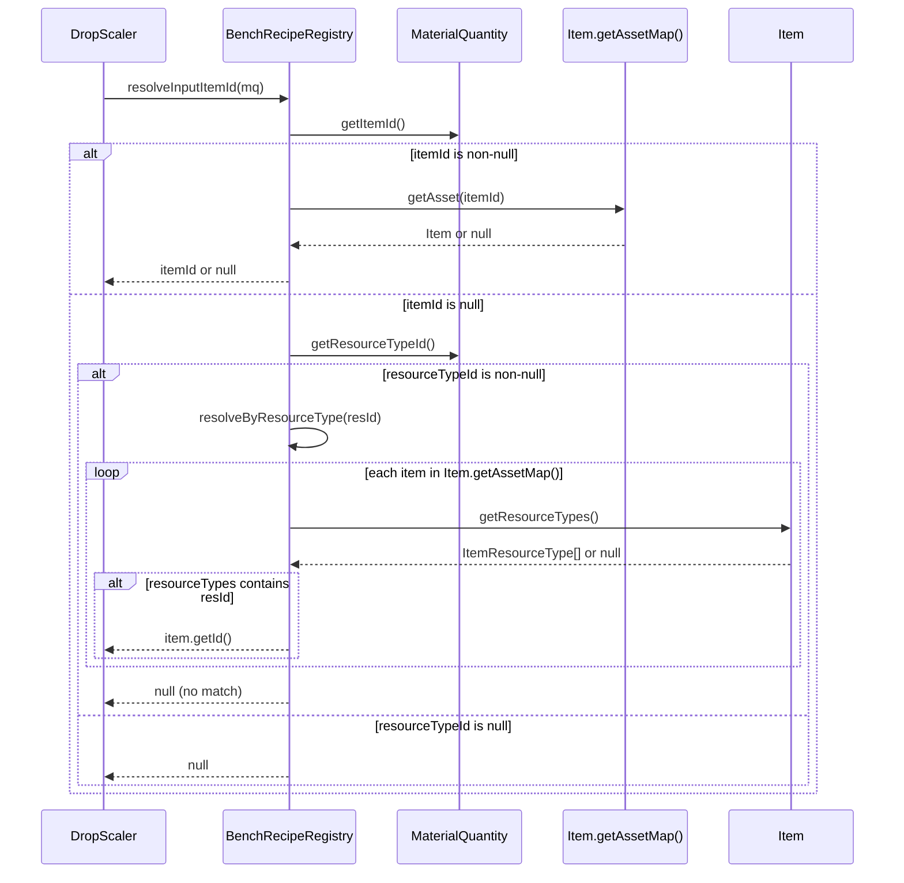

# Refactor Plan: Replace BlockGroup Resolution with Engine-Native ResourceType Resolution

## 1. Overview

Replace the fabricated `resolveByBlockGroup()` algorithm — which uses `BlockGroup` scanning with prefix matching and `_All` suffix stripping — with the engine's actual `Item.getResourceTypes()` resolution. This aligns the plugin's `ResourceTypeId → Item` resolution with how `CraftingManager.matches()`, `ItemContainer.getMatchingResourceType()`, and `InternalContainerUtilResource` work in the Hytale SDK. The core design principle is: **use the same matching logic the engine uses, not an invented approximation.**

## 2. Design Priorities

1. **Engine-native patterns** — match exactly how the SDK resolves `ResourceTypeId`
2. **Simplicity** — remove the `BlockGroup` scanning, prefix heuristics, and `_All` suffix logic entirely
3. **Testability** — test data must model `Item.getResourceTypes()` like real game assets
4. **Minimal blast radius** — `resolveInputItemId()` keeps its exact signature; all callers unchanged

## 3. Component Diagram



## 4. Responsibility Map



## 5. Sequence Diagram



## 6. Current State

### How it works now

`BenchRecipeRegistry.resolveInputItemId()` handles two cases:
1. **Direct `ItemId`** — looks up the item by ID in `Item.getAssetMap()`. This is correct.
2. **`ResourceTypeId`** — calls `resolveByBlockGroup(resId)`, which:
   - Strips the `_All` suffix (e.g. `"Wood_All"` → prefix `"Wood_"`)
   - Iterates **all** `BlockGroup` entries from the `AssetRegistry`
   - For each group, checks if any block ID starts with the prefix
   - Returns the first item whose ID or `blockId` matches

This is wrong because:
- The engine uses `Item.getResourceTypes()` with exact string equality — no prefix matching, no suffix stripping
- `BlockGroup` is a UI/cycling concept for the Builder's Bench, not related to `ResourceTypeId` resolution
- The result is non-deterministic (HashMap iteration order)
- The `_All` convention is fabricated — `"Wood_All"` is a literal resource type ID that items declare in their `ResourceTypes` array

### How callers use the result

| Caller | Purpose | Change needed? |
|--------|---------|----------------|
| `DropScaler.processRecipeBlock()` | Resolves each recipe input to a concrete item ID to build a synthetic drop list | **No** — same method signature |
| `DropScaler.collectIngredientItemIds()` | Builds a set of all item IDs used as recipe ingredients | **No** — same method signature |
| `BenchRecipeRegistry.allInputsNatural()` | Checks if all inputs of a recipe are natural resources | **No** — same method signature |

## 7. Target State

### How it will work after

`resolveInputItemId()` keeps the same signature and `ItemId` path. The `ResourceTypeId` path calls a new `resolveByResourceType(resId)` which:
1. Iterates `Item.getAssetMap().getAssetMap().values()`
2. For each item, calls `item.getResourceTypes()`
3. If any `ItemResourceType.id` equals `resId` (exact string match), returns that item's ID
4. Returns `null` if no match

This mirrors the engine's `ItemContainer.getMatchingResourceType()` logic exactly.

## 8. Affected Files

| File | Change Type | Dependencies |
|------|-------------|--------------|
| `src/main/java/.../BenchRecipeRegistry.java` | **Modify** | None — self-contained change |
| `src/test/java/.../AssetTestHelper.java` | **Modify** | Blocked by BenchRecipeRegistry change (needs `resourceTypes` support) |
| `src/test/java/.../TestDataSet.java` | **Modify** | Blocked by AssetTestHelper change |
| `src/test/java/.../BlockRecipeRegistryTest.java` | **Modify** | Blocked by TestDataSet change |
| `src/test/java/.../ResourceScalingIntegrationTest.java` | **Modify** | Blocked by TestDataSet change |
| `src/test/java/.../DropBehaviorScenarioTest.java` | **Modify** | Blocked by AssetTestHelper change |
| `src/test/java/.../SharedInstanceDropBugTest.java` | **Review** | May need ResourceTypes on test items |

## 9. Execution Plan

### Phase 1: Production Code — Replace Resolution Algorithm

- [ ] **Step 1.1**: In `BenchRecipeRegistry.java`, replace `resolveByBlockGroup()` with `resolveByResourceType()`
  - Remove the `BlockGroup` import and `AssetRegistry` import (if only used here)
  - Remove `DefaultAssetMap` import for BlockGroup
  - Delete `resolveByBlockGroup()` entirely
  - Add new `resolveByResourceType()` that **prefers natural items** over crafted items:
    ```java
    @Nullable
    private static String resolveByResourceType(@Nonnull String resId) {
        // First pass: prefer natural resource items
        for (var entry : Item.getAssetMap().getAssetMap().entrySet()) {
            Item item = entry.getValue();
            if (item == null) continue;
            if (!NaturalResourceRegistry.isNaturalItem(entry.getKey())) continue;
            ItemResourceType[] types = item.getResourceTypes();
            if (types == null) continue;
            for (ItemResourceType rt : types) {
                if (resId.equals(rt.id)) return entry.getKey();
            }
        }
        // Fallback: any item with a matching ResourceType
        for (var entry : Item.getAssetMap().getAssetMap().entrySet()) {
            Item item = entry.getValue();
            if (item == null) continue;
            ItemResourceType[] types = item.getResourceTypes();
            if (types == null) continue;
            for (ItemResourceType rt : types) {
                if (resId.equals(rt.id)) return entry.getKey();
            }
        }
        return null;
    }
    ```
  - Update `resolveInputItemId()` to call `resolveByResourceType(resId)` instead of `resolveByBlockGroup(resId)`
  - Add import for `com.hypixel.hytale.protocol.ItemResourceType`
- [ ] **Verify**: Code compiles. No callers change — `resolveInputItemId()` signature is identical.

### Phase 2: Test Infrastructure — Add ResourceType Support

- [ ] **Step 2.1**: In `AssetTestHelper.java`, add an overloaded `item()` method that accepts `ItemResourceType[]`
  ```java
  public static Item item(String id, String blockId, boolean hasBlockType,
                           int maxStack, ItemResourceType... resourceTypes) {
      Item it = item(id, blockId, hasBlockType, maxStack);
      if (resourceTypes != null && resourceTypes.length > 0) {
          setField(Item.class, it, "resourceTypes", resourceTypes);
      }
      return it;
  }
  ```
- [ ] **Step 2.2**: In `AssetTestHelper.java`, remove `installBlockGroups()` method (no longer needed)
- [ ] **Step 2.3**: In `AssetTestHelper.cleanup()`, remove the BlockGroup cleanup if present
- [ ] **Verify**: `AssetTestHelper` compiles. Existing `item(id, blockId, hasBlockType, maxStack)` overload still works for items that don't need ResourceTypes.

### Phase 3: Test Data — Model Real ResourceTypes

- [ ] **Step 3.1**: In `TestDataSet.java`, update item creation calls to include `ResourceTypes` matching real game data:
  - `itemRockStone` → `ResourceTypes: [{"Id": "Rock"}]`
  - `itemWoodLogOak` → `ResourceTypes: [{"Id": "Wood_All"}, {"Id": "Wood_Trunk"}, {"Id": "Fuel"}]`
  - `itemWoodPlanksOak` → `ResourceTypes: [{"Id": "Wood_Planks"}, {"Id": "Wood_All"}, {"Id": "Fuel"}]`
  - `itemPlantFiber` → no ResourceTypes (it's an ingredient item, matched by direct ItemId)
  - `itemIngredientFibre` → no ResourceTypes (matched by direct ItemId)
  - `itemMetalIngotIron` → no ResourceTypes (matched by direct ItemId)
  - `items.put("Wood_Blackwood_Planks", ...)` → `ResourceTypes: [{"Id": "Wood_Planks"}, {"Id": "Wood_All"}]`
  - `items.put("Wood_Hardwood_Planks", ...)` → `ResourceTypes: [{"Id": "Wood_Planks"}, {"Id": "Wood_All"}, {"Id": "Wood_Hardwood"}]`
- [ ] **Step 3.2**: Remove `blockGroups` map, `createBlockGroup()` helper, and `installBlockGroups()` call from `TestDataSet`
- [ ] **Step 3.3**: Remove `items.put("Wood_Blackwood_Planks", ...)` and `items.put("Wood_Hardwood_Planks", ...)` **only if** they were solely for BlockGroup tests. If they're used elsewhere, keep them but add ResourceTypes.
- [ ] **Verify**: `TestDataSet` compiles. `install()` no longer calls `installBlockGroups()`.

### Phase 4: Test Assertions — Fix ResourceType Resolution Tests

- [ ] **Step 4.1**: In `ResourceScalingIntegrationTest.java`, update `GenericResourceTypeRecipeDrops`:
  - `kweebecBedResolvesWoodAllToFirstMatchingWood`: Change assertion from "first block in BlockGroup starting with `Wood_`" to "first item whose ResourceTypes contains `Wood_All`" — this should be `Wood_Log_Oak` (the first item in the asset map with `Wood_All` in its resource types, based on TestDataSet insertion order)
  - Other assertions in that class should remain valid (drop list creation, gatherType preservation, cost scaling)
- [ ] **Step 4.2**: In `DropBehaviorScenarioTest.java`, add `ResourceTypes` to test items if any use `materialQtyResource()`:
  - The Rail recipe uses `materialQtyResource("Wood_Planks", 2)` — this is for a `Workbench` bench (not registered), so it won't be resolved by the plugin. But to prevent regressions, add `ResourceTypes: [{"Id": "Wood_Planks"}]` to `Wood_Planks_Oak` if it exists, or document that Rail's recipe is intentionally excluded from the pipeline.
- [ ] **Step 4.3**: In `BlockRecipeRegistryTest.java`, verify no tests depend on `BlockGroup` resolution. (Current review shows none do — the tests use `installBlockGroups` only via `TestDataSet`, and BlockRecipeRegistryTest uses its own `setUp` that doesn't call `installBlockGroups`.)
- [ ] **Step 4.4**: Review `SharedInstanceDropBugTest.java` for any `ResourceTypeId`-based test data that needs `ResourceTypes`.
- [ ] **Verify**: Run `./gradlew test`. All tests pass.

### Phase 5: Cleanup

- [ ] **Step 5.1**: Remove any remaining `BlockGroup` references from production code (check imports in `BenchRecipeRegistry.java`)
- [ ] **Step 5.2**: Verify `installBlockGroups()` has no other callers outside `TestDataSet`
- [ ] **Step 5.3**: If `AssetTestHelper.installBlockGroups()` is now dead code, delete it and the `AssetRegistry.storeMap` injection logic
- [ ] **Verify**: `./gradlew test` passes. `./gradlew build` succeeds.

## 10. Package Structure (unchanged)

```
src/main/java/com/UnobstructedThirdPerson/resourcecollection/
├── BenchRecipeRegistry.java        ← MODIFIED (resolveByResourceType replaces resolveByBlockGroup)
├── BenchRecipeRegistries.java      ← unchanged
├── DropScaler.java                 ← unchanged (callers use same resolveInputItemId signature)
├── NaturalResourceRegistry.java    ← unchanged
├── PlacementCostScaler.java        ← unchanged
├── AssetFieldAccessor.java         ← unchanged
└── ResourceConstants.java          ← unchanged

src/test/java/com/UnobstructedThirdPerson/resourcecollection/
├── AssetTestHelper.java            ← MODIFIED (item() overload with resourceTypes, remove installBlockGroups)
├── TestDataSet.java                ← MODIFIED (add ResourceTypes to items, remove blockGroups)
├── BlockRecipeRegistryTest.java    ← MODIFIED (minor: may need ResourceTypes on items if using init())
├── ResourceScalingIntegrationTest.java ← MODIFIED (fix GenericResourceTypeRecipeDrops assertions)
├── DropBehaviorScenarioTest.java   ← MODIFIED (add ResourceTypes to relevant items)
└── SharedInstanceDropBugTest.java  ← REVIEW (may need ResourceTypes)
```

## 11. Integration Changes Required

| Existing File | Modification | Reason |
|---------------|-------------|--------|
| `BenchRecipeRegistry.java` | Replace `resolveByBlockGroup()` with `resolveByResourceType()`, remove BlockGroup imports | Core fix |
| `AssetTestHelper.java` | Add `item()` overload with `ItemResourceType[]` param, remove `installBlockGroups()` | Test infrastructure |
| `TestDataSet.java` | Add `ResourceTypes` to item creation calls, remove `blockGroups` map and helpers | Test data accuracy |
| All test files using `ResourceTypeId` inputs | Add `ItemResourceType` arrays to test items that need to be matched by ResourceTypeId | Without this, resolution returns null |

**Nothing can be deleted from production code** other than the `resolveByBlockGroup()` method and its BlockGroup-related imports in `BenchRecipeRegistry.java`.

## 12. Rollback Plan

If something fails:
1. `git stash` or `git checkout -- .` to revert all changes
2. The only production file touched is `BenchRecipeRegistry.java` — reverting that single file restores the old behavior
3. Test infrastructure changes (`AssetTestHelper`, `TestDataSet`) are additive (the old `item()` overload is kept), so they can be reverted independently

## 13. Risks

| Risk | Mitigation |
|------|------------|
| **Item iteration order determines which concrete item is picked for a ResourceTypeId** | Document that the "first match" is a plugin-specific approximation. The engine doesn't need to pick one — it checks the player's actual inventory at craft time. For drops, first-match is acceptable. |
| **Some test items may be used by tests we haven't reviewed** | The old `item()` overload is preserved. Only items that need `ResourceTypes` for resolution get the new overload. Existing tests that don't test ResourceTypeId resolution continue to work. |
| **`allInputsNatural()` may classify differently after resolution fix** | `Wood_All` should resolve to `Wood_Log_Oak` (a natural item) instead of `Wood_Blackwood_Planks` (a recipe item). This actually **improves** correctness — the Kweebec Bed's wood input is more accurately classified as natural. |
| **Real game items may have ResourceTypes we haven't modeled in tests** | Use the reference JSONs in `docs/Resources/` as source of truth for test data. `Wood_Hardwood_Planks.json` shows `ResourceTypes: [Wood_Planks, Fuel, Charcoal, Wood_Hardwood]`. |
| **Performance: iterating all items for each ResourceTypeId** | Negligible — this runs once during `init()` with a small number of ResourceTypeId-based inputs. If needed later, build a `Map<String, String>` index during init. |

## 14. Open Questions

1. **What ResourceTypes does `Wood_Oak_Trunk` declare?** We have `Wood_Hardwood_Planks.json` (shows `Wood_Planks`, `Fuel`, `Charcoal`, `Wood_Hardwood`) but not `Wood_Oak_Trunk.json`'s `ResourceTypes`. Does it include `"Wood_All"`? For the test data, we should model it as including `"Wood_All"` and `"Wood_Trunk"` based on the naming pattern and the fact that the Kweebec Bed recipe uses `"Wood_All"` and expects any wood to work.
2. **Resolved: Prefer natural items over recipe items.** When multiple items match a `ResourceTypeId`, the two-pass approach iterates natural items first, then falls back to any match. This ensures `"Wood_All"` resolves to `Wood_Log_Oak` (a natural drop) rather than `Wood_Planks_Oak` (a recipe block).
