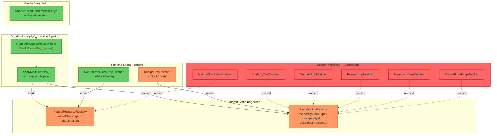
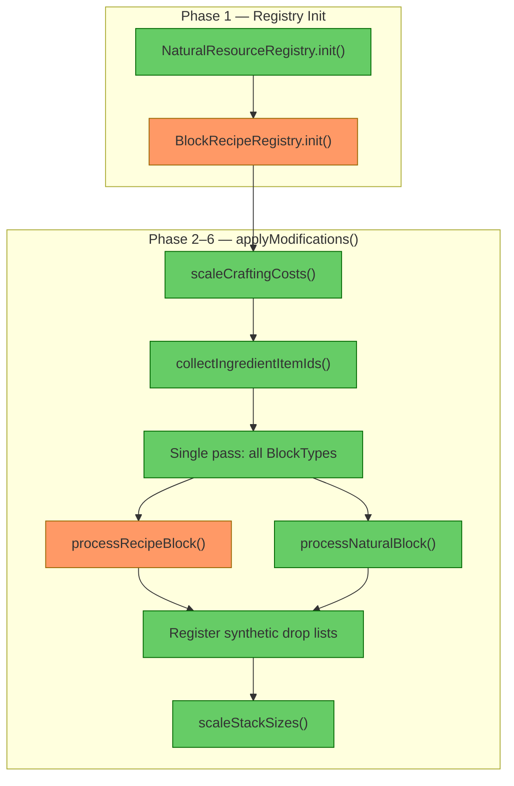
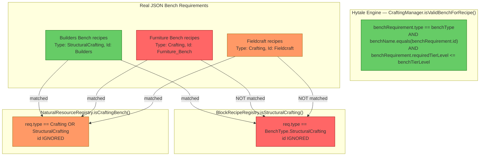
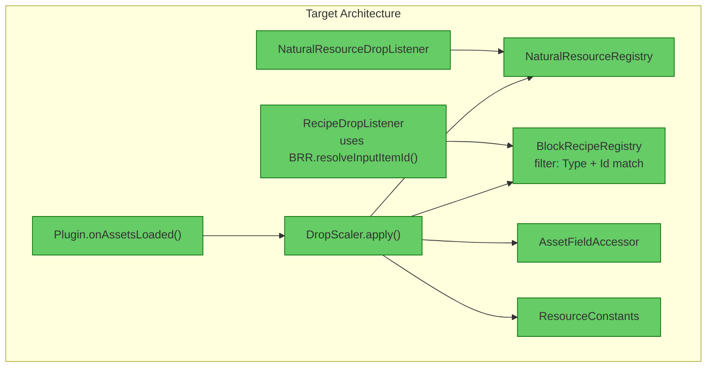

# Resource Collection Pipeline — Architecture Review

## 1. Executive Summary

The resource collection system has a **dual-pipeline problem**: `DropScaler` consolidates six legacy modifiers into a single-pass pipeline, but the six legacy modifier classes still exist as dead code alongside it. The highest-impact structural defect is a **bench-type filter mismatch** between `BlockRecipeRegistry` (checks only `StructuralCrafting`) and `NaturalResourceRegistry` (checks `Crafting` OR `StructuralCrafting`), which creates gap blocks that neither pipeline branch processes — and real game data confirms the Furniture Bench uses `BenchType.Crafting`, not `StructuralCrafting`. A secondary concern is that `RecipeDropListener` duplicates `resolveByBlockGroup()` logic rather than delegating to the shared registry method.

---

## 2. Current Architecture Diagram



### DropScaler Internal Pipeline



---

## 3. Findings Table

| # | Category | Location | Detail |
|---|----------|----------|--------|
| 1 | **Scalability** | [BlockRecipeRegistry.java](src/main/java/com/UnobstructedThirdPerson/resourcecollection/BlockRecipeRegistry.java#L110-L118) | `isStructuralCrafting()` only checks `BenchType.StructuralCrafting`. Real game data shows the Furniture Bench is `BenchType.Crafting` with `id="Furniture_Bench"`. All furniture bench recipes fall into a classification gap: excluded from natural by NRR, absent from BRR. |
| 2 | **Scalability** | [NaturalResourceRegistry.java](src/main/java/com/UnobstructedThirdPerson/resourcecollection/NaturalResourceRegistry.java#L202-L214) | `isCraftingBench()` checks `Crafting OR StructuralCrafting` — a wider filter than BRR's `isStructuralCrafting()`. This asymmetry is the root cause of gap blocks. Both filters ignore `BenchRequirement.id` entirely. |
| 3 | **Scalability** | [BlockRecipeRegistry.java](src/main/java/com/UnobstructedThirdPerson/resourcecollection/BlockRecipeRegistry.java#L22-L24) | Docstring claims "builder's bench and furniture bench (StructuralCrafting)" but the Furniture Bench's actual `Bench.Type` is `"Crafting"` (see `Bench_Furniture.json` line 46). The docstring is incorrect. |
| 4 | **Anti-pattern** | [BlockRecipeRegistry.java](src/main/java/com/UnobstructedThirdPerson/resourcecollection/BlockRecipeRegistry.java#L34-L38), [NaturalResourceRegistry.java](src/main/java/com/UnobstructedThirdPerson/resourcecollection/NaturalResourceRegistry.java#L37-L38) | Both registries use **static mutable fields** with no lifecycle management. Init ordering is enforced only by `DropScaler.apply()` calling NRR before BRR. Tests must reflectively inject state via `setNaturalRegistry()` / `setBlockRecipeRegistry()`. |
| 5 | **Anti-pattern** | [DropScaler.java](src/main/java/com/UnobstructedThirdPerson/resourcecollection/DropScaler.java#L245-L280) | `processRecipeBlock()` mutates `BlockGathering` in-place via `f.gatheringBreaking.set(gathering, newBreaking)` without cloning. If multiple blocks share a gathering instance (Hytale asset inheritance), the mutation contaminates non-target blocks. |
| 6 | **Redundancy** | [RecipeDropListener.java](src/main/java/com/UnobstructedThirdPerson/resourcecollection/RecipeDropListener.java) (~line 136+) | Contains its own `resolveByBlockGroup()` implementation that duplicates `BlockRecipeRegistry.resolveInputItemId()`. Both resolve `resourceTypeId` → item ID via the same `FullBlocks_` prefix + BlockGroup lookup pattern. |
| 7 | **Redundancy** | [CraftingCostModifier.java](src/main/java/com/UnobstructedThirdPerson/resourcecollection/CraftingCostModifier.java), [RecipeDropModifier.java](src/main/java/com/UnobstructedThirdPerson/resourcecollection/RecipeDropModifier.java), [IngredientDropModifier.java](src/main/java/com/UnobstructedThirdPerson/resourcecollection/IngredientDropModifier.java), [NaturalDropModifier.java](src/main/java/com/UnobstructedThirdPerson/resourcecollection/NaturalDropModifier.java), [PlacedBlockDropModifier.java](src/main/java/com/UnobstructedThirdPerson/resourcecollection/PlacedBlockDropModifier.java), [NaturalStackSizeModifier.java](src/main/java/com/UnobstructedThirdPerson/resourcecollection/NaturalStackSizeModifier.java) | Six legacy modifier classes are dead code. `DropScaler` consolidates all their logic but they remain in the codebase. Each resolves its own reflection fields independently (duplicating `AssetFieldAccessor`). `RecipeDropModifier` also has its own `resolveInputItemId()` and `resolveByBlockGroup()`. |
| 8 | **Anti-pattern** | [DropScaler.java](src/main/java/com/UnobstructedThirdPerson/resourcecollection/DropScaler.java#L394-L408) | `cloneGathering()` performs a **shallow clone** — field references are copied, not deep-cloned. Sub-objects (`SoftBlockDropType`, `HarvestingDropType`, `PhysicsDropType`) are shared between original and clone. When `processNaturalBlock()` mutates these via `processIngredientConfig()`, mutations propagate to all blocks sharing those sub-objects. |
| 9 | **Over-engineering** | [RecipeDropListener.java](src/main/java/com/UnobstructedThirdPerson/resourcecollection/RecipeDropListener.java#L88-L170) | The runtime block break handler re-resolves recipe inputs, divides by output quantity, and resolves `resourceTypeId` groups — duplicating work that `DropScaler` already performed at asset-load time. If the asset modifications are correct, the breaking config already has the right drops; this handler only needs to read the pre-computed breaking config. |
| 10 | **Scalability** | [BlockRecipeRegistry.java](src/main/java/com/UnobstructedThirdPerson/resourcecollection/BlockRecipeRegistry.java#L110-L118), [NaturalResourceRegistry.java](src/main/java/com/UnobstructedThirdPerson/resourcecollection/NaturalResourceRegistry.java#L202-L214) | Both filters ignore `BenchRequirement.id`. The engine (see decompiled `CraftingManager.isValidBenchForRecipe()`) validates `type == benchType AND benchName.equals(id) AND tierLevel <= requiredTierLevel`. Adding new bench types (e.g., a second StructuralCrafting bench) would silently include unintended recipes. |

---

## 3a. BenchRequirement.id Field Analysis

`BenchRequirement` **does** have an accessible public `id` field:

```java
// From .tmp_hytale_src/com/hypixel/hytale/protocol/BenchRequirement.java
public class BenchRequirement {
    @Nonnull public BenchType type = BenchType.Crafting;
    @Nullable public String id;
    @Nullable public String[] categories;
    public int requiredTierLevel;
    
    public BenchRequirement(@Nonnull BenchType type, @Nullable String id,
                            @Nullable String[] categories, int requiredTierLevel) { ... }
}
```

Test files construct it as:
```java
// AssetTestHelper.java line 77
BenchRequirement req = new BenchRequirement(benchType, null, null, 0);
```

Tests always pass `null` for `id`, meaning the bench-id filtering gap is **untested**.

### Real bench IDs from JSON data

| Bench | Bench.Type | Bench.Id | Recipe BenchRequirement |
|-------|-----------|----------|------------------------|
| Builders Bench | `StructuralCrafting` | `Builders` | `Type: StructuralCrafting, Id: Builders` |
| Furniture Bench | `Crafting` | `Furniture_Bench` | `Type: Crafting, Id: Furniture_Bench` |
| Fieldcraft (hand crafting) | `Crafting` | `Fieldcraft` | `Type: Crafting, Id: Fieldcraft` |

### Bench filter mismatch diagram



**Impact**: Furniture bench recipes (beds, lighting, pottery, textiles, etc.) are excluded from `BlockRecipeRegistry` but excluded from natural by `NaturalResourceRegistry`. These blocks are **gap blocks** — `DropScaler` processes neither their drops nor their recipes.

---

## 3b. BlockRecipeRegistry Callsite Reference

| Method Called | Caller File | Line |
|---|---|---|
| `BlockRecipeRegistry.init()` | [DropScaler.java](src/main/java/com/UnobstructedThirdPerson/resourcecollection/DropScaler.java#L58) | 58 |
| `BlockRecipeRegistry.hasRecipe()` | [DropScaler.java](src/main/java/com/UnobstructedThirdPerson/resourcecollection/DropScaler.java#L94) | 94 |
| `BlockRecipeRegistry.isBaseBlockType()` | [DropScaler.java](src/main/java/com/UnobstructedThirdPerson/resourcecollection/DropScaler.java#L97) | 97 |
| `BlockRecipeRegistry.getAllRecipesById()` | [DropScaler.java](src/main/java/com/UnobstructedThirdPerson/resourcecollection/DropScaler.java#L143) | 143 |
| `BlockRecipeRegistry.isBaseBlockRecipe()` | [DropScaler.java](src/main/java/com/UnobstructedThirdPerson/resourcecollection/DropScaler.java#L147) | 147 |
| `BlockRecipeRegistry.getRecipeForBlock()` | [DropScaler.java](src/main/java/com/UnobstructedThirdPerson/resourcecollection/DropScaler.java#L247) | 247 |
| `BlockRecipeRegistry.resolveInputItemId()` | [DropScaler.java](src/main/java/com/UnobstructedThirdPerson/resourcecollection/DropScaler.java#L261) | 261 |
| `BlockRecipeRegistry.getAllRecipesById()` | [DropScaler.java](src/main/java/com/UnobstructedThirdPerson/resourcecollection/DropScaler.java#L386) | 386 |
| `BlockRecipeRegistry.resolveInputItemId()` | [DropScaler.java](src/main/java/com/UnobstructedThirdPerson/resourcecollection/DropScaler.java#L391) | 391 |
| `BlockRecipeRegistry.getRecipeForBlock()` | [RecipeDropListener.java](src/main/java/com/UnobstructedThirdPerson/resourcecollection/RecipeDropListener.java#L98) | 98 |
| `BlockRecipeRegistry.hasRecipe()` | [IngredientDropModifier.java](src/main/java/com/UnobstructedThirdPerson/resourcecollection/IngredientDropModifier.java#L91) | 91 (dead code) |
| `BlockRecipeRegistry.getAllRecipesById()` | [IngredientDropModifier.java](src/main/java/com/UnobstructedThirdPerson/resourcecollection/IngredientDropModifier.java#L251) | 251 (dead code) |
| `BlockRecipeRegistry.resolveInputItemId()` | [IngredientDropModifier.java](src/main/java/com/UnobstructedThirdPerson/resourcecollection/IngredientDropModifier.java#L256) | 256 (dead code) |
| `BlockRecipeRegistry.hasRecipe()` | [NaturalDropModifier.java](src/main/java/com/UnobstructedThirdPerson/resourcecollection/NaturalDropModifier.java#L63) | ~63 (dead code) |
| `BlockRecipeRegistry.hasRecipe()` | [PlacedBlockDropModifier.java](src/main/java/com/UnobstructedThirdPerson/resourcecollection/PlacedBlockDropModifier.java#L83) | ~83 (dead code) |
| `BlockRecipeRegistry.getAllRecipesById()` | [CraftingCostModifier.java](src/main/java/com/UnobstructedThirdPerson/resourcecollection/CraftingCostModifier.java#L42) | ~42 (dead code) |
| `BlockRecipeRegistry.isBaseBlockRecipe()` | [CraftingCostModifier.java](src/main/java/com/UnobstructedThirdPerson/resourcecollection/CraftingCostModifier.java#L48) | ~48 (dead code) |
| `BlockRecipeRegistry.getAllRecipesByBlockType()` | [RecipeDropModifier.java](src/main/java/com/UnobstructedThirdPerson/resourcecollection/RecipeDropModifier.java#L53) | ~53 (dead code) |
| `BlockRecipeRegistry.isBaseBlockRecipe()` | [RecipeDropModifier.java](src/main/java/com/UnobstructedThirdPerson/resourcecollection/RecipeDropModifier.java#L57) | ~57 (dead code) |

---

## 3c. Class Responsibility Summary

| Class | Status | Responsibility |
|-------|--------|---------------|
| **BlockRecipeRegistry** | Active | Static registry of StructuralCrafting recipes → block type mappings. Filters by `BenchType.StructuralCrafting` only. Classifies base-block recipes. Provides `resolveInputItemId()`. |
| **NaturalResourceRegistry** | Active | Static registry of natural (non-craftable) block types and their droppable item IDs. Filters by `Crafting` OR `StructuralCrafting`. |
| **DropScaler** | Active | Orchestrator: initializes registries, then applies all asset modifications in 6 phases (cost scaling, ingredient collection, recipe block drops, natural block drops, synthetic drop list registration, stack size scaling). |
| **AssetFieldAccessor** | Active | Centralizes all reflection field resolution for `DropScaler`. Fails fast on construction if any field is missing. |
| **ResourceConstants** | Active | Holds `RESOURCE_MULTIPLIER = 12`. |
| **RecipeDropListener** | Active | Runtime `BreakBlockEvent` handler for recipe blocks. Queries `BlockRecipeRegistry`, re-resolves inputs at runtime, spawns ingredient item entities. |
| **NaturalResourceDropListener** | Active | Runtime `BreakBlockEvent` handler for natural blocks. Multiplies drops, handles physics cascades. |
| **BreakBlockRecipeSystem** | Active | ECS system that dispatches `BreakBlockEvent` to `RecipeDropListener`. |
| **BreakBlockNaturalSystem** | Active | ECS system that dispatches `BreakBlockEvent` to `NaturalResourceDropListener`. |
| **CraftingCostModifier** | Dead code | Legacy: scales recipe input costs. Replaced by `DropScaler.scaleCraftingCosts()`. |
| **NaturalDropModifier** | Dead code | Legacy: scales natural block breaking quantities. Replaced by `DropScaler.processNaturalBlock()`. |
| **RecipeDropModifier** | Dead code | Legacy: replaces recipe block drops with ingredients. Replaced by `DropScaler.processRecipeBlock()`. Has known shared-instance mutation bug. |
| **IngredientDropModifier** | Dead code | Legacy: scales ingredient drops in soft/harvest/physics configs. Replaced by `DropScaler.processIngredientConfig()`. |
| **PlacedBlockDropModifier** | Dead code | Legacy: sets `useDefaultDropWhenPlaced` flag. Replaced by `DropScaler.processNaturalBlock()`. |
| **NaturalStackSizeModifier** | Dead code | Legacy: scales natural item stack sizes. Replaced by `DropScaler.scaleStackSizes()`. |

---

## 4. Target Architecture Diagram



The target is 9 source files (down from 15): `BlockRecipeRegistry`, `NaturalResourceRegistry`, `DropScaler`, `AssetFieldAccessor`, `ResourceConstants`, `RecipeDropListener`, `NaturalResourceDropListener`, `BreakBlockRecipeSystem`, `BreakBlockNaturalSystem`.

---

## 5. Migration Notes

### Delete entirely
- `CraftingCostModifier.java` — consolidated into `DropScaler.scaleCraftingCosts()`
- `NaturalDropModifier.java` — consolidated into `DropScaler.processNaturalBlock()`
- `RecipeDropModifier.java` — consolidated into `DropScaler.processRecipeBlock()`
- `IngredientDropModifier.java` — consolidated into `DropScaler.processIngredientConfig()`
- `PlacedBlockDropModifier.java` — consolidated into `DropScaler.processNaturalBlock()` (flag setting)
- `NaturalStackSizeModifier.java` — consolidated into `DropScaler.scaleStackSizes()`

### Consolidate
- `RecipeDropListener.resolveByBlockGroup()` should delegate to `BlockRecipeRegistry.resolveInputItemId()` instead of duplicating the resolution logic
- `BlockRecipeRegistry.isStructuralCrafting()` and `NaturalResourceRegistry.isCraftingBench()` should use the **same** bench-type filter — or better, filter by a known set of bench IDs (`"Builders"`, `"Furniture_Bench"`) rather than by `BenchType` alone

### Fix bench-type filter alignment
- `BlockRecipeRegistry.isStructuralCrafting()` should be widened to match `NaturalResourceRegistry.isCraftingBench()` (accepting `Crafting` OR `StructuralCrafting`), OR both should filter by specific `BenchRequirement.id` values
- If widened to include `Crafting`, the filter must exclude Fieldcraft and Workbench recipes that produce non-block items — filtering on `id` (e.g., `"Builders"` or `"Furniture_Bench"`) is more precise than filtering on `type`
- Test data should set `BenchRequirement.id` to real values (`"Builders"`, `"Furniture_Bench"`) instead of `null`

### Shared-instance fix in DropScaler.processRecipeBlock()
- `processRecipeBlock()` should clone the `BlockGathering` before mutating the breaking config (same pattern as `processNaturalBlock()`)
- `processNaturalBlock()` shallow-clones gathering but shares sub-objects; ingredient scaling via `processIngredientConfig()` still mutates shared `SoftBlockDropType`/`HarvestingDropType`/`PhysicsDropType` instances — these also need cloning or identity-tracking

### Ordering constraints eliminated by deletion
- The 8-step implicit execution order (`NRR.init → BRR.init → CCM → NDM → RDM → IDM → PBDM → NSSM`) is already eliminated — `DropScaler.apply()` makes order explicit in one method
- Deleting legacy modifiers removes the risk of anyone calling them independently with wrong ordering