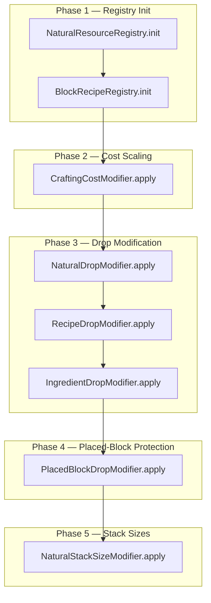
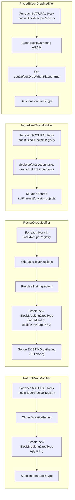
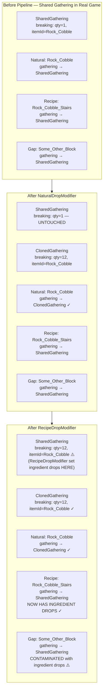
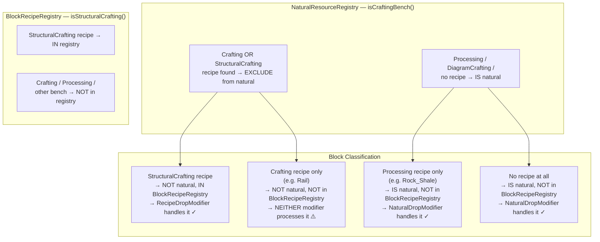
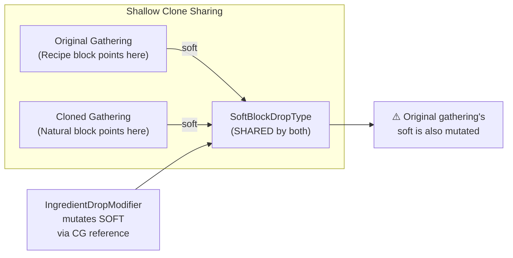
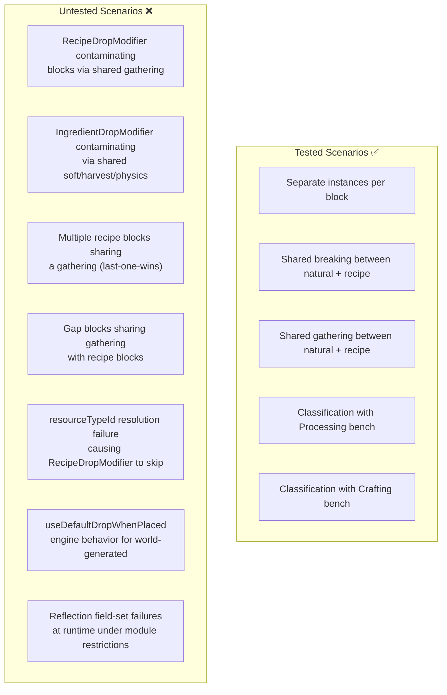

# Shared-Instance Pipeline Diagnostic Report

## Reported Symptoms (In-Game)

| Block Type | Expected Behavior | Actual Behavior |
|------------|-------------------|-----------------|
| **Natural blocks** (Rock, Log, etc.) | Drop 12× their resource when world-generated | Dropping **1×** their loot table |
| **Recipe blocks** (Stairs, Walls, etc.) | Drop crafting ingredient at scaled qty | Dropping **12× of themselves** |

The tests (220/220 passing) do not reproduce these failures.

---

## What Changed (Uncommitted vs Commit `abbafc36`)

| File | Change Summary |
|------|---------------|
| `NaturalResourceRegistry` | Added `isCraftingBench()` filter — Processing recipes no longer disqualify blocks from being natural. Switched `hasBlockType()` → `getBlockId()` for recipe output detection. |
| `BlockRecipeRegistry` | Switched `hasBlockType()` → `getBlockId()` so items like Rail (blockId set, hasBlockType=false) are now detected. |
| `NaturalDropModifier` | **Clone-before-mutate**: creates private `BlockGathering` + `BlockBreakingDropType` per natural block instead of mutating the shared instance in-place. |
| `PlacedBlockDropModifier` | **New modifier**: clones gathering again and sets `useDefaultDropWhenPlaced=true` on natural blocks so player-placed copies drop 1× of themselves. |
| `UnobstructedThirdPersonPlugin` | Added `PlacedBlockDropModifier.apply()` to the pipeline after `IngredientDropModifier`. |

---

## Pipeline Architecture

### Execution Order



### Modifier Responsibilities



---

## Root Cause Analysis

### Problem 1 — Asymmetric Cloning (RecipeDropModifier Still Mutates In-Place)

`NaturalDropModifier` was fixed to clone-before-mutate, but **`RecipeDropModifier` still mutates the gathering in-place** via `breakingField.set(gathering, newBreaking)`. When recipe blocks share a `BlockGathering` instance with other blocks (common due to Hytale's JSON asset inheritance), RecipeDropModifier's mutation propagates to all sharing blocks.



**Impact**: Any block that shares a gathering with a recipe block — but is not itself a recipe block or natural block — inherits the recipe block's ingredient drops.

### Problem 2 — Classification Gap Creates Unprotected Blocks

`NaturalResourceRegistry` and `BlockRecipeRegistry` use different bench-type filters, creating blocks that **neither modifier processes**:



Blocks in the **Crafting-only gap** (like Rail) keep their original breaking config. This is *intentionally* correct for Rail (should drop 1× of itself). But if a gap block shares a gathering with a recipe block, RecipeDropModifier's in-place mutation contaminates it.

### Problem 3 — `PlacedBlockDropModifier` Double-Clone

`PlacedBlockDropModifier` clones the gathering a **second time** for every natural block, even though `NaturalDropModifier` already created a private gathering. This is wasteful but not directly harmful — the shallow clone preserves the 12× breaking from the first clone.

However, the double-clone reveals a design issue: each modifier independently creates private gatherings without awareness of prior cloning. If a future modifier between them mutated the clone in a way that the second clone needed to preserve, the shallow copy would work. But this fragile coupling is error-prone.

### Problem 4 — `IngredientDropModifier` Mutates Shared Sub-Objects

`NaturalDropModifier.cloneGathering()` performs a **shallow clone** — it copies field references, not deep copies. The cloned gathering shares the same `SoftBlockDropType`, `HarvestingDropType`, and `PhysicsDropType` objects as the original.

When `IngredientDropModifier` mutates these sub-objects on a natural block's cloned gathering, the mutations propagate to the **original gathering** (and all other blocks sharing it):



---

## Why Tests Pass But the Game Fails

### Test Design vs Real-Game Reality

| Aspect | Tests | Real Game |
|--------|-------|-----------|
| **Instance sharing** | Each BlockType has its **own** `BlockGathering` and `BlockBreakingDropType` | Child BlockTypes **share** parent's Java object instances via asset inheritance |
| **RecipeDropModifier mutation** | Only the recipe block's own gathering is affected | Mutation propagates to ALL blocks sharing that gathering |
| **IngredientDropModifier mutation** | Only the natural block's own soft/harvest/physics is affected | Mutation propagates to ALL blocks sharing those sub-objects |
| **Classification** | Test creates exact blocks with known recipes | Real game has hundreds of blocks with complex recipe/bench-type relationships |
| **resourceTypeId resolution** | Tests use `materialQty()` (direct itemId) | Real recipes often use `materialQtyResource()` (resourceTypeId) which requires `BlockGroup` lookup — may silently fail |

### The SharedInstanceDropBugTest Gap

The `SharedInstanceDropBugTest` tests shared instances between:
- ✅ Natural block + recipe block sharing a `BlockBreakingDropType`
- ✅ Natural block + recipe block sharing a `BlockGathering`

But it does **NOT** test:
- ❌ RecipeDropModifier contaminating other blocks through a shared gathering
- ❌ IngredientDropModifier contaminating non-natural blocks through shared soft/harvest/physics
- ❌ Multiple recipe blocks sharing a gathering (last-one-wins on ingredient drops)
- ❌ "Gap" blocks (Crafting-bench only) sharing a gathering with recipe blocks
- ❌ `resourceTypeId`-based recipe inputs failing to resolve (causing RecipeDropModifier to skip)

---

## Scenario Trace — How the Reversal Happens

### Why Natural Blocks Drop 1× (Instead of 12×)

**Most likely cause: `useDefaultDropWhenPlaced` semantics differ from expectation.**

Our understanding of the flag:
- Player-placed block (deco) → drops 1× of blockType.getItem()
- World-generated block (not deco) → uses the 12× modified breaking config

**If the engine instead interprets the flag as:**
- `useDefaultDropWhenPlaced=true` → *always* use default drop behavior (qty=1) regardless of deco status
- Or: the flag triggers a code path that ignores the modified breaking config entirely

Then ALL natural blocks (both world-generated and player-placed) would drop 1× after `PlacedBlockDropModifier` sets the flag. This exactly matches the reported symptom.

**Alternative cause: `gatheringField.set(bt, newGathering)` fails at runtime.**

If Java module access restrictions prevent setting the `gathering` field on `BlockType` at runtime (but not in tests, which add `--add-opens` JVM args), then:
- `NaturalDropModifier` creates the clone and 12× breaking ✓
- `gatheringField.set(bt, newGathering)` throws → caught silently ⚠️
- The natural block keeps its **original** gathering (qty=1)
- `PlacedBlockDropModifier` also fails to set → original gathering stays at qty=1

### Why Recipe Blocks Drop 12× of Themselves (Instead of Ingredients)

**Most likely cause: `RecipeDropModifier` fails to resolve recipe inputs.**

Many real-game recipes use `resourceTypeId` (e.g., `"Rock_Shale"`) instead of direct `itemId`. Resolution requires `BlockGroup` lookup via `AssetRegistry.getAssetStore(BlockGroup.class)`. If this fails:

```java
if (resolvedItemId == null) {
    log("SKIP " + blockTypeId + " (" + recipe.getId() + "): could not resolve any input");
    skipped++;
    continue;
}
```

RecipeDropModifier **skips** the block. The block keeps its original breaking.

In the **committed code** (before clone fix), `NaturalDropModifier` mutated the shared breaking instance to qty=12. This mutation leaked to recipe blocks sharing the same instance. So recipe blocks coincidentally got qty=12 of their own itemId — not the ingredient, but at least a 12× drop.

In the **current code** (with clone fix), `NaturalDropModifier` no longer contaminates shared instances. Recipe blocks that `RecipeDropModifier` skips now keep the **original** qty=1 breaking. But if the old shared-instance mutation was the *only* source of their 12× drops, losing it would make them drop 1× — not 12×.

**To get 12×**: there must be another contamination path. If any block sharing the same original gathering gets its breaking quantity mutated to 12 (e.g., a natural block that NaturalDropModifier failed to clone away from), the recipe block inherits that mutation.

---

## Missing Test Coverage



---

## Recommended Next Steps

### 1. Check Server Logs
Look for these log messages after asset loading:
- `[NaturalDropMod] ERROR cloning gathering for ...` — confirms reflection failure
- `[RecipeDropMod] SKIP ... could not resolve any input` — confirms input resolution failure
- Compare `modified` and `skipped` counts with expectations

### 2. Verify `useDefaultDropWhenPlaced` Behavior
Before the clone-before-mutate fix, temporarily **disable `PlacedBlockDropModifier`** (comment out the call in the plugin) and test:
- If natural blocks drop 12× again → the flag is the cause
- If they still drop 1× → the clone/reflection is the cause

### 3. Add `RecipeDropModifier` Cloning
Apply the same clone-before-mutate pattern to `RecipeDropModifier`:

```java
// Current (mutates shared gathering):
breakingField.set(gathering, newBreaking);

// Fixed (clone first):
BlockGathering newGathering = NaturalDropModifier.cloneGathering(gathering);
breakingField.set(newGathering, newBreaking);
gatheringField.set(bt, newGathering);
```

### 4. Add Missing Shared-Instance Tests
- RecipeDropModifier + shared gathering contamination
- IngredientDropModifier + shared soft/harvest/physics contamination
- Gap blocks (Crafting-bench only) sharing with recipe blocks
- resourceTypeId resolution failure scenarios

### 5. Consider Centralizing the Clone Strategy
Instead of each modifier independently cloning, do a single "privatize" pass before all modifiers run. This ensures every block that will be modified by ANY modifier gets its own gathering instance upfront.
