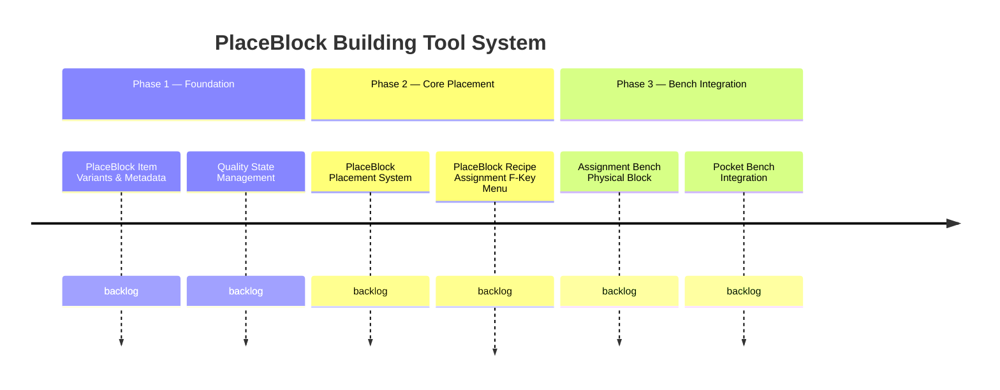

# PlaceBlock Building Tool System

## Goal
Give players a reusable building tool that can be armed with any bench recipe and used to place that recipe's output block repeatedly — consuming inventory resources per placement instead of requiring repeated bench visits. Visual feedback (blue/green/red highlight) communicates tool state at a glance.

## Success Criteria
- [ ] Player can arm a PlaceBlock with any block-output recipe from Builders or Furniture benches
- [ ] Player can right-click to place the armed recipe's output, consuming scaled recipe inputs from inventory
- [ ] PlaceBlock highlight changes to green (resources OK) or red (resources missing) after each state change
- [ ] PlaceBlock is never consumed — only inventory resources are spent
- [ ] Blocks placed via PlaceBlock are indistinguishable from bench-crafted blocks
- [ ] Recipe assignment works via F-key menu, Assignment Bench, and optionally the Pocket Bench

## Features
| ID | Title | Status |
|----|-------|--------|
| F2604201405 | PlaceBlock Item Variants & Metadata | backlog |
| F2604201410 | PlaceBlock Placement System | backlog |
| F2604201415 | PlaceBlock Recipe Assignment (F-Key Menu) | backlog |
| F2604201420 | Assignment Bench (Physical Block) | backlog |
| F2604201425 | Quality State Management | backlog |
| F2604201430 | Pocket Bench Integration | backlog |

## Context
This system extends the Resource Economy by compressing the "craft then place" workflow into a single action. The design doc is at `docs/Plans/design-placeblock-system.md`. The behavioral contracts are at `docs/product/contracts/building-tools.md`.

## Roadmap

