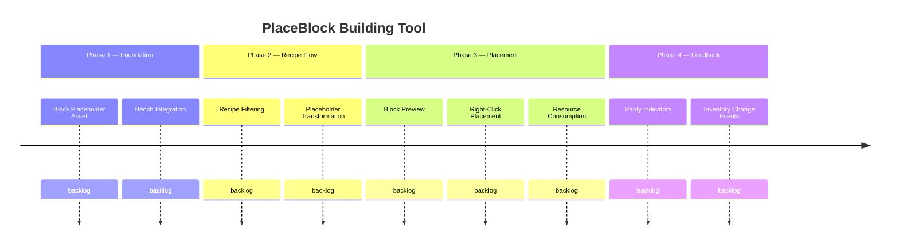

# PlaceBlock Building Tool

## Goal
Give players a select-then-build workflow at the Builders Bench. Instead of crafting blocks into inventory and then placing them, the player selects a recipe, arms a placeholder tool, previews placement in-world, and places the block directly — consuming resources only at placement time from inventory and nearby chests.

## Success Criteria
- [ ] Player can place a Block_Placeholder into the Builders Bench and browse filtered recipes
- [ ] Selecting a recipe transforms the placeholder visually without consuming resources (Contract #10)
- [ ] Armed placeholder integrates with the engine's block preview system for placement preview
- [ ] Right-clicking a valid location atomically consumes scaled recipe inputs and places the block (Contract #11)
- [ ] PlaceBlock tool and PlacementCostScaler never both fire on the same PlaceBlockEvent (Contract #12)
- [ ] Rarity indicators reflect real-time resource availability (Contract #13)
- [ ] Placed blocks are indistinguishable from normally-crafted blocks (Contract #14)

## Features
| ID | Title | Status |
|----|-------|--------|
| F2604221035 | Block Placeholder Asset & Bench Integration | backlog |
| F2604221040 | Recipe Selection & Placeholder Transformation | backlog |
| F2604221045 | Block Preview & Placement | backlog |
| F2604221050 | Rarity-Based Availability Indicators | backlog |
| F2604221055 | Resource Consumption & Chest Scanning | backlog |

## Context
This system extends the 12× resource economy's "Build" phase (Phase 3 in the vision). The existing portable bench handles the "craft anywhere" use case; this tool handles the "build directly" use case. The `placeblock` package is stubbed with interaction codecs (`PlaceBlock_Menu`, `Assign_Bench`) but has no implementation yet.

Key integration points:
- `PlacementCostScaler` — mutual exclusion required (Contract #12)
- `PreviewBlockManager` — existing ghost block system to leverage
- `PortableBenchWindow` / `PortableStructuralWindow` — similar inventory scanning and recipe filtering patterns
- Existing placeholder block assets in `Server/Item/Items/_Debug/Placeholders/`
- Bench radius concept from `PortableStructuralWindow` (currently `chestHorizontalRadius: 0`)

## Roadmap

