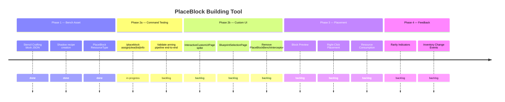

# PlaceBlock Building Tool

## Goal
Give players a select-then-build workflow at a dedicated **Stencil Crafting** — a new workbench block placed in the world. The player interacts with this bench while holding a `Block_Placeholder` tool, browses available recipes (from both Builders and Furniture categories), selects a recipe to arm the tool, and then places blocks directly in the world — consuming resources only at placement time from inventory and nearby chests.

## Key Clarifications
- The **Portable Bench** system is NOT involved. It is a separate, incompatible workflow.
- The existing **Builders Bench** is NOT modified. The Stencil Crafting is a new, separate block.
- The **Stencil Crafting** aggregates placeable recipes from ALL registered benches (Contract #16).

## Success Criteria
- [ ] Stencil Crafting block asset exists, can be placed in the world, and opens a crafting window (Contract #15)
- [ ] Stencil Crafting aggregates recipes from Builders AND Furniture benches (Contract #16)
- [ ] Player can put a Block_Placeholder in the Stencil Crafting input and browse filtered recipes
- [ ] Selecting a recipe arms the placeholder without consuming resources (Contract #10)
- [ ] Armed placeholder integrates with the engine's block preview system for placement preview
- [ ] Right-clicking a valid location atomically consumes scaled recipe inputs and places the block (Contract #11)
- [ ] PlaceBlock tool and PlacementCostScaler never both fire on the same PlaceBlockEvent (Contract #12)
- [ ] Rarity indicators reflect real-time resource availability (Contract #13)
- [ ] Placed blocks are indistinguishable from normally-crafted blocks (Contract #14)

## Features
| ID | Title | Status |
|----|-------|--------|
| F2604221035 | Stencil Crafting Block Asset | backlog |
| F2604221040 | Recipe Selection & Placeholder Transformation | backlog |
| F2604221045 | Block Preview & Placement | backlog |
| F2604221050 | Rarity-Based Availability Indicators | backlog |
| F2604221055 | Resource Consumption & Chest Scanning | backlog |

## Context
This system extends the 12× resource economy's "Build" phase (Phase 3 in the vision). Three benches serve distinct roles:

| Bench | Intent | Output |
|-------|--------|--------|
| **Builders Bench** | "I need items" | Crafted item → inventory |
| **Portable Bench** | "I need items, but I'm away from a bench" | Same, but mobile |
| **Stencil Crafting** | "I want to build directly in the world" | Armed placeholder → deferred placement |

Key integration points:
- `PlacementCostScaler` — mutual exclusion required (Contract #12)
- `PreviewBlockManager` — existing ghost block system to leverage
- `CraftRecipeEvent.Pre` — intercept crafting when placeholder is in the input slot
- `CraftingManager.getContainersAroundBench()` — automatic nearby chest scanning via KDTree spatial index
- Runtime `BenchRequirement` mutation — add entries so Builders/Furniture recipes appear at the Stencil Crafting

Key technical findings:
- Bench creation is **data-driven** — a new JSON with a unique `Bench.Id` auto-registers with the engine
- `BlockEntity.Components.BenchBlock: {}` enables automatic chest scanning
- Builders recipes use `BenchType: "StructuralCrafting"`, Furniture uses `BenchType: "Crafting"` — combining requires runtime `BenchRequirement` mutation
- `CraftRecipeEvent.Pre` can cancel crafting to intercept the placeholder flow

## Roadmap

