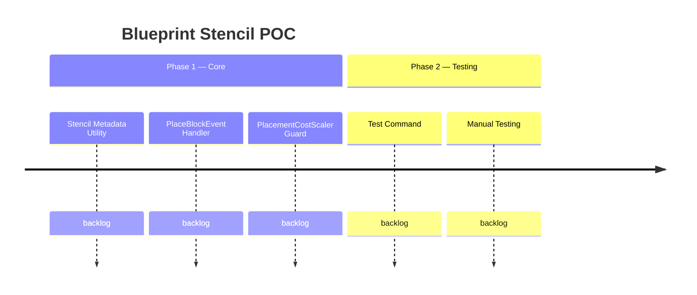

# Blueprint Stencil POC

## Goal
Prove that a player can hold an actual block item (tagged with BSON metadata), right-click to place it, and have the server intercept the placement to consume recipe resources instead of the held item — eliminating the need for the 9-variant placeholder system, UpdateBlockTypes reskin packets, and custom interaction codecs.

## Success Criteria
- [ ] Player holds a BSON-tagged block item (stack of 1) and can place the block into the world without the stack being consumed
- [ ] Resources are consumed atomically from the player's inventory at placement time, prioritizing non-active-slot stacks
- [ ] If the player cannot afford the placement, a toast message appears and no block is placed
- [ ] PlacementCostScaler does not double-charge blueprint-tagged items
- [ ] Native client block preview works automatically (no UpdateBlockTypes packets needed)
- [ ] System coexists with the current placeholder system without interference

## Features
| ID | Title | Status |
|----|-------|--------|
| F2604301410 | Blueprint Stencil Placement Interception | backlog |
| F2604301420 | PlacementCostScaler Blueprint Guard | backlog |
| F2604301430 | Stencil Test Command | backlog |

## Context
The current PlaceBlock Building Tool uses a persistent `Block_Placeholder` item with 9 green state variants (one per hotbar slot) and per-player `UpdateBlockTypes` reskin packets to show block previews. This is complex and fragile.

The Blueprint Stencil approach replaces this with actual block items tagged with BSON metadata. The engine's native block preview handles visuals automatically. A `PlaceBlockEvent` handler intercepts placement, cancels the native behavior (preventing item consumption), then manually places the block and consumes resources.

### Key Engine Facts (Confirmed)
- `PlaceBlockEvent` cancellation prevents BOTH block placement AND item consumption
- `WorldChunk.setBlock()` / `placeBlock()` do NOT fire `PlaceBlockEvent` (no recursion)
- BSON metadata on ItemStacks prevents stack merging with untagged items
- Native block preview works automatically for any held block item
- No placement rate limiting exists in the engine

### Risks
- No visual affordability indicator (Green/Red) — toast messages only for POC
- Stencil items are visually indistinguishable from normal blocks in inventory
- ECS event handler ordering is not guaranteed — PlacementCostScaler guard must be metadata-based, not order-dependent

## Graduation Gates
If the POC succeeds, these must be resolved before the stencil approach can replace the placeholder system:

1. **Visual Identity** — Stencil items must be visually distinguishable from normal blocks (custom name, tooltip, item model, or glow). Stack-of-1 with no visual cue will feel like a bug.
2. **Single-Approach Decision** — One approach is chosen (placeholder OR stencil) and the other is retired. Both cannot ship.
3. **Affordability Indicator** — A real-time affordability signal must replace the Green/Red/Blue rarity system (HUD overlay, item glow, sound, or equivalent). Toast-after-failure is not sufficient for production.

## Roadmap

