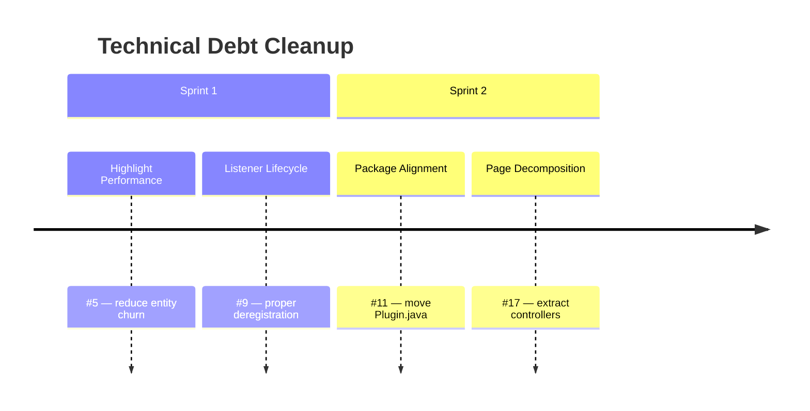

# Technical Debt Cleanup

## Goal
Address remaining code quality findings from the comprehensive code review — improving server performance, resource hygiene, code organization, and maintainability without changing any player-visible behavior.

## Success Criteria
- [ ] Stencil Book highlight no longer flickers and reduces entity churn by 80%+
- [ ] Inventory change listeners are properly deregistered on player disconnect
- [ ] Plugin entry point follows project package conventions
- [ ] StencilSelectionPage is decomposed into focused controllers (< 800 lines)

## Features
| ID | Title | Status |
|----|-------|--------|
| F2605181405 | Stencil Book Highlight Performance | backlog |
| F2605181410 | Inventory Listener Lifecycle Fix | backlog |
| F2605181415 | Plugin Package Alignment | backlog |
| F2605181420 | Stencil Crafting Page Decomposition | backlog |
| F2605261200 | Decompile Update API Compatibility | backlog |

## Context
These items were identified in the full codebase review (docs/review-full-codebase.md, findings #5, #9, #11, #17) and initially deferred due to risk or scope. Feasibility research (docs/hytale/research-particle-highlight-and-container-events.md) and architecture assessment (docs/review-refactor-blast-radius.md) have confirmed all 4 are viable. Design doc at docs/design-deferred-fixes.md.

## Priority Guidance (from Product Owner)
- **This sprint:** #5 (performance — player-facing improvement) and #9 (stability)
- **Next sprint:** #11 (trivial risk, zero player impact) and #17 (needs full pipeline verification)

## Roadmap

