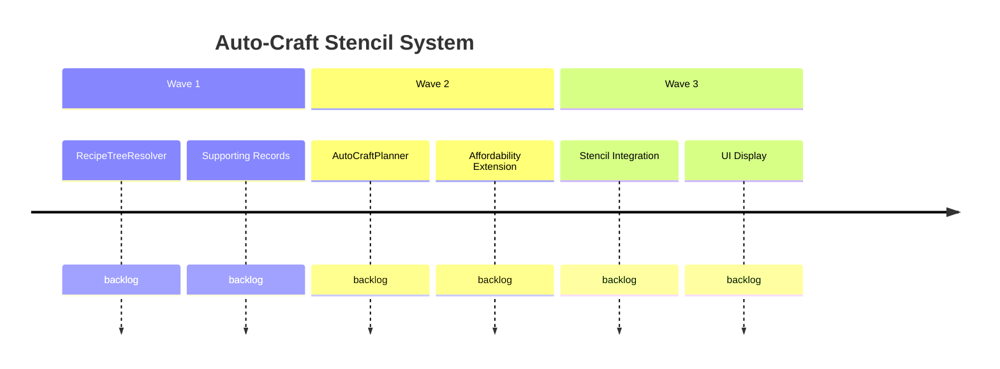

# Auto-Craft Stencil System

## Goal
When a player uses the stencil PlaceBlock tool to place a crafted block, the system automatically resolves any missing intermediate ingredients to raw materials and consumes those raw materials directly — eliminating the need to interrupt building to visit a crafting bench. The closed-loop economy is preserved: break returns intermediates per Contract #4.

## Success Criteria
- [ ] Player can place brick stairs via stencil using cobblestone when they have no bricks
- [ ] Existing intermediates are preferred — auto-craft only resolves the deficit
- [ ] Break-return behavior is unchanged (Contract #4 — intermediates, not raw materials)
- [ ] Radial menu and blueprint bench show raw material cost breakdown
- [ ] All existing tests pass; new tests cover auto-craft paths
- [ ] Performance: affordability check completes in <1ms (pre-computed cache)

## Features
| ID | Title | Status |
|----|-------|--------|
| F2605191105 | Recipe Tree Resolution | backlog |
| F2605191110 | Auto-Craft Consumption Planning | backlog |
| F2605191115 | Stencil Integration | backlog |
| F2605191120 | UI Raw Cost Display | backlog |

## Context
The stencil PlaceBlock tool currently requires the player to have pre-crafted intermediate ingredients. With the 12× economy, multi-tier recipes (stairs → bricks → cobblestone) force players to interrupt building workflows to visit crafting benches. Auto-craft eliminates this friction by resolving intermediates to raw materials at placement time.

This builds on the leaf-only scaling system (Feature F2605191000) which already classifies items as raw vs crafted via `RecipeTierClassifier`.

Design: [design-auto-craft-stencil.md](../../design-auto-craft-stencil.md)
Vision contracts: #15–#18

## Roadmap

