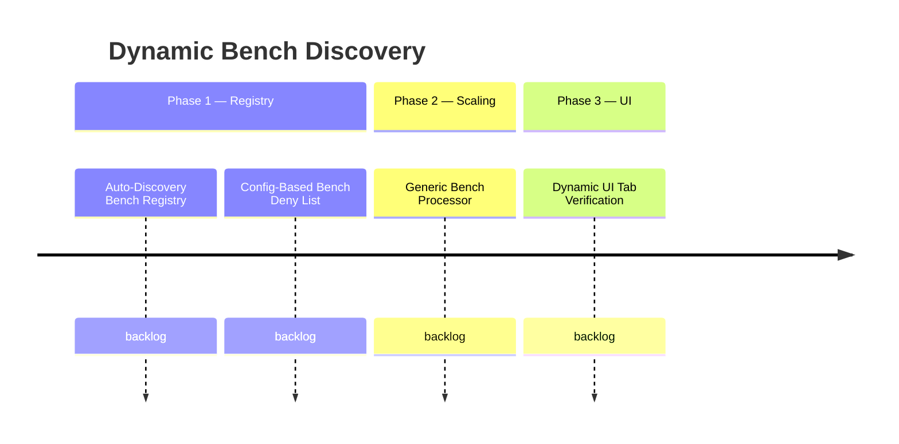

# Dynamic Bench Discovery System

## Goal
Allow the plugin to automatically discover and support all crafting benches in the game by scanning recipe assets at load time, instead of hardcoding support for only Builders and Furniture. Players will see tabs, recipes, and drop scaling for any bench that has crafting recipes — without requiring code changes for each new bench type.

## Success Criteria
- [ ] All bench IDs are discovered from CraftingRecipe assets at runtime — no hardcoded bench strings
- [ ] A config-based deny list allows excluding specific benches (e.g., Processing)
- [ ] Drop scaling applies to all discovered benches using a generic processor (preferNatural defaults to false)
- [ ] Builders and Furniture retain their existing preferNatural behavior (Furniture=true, Builders=false)
- [ ] UI tabs are generated dynamically for every discovered bench
- [ ] Adding a new bench to the game requires zero plugin code changes (unless it needs custom scaling behavior)

## Features
| ID | Title | Status |
|----|-------|--------|
| F2605291005 | Auto-Discovery Bench Registry | backlog |
| F2605291010 | Generic Bench Processor | backlog |
| F2605291015 | Config-Based Bench Deny List | backlog |
| F2605291020 | Dynamic UI Tab Verification | backlog |

## Product Decisions
- **Registration model**: Opt-out (deny list). All discovered benches auto-included unless explicitly denied.
- **preferNatural default**: `false` for unknown benches. Furniture_Bench retains `true` as a hardcoded override.
- **UI tab policy**: Only benches whose recipes output placeable blocks get a UI tab.

## Context
Currently `BenchCategory` is a Java enum with three hardcoded constants: `BUILDERS_ONLY`, `FURNITURE_ONLY`, `BUILDERS_AND_FURNITURE`. Each has a dedicated processor class. `RecipeFilterRegistry` only indexes recipes whose bench requirements match `BenchCategory.allBenchIds()`, discarding all others. This means benches like Workbench, Fieldcraft, etc. are invisible to the plugin.

The existing story S2604271740 (Unify Bench ID Definitions) is a subset of this work — it unified the source of truth but kept it hardcoded. This epic supersedes it with full runtime discovery.

**Critical coupling**: `NaturalResourceRegistry.CRAFTING_BENCH_IDS` is a separate hardcoded set that must be unified with the dynamic registry.

## Roadmap

