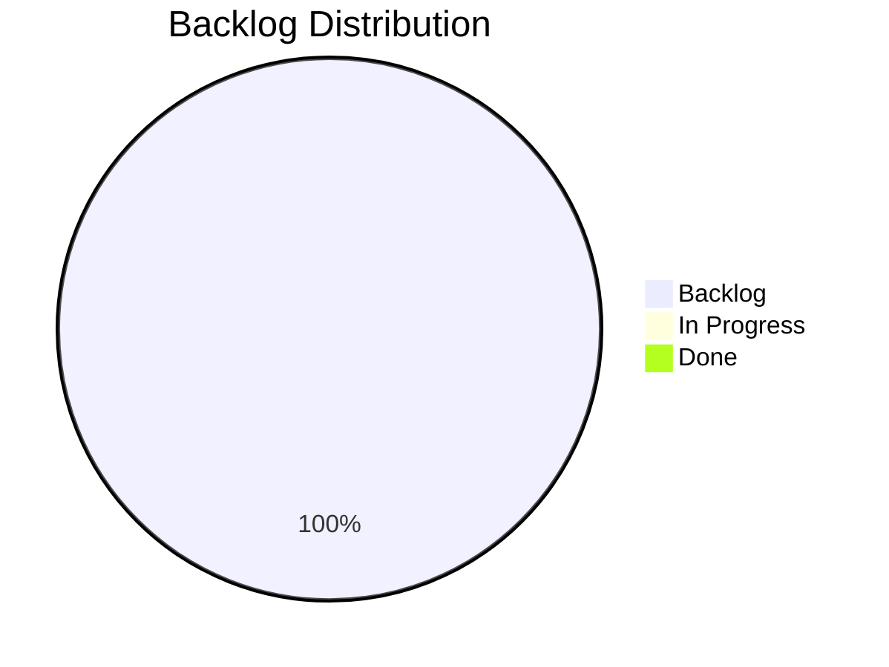

# Product Board

> Last updated: 2026-04-22 12:30

## Status Overview

## Board

### In Progress
| ID | Type | Title | Epic | Priority |
|----|------|-------|------|----------|
| — | — | — | — | — |

### Backlog
| ID | Type | Title | Epic | Priority |
|----|------|-------|------|----------|
| E2604221030 | Epic | PlaceBlock Building Tool | — | high |
| F2604221035 | Feature | Blueprint Bench Block Asset | E2604221030 | high |
| F2604221040 | Feature | Recipe Selection & Placeholder Transformation | E2604221030 | high |
| F2604221045 | Feature | Block Preview & Placement | E2604221030 | high |
| F2604221050 | Feature | Rarity-Based Availability Indicators | E2604221030 | high |
| F2604221055 | Feature | Resource Consumption & Chest Scanning | E2604221030 | high |
| S2604221100 | Story | Create Block_Placeholder Item Assets | E2604221030 | high |
| S2604221105 | Story | Create Blueprint Bench Block Asset | E2604221030 | high |
| S2604221210 | Story | Runtime BenchRequirement Mutation for Recipe Aggregation | E2604221030 | high |
| S2604221215 | Story | CraftRecipeEvent Interceptor for Placeholder | E2604221030 | high |
| S2604221110 | Story | Inventory & Chest Resource Scanner | E2604221030 | high |
| S2604221120 | Story | Placeholder Arming via Metadata | E2604221030 | high |
| S2604221125 | Story | Block Preview Integration with Armed Placeholder | E2604221030 | high |
| S2604221130 | Story | Right-Click Placement Handler | E2604221030 | high |
| S2604221135 | Story | Atomic Resource Consumption from Inventory & Chests | E2604221030 | high |
| S2604221140 | Story | PlacementCostScaler Mutual Exclusion | E2604221030 | high |
| S2604221145 | Story | Quality State Machine for Placeholder | E2604221030 | high |
| S2604221150 | Story | Inventory Change Event Listener for Rarity Updates | E2604221030 | high |
| S2604221155 | Story | Nearby Chest Discovery by Radius | E2604221030 | high |
| S2604221200 | Story | Aggregate Resource Availability Check | E2604221030 | high |
| S2604221205 | Story | Atomic Multi-Source Resource Consumption | E2604221030 | high |

### Done
| ID | Type | Title | Epic | Priority |
|----|------|-------|------|----------|
| — | — | — | — | — |

## Epics

### E2604221030 — PlaceBlock Building Tool
**Status:** backlog (REALIGNED) | **Priority:** high

Select-then-build workflow at the **Blueprint Bench** — a new dedicated workbench block placed in the world. Player arms a placeholder tool with a recipe, previews placement, and right-clicks to place — consuming resources at placement time from inventory/nearby chests.

**KEY CORRECTION:** The Portable Bench system is NOT involved. A new Blueprint Bench block is the interaction point.

**Three Benches:**
| Bench | Intent | Output |
|-------|--------|--------|
| Builders Bench | "I need items" | Crafted item → inventory |
| Portable Bench | "I need items, away from bench" | Same, but mobile |
| **Blueprint Bench** | "I want to build in the world" | Armed placeholder → deferred placement |

**Phases:**
1. **Bench Asset** — Blueprint Bench block JSON + recipe aggregation via BenchRequirement mutation + Block_Placeholder assets
2. **Recipe Interception** — CraftRecipeEvent interceptor + placeholder arming via metadata + quality swap
3. **Placement** — Block preview + right-click handler + atomic resource consumption + PlacementCostScaler exclusion
4. **Feedback** — Rarity indicators + inventory change events

**Contracts:** #10–#14 (unchanged), #15 (Blueprint Bench is separate block), #16 (aggregates all placeable recipes)

**Risk Investigation:**
- R1 (metadata persistence) ✅ confirmed
- R2 (icon transformation) ❌ denied — using 3-variant item swap
- R3 (block type override) ✅ confirmed — cancel event + manual placeBlock
- R9 (placeholder may not match recipes) ⚠️ investigate in Phase 1
- R10 (CraftRecipeEvent.Pre cancellation clean?) ⚠️ investigate in Phase 2
- R11 (return placeholder after interception) ⚠️ investigate in Phase 2

**Docs:**
- [design-placeblock-building-tool.md](docs/Plans/design-placeblock-building-tool.md) — Updated system design
- [custom-bench-creation.md](docs/hytale/crafting/custom-bench-creation.md) — Hytale Expert research
- [placeblock-risk-investigation.md](docs/hytale/items/placeblock-risk-investigation.md) — Risk investigation results

### E2604201200 — Resource Economy Scaling System
**Status:** backlog (empty) | **Priority:** —

### E2604201400 — PlaceBlock Building Tool System
**Status:** backlog (empty, superseded by E2604221030) | **Priority:** —
