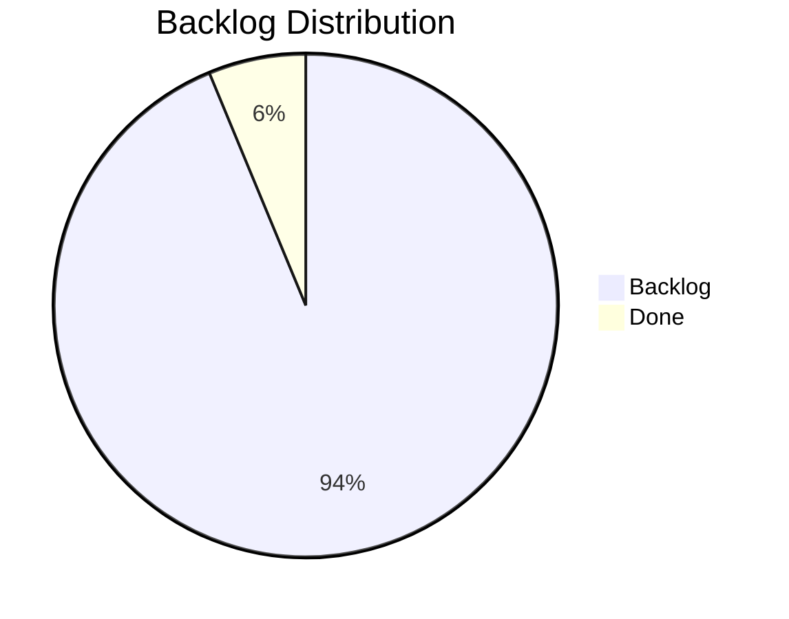

# Product Board

> Last updated: 2026-04-20 14:30

## Status Overview

## Epics

| ID | Title | Status | Features | Stories |
|----|-------|--------|----------|---------|
| E2604201200 | Resource Economy Scaling System | done | 5 done | — |
| E2604201400 | PlaceBlock Building Tool System | backlog | 6 backlog | 15 backlog |

---

## Board

### In Progress
_None_

### Backlog — PlaceBlock Building Tool System (E2604201400)

#### Phase 1 — Foundation (high priority)
| ID | Type | Title | Feature | Priority |
|----|------|-------|---------|----------|
| S2604201440 | story | Create PlaceBlock Item JSON Assets | F2604201405 | high |
| S2604201445 | story | Implement PlaceBlockConstants | F2604201405 | high |
| S2604201450 | story | Implement PlaceBlockMetadata | F2604201405 | high |
| S2604201500 | story | Implement PlaceBlockQualitySwapper | F2604201425 | high |
| S2604201505 | story | Implement PlaceBlockInventoryMonitor | F2604201425 | high |

#### Phase 2 — Core Placement (high priority)
| ID | Type | Title | Feature | Priority |
|----|------|-------|---------|----------|
| S2604201455 | story | Implement PlaceBlockPlacementSystem | F2604201410 | high |
| S2604201460 | story | Verify Placement Rotation Handling | F2604201410 | medium |
| S2604201465 | story | Implement PlaceBlockMenuInteraction | F2604201415 | high |
| S2604201470 | story | Implement PlaceBlockSelectorWindow | F2604201415 | high |
| S2604201475 | story | Create PlaceBlock Interaction JSON Assets | F2604201415 | high |

#### Phase 3 — Bench Integration (medium/low priority)
| ID | Type | Title | Feature | Priority |
|----|------|-------|---------|----------|
| S2604201480 | story | Create Assignment Bench Block JSON Asset | F2604201420 | medium |
| S2604201485 | story | Implement AssignBenchInteraction | F2604201420 | medium |
| S2604201490 | story | Implement AssignBenchWindow | F2604201420 | medium |
| S2604201495 | story | Add Bench_Assignment Config Entry | F2604201420 | medium |
| S2604201510 | story | Add PlaceBlock Detection to PortableBenchInteraction | F2604201430 | low |

### Done
| ID | Type | Title | Epic | Priority |
|----|------|-------|------|----------|
| E2604201200 | epic | Resource Economy Scaling System | — | critical |

---

## Document Index

### Product Vision
| Document | Area | Updated |
|----------|------|---------|
| [docs/product/vision.md](product/vision.md) | Resource Economy | 2026-04-18 |
| [docs/product/vision-building-tools.md](product/vision-building-tools.md) | Building Tools | 2026-04-20 |

### Behavioral Contracts
| Document | Area |
|----------|------|
| [docs/product/contracts/block-breaking.md](product/contracts/block-breaking.md) | Resource Economy |
| [docs/product/contracts/crafting-costs.md](product/contracts/crafting-costs.md) | Resource Economy |
| [docs/product/contracts/economy-commands.md](product/contracts/economy-commands.md) | Resource Economy |
| [docs/product/contracts/economy-persistence.md](product/contracts/economy-persistence.md) | Resource Economy |
| [docs/product/contracts/building-tools.md](product/contracts/building-tools.md) | Building Tools |

### Design Documents
| Document | Area | Status |
|----------|------|--------|
| [docs/Plans/design-placeblock-system.md](Plans/design-placeblock-system.md) | Building Tools | Active |
| [docs/Plans/design-portable-bench-tool.md](Plans/design-portable-bench-tool.md) | Building Tools | Done |
| [docs/Plans/design-bench-category-processors.md](Plans/design-bench-category-processors.md) | Resource Economy | Done |
| [docs/Plans/design-deco-aware-natural-registry.md](Plans/design-deco-aware-natural-registry.md) | Resource Economy | Done |

### Reviews
| Document | Area | Status |
|----------|------|--------|
| [docs/review-non-block-recipe-gap.md](review-non-block-recipe-gap.md) | Resource Economy | Done |
| [docs/review-parallel-bench-processors.md](review-parallel-bench-processors.md) | Resource Economy | Done |
| [docs/review-resourcetypeid-resolution.md](review-resourcetypeid-resolution.md) | Resource Economy | Done |

### Engine Reference
| Document | Category |
|----------|----------|
| [docs/hytale/blocks/block-interactions.md](hytale/blocks/block-interactions.md) | Blocks / Interactions |
| [docs/hytale/README.md](hytale/README.md) | Index |
