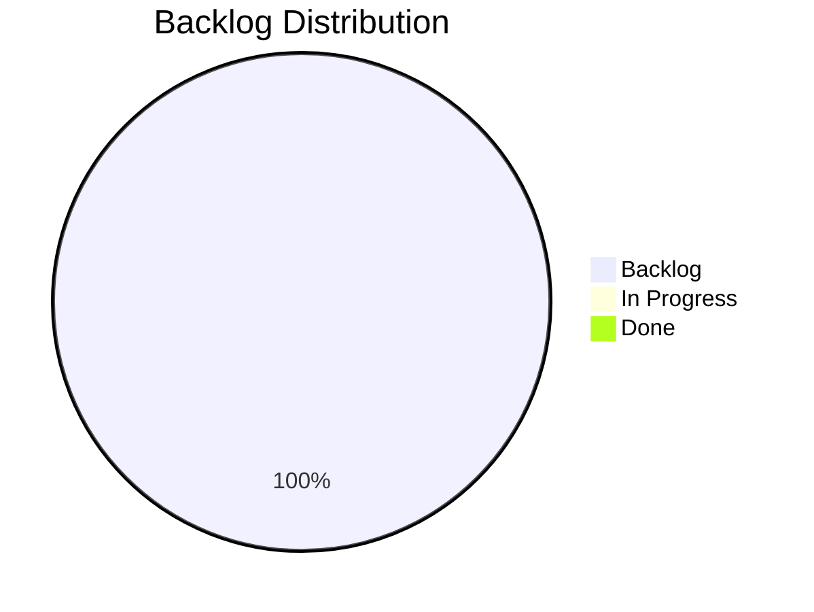

# Product Board

> Last updated: 2026-04-22 10:30

## Status Overview

## Board

### In Progress
| ID | Type | Title | Epic | Priority |
|----|------|-------|------|----------|
| — | — | — | — | — |

### Backlog
| ID | Type | Title | Epic | Priority |
|----|------|-------|------|----------|
| E2604221030 | Epic | PlaceBlock Building Tool | — | high |
| F2604221035 | Feature | Block Placeholder Asset & Bench Integration | E2604221030 | high |
| F2604221040 | Feature | Recipe Selection & Placeholder Transformation | E2604221030 | high |
| F2604221045 | Feature | Block Preview & Placement | E2604221030 | high |
| F2604221050 | Feature | Rarity-Based Availability Indicators | E2604221030 | high |
| F2604221055 | Feature | Resource Consumption & Chest Scanning | E2604221030 | high |
| S2604221100 | Story | Create Block_Placeholder Item Asset | E2604221030 | high |
| S2604221105 | Story | Register PlaceBlock Bench Interaction | E2604221030 | high |
| S2604221110 | Story | Inventory & Chest Resource Scanner | E2604221030 | high |
| S2604221115 | Story | Recipe Filtering by Available Resources | E2604221030 | high |
| S2604221120 | Story | Placeholder Icon Transformation on Selection | E2604221030 | high |
| S2604221125 | Story | Block Preview Integration with Armed Placeholder | E2604221030 | high |
| S2604221130 | Story | Right-Click Placement Handler | E2604221030 | high |
| S2604221135 | Story | Atomic Resource Consumption from Inventory & Chests | E2604221030 | high |
| S2604221140 | Story | PlacementCostScaler Mutual Exclusion | E2604221030 | high |
| S2604221145 | Story | Quality State Machine for Placeholder | E2604221030 | high |
| S2604221150 | Story | Inventory Change Event Listener for Rarity Updates | E2604221030 | high |
| S2604221155 | Story | Nearby Chest Discovery by Radius | E2604221030 | high |
| S2604221200 | Story | Aggregate Resource Availability Check | E2604221030 | high |
| S2604221205 | Story | Atomic Multi-Source Resource Consumption | E2604221030 | high |

### Done
| ID | Type | Title | Epic | Priority |
|----|------|-------|------|----------|
| — | — | — | — | — |

## Epics

### E2604221030 — PlaceBlock Building Tool
**Status:** backlog | **Priority:** high

Select-then-build workflow at the Builders Bench. Player arms a placeholder tool with a recipe, previews placement, and right-clicks to place — consuming resources at placement time from inventory/nearby chests.

**Phases:**
1. Foundation — Placeholder asset + bench interaction
2. Recipe Flow — Filtering + transformation
3. Placement — Preview + right-click + resource consumption
4. Feedback — Rarity indicators + inventory events

### E2604201200 — Resource Economy Scaling System
**Status:** backlog (empty) | **Priority:** —

### E2604201400 — PlaceBlock Building Tool System
**Status:** backlog (empty, superseded by E2604221030) | **Priority:** —
