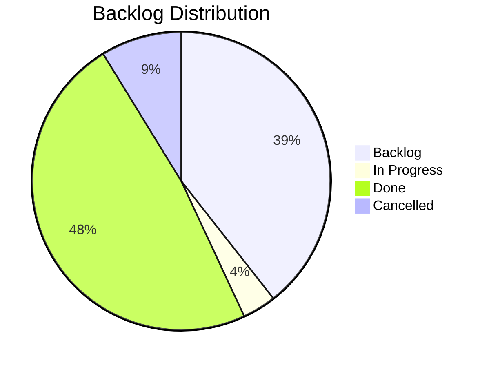

# Product Board

> Last updated: 2026-05-29 16:00

## Status Overview

## Board

### In Progress
| ID | Type | Title | Epic | Priority |
|----|------|-------|------|----------|
| F2604262300 | Feature | Custom Interaction Placement | E2604221030 | critical |
| E2605061200 | Epic | Ingredient Filter Grid Refactor | — | high |
| F2605191000 | Feature | Leaf-Only Recipe Scaling | E2604201200 | critical |
| E2605191100 | Epic | Auto-Craft Stencil System | — | high |
| E2605291500 | Epic | World Thread Queue Saturation Fix | — | critical |

### Backlog
| ID | Type | Title | Epic | Priority |
|----|------|-------|------|----------|
| E2605291000 | Epic | Dynamic Bench Discovery System | — | high |
| F2605291005 | Feature | Auto-Discovery Bench Registry | E2605291000 | high |
| S2605291030 | Story | Create BenchRegistry with Runtime Discovery | E2605291000 | high |
| S2605291035 | Story | Update RecipeFilterRegistry for Open Discovery | E2605291000 | high |
| S2605291040 | Story | Update BenchBlockClassifier for Dynamic Categories | E2605291000 | high |
| S2605291080 | Story | Unify NaturalResourceRegistry with BenchRegistry | E2605291000 | high |
| F2605291010 | Feature | Generic Bench Processor | E2605291000 | high |
| S2605291045 | Story | Create GenericBenchProcessor | E2605291000 | high |
| S2605291050 | Story | Refactor DropScaler for Dynamic Processor Dispatch | E2605291000 | high |
| S2605291055 | Story | Remove Hardcoded Processor Classes | E2605291000 | medium |
| F2605291015 | Feature | Config-Based Bench Deny List | E2605291000 | medium |
| S2605291060 | Story | Add Bench Deny List to Plugin Config | E2605291000 | medium |
| S2605291065 | Story | Wire Deny List into Discovery Pipeline | E2605291000 | medium |
| F2605291020 | Feature | Dynamic UI Tab Verification | E2605291000 | medium |
| S2605291070 | Story | Verify UI Tab Rendering with N Benches | E2605291000 | medium |
| S2605291075 | Story | Validate BlueprintBenchPrefs for Dynamic Tabs | E2605291000 | medium |
| E2605181400 | Epic | Technical Debt Cleanup | — | high |
| F2605281000 | Feature | Centralized Debug Logging Utility | E2605181400 | high |
| F2605261200 | Feature | Decompile Update API Compatibility | E2605181400 | critical |
| S2605261205 | Story | Fix Missing Vector Types After Decompile Update | E2605181400 | critical |
| F2605181420 | Feature | Blueprint Bench Page Decomposition | E2605181400 | medium |
| S2605051200 | Story | Dynamic Cells Per Set Group | E2604221030 | high |
| S2605051205 | Story | Fix Uncategorized Recipe Visibility | E2604221030 | high |
| E2604221030 | Epic | PlaceBlock Building Tool | — | high |
| S2604262305 | Story | Register Custom PlaceBlock Interaction Type | E2604221030 | critical |
| S2604262310 | Story | Implement Placement Logic in Custom Interaction | E2604221030 | critical |
| S2604262315 | Story | Update Block_Placeholder JSON to Custom Interaction | E2604221030 | critical |
| S2604262320 | Story | Delete PlaceBlockPlacementSystem and Suppress/Resume | E2604221030 | high |
| F2604261630 | Feature | Placeholder State Consolidation | E2604221030 | critical |
| S2604261635 | Story | Unified Block_Placeholder JSON with 11 States | E2604221030 | critical |
| S2604261640 | Story | State-Based Arming and Disarming API | E2604221030 | critical |
| S2604261645 | Story | State-Based Block Preview Reskinning | E2604221030 | critical |
| S2604261650 | Story | Affordability State Transitions (Green ↔ Red) | E2604221030 | high |
| S2604261655 | Story | Remove SlotFilter.DENY Workaround | E2604221030 | high |
| S2604261660 | Story | Delete PlaceBlockIndicatorListener Stub | E2604221030 | medium |
| F2604221050 | Feature | Rarity-Based Availability Indicators | E2604221030 | high |
| F2604221055 | Feature | Resource Consumption (Inventory Only) | E2604221030 | high |
| F2605020300 | Feature | Material Group Pre-Filter | E2604221030 | high |
| S2605020305 | Story | Pipeline Material Group Extraction and Filtering | E2604221030 | high |
| S2605020310 | Story | Material Group UI Bar and Event Handling | E2604221030 | high |
| S2605020315 | Story | Persist Material Group Preferences | E2604221030 | medium |
| S2604221135 | Story | Atomic Resource Consumption from Inventory | E2604221030 | high |
| S2604221140 | Story | PlacementCostScaler Mutual Exclusion | E2604221030 | high |
| S2604221200 | Story | Inventory Resource Availability Check | E2604221030 | high |
| E2605071500 | Epic | Unified Style & Affordability System | — | high |
| F2605071510 | Feature | Plugin-Wide Shared Style Tokens | E2605071500 | high |
| S2605071511 | Story | Create SharedStyles.ui with Universal Tokens | E2605071500 | high |
| S2605071512 | Story | Migrate BlueprintBenchStyles.ui to Import Shared | E2605071500 | high |
| F2605071520 | Feature | StencilRadial Style Extraction | E2605071500 | high |
| S2605071521 | Story | Create StencilRadialStyles.ui | E2605071500 | high |
| S2605071522 | Story | Replace Inline Styles in Radial UI Files | E2605071500 | high |
| F2605071530 | Feature | Unified Affordability Resolver | E2605071500 | high |
| S2605071531 | Story | Extract RecipeAffordabilityResolver | E2605071500 | high |
| S2605071532 | Story | Migrate Callers to Shared Resolver | E2605071500 | high |
| F2605071540 | Feature | Radial Cost Arc Affordability Feedback | E2605071500 | high |
| S2605071541 | Story | Add CostDim Overlay to StencilRadialCostSlot.ui | E2605071500 | high |
| S2605071542 | Story | Wire Affordability Check into showCostArc | E2605071500 | high |
| F2605191120 | Feature | UI Raw Cost Display | E2605191100 | medium |
| S2605191121 | Story | Add Raw Cost to StencilRadialMenuPage | E2605191100 | medium |
| S2605191122 | Story | Add Raw Cost to BlueprintSelectionPage | E2605191100 | medium |

### Done
| ID | Type | Title | Epic | Priority |
|----|------|-------|------|----------|
| S2605281025 | Story | Create Standalone FeatureFlags System | E2605181400 | high |
| S2605281005 | Story | Create DebugLogger Utility Class | E2605181400 | high |
| S2605281010 | Story | Migrate All Log Call Sites to DebugLogger | E2605181400 | high |
| S2605281015 | Story | Migrate Debug Chat Messages to DebugLogger | E2605181400 | high |
| S2605281020 | Story | Register /Debug Logging Command | E2605181400 | high |
| S2605271730 | Story | Fix Manifest ServerVersion Semver Range | E2605181400 | critical |
| S2605271735 | Story | Fix Permission Node Invalid Characters | E2605181400 | high |
| S2605271740 | Story | Remove Compile Restoration Skeleton Code | E2605181400 | medium |
| S2605271745 | Story | Fix Null Safety in BlueprintBookParticleLoop | E2605181400 | high |
| F2605291505 | Feature | Particle Loop Task Queue Guard | E2605291500 | critical |
| F2605181405 | Feature | Blueprint Book Highlight Performance | E2605181400 | high |
| S2605191005 | Story | Build RecipeTierClassifier | E2604201200 | critical |
| S2605191010 | Story | Modify DropScaler Phase 1 for Leaf-Only Scaling | E2604201200 | critical |
| S2605191015 | Story | Update Vision Contracts for Leaf-Only Scaling | E2604201200 | critical |
| S2605191020 | Story | Add Duplicate Recipe Guard | E2604201200 | critical |
| S2605191025 | Story | Remove Dead baseBlockRecipeIds Tests | E2604201200 | critical |
| S2605181406 | Story | Infinite-Duration Effect + 500ms Loop | E2605181400 | high |
| F2605181410 | Feature | Inventory Listener Lifecycle Fix | E2605181400 | high |
| S2605181411 | Story | Store EventRegistration Handles | E2605181400 | high |
| F2605181415 | Feature | Plugin Package Alignment | E2605181400 | medium |
| S2605181416 | Story | Move Plugin.java to CodeCreature Package | E2605181400 | medium |
| S2605181421 | Story | Extract GridLayoutController | E2605181400 | medium |
| S2605181422 | Story | Extract DetailPanelController | E2605181400 | medium |
| S2605181423 | Story | Wire Controllers into BlueprintSelectionPage | E2605181400 | medium |
| F2605191105 | Feature | Recipe Tree Resolution | E2605191100 | high |
| S2605191106 | Story | Implement RecipeTreeResolver with Cache | E2605191100 | high |
| S2605191107 | Story | Implement Supporting Records | E2605191100 | high |
| F2605191110 | Feature | Auto-Craft Consumption Planning | E2605191100 | high |
| S2605191111 | Story | Implement AutoCraftPlanner | E2605191100 | high |
| S2605191112 | Story | Add isAffordableWithAutoCraft to RecipeAffordabilityResolver | E2605191100 | high |
| F2605191115 | Feature | Stencil Integration | E2605191100 | high |
| S2605191116 | Story | Wire AutoCraftPlanner into StencilPlacementSystem | E2605191100 | high |
| S2605191117 | Story | Update StencilVisualManager for Auto-Craft Affordability | E2605191100 | high |
| S2605191118 | Story | Add RecipeTreeResolver.init() to DropScaler | E2605191100 | medium |
| E2604301400 | Epic | Blueprint Stencil POC | — | high |
| F2604301410 | Feature | Blueprint Stencil Placement Interception | E2604301400 | high |
| S2604301411 | Story | Blueprint Stencil Metadata Utility | E2604301400 | high |
| S2604301412 | Story | PlaceBlockEvent Interception Handler | E2604301400 | high |
| S2604301413 | Story | Atomic Resource Consumption with Slot Priority | E2604301400 | high |
| F2604301420 | Feature | PlacementCostScaler Blueprint Guard | E2604301400 | high |
| S2604301421 | Story | Add Blueprint BSON Guard to PlacementCostScaler | E2604301400 | high |
| F2604301430 | Feature | Stencil Test Command | E2604301400 | high |
| S2604301431 | Story | Implement Stencil Test Command | E2604301400 | high |
| F2604271700 | Feature | Unified Recipe Filter Registry | E2604201200 | high |
| S2604271710 | Story | Extract Shared Recipe Predicate Pipeline | E2604201200 | high |
| S2604271720 | Story | Migrate BlueprintSelectionPage to Shared Registry | E2604201200 | high |
| S2604271730 | Story | Migrate BenchRecipeRegistry to Shared Registry | E2604201200 | high |
| S2604271740 | Story | Unify Bench ID Definitions | E2604201200 | high |
| F2604221035 | Feature | Blueprint Bench Block Asset | E2604221030 | high |
| F2604221040 | Feature | Recipe Selection & Placeholder Transformation | E2604221030 | high |
| F2604221045 | Feature | Block Preview & Placement | E2604221030 | high |
| S2604221100 | Story | Create Block_Placeholder Item Assets | E2604221030 | high |
| S2604221105 | Story | Register PlaceBlock Bench Interaction | E2604221030 | high |
| S2604221125 | Story | Block Preview Integration with Armed Placeholder | E2604221030 | high |
| S2604221130 | Story | Right-Click Placement Handler | E2604221030 | high |
| S2604221145 | Story | Quality State Machine for Placeholder | E2604221030 | high |
| S2604221150 | Story | Inventory Change Event Listener for Rarity Updates | E2604221030 | high |
| S2604221210 | Story | Runtime BenchRequirement Mutation (Shadow Recipes) | E2604221030 | high |
| S2604230900 | Story | Expand Recipe Aggregation to All Benches | E2604221030 | critical |
| S2604240900 | Story | PlaceBlock Command for Testing | E2604221030 | critical |
| S2604240920 | Story | Custom UI Feasibility Spike | E2604221030 | high |
| S2604240910 | Story | Custom Blueprint Selection UI | E2604221030 | high |
| S2604271300 | Story | Placeholder Acquisition Button (Life Essence) | E2604221030 | high |
| F2605051500 | Feature | Resource Type Input Filter | E2604221030 | high |
| S2605051505 | Story | Replace Placeholder Section with Resource Type Grid UI | E2604221030 | high |
| S2605051510 | Story | Three-State Affordability Toggle | E2604221030 | high |
| S2605051515 | Story | Resource Type Filter Build/Bind/Update Logic | E2604221030 | high |
| S2605051520 | Story | Resource Type Recipe Filtering in Pipeline | E2604221030 | high |

### Cancelled
| ID | Type | Title | Epic | Reason |
|----|------|-------|------|--------|
| S2604221155 | Story | Nearby Chest Discovery by Radius | E2604221030 | Scope reduced — inventory only |
| S2604221205 | Story | Atomic Multi-Source Resource Consumption | E2604221030 | Scope reduced — inventory only |
| S2604221215 | Story | CraftRecipeEvent Interceptor for Placeholder | E2604221030 | StructuralCraftingWindow dimming unsolvable |
| S2604230905 | Story | Non-Block Recipe Feedback Message | E2604221030 | Replaced by command feedback |
| S2604221115 | Story | Recipe Filtering By Available Resources | E2604221030 | Deferred to custom UI |
| S2604221110 | Story | Inventory & Chest Resource Scanner | E2604221030 | Scope reduced — inventory only |
| S2604221120 | Story | Placeholder Icon Transformation on Selection | E2604221030 | Arming via command/UI now |

## Epics

### E2604221030 — PlaceBlock Building Tool
**Status:** in-progress | **Priority:** high

Select-then-build workflow at the **Blueprint Bench**. Player arms a placeholder tool with a recipe, sees a ghost block preview, and right-clicks to place — consuming resources at placement time from inventory.

**UI PIVOT (2026-04-24):** StructuralCraftingWindow approach abandoned — client dims recipes because the placeholder doesn't match expected materials. Moving to:
- **Phase 2a:** Command-based arming (`/placeblock assign|clear|list|info`) for pipeline testing
- **Phase 2b:** Custom `InteractiveCustomUIPage` for production UI with "Select" button

**Three Benches:**
| Bench | Intent | Output |
|-------|--------|--------|
| Builders Bench | "I need items" | Crafted item → inventory |
| Portable Bench | "I need items, away from bench" | Same, but mobile |
| **Blueprint Bench** | "I want to build in the world" | Armed placeholder → deferred placement |

**Phases:**
1. ~~Bench Asset~~ — **Done.** Blueprint Bench JSON, shadow recipes, PlaceBlock ResourceType
2. **Recipe Selection** — In progress. Phase 2a (command testing) active. Phase 2b (custom UI) backlog.
3. **Placement** — Backlog. Block preview, right-click handler, atomic resource consumption
4. **Feedback** — Backlog. Rarity indicators, inventory change events

**Contracts:** #10–#16 (unchanged by pivot)

**Key Docs:**
- [design-blueprint-bench-custom-ui.md](docs/Plans/design-blueprint-bench-custom-ui.md) — Custom UI architecture
- [custom-ui-options.md](docs/hytale/plugins/custom-ui-options.md) — Hytale Expert UI research
- [structural-crafting-dimming.md](docs/hytale/crafting/structural-crafting-dimming.md) — Dimming root cause analysis

### E2604201200 — Resource Economy Scaling System
**Status:** backlog (empty) | **Priority:** —

### E2604201400 — PlaceBlock Building Tool System
**Status:** backlog (empty, superseded by E2604221030) | **Priority:** —
