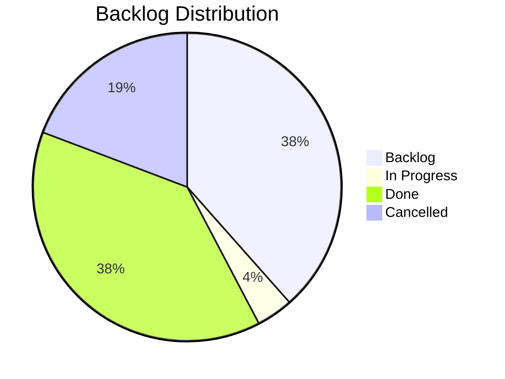

# Product Board

> Last updated: 2026-04-24 14:30

## Status Overview

## Board

### In Progress
| ID | Type | Title | Epic | Priority |
|----|------|-------|------|----------|
| F2604221045 | Feature | Block Preview & Placement | E2604221030 | high |

### Backlog
| ID | Type | Title | Epic | Priority |
|----|------|-------|------|----------|
| E2604221030 | Epic | PlaceBlock Building Tool | — | high |
| F2604221050 | Feature | Rarity-Based Availability Indicators | E2604221030 | high |
| F2604221055 | Feature | Resource Consumption & Chest Scanning | E2604221030 | high |
| S2604221125 | Story | Block Preview Integration with Armed Placeholder | E2604221030 | high |
| S2604221135 | Story | Atomic Resource Consumption from Inventory & Chests | E2604221030 | high |
| S2604221140 | Story | PlacementCostScaler Mutual Exclusion | E2604221030 | high |
| S2604221145 | Story | Quality State Machine for Placeholder | E2604221030 | high |
| S2604221150 | Story | Inventory Change Event Listener for Rarity Updates | E2604221030 | high |
| S2604221155 | Story | Nearby Chest Discovery by Radius | E2604221030 | high |
| S2604221200 | Story | Aggregate Resource Availability Check | E2604221030 | high |
| S2604221205 | Story | Atomic Multi-Source Resource Consumption | E2604221030 | high |

### Done
| ID | Type | Title | Epic | Priority |
|----|------|-------|------|----------|
| F2604221035 | Feature | Blueprint Bench Block Asset | E2604221030 | high |
| F2604221040 | Feature | Recipe Selection & Placeholder Transformation | E2604221030 | high |
| S2604221100 | Story | Create Block_Placeholder Item Assets | E2604221030 | high |
| S2604221105 | Story | Register PlaceBlock Bench Interaction | E2604221030 | high |
| S2604221210 | Story | Runtime BenchRequirement Mutation (Shadow Recipes) | E2604221030 | high |
| S2604230900 | Story | Expand Recipe Aggregation to All Benches | E2604221030 | critical |
| S2604240900 | Story | PlaceBlock Command for Testing | E2604221030 | critical |
| S2604240920 | Story | Custom UI Feasibility Spike | E2604221030 | high |
| S2604240910 | Story | Custom Blueprint Selection UI | E2604221030 | high |
| S2604221130 | Story | Right-Click Placement Handler | E2604221030 | high |

### Cancelled
| ID | Type | Title | Epic | Reason |
|----|------|-------|------|--------|
| S2604221215 | Story | CraftRecipeEvent Interceptor for Placeholder | E2604221030 | StructuralCraftingWindow dimming unsolvable |
| S2604230905 | Story | Non-Block Recipe Feedback Message | E2604221030 | Replaced by command feedback |
| S2604221115 | Story | Recipe Filtering By Available Resources | E2604221030 | Deferred to custom UI |
| S2604221110 | Story | Inventory & Chest Resource Scanner | E2604221030 | Deferred to Phase 3 |
| S2604221120 | Story | Placeholder Icon Transformation on Selection | E2604221030 | Arming via command/UI now |

### Cancelled
| ID | Type | Title | Epic | Reason |
|----|------|-------|------|--------|
| S2604221215 | Story | CraftRecipeEvent Interceptor for Placeholder | E2604221030 | StructuralCraftingWindow approach abandoned — client-side recipe dimming unsolvable |
| S2604230905 | Story | Non-Block Recipe Feedback Message | E2604221030 | Depended on interceptor; replaced by command feedback |
| S2604221115 | Story | Recipe Filtering By Available Resources | E2604221030 | Was tied to StructuralCraftingWindow; deferred to custom UI |
| S2604221110 | Story | Inventory & Chest Resource Scanner | E2604221030 | Deferred to Phase 3 |
| S2604221120 | Story | Placeholder Icon Transformation on Selection | E2604221030 | Depended on interceptor; arming via command now |

## Epics

### E2604221030 — PlaceBlock Building Tool
**Status:** in-progress | **Priority:** high

Select-then-build workflow at the **Blueprint Bench** — a new dedicated workbench block placed in the world. Player arms a placeholder tool with a recipe, previews placement, and right-clicks to place — consuming resources at placement time from inventory/nearby chests.

**UI PIVOT (2026-04-24):** StructuralCraftingWindow approach abandoned — client dims recipes because the placeholder doesn't match expected materials. Moving to:
- **Phase 2a:** Command-based arming (`/placeblock assign|clear|list|info`) for pipeline testing
- **Phase 2b:** Custom `InteractiveCustomUIPage` for production UI with "Select" button

**Three Benches:**
| Bench | Intent | Output |
|-------|--------|--------|
| Builders Bench | "I need items" | Crafted item → inventory |
| Portable Bench | "I need items, away from bench" | Same, but mobile |
| **Blueprint Bench** | "I want to build in the world" | Armed placeholder → deferred placement |

**Phases:**
1. ~~Bench Asset~~ — **Done.** Blueprint Bench JSON, shadow recipes, PlaceBlock ResourceType
2. **Recipe Selection** — In progress. Phase 2a (command testing) active. Phase 2b (custom UI) backlog.
3. **Placement** — Backlog. Block preview, right-click handler, atomic resource consumption
4. **Feedback** — Backlog. Rarity indicators, inventory change events

**Contracts:** #10–#16 (unchanged by pivot)

**Key Docs:**
- [design-blueprint-bench-custom-ui.md](docs/Plans/design-blueprint-bench-custom-ui.md) — Custom UI architecture
- [custom-ui-options.md](docs/hytale/plugins/custom-ui-options.md) — Hytale Expert UI research
- [structural-crafting-dimming.md](docs/hytale/crafting/structural-crafting-dimming.md) — Dimming root cause analysis

### E2604201200 — Resource Economy Scaling System
**Status:** backlog (empty) | **Priority:** —

### E2604201400 — PlaceBlock Building Tool System
**Status:** backlog (empty, superseded by E2604221030) | **Priority:** —
