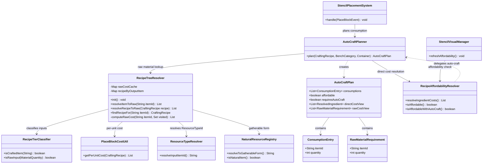
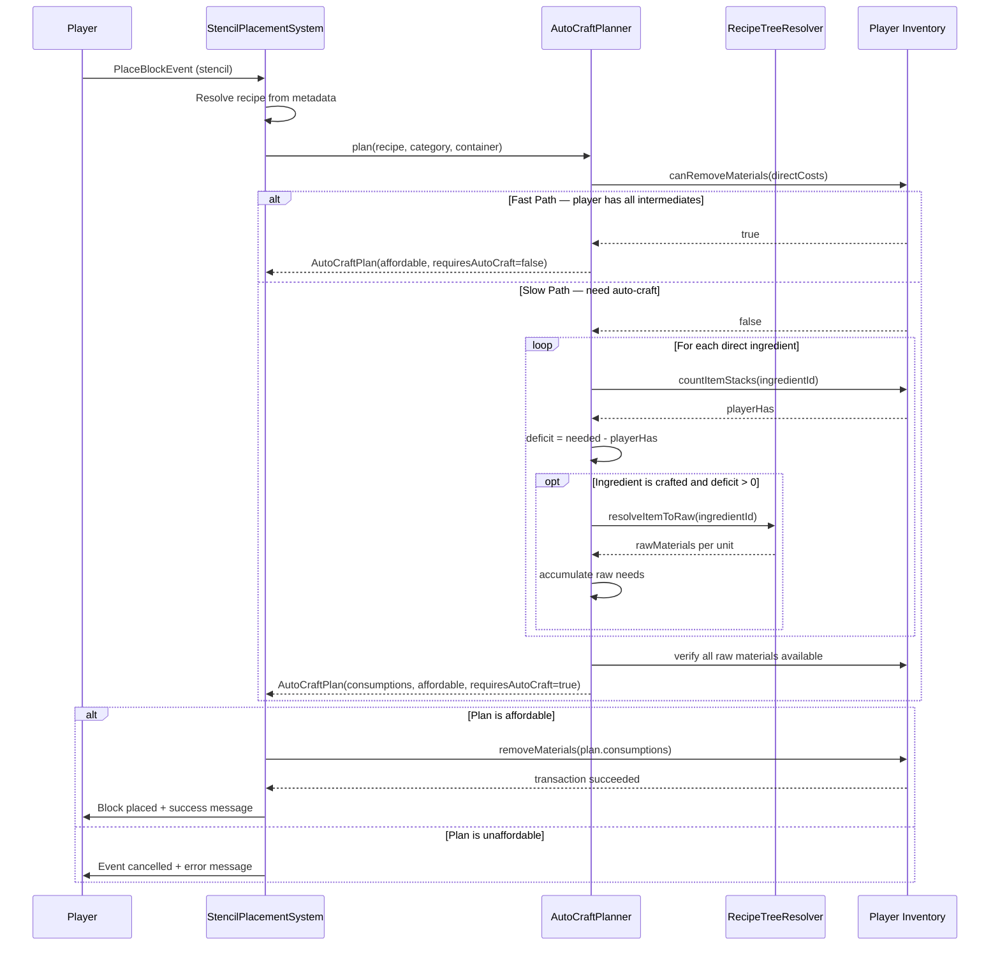

# Design: Auto-Craft for Stencils

**Created:** 2026-05-19  
**Status:** Ready for Implementation  
**Author:** Architect

---

## 1. Problem Statement

When a player uses a stencil to place a crafted block (e.g., brick stairs), the system currently requires the player to have the recipe's **direct ingredients** (3 bricks) already in inventory. If the player has abundant raw materials (100 cobblestone) but zero pre-crafted intermediates, they must interrupt their building workflow — walk to a bench, manually craft bricks, then return to their build site. This friction violates the stencil system's core promise of a seamless select-then-build workflow.

**Auto-craft** solves this by letting the stencil placement system automatically resolve ingredient deficits to raw materials: if the player doesn't have enough bricks, the system checks whether they have enough cobblestone to "virtually craft" the missing bricks, and if so, consumes the raw materials directly. The intermediates are never physically created — the economy behaves as if they were crafted and immediately consumed.

**Critical constraint:** This is a convenience layer, not an economy change. Break-return behavior is unaffected (Contract #4 — placed blocks still drop recipe intermediates, not raw materials).

---

## 2. Design Goals

Ranked by priority (established via product vision alignment):

1. **Correctness** — Auto-craft must preserve the closed-loop economy. Every resource path must be traceable. No duplication, no loss.
2. **Atomicity** — Resource consumption is all-or-nothing. If any step of the auto-craft plan can't be satisfied, nothing is consumed.
3. **Performance** — Recipe tree resolution is on the hot path (every affordability check, every placement). Static resolution must be pre-computed and cached; only inventory checks happen at runtime.
4. **Simplicity** — Minimal new surface area. Reuse existing resolution infrastructure (`RecipeTierClassifier`, `ResourceTypeResolver`, `PlaceBlockCostUtil`).
5. **Additivity** — The system is a layer on top of existing behavior. Disabling auto-craft reverts to current behavior with zero code changes to existing classes.
6. **Transparency** — The player sees what raw materials are needed via the radial menu and stencil bench UI.

---

## 3. Architecture Overview

### Component Diagram



---

## 4. Detailed Design

### 4.1 New Class: `RecipeTreeResolver`

**Package:** `com.CodeCreature.crafting`  
**Responsibility:** Recursively resolves crafted items to their raw material equivalents. Results are cached at init time for O(1) runtime lookup.

**Key methods:**

| Method | Purpose |
|--------|---------|
| `init()` | Pre-computes raw cost cache for all known crafted items. Called once after `DropScaler.applyModifications()`. |
| `resolveItemToRaw(String itemId)` | Returns the raw materials needed to produce ONE unit of the given crafted item. Returns `null` if the item is raw or unresolvable. |
| `resolveRecipeToRaw(CraftingRecipe recipe)` | Returns the total raw material cost for one unit of the recipe's output. Used by UI for display. |
| `findRecipeFor(String itemId)` | Returns the crafting recipe that produces this item (excludes Salvage and processing recipes). |

**Cache structure:**
- `Map<String, CraftingRecipe> recipeByOutputItem` — item ID → recipe that produces it. Built at init from all non-Salvage crafting-bench recipes.
- `Map<String, List<RawMaterialRequirement>> rawCostCache` — item ID → raw material cost for 1 unit. Pre-computed for all items in `RecipeTierClassifier.craftedItemIds`.

**Resolution pipeline (per crafted item):**
1. Look up recipe via `recipeByOutputItem`
2. Get per-unit cost via `PlaceBlockCostUtil.getPerUnitCost(recipe)`
3. For each per-unit input:
   - Resolve concrete item ID via `ResourceTypeResolver.resolveInputItemId()`
   - Map to gatherable form via `NaturalResourceRegistry.resolveToGatherableForm()`
   - If `RecipeTierClassifier.isRawInput()` → add to raw list
   - If crafted → recurse (with cycle detection via `Set<String> visited`)
4. Merge duplicate raw materials (sum quantities)

### 4.2 New Class: `AutoCraftPlanner`

**Package:** `com.CodeCreature.crafting`  
**Responsibility:** Given a recipe and a player's inventory, produces an `AutoCraftPlan` that specifies exactly what to consume. Prefers existing intermediates, auto-crafts deficit from raw materials.

**Algorithm (two-pass):**

**Pass 1 — Fast path:**
Check `container.canRemoveMaterials(directMaterials)`. If the player has all direct ingredients (using the engine's built-in `ResourceTypeId` matching), return a plan with no auto-crafting needed. This is the common case for well-stocked players.

**Pass 2 — Slow path (auto-craft):**
For each direct ingredient:
1. Resolve to concrete item ID
2. Count how many the player has
3. Use existing stock up to the needed quantity
4. For any deficit where the item is crafted: look up `RecipeTreeResolver.resolveItemToRaw()` and accumulate raw material needs
5. For any deficit where the item is raw: accumulate directly

After processing all ingredients, validate that the player has enough of every raw material in the aggregated needs. If yes, return an affordable plan with the combined consumption list. If no, return an unaffordable plan.

### 4.3 New Record: `AutoCraftPlan`

**Package:** `com.CodeCreature.crafting`  
**Fields:**

| Field | Type | Purpose |
|-------|------|---------|
| `consumptions` | `List<ConsumptionEntry>` | What to actually remove from inventory (mix of existing intermediates + raw materials for auto-craft) |
| `affordable` | `boolean` | Whether the full plan can be executed |
| `requiresAutoCraft` | `boolean` | Whether any auto-crafting is needed (false = fast path) |
| `directCostView` | `List<ResolvedIngredient>` | For UI: the recipe's direct ingredients with per-ingredient affordability |
| `rawCostView` | `List<RawMaterialRequirement>` | For UI: total raw material cost for the full recipe |

### 4.4 Integration Points with Existing Systems

#### StencilPlacementSystem (consumption)

**Current flow:**
```
getPerUnitCost → canRemoveMaterials → removeMaterials → engine places block
```

**New flow:**
```
AutoCraftPlanner.plan(recipe, category, container)
  → if plan.affordable:
      convert plan.consumptions to MaterialQuantity list
      removeMaterials(consumptionMaterials)
      engine places block
  → else: cancel + error
```

#### RecipeAffordabilityResolver (affordability check)

Add a new static method `isAffordableWithAutoCraft()` that delegates to `AutoCraftPlanner.plan()` and returns `plan.affordable()`. This is the single entry point for all auto-craft-aware affordability checks.

#### StencilVisualManager (visual indicator)

Replace `RecipeAffordabilityResolver.isAffordable()` call with `RecipeAffordabilityResolver.isAffordableWithAutoCraft()`. The green/red glow now reflects whether the player can afford the recipe with auto-crafting.

#### StencilRadialMenuPage (cost arc display)

When showing the cost arc on hover, include a secondary display of raw material costs from `RecipeTreeResolver.resolveRecipeToRaw()`. Design: show direct recipe costs in the inner ring(s), and if auto-crafting would be needed, show raw material costs in an outer ring with a distinct visual treatment (e.g., different border color or icon overlay).

#### StencilSelectionPage (detail panel)

Add a "Raw Materials" section below the existing cost grid in the detail panel. Show the total raw material cost from `RecipeTreeResolver.resolveRecipeToRaw()`. Conditionally visible: only when the recipe has crafted intermediate inputs.

#### DropScaler (initialization)

Add `RecipeTreeResolver.init()` at the end of `DropScaler.apply()`, after `applyModifications()` — the resolver needs scaled recipe values.

### 4.5 Data Flow Diagrams

#### Responsibility Map

```mermaid
graph TB
    subgraph Init["Phase 0: Initialization"]
        NRR["NaturalResourceRegistry.init()"]
        RTC["RecipeTierClassifier.init()"]
        DS["DropScaler.applyModifications()"]
        RTR["RecipeTreeResolver.init()"]
        NRR --> RTC --> DS --> RTR
    end

    subgraph Placement["Stencil Placement Flow"]
        PBE(("PlaceBlockEvent"))
        SPS["StencilPlacementSystem.handle()"]
        ACP["AutoCraftPlanner.plan()"]
        FP{"Fast path: direct\n canRemoveMaterials?"}
        DEFICIT["Compute per-ingredient\n deficit"]
        RESOLVE["RecipeTreeResolver\n .resolveItemToRaw()"]
        AGG["Aggregate raw\n material needs"]
        CHECK{"Player has\n all raw mats?"}
        CONSUME["Execute consumption\n (removeMaterials)"]
        PLACE["Engine places block"]
        DENY["Cancel event +\n error message"]

        PBE --> SPS
        SPS -->|"recipe + inventory"| ACP
        ACP --> FP
        FP -->|"Yes"| CONSUME
        FP -->|"No"| DEFICIT
        DEFICIT --> RESOLVE
        RESOLVE --> AGG
        AGG --> CHECK
        CHECK -->|"Yes"| CONSUME
        CHECK -->|"No"| DENY
        CONSUME --> PLACE
    end

    subgraph Visual["Affordability Visual Flow"]
        INV(("Inventory Change"))
        SVM["StencilVisualManager"]
        RAR["RecipeAffordabilityResolver\n .isAffordableWithAutoCraft()"]
        GLOW["Update quality glow\n green / red"]
        INV --> SVM --> RAR --> GLOW
    end

    subgraph UI["UI Display Flow"]
        HOVER(("Radial Hover /\n Detail Panel"))
        RTRUI["RecipeTreeResolver\n .resolveRecipeToRaw()"]
        DIRECT["Show direct recipe cost"]
        RAW["Show raw material\n breakdown"]
        HOVER --> RTRUI
        RTRUI --> DIRECT
        RTRUI --> RAW
    end
```



#### Sequence Diagram — Stencil Placement with Auto-Craft



---

## 5. Responsibility Map

| Component | Owns | Does NOT Own |
|-----------|------|-------------|
| `RecipeTreeResolver` | Static recipe → raw material resolution; recipe lookup by output item; resolution cache | Inventory checks, consumption, UI display |
| `AutoCraftPlanner` | Deficit computation; inventory-aware planning; consumption list construction | Actual material removal, recipe resolution caching |
| `AutoCraftPlan` | Immutable plan data; consumption entries; UI display data | Execution logic, inventory interaction |
| `StencilPlacementSystem` | Executing the plan (calling `removeMaterials`); event handling; error feedback | Planning, resolution, UI |
| `RecipeAffordabilityResolver` | `isAffordableWithAutoCraft()` convenience method; direct ingredient resolution | Auto-craft planning logic (delegates to `AutoCraftPlanner`) |
| `StencilVisualManager` | Visual indicator updates (green/red glow) | Affordability logic (delegates to `RecipeAffordabilityResolver`) |
| `StencilRadialMenuPage` | Displaying raw cost arc on hover | Resolution, planning |
| `StencilSelectionPage` | Displaying raw cost in detail panel | Resolution, planning |

---

## 6. Algorithm

### 6.1 Recursive Resolution — `RecipeTreeResolver.computeRawCost()`

```
function computeRawCost(itemId, visited):
    // Cycle detection
    if itemId IN visited:
        log WARNING "Cycle detected at " + itemId
        return null  // unresolvable

    // Find recipe for this item
    recipe = recipeByOutputItem.get(itemId)
    if recipe == null:
        return null  // no recipe → raw or unresolvable

    visited.add(itemId)
    perUnitCosts = PlaceBlockCostUtil.getPerUnitCost(recipe)
    rawMaterials = new Map<String, Integer>  // itemId → quantity

    for each mq in perUnitCosts:
        if mq == null: continue
        resolvedId = ResourceTypeResolver.resolveInputItemId(mq, BUILDERS_ONLY)
        if resolvedId == null: continue
        resolvedId = NaturalResourceRegistry.resolveToGatherableForm(resolvedId)
        qty = mq.getQuantity()

        if RecipeTierClassifier.isRawInput(mq):
            rawMaterials.merge(resolvedId, qty, +)
        else:
            // Crafted intermediate — recurse
            subCost = computeRawCost(resolvedId, visited)
            if subCost == null:
                // Can't resolve further — treat as terminal
                rawMaterials.merge(resolvedId, qty, +)
            else:
                for each (rawId, rawQty) in subCost:
                    rawMaterials.merge(rawId, rawQty * qty, +)

    visited.remove(itemId)
    return rawMaterials as List<RawMaterialRequirement>
```

### 6.2 Deficit Computation — `AutoCraftPlanner.plan()`

```
function plan(recipe, category, container):
    directMaterials = PlaceBlockCostUtil.getPerUnitCost(recipe)
    directView = RecipeAffordabilityResolver.resolveIngredientCosts(recipe, category, container)
    rawView = RecipeTreeResolver.resolveRecipeToRaw(recipe)

    // ── Fast path: player has all direct ingredients ──
    if container.canRemoveMaterials(directMaterials):
        return AutoCraftPlan(
            consumptions = materializeAsMQ(directMaterials),
            affordable = true,
            requiresAutoCraft = false,
            directCostView = directView,
            rawCostView = rawView
        )

    // ── Slow path: compute per-ingredient deficit ──
    totalConsumption = new Map<String, Integer>  // itemId → quantity
    requiresAutoCraft = false

    for each mq in directMaterials:
        resolvedId = resolve(mq, category)
        if resolvedId == null:
            return AutoCraftPlan(affordable = false, ...)

        needed = mq.getQuantity()
        playerHas = container.countItemStacks(
            stack -> resolvedId.equals(stack.getItemId()))

        useExisting = min(playerHas, needed)
        deficit = needed - useExisting

        if useExisting > 0:
            totalConsumption.merge(resolvedId, useExisting, +)

        if deficit > 0:
            if RecipeTierClassifier.isCraftedItem(resolvedId):
                requiresAutoCraft = true
                rawPerUnit = RecipeTreeResolver.resolveItemToRaw(resolvedId)
                if rawPerUnit == null:
                    return AutoCraftPlan(affordable = false, ...)
                for each rawReq in rawPerUnit:
                    totalConsumption.merge(rawReq.itemId, rawReq.quantity * deficit, +)
            else:
                // Raw item the player doesn't have enough of
                totalConsumption.merge(resolvedId, deficit, +)

    // ── Verify all consumptions are affordable ──
    for each (itemId, qty) in totalConsumption:
        if container.countItemStacks(...itemId...) < qty:
            return AutoCraftPlan(affordable = false, ...)

    return AutoCraftPlan(
        consumptions = totalConsumption as List<ConsumptionEntry>,
        affordable = true,
        requiresAutoCraft = requiresAutoCraft,
        directCostView = directView,
        rawCostView = rawView
    )
```

### 6.3 Caching Strategy

| Data | When Computed | Lifetime | Invalidation |
|------|--------------|----------|-------------|
| `recipeByOutputItem` | `RecipeTreeResolver.init()` | Server lifetime | Only on economy recalculation (`/scalereset`) |
| `rawCostCache` | `RecipeTreeResolver.init()` | Server lifetime | Only on economy recalculation |
| Inventory counts | Every `plan()` call | Per-call | N/A — always fresh |
| `AutoCraftPlan` | Every `plan()` call | Per-call | N/A — always fresh |

**Pre-computation at init:** `RecipeTreeResolver.init()` iterates all items classified as crafted by `RecipeTierClassifier`, computes their raw cost, and caches the result. At runtime, `resolveItemToRaw()` is a simple map lookup — O(1).

**Why not lazy:** The affordability visual update (`StencilVisualManager`) fires on every inventory change. Lazy computation would cause a cache-miss storm on the first scan after server boot. Pre-computing at init avoids this.

### 6.4 `MaterialQuantity` Construction for Consumption

The `container.removeMaterials()` API requires `List<MaterialQuantity>`. The `ConsumptionEntry` records must be converted to `MaterialQuantity` instances. Two approaches:

1. **Clone from recipe inputs:** For items that appear in the original recipe, clone the existing `MaterialQuantity` with the adjusted quantity via `mq.clone(qty)`.
2. **Clone from sub-recipe inputs:** For raw materials (from auto-craft resolution), find any `MaterialQuantity` in the sub-recipe's inputs that references the same item, and clone it.

The Engineer should implement a helper method `AutoCraftPlanner.toMaterialQuantities(List<ConsumptionEntry>)` that handles this lookup. If no existing `MaterialQuantity` can be found for a given item ID, the item is unresolvable and the plan should be marked unaffordable.

---

## 7. Edge Cases

### 7.1 Multi-Recipe Items

**Scenario:** An item can be produced by multiple recipes (e.g., planks from oak logs OR birch logs).

**Design:** `recipeByOutputItem` stores ONE recipe per output item. During `init()`, if multiple recipes produce the same item, compute the raw material cost for each candidate recipe and pick the **cheapest by total raw material quantity**. At runtime, `AutoCraftPlanner` additionally validates that the cheapest recipe is **affordable given the player's current inventory** — if not, it falls through to the next cheapest recipe that the player can afford. This ensures the system always selects the best option the player can actually execute.

**Resolution order:** cheapest affordable > next cheapest affordable > ... > unaffordable.

**Risk:** Low — most crafting intermediates have exactly one recipe. For items with variants (oak planks vs. birch planks), each variant has its own item ID and recipe, so they don't collide.

**Decision:** Resolved 2026-05-20 — pick cheapest based on what can be afforded from inventory.

### 7.2 Cycles

**Scenario:** Recipe A produces item X, recipe B produces item Y, and X requires Y while Y requires X.

**Design:** `computeRawCost()` maintains a `Set<String> visited` of items currently being resolved. If an item is encountered that's already in the set, resolution halts for that branch with a warning log. The item is treated as a terminal node (must be in inventory, cannot be auto-crafted).

**Risk:** Very low — crafting cycles don't exist in normal Hytale recipe data. This is a safety net.

### 7.3 Items with No Recipe Path to Raw Materials

**Scenario:** A crafted intermediate's recipe uses another intermediate that has no recipe (e.g., a mob-dropped ingredient used in a recipe).

**Design:** If `findRecipeFor()` returns null for a crafted intermediate, the item is treated as a terminal node — the player must have it in inventory. `resolveItemToRaw()` returns `null` for that item. In `AutoCraftPlanner`, a null resolution means the deficit for that ingredient cannot be auto-crafted, and the plan is unaffordable unless the player has enough of the ingredient directly.

### 7.4 ResourceTypeId at Intermediate Tiers

**Scenario:** A recipe input uses `ResourceTypeId: "Wood_All"` instead of a direct item ID. This resolves to a concrete item (e.g., oak planks) which is itself crafted.

**Design:** Resolution uses `ResourceTypeResolver.resolveInputItemId()` at every level of the tree, the same way `RecipeAffordabilityResolver` does today. The concrete item is then looked up in `recipeByOutputItem` for recursive resolution.

**Design (V1 — full handling):** The slow path resolves `ResourceTypeId` inputs by enumerating all concrete items matching the type via `ResourceTypeResolver`, then checking the player's inventory for each variant. Existing stock of any matching variant is used first (preference: most abundant). For any remaining deficit, the system resolves to the **cheapest affordable** concrete recipe (per §7.1). This ensures the slow path correctly accounts for mixed variant inventories (e.g., player has 3 oak planks + 2 birch planks when 6 "any plank" are needed).

**Decision:** Resolved 2026-05-20 — handle ResourceTypeId fully in V1. The ResourceTypeResolver already maps types to concrete items, and the cheapest-affordable selection from §7.1 applies here.

### 7.5 Processing Recipes

**Decision: Included in auto-craft resolution (V1).**

Processing recipes (smelting, stonecutting, refining) are included in `RecipeTreeResolver`'s resolution tree. The `recipeByOutputItem` map indexes recipes from both registered crafting benches (`Builders`, `Furniture_Bench`, `Workbench`, `Fieldcraft`) AND processing benches. This means auto-craft can resolve through processing chains (e.g., iron ingot → iron ore via smelting → auto-craft consumes iron ore).

**Rationale:** Bench recipes are part of the stencil system. Excluding processing recipes would create an artificial boundary where some crafted intermediates can be auto-crafted and others cannot. The system architecture handles this naturally — the `isCraftingBenchRecipe()` predicate in `RecipeTreeResolver` accepts processing bench recipes alongside standard crafting bench recipes. The recipe tree depth increases by at most 1 level for processed items, with negligible performance impact.

**Implementation:** The bench filter predicate in `RecipeTreeResolver.init()` uses an expanded bench set that includes processing benches. This is a predicate change, not an architectural change — the recursive resolution, caching, and planning layers are unaffected.

**Decision:** Resolved 2026-05-20 — include processing bench recipes. The system must be structured so this is not a massive lift.

### 7.6 Salvage Recipe Exclusion

**Design:** `recipeByOutputItem` is built by scanning recipes with `!recipe.getId().startsWith("Salvage")`. This is the same filter used by `RecipeTierClassifier.init()`. Salvage recipes are reverse-crafting and must never be followed during auto-craft resolution.

### 7.7 Recipe with Zero or Null Inputs

**Design:** If `PlaceBlockCostUtil.getPerUnitCost()` returns an empty list, `resolveRecipeToRaw()` returns an empty list (no raw cost). `AutoCraftPlanner.plan()` returns affordable with no consumptions. This is consistent with existing behavior for zero-cost recipes.

### 7.8 Same Raw Material Needed by Multiple Deficits

**Scenario:** Recipe needs 3 bricks + 2 cobblestone. Player has 0 bricks, 50 cobblestone. Auto-craft: 3 bricks = 36 cobblestone. Direct: 2 cobblestone. Total cobblestone: 38.

**Design:** `totalConsumption` map merges all needs for the same item ID. The final verification checks `50 >= 38` — affordable. This correctly handles overlap between direct ingredients and auto-crafted raw materials.

---

## 8. Integration Points — Exact Modifications

### 8.1 `StencilPlacementSystem.handle()` — `stencil/StencilPlacementSystem.java`

**Current code (steps 5-7):**
```java
List<MaterialQuantity> materials = PlaceBlockCostUtil.getPerUnitCost(recipe);
if (!container.canRemoveMaterials(materials)) { ... cancel ... }
ListTransaction<MaterialTransaction> txn = container.removeMaterials(materials, true, true, true);
```

**New code:**
```java
AutoCraftPlan plan = AutoCraftPlanner.plan(recipe, BenchCategory.BUILDERS_ONLY, container);
if (!plan.affordable()) { ... cancel ... }
// Convert plan.consumptions() to MaterialQuantity list and execute removeMaterials
```

The empty-materials check (step 5) remains unchanged. Steps 6-7 are replaced with the auto-craft planner.

### 8.2 `RecipeAffordabilityResolver` — `crafting/RecipeAffordabilityResolver.java`

**Add new method:**
```java
public static boolean isAffordableWithAutoCraft(CraftingRecipe recipe,
                                                 BenchCategory category,
                                                 CombinedItemContainer container)
```

Delegates to `AutoCraftPlanner.plan()` and returns `plan.affordable()`.

### 8.3 `StencilVisualManager.scanAndSend()` — `stencil/StencilVisualManager.java`

**Current:**
```java
boolean affordable = RecipeAffordabilityResolver.isAffordable(recipe, container);
```

**New:**
```java
boolean affordable = RecipeAffordabilityResolver.isAffordableWithAutoCraft(
    recipe, BenchCategory.BUILDERS_ONLY, container);
```

### 8.4 `StencilRadialMenuPage.applySegmentAffordability()` — `ui/radial/StencilRadialMenuPage.java`

**Current:**
```java
boolean affordable = container != null
    && RecipeAffordabilityResolver.resolveIngredientCosts(recipe, category, container)
            .stream().allMatch(ResolvedIngredient::sufficient);
```

**New:**
```java
boolean affordable = container != null
    && RecipeAffordabilityResolver.isAffordableWithAutoCraft(recipe, category, container);
```

### 8.5 `StencilRadialMenuPage.showCostArc()` — `ui/radial/StencilRadialMenuPage.java`

**Current:** Shows direct ingredients in concentric rings.

**New:** When auto-craft would be needed for a placement, **replace** the intermediate ingredient slot(s) in the cost arc with the raw material(s) that auto-craft would consume. The ingredient list reflects what will actually be taken from the player's inventory, not the recipe's nominal inputs. If the player has some intermediates (partial fast-path), those intermediates remain in the list and only the deficit portion is shown as raw materials.

**Example:** Recipe needs 3 bricks. Player has 1 brick, enough cobblestone for 2 more.
- Cost arc shows: 1× Brick (has it) + 24× Cobblestone (auto-craft for 2 bricks)
- NOT: 3× Brick + 36× Cobblestone

### 8.6 `StencilSelectionPage` detail panel — `ui/bench/StencilSelectionPage.java`

**New behavior:** When the player cannot afford a recipe's direct intermediates, **replace** the unaffordable intermediate ingredient(s) in the cost grid with the raw materials that auto-craft would consume. The grid reflects the actual consumption plan. If the player has sufficient intermediates for the full recipe, the grid shows the original recipe ingredients unchanged (fast path).

**Example:** Recipe needs 3 bricks + 2 cobblestone. Player has 0 bricks, 50 cobblestone.
- Grid shows: 38× Cobblestone (36 for auto-craft + 2 direct)
- NOT: 3× Brick (red) + 2× Cobblestone (green) + separate "Raw: 36 cobblestone" line

### 8.7 `DropScaler.apply()` — `scaling/DropScaler.java`

**Add at end of method:**
```java
RecipeTreeResolver.init();
```

After `applyModifications()` so that `resolveRecipeToRaw()` operates on scaled recipe values.

---

## 9. Performance Analysis

### Hot Path: Affordability Check

**Trigger:** `StencilVisualManager.refreshAffordability()` → fires on every inventory change event for players holding stencils.

**Current cost:** `RecipeAffordabilityResolver.isAffordable()` → O(N) where N = number of recipe inputs. Each input requires `ResourceTypeResolver` lookup (full item asset map scan) + inventory count.

**New cost with auto-craft:**
- **Fast path (common case):** `container.canRemoveMaterials()` — same as current. If player has all intermediates, cost is identical.
- **Slow path (auto-craft needed):** N × `countItemStacks()` + map lookups into pre-computed `rawCostCache` (O(1) each) + M × `countItemStacks()` for raw material verification where M = unique raw materials. Total: O(N + M).

**Conclusion:** The slow path adds M inventory scans beyond the current N. Since M is typically 1-3 (most recipes resolve to 1-2 raw materials), the overhead is minimal. The fast path is zero additional cost.

### Hot Path: Placement

**Trigger:** `StencilPlacementSystem.handle()` → fires on every PlaceBlockEvent with a stencil.

**Current cost:** `getPerUnitCost()` + `canRemoveMaterials()` + `removeMaterials()`.

**New cost:** `AutoCraftPlanner.plan()` (same as affordability analysis above) + `removeMaterials()` with the consumption list. The consumption list may have slightly more entries (raw materials instead of intermediates) but is bounded by the recipe tree depth.

**Conclusion:** Placement performance is not a concern — it fires once per block placement. Even the slow path completes in microseconds.

### Init Time

**New cost:** `RecipeTreeResolver.init()` iterates all crafted items (~100-500 items in a typical Hytale game) and computes raw costs (recursive but shallow — typically 2-3 levels). Estimated: <50ms. This runs once at server boot, piggy-backed on the existing `DropScaler.apply()` pipeline.

### Memory

**New cost:** `rawCostCache` holds ~100-500 entries, each with 1-3 `RawMaterialRequirement` records. `recipeByOutputItem` holds ~100-500 recipe references. Total: <100KB. Negligible.

---

## 10. Package Structure

```
src/main/java/com/CodeCreature/
├── crafting/
│   ├── AutoCraftPlan.java           (NEW — immutable plan record)
│   ├── AutoCraftPlanner.java        (NEW — deficit computation + planning)
│   ├── ConsumptionEntry.java        (NEW — item+quantity to consume)
│   ├── PlaceBlockCostUtil.java      (EXISTING — unchanged)
│   ├── RawMaterialRequirement.java  (NEW — raw material + quantity)
│   ├── RecipeAffordabilityResolver.java (MODIFIED — add isAffordableWithAutoCraft)
│   ├── RecipeTreeResolver.java      (NEW — recursive resolution + cache)
│   └── ResolvedIngredient.java      (EXISTING — unchanged)
├── scaling/
│   ├── DropScaler.java              (MODIFIED — add RecipeTreeResolver.init())
│   ├── RecipeTierClassifier.java    (EXISTING — unchanged)
│   ├── ResourceTypeResolver.java    (EXISTING — unchanged)
│   └── NaturalResourceRegistry.java (EXISTING — unchanged)
├── stencil/
│   ├── StencilPlacementSystem.java  (MODIFIED — use AutoCraftPlanner)
│   └── StencilVisualManager.java    (MODIFIED — use isAffordableWithAutoCraft)
└── ui/
    ├── bench/
    │   └── StencilSelectionPage.java (MODIFIED — raw cost display)
    └── radial/
        └── StencilRadialMenuPage.java  (MODIFIED — raw cost display + affordability)
```

---

## 11. Resolved Questions

All questions resolved 2026-05-20:

1. **Multi-recipe selection strategy:** Pick the **cheapest recipe that the player can afford** from inventory. If the cheapest overall isn't affordable, fall through to the next cheapest affordable recipe. See §7.1.

2. **ResourceTypeId in slow path:** Handle **fully in V1**. The slow path enumerates all concrete items matching the ResourceTypeId, uses existing inventory of any variant first, and resolves the deficit to the cheapest affordable concrete recipe. See §7.4.

3. **Player feedback on auto-craft:** Use recommended format: `"§a[Stencil] Placed brick_stairs (auto-crafted 2× Brick from 24× Cobblestone)"`. Lists auto-crafted intermediates and the raw materials consumed.

4. **Processing recipe expansion:** **Included in V1.** Processing bench recipes (smelting, stonecutting, refining) are part of the stencil system and are included in `RecipeTreeResolver`'s resolution tree. See §7.5.

5. **Radial menu raw cost display layout:** When auto-craft is needed, **replace** the intermediate ingredient in the cost arc/grid with the raw materials that will actually be consumed. The UI reflects the real consumption plan, not the nominal recipe. See §8.5, §8.6.

---

## 12. Integration Changes Required

| File | Change | Risk |
|------|--------|------|
| `StencilPlacementSystem.java` | Replace steps 5-7 with `AutoCraftPlanner.plan()` + execute | Medium — core placement logic |
| `RecipeAffordabilityResolver.java` | Add `isAffordableWithAutoCraft()` static method | Low — additive |
| `StencilVisualManager.java` | Swap `isAffordable()` → `isAffordableWithAutoCraft()` in `scanAndSend()` | Low — one-line change |
| `StencilRadialMenuPage.java` | Update `applySegmentAffordability()` and `showCostArc()` for auto-craft | Medium — UI rendering |
| `StencilSelectionPage.java` | Add raw cost section to detail panel | Medium — UI rendering |
| `DropScaler.java` | Add `RecipeTreeResolver.init()` call at end of `apply()` | Low — one-line addition |

---

## Handoff Checklist

- [x] Component diagram included
- [x] Responsibility map included
- [x] Sequence diagram included
- [x] All interfaces have Javadoc contracts
- [x] All skeleton files created with TODO markers
- [x] Integration Changes Required section populated
- [x] Open Questions section populated
- [x] Task Decomposition section populated
- [x] Performance analysis included
- [x] Edge cases documented with resolutions
- [x] Vision contracts verified (4, 11, 14 preserved)

---

## Task Decomposition

### Wave 1 (no dependencies — can run in parallel)

#### Unit: `RawMaterialRequirement.java`
- **Methods**: Record constructor, `itemId()`, `quantity()`
- **Contract**: Immutable record representing a single raw material and its required quantity
- **Dependencies**: none
- **Done when**: Compiles, used by `RecipeTreeResolver`

#### Unit: `ConsumptionEntry.java`
- **Methods**: Record constructor, `itemId()`, `quantity()`
- **Contract**: Immutable record representing a single item + quantity to consume from inventory
- **Dependencies**: none
- **Done when**: Compiles, used by `AutoCraftPlan`

#### Unit: `AutoCraftPlan.java`
- **Methods**: Record constructor, `consumptions()`, `affordable()`, `requiresAutoCraft()`, `directCostView()`, `rawCostView()`
- **Contract**: Immutable plan holding the full consumption list and UI display data. Factory methods `affordable(...)` and `unaffordable(...)` for clean construction.
- **Dependencies**: `ConsumptionEntry`, `RawMaterialRequirement`, `ResolvedIngredient` (existing)
- **Done when**: Compiles, used by `AutoCraftPlanner`

#### Unit: `RecipeTreeResolver.java`
- **Methods**: `init()`, `resolveItemToRaw(String)`, `resolveRecipeToRaw(CraftingRecipe)`, `findRecipeFor(String)`, `computeRawCost(String, Set)`
- **Contract**: Pre-computes raw material cost for all crafted items at init time. Handles cycle detection, ResourceTypeId resolution, and salvage/processing exclusion.
- **Dependencies**: `RecipeTierClassifier`, `PlaceBlockCostUtil`, `ResourceTypeResolver`, `NaturalResourceRegistry`, `RawMaterialRequirement`
- **Done when**: `init()` completes without error; `resolveItemToRaw("brick")` returns cobblestone with correct quantity; `resolveItemToRaw("cobblestone")` returns null; cycles produce warning log and null

### Wave 2 (depends on Wave 1)

#### Unit: `AutoCraftPlanner.java`
- **Methods**: `plan(CraftingRecipe, BenchCategory, CombinedItemContainer)`
- **Contract**: Given a recipe and inventory, returns an `AutoCraftPlan` with the optimal consumption list. Fast path when direct ingredients are available; slow path with deficit computation and raw material resolution when auto-craft is needed.
- **Dependencies**: Wave 1 (`RecipeTreeResolver`, `AutoCraftPlan`, `ConsumptionEntry`, `RawMaterialRequirement`), existing (`RecipeAffordabilityResolver`, `PlaceBlockCostUtil`, `RecipeTierClassifier`, `ResourceTypeResolver`, `NaturalResourceRegistry`)
- **Done when**: Fast path returns existing-behavior plan; slow path correctly auto-crafts deficits; mixed inventory (partial intermediates + raw materials) produces correct consumption list; unaffordable cases return `affordable=false`

#### Unit: `RecipeAffordabilityResolver.isAffordableWithAutoCraft()`
- **Methods**: `isAffordableWithAutoCraft(CraftingRecipe, BenchCategory, CombinedItemContainer)`
- **Contract**: Convenience method that delegates to `AutoCraftPlanner.plan()` and returns `plan.affordable()`. Single entry point for auto-craft-aware affordability.
- **Dependencies**: `AutoCraftPlanner`
- **Done when**: Returns true when player can afford with or without auto-craft; returns false when neither path works

### Wave 3 (depends on Wave 2 — integration wiring)

#### Unit: `StencilPlacementSystem` integration
- **Files**: `stencil/StencilPlacementSystem.java`
- **Contract**: Replace direct `canRemoveMaterials`/`removeMaterials` with `AutoCraftPlanner.plan()` + execute consumption. Maintain bump-and-let-through strategy. Atomicity preserved.
- **Dependencies**: Wave 2 (`AutoCraftPlanner`, `AutoCraftPlan`)
- **Done when**: Placing brick stairs with 0 bricks but 36+ cobblestone succeeds; placing with insufficient raw materials fails atomically; fast path behavior identical to current

#### Unit: `StencilVisualManager` integration
- **Files**: `stencil/StencilVisualManager.java`
- **Contract**: Swap `isAffordable()` for `isAffordableWithAutoCraft()` in `scanAndSend()`. Green glow when auto-craft is possible.
- **Dependencies**: Wave 2 (`RecipeAffordabilityResolver.isAffordableWithAutoCraft`)
- **Done when**: Stencil shows green when player has raw materials for auto-craft; shows red only when neither direct nor auto-craft is possible

#### Unit: `StencilRadialMenuPage` integration
- **Files**: `ui/radial/StencilRadialMenuPage.java`
- **Contract**: Update `applySegmentAffordability()` to use auto-craft-aware check. Extend `showCostArc()` to display raw material breakdown.
- **Dependencies**: Wave 2 (`RecipeAffordabilityResolver`, `RecipeTreeResolver`)
- **Done when**: Segment frames show correct affordability with auto-craft; cost arc shows raw materials when hovering a recipe with crafted inputs

#### Unit: `StencilSelectionPage` integration
- **Files**: `ui/bench/StencilSelectionPage.java`
- **Contract**: Add raw material cost section to detail panel. Show `RecipeTreeResolver.resolveRecipeToRaw()` output below existing cost grid.
- **Dependencies**: Wave 2 (`RecipeTreeResolver`)
- **Done when**: Detail panel shows "Raw Materials" section for recipes with crafted intermediate inputs; section hidden for recipes with only raw inputs

#### Unit: `DropScaler` init wiring
- **Files**: `scaling/DropScaler.java`
- **Contract**: Add `RecipeTreeResolver.init()` at the end of `apply()` method
- **Dependencies**: Wave 1 (`RecipeTreeResolver`)
- **Done when**: `RecipeTreeResolver` cache is populated after `DropScaler.apply()`; no init-order errors

---

→ @Engineer implement `docs/design-auto-craft-stencil.md`
