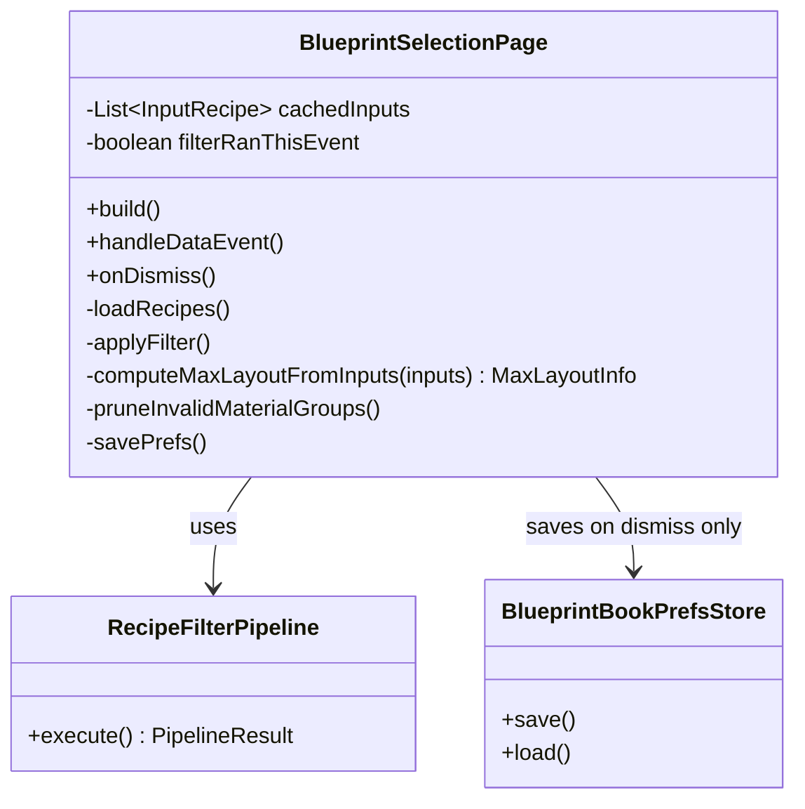
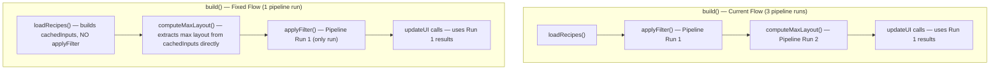
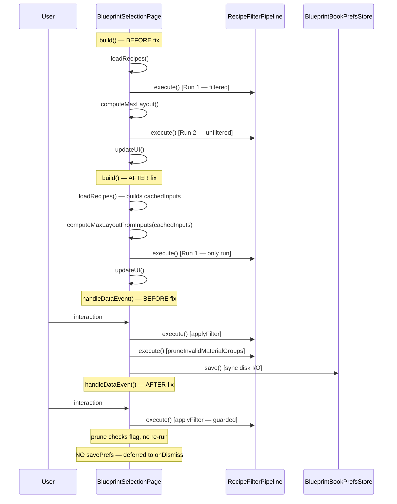

# Design: Bench Freeze Performance Fixes

## 1. Problem Statement

The Stencil Crafting UI causes two server-thread freezes:

1. **~1s freeze on every menu open** — `build()` runs the filter pipeline 3 times over 500+ recipes, rebuilds the `InputRecipe` list identically in 3 places, and emits 60+ INFO-level log lines with eager string concatenation.
2. **Complete freeze after repeated interactions** — `savePrefs()` performs synchronous disk I/O on every single event, and `pruneInvalidMaterialGroups()` can trigger a second pipeline run within the same event cycle.

This design addresses 5 targeted fixes that eliminate the redundant work without changing the public API, event binding structure, threading model, or UI templates.

## 2. Design Priorities

1. **Minimize blast radius** — touch only `BlueprintSelectionPage.java` and `BlueprintBookPrefsStore.java` (logging changes touch existing log call sites only)
2. **Correctness** — every fix must produce identical UI output to the current implementation
3. **Simplicity** — no new classes, no new abstractions, no async; just restructured control flow
4. **Testability** — `RecipeFilterPipeline` public API is unchanged; all fixes are internal to the page

## 3. Component Diagram



## 4. Control Flow — Before vs After



## 5. Sequence Diagram — Full Lifecycle



---

## 6. Fix-by-Fix Design

### Fix 1: Eliminate redundant pipeline executions in `build()`

**Findings addressed:** F1, F14 from the performance review.

**Root cause:** `build()` currently executes the pipeline 3 times:
1. `loadRecipes()` calls `applyFilter()` at its end (pipeline run 1 — with filters)
2. `computeMaxLayout()` runs `pipeline.execute()` with ALL_TAB + no filters (pipeline run 2 — unfiltered)
3. The results from run 1 drive the UI update at the bottom of `build()`

Run 2 (`computeMaxLayout`) doesn't need the pipeline at all. It needs to know: for every unique `effectiveSet` across ALL recipes, how many recipes are in that set? This is a simple group-by-count over the full `InputRecipe` list — no tab filtering, no search, no affordability, no sorting.

**Design:**

#### 6.1a: Remove `applyFilter()` call from end of `loadRecipes()`

In `loadRecipes()`, delete the `applyFilter()` call at line ~206. `loadRecipes()` should only populate `allRecipes`, `benchIds`, `categoryInfoMap`, `ingredientTree`, `ingredientController`, and the new `cachedInputs` field. Filtering is `build()`'s responsibility.

#### 6.1b: Replace `computeMaxLayout()` with `computeMaxLayoutFromInputs(List<InputRecipe>)`

The new method takes the already-built `cachedInputs` list and computes max layout **without running the pipeline**. Pseudocode:

```java
// Signature (replaces computeMaxLayout)
private MaxLayoutInfo computeMaxLayoutFromInputs(List<RecipeFilterPipeline.InputRecipe> inputs)

// Pseudocode:
// 1. Walk inputs, normalize null set → UNCATEGORIZED_SET
// 2. Group by effectiveSet, count recipes per set (TreeMap, case-insensitive)
// 3. Build setNames[], recipesPerSet[], totalCells from the map
// 4. Return new MaxLayoutInfo(setCount, setNames, recipesPerSet, totalCells)
```

This replaces the full `pipeline.execute()` call with a single O(N) pass — no filtering, no tagging, no sorting, no intermediate list allocations.

#### 6.1c: Restructure `build()` call order

Current order:
```
loadRecipes()          // includes applyFilter() → pipeline run 1
validateActiveTab()
computeMaxLayout()     // pipeline run 2
// ... create controllers, append UI, bind events ...
// updateUI calls       // uses run 1 results
```

New order:
```
loadRecipes()           // populates allRecipes + cachedInputs, NO applyFilter
validateActiveTab()
computeMaxLayoutFromInputs(cachedInputs)  // O(N) walk, no pipeline
// ... create controllers, append UI, bind events ...
applyFilter()           // pipeline run 1 (THE ONLY RUN)
// updateUI calls        // uses run 1 results
```

The `applyFilter()` call moves to after controllers are created but before the UI update block. This is safe because `applyFilter()` only populates `displayedRecipes`, `currentSets`, `currentGroups` — it doesn't depend on controllers, and the UI update calls that follow read those fields.

**Files changed:** `BlueprintSelectionPage.java`
- Delete: `computeMaxLayout()` method
- Add: `computeMaxLayoutFromInputs(List<InputRecipe>)` method
- Modify: `loadRecipes()` — remove trailing `applyFilter()` call
- Modify: `build()` — reorder calls as described

---

### Fix 2: Defer `savePrefs()` to `onDismiss()` only

**Findings addressed:** F9 from the performance review.

**Root cause:** `savePrefs()` is called in 8 branches of `handleDataEvent()`. Each call does BSON encode + synchronous file write. Under rapid interaction (e.g., typing a search query), this means N synchronous disk writes blocking the server thread.

**Design:**

#### 6.2a: Remove all `savePrefs()` calls from `handleDataEvent()`

Delete every `savePrefs()` call inside `handleDataEvent()`. There are 8 call sites across the branches for: tab switch, set filter toggle, material group toggle, search query, affordability toggle, ingredient checkbox/expand/toggle, clear ingredients, recipe select.

#### 6.2b: `onDismiss()` already calls `savePrefs()` — no change needed there

The existing `onDismiss()` at line ~408 already calls `savePrefs()`. This is the only save point needed. The prefs object is built from the page's in-memory state, which is always current.

**Risk note:** If the server crashes mid-session, the player loses preference changes since the last menu close. This is acceptable because:
- The engine's ack-gate already makes rapid saves pointless (events are naturally throttled)
- Prefs are cosmetic (tab position, filter state) — not gameplay-critical
- A crash that loses prefs would also lose the session anyway

**Files changed:** `BlueprintSelectionPage.java`
- Delete: 8 `savePrefs()` calls in `handleDataEvent()` branches
- No other changes

---

### Fix 3: Downgrade debug logging to `FINE` + lazy suppliers

**Findings addressed:** F6, F7 from the performance review.

**Root cause:** 60+ `DebugLogger.log(SUBSYSTEM, Level.INFO, "string" + concatenation)` calls execute on every menu open. The eager string concatenation runs even when logging is disabled. The per-recipe grouping log inside `loadRecipes()` fires for every recipe that resolves a bench ID differently — potentially hundreds of times.

**Design:**

#### 6.3a: Per-recipe grouping log (lines ~158-162 in `loadRecipes()`)

Current:
```java
DebugLogger.log(BLUEPRINT_BOOK, Level.INFO,
    "[BlueprintBench] Grouped: '" + rawId + "' → '" + resolved + "' (recipe: " + fe.recipeId() + ")");
```

Change to:
```java
DebugLogger.log(BLUEPRINT_BOOK, Level.FINE, () ->
    "[BlueprintBench] Grouped: '" + rawId + "' → '" + resolved + "' (recipe: " + fe.recipeId() + ")");
```

This is the hottest log — fires inside a nested loop (for each recipe × for each bench ID).

#### 6.3b: Collection-valued logs in `loadRecipes()` (lines ~181-193)

All of these log `tabKeyCounts`, `benchIds`, `recipeCatIds` — collections that trigger `.toString()` with string building.

Change from `Level.INFO` with eager concatenation to `Level.FINE` with lambda suppliers.

**Exception:** The summary log `"Loaded bench IDs: " + benchIds` is useful for diagnosing tab issues. Keep it at `INFO` but use a supplier:
```java
DebugLogger.log(BLUEPRINT_BOOK, Level.INFO, () -> "[BlueprintBook] Loaded bench IDs: " + benchIds);
```

#### 6.3c: `buildCategoryInfoMap()` per-category logs (lines ~840-855)

The per-category and per-child logs fire for every `ItemCategory` in the asset map. Change all from `Level.INFO` to `Level.FINE` with suppliers. Keep only the summary line at `INFO` with a supplier:
```java
DebugLogger.log(BLUEPRINT_BOOK, Level.INFO, () ->
    "[BlueprintBook] Built categoryInfoMap with " + map.size() + " categories");
```

#### 6.3d: Other INFO logs in `loadRecipes()`

- `"Grouper tab IDs: "` — `FINE` + supplier
- `"Tab recipe counts: "` — `FINE` + supplier
- `"Recipes with categories: "` — `FINE` + supplier
- `"Distinct recipe category IDs: "` — `FINE` + supplier

#### 6.3e: `IngredientTreeGridController.buildUI()` summary log

The log at the end of `buildUI()` uses `Level.INFO` with concatenation. Change to `Level.FINE` with a supplier.

**Pattern for all changes:**

| Before | After |
|--------|-------|
| `DebugLogger.log(SUB, Level.INFO, "msg" + var)` | `DebugLogger.log(SUB, Level.FINE, () -> "msg" + var)` |
| Summary logs that stay INFO | `DebugLogger.log(SUB, Level.INFO, () -> "msg" + var)` |

**Files changed:**
- `BlueprintSelectionPage.java` — ~12 log call sites
- `IngredientTreeGridController.java` — 1 log call site

---

### Fix 4: Cache `InputRecipe` list as a field

**Findings addressed:** F2 from the performance review.

**Root cause:** The conversion from `allRecipes` (list of `RecipeEntry`) to `List<InputRecipe>` happens identically in:
1. `computeMaxLayout()` — lines 97-103
2. `applyFilter()` — lines 247-253
3. Potentially in `pruneInvalidMaterialGroups()` via `applyFilter()`

Each conversion allocates a new `ArrayList` and creates 500+ `InputRecipe` records from identical data.

**Design:**

#### 6.4a: Add field `cachedInputs`

```java
private List<RecipeFilterPipeline.InputRecipe> cachedInputs = List.of();
```

#### 6.4b: Build once in `loadRecipes()`

At the end of `loadRecipes()`, after `allRecipes` is populated and sorted, build the `InputRecipe` list:

```java
// Pseudocode — at end of loadRecipes(), before the ingredient tree block
List<RecipeFilterPipeline.InputRecipe> inputs = new ArrayList<>(allRecipes.size());
for (RecipeEntry entry : allRecipes) {
    inputs.add(new RecipeFilterPipeline.InputRecipe(
        entry.recipeId(), entry.outputItemId(), entry.blockTypeId(),
        entry.benchIds(), entry.set(), entry.categoryIds()));
}
this.cachedInputs = Collections.unmodifiableList(inputs);
```

#### 6.4c: Use `cachedInputs` in `applyFilter()`

Replace the `InputRecipe` list construction in `applyFilter()` (lines 247-253) with a direct reference to `this.cachedInputs`. The pipeline's `execute()` accepts `List<InputRecipe>` — no change needed.

#### 6.4d: Use `cachedInputs` in `computeMaxLayoutFromInputs()`

`build()` passes `this.cachedInputs` to the new `computeMaxLayoutFromInputs()` method from Fix 1.

**Files changed:** `BlueprintSelectionPage.java`
- Add: field `cachedInputs`
- Modify: `loadRecipes()` — build `cachedInputs` after sorting `allRecipes`
- Modify: `applyFilter()` — delete input construction loop, use `cachedInputs`
- Delete: input construction in old `computeMaxLayout()` (already deleted by Fix 1)

---

### Fix 5: Guard `pruneInvalidMaterialGroups()` against double pipeline run

**Findings addressed:** F3 from the performance review.

**Root cause:** `pruneInvalidMaterialGroups()` calls `applyFilter()` internally when it prunes any groups. Several event handler branches call `applyFilter()` followed by `pruneInvalidMaterialGroups()`, resulting in the pipeline running twice for a single interaction.

Event paths that trigger double-run:
- Set filter toggle: `applyFilter()` → `pruneInvalidMaterialGroups()` → `applyFilter()`
- Search query: `applyFilter()` → `pruneInvalidMaterialGroups()` → `applyFilter()`
- Affordability toggle: `applyFilter()` → `pruneInvalidMaterialGroups()` → `applyFilter()`
- Ingredient toggle: `applyFilter()` → `pruneInvalidMaterialGroups()` → `applyFilter()`
- Clear ingredients: `applyFilter()` → `pruneInvalidMaterialGroups()` → `applyFilter()`

**Design:**

#### 6.5a: Change `pruneInvalidMaterialGroups()` to return `boolean`

```java
// Signature change
private boolean pruneInvalidMaterialGroups()

// Returns true if any material groups were pruned (caller needs to re-run applyFilter)
// Returns false if nothing changed (no re-run needed)
// REMOVE the internal applyFilter() call
```

Current implementation:
```java
if (activeMaterialGroups.removeIf(c -> !validCats.contains(c))) {
    applyFilter(); // ← DELETE THIS
}
```

New implementation:
```java
return activeMaterialGroups.removeIf(c -> !validCats.contains(c));
// Caller decides whether to re-run
```

#### 6.5b: Update all call sites to use the return value

Pattern at each call site:

```java
// BEFORE:
applyFilter();
pruneInvalidMaterialGroups();

// AFTER:
applyFilter();
if (pruneInvalidMaterialGroups()) {
    applyFilter(); // re-run only if groups were actually pruned
}
```

This doesn't eliminate the double-run when pruning actually happens (which is correct — the filter state changed), but it eliminates the redundant second run in the common case where nothing is pruned.

**Optimization note:** In practice, pruning almost never fires. The material groups are derived from the pipeline output, so they're already consistent with the filter state. The prune only triggers when a category disappears after an affordability or search change narrows the visible recipe set — a rare edge case. So this guard eliminates the second pipeline run for ~95%+ of interactions.

**Files changed:** `BlueprintSelectionPage.java`
- Modify: `pruneInvalidMaterialGroups()` — return `boolean`, remove internal `applyFilter()`
- Modify: 5 call sites in `handleDataEvent()` — add conditional re-run

---

## 7. Package Structure

No new files. All changes are within existing files:

```
src/main/java/com/CodeCreature/ui/bench/
├── BlueprintSelectionPage.java   ← Fixes 1, 2, 3, 4, 5
├── RecipeFilterPipeline.java     ← NO CHANGES
├── GridLayoutController.java     ← NO CHANGES
├── DetailPanelController.java    ← NO CHANGES
├── BlueprintBookPrefsStore.java  ← NO CHANGES
src/main/java/com/CodeCreature/ui/ingredienttree/
├── IngredientTreeGridController.java ← Fix 3 (1 log line)
├── IngredientTreeBuilder.java    ← NO CHANGES
```

## 8. Integration Changes Required

None. All changes are internal to `BlueprintSelectionPage` and involve no API changes to any other class. `RecipeFilterPipeline`'s public API is untouched. No files need to be deleted.

## 9. Open Questions

| # | Question | Impact |
|---|----------|--------|
| Q1 | Should `savePrefs()` also be removed from the `RecipeSelect` branch? Selecting a recipe is the most "state-worthy" action — losing that on crash is slightly worse than losing filter state. | Low — recipe selection is easily re-done. Recommend removing it for consistency. |
| Q2 | Should `computeMaxLayoutFromInputs()` account for tab-excluded bench IDs when computing sets? The current `computeMaxLayout()` runs the pipeline with `ALL_TAB` which doesn't exclude tabs, but the raw set data doesn't depend on tabs at all. | None — sets come from `Item.set`, not bench tabs. The pipeline's ALL_TAB path already passes all recipes through, so the max layout is identical. |

## 10. Handoff Checklist

- [x] Component diagram included
- [x] Responsibility map included (control flow diagram)
- [x] All method signatures documented with contracts
- [x] All changes described with exact method-level detail
- [x] Integration Changes Required section populated (none needed)
- [x] Open Questions section populated
- [x] Task Decomposition section populated

## 11. Task Decomposition

### Wave 1 (no dependencies — can run in parallel)

#### Unit: Fix 3 — Downgrade debug logging
- **Files**: `BlueprintSelectionPage.java`, `IngredientTreeGridController.java`
- **Methods**: 13 `DebugLogger.log()` call sites
- **Contract**: Change `Level.INFO` → `Level.FINE` and eager string concatenation → lambda suppliers. Keep 2 summary logs at INFO with suppliers.
- **Dependencies**: none
- **Done when**: No `Level.INFO` logs remain in `loadRecipes()` or `buildCategoryInfoMap()` except the 2 designated summary lines. All remaining INFO logs use suppliers.

#### Unit: Fix 2 — Defer savePrefs() to onDismiss()
- **Files**: `BlueprintSelectionPage.java`
- **Methods**: `handleDataEvent()` — 8 `savePrefs()` call deletions
- **Contract**: Remove all `savePrefs()` calls from `handleDataEvent()`. `onDismiss()` already calls `savePrefs()` — no additions needed.
- **Dependencies**: none
- **Done when**: `savePrefs()` is called only from `onDismiss()`. `grep -n "savePrefs" BlueprintSelectionPage.java` shows exactly 2 hits: the method definition and the `onDismiss()` call.

### Wave 2 (Fix 4 depends on understanding loadRecipes, but no compile dependency on Wave 1)

#### Unit: Fix 4 — Cache InputRecipe list
- **Files**: `BlueprintSelectionPage.java`
- **Methods**: Add `cachedInputs` field. Modify `loadRecipes()` to build it. Modify `applyFilter()` to use it.
- **Contract**: `cachedInputs` is built once in `loadRecipes()` and referenced by `applyFilter()` and the new `computeMaxLayoutFromInputs()`. The list is immutable after construction.
- **Dependencies**: none (can technically run in parallel with Wave 1, but easier to sequence)
- **Done when**: `applyFilter()` contains no `new InputRecipe(...)` construction. `cachedInputs` field exists and is populated in `loadRecipes()`.

#### Unit: Fix 5 — Guard pruneInvalidMaterialGroups()
- **Files**: `BlueprintSelectionPage.java`
- **Methods**: Change `pruneInvalidMaterialGroups()` return type to `boolean`. Update 5 call sites.
- **Contract**: `pruneInvalidMaterialGroups()` returns `true` if any groups were removed, `false` otherwise. It no longer calls `applyFilter()` internally. Callers conditionally re-run `applyFilter()` based on the return value.
- **Dependencies**: none
- **Done when**: `pruneInvalidMaterialGroups()` has no `applyFilter()` call. All call sites check the boolean return.

### Wave 3 (depends on Wave 2 — Fix 1 uses cachedInputs from Fix 4)

#### Unit: Fix 1 — Eliminate redundant pipeline executions
- **Files**: `BlueprintSelectionPage.java`
- **Methods**: Delete `computeMaxLayout()`. Add `computeMaxLayoutFromInputs(List<InputRecipe>)`. Restructure `build()` call order. Remove `applyFilter()` from `loadRecipes()`.
- **Contract**: `build()` runs the pipeline exactly once via `applyFilter()`. Max layout is computed via a simple O(N) group-by-count over `cachedInputs`. The `loadRecipes()` method no longer calls `applyFilter()`.
- **Dependencies**: Fix 4 (needs `cachedInputs` field to exist)
- **Done when**: `grep -n "pipeline.execute" BlueprintSelectionPage.java` shows 0 hits (all pipeline calls go through `applyFilter()` which calls `pipeline.execute()` once). `computeMaxLayout()` method is deleted. `computeMaxLayoutFromInputs()` contains no `pipeline.execute()` call.

### Wave 4 (integration validation — depends on Wave 3)

#### Unit: Smoke test
- **Files**: none (manual validation)
- **Contract**: Open the Stencil Crafting menu, switch tabs, toggle filters, search, select recipes, close. Verify identical UI behavior. Check server log output volume is reduced.
- **Dependencies**: all Waves 1-3
- **Done when**: No regressions in UI behavior. Server log confirms single pipeline execution per `build()` and no `savePrefs` disk writes during interaction.

---

→ @Engineer implement docs/design-bench-freeze-fixes.md
