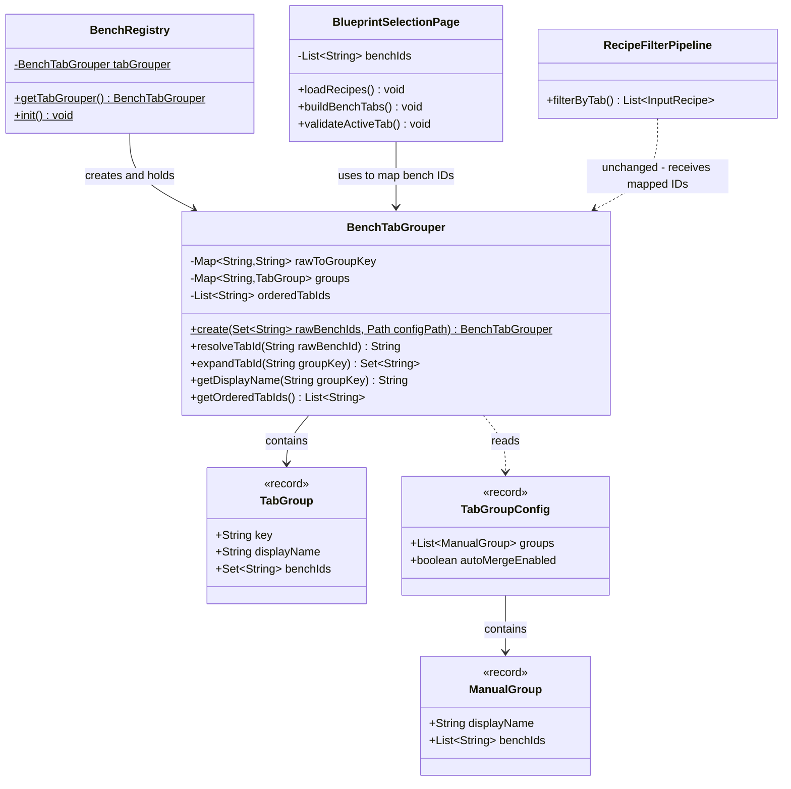
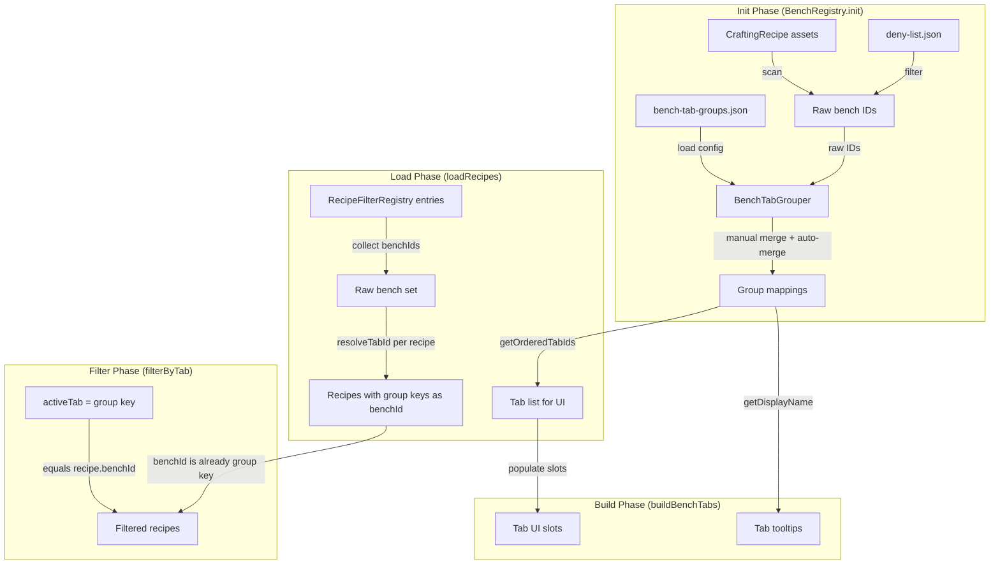
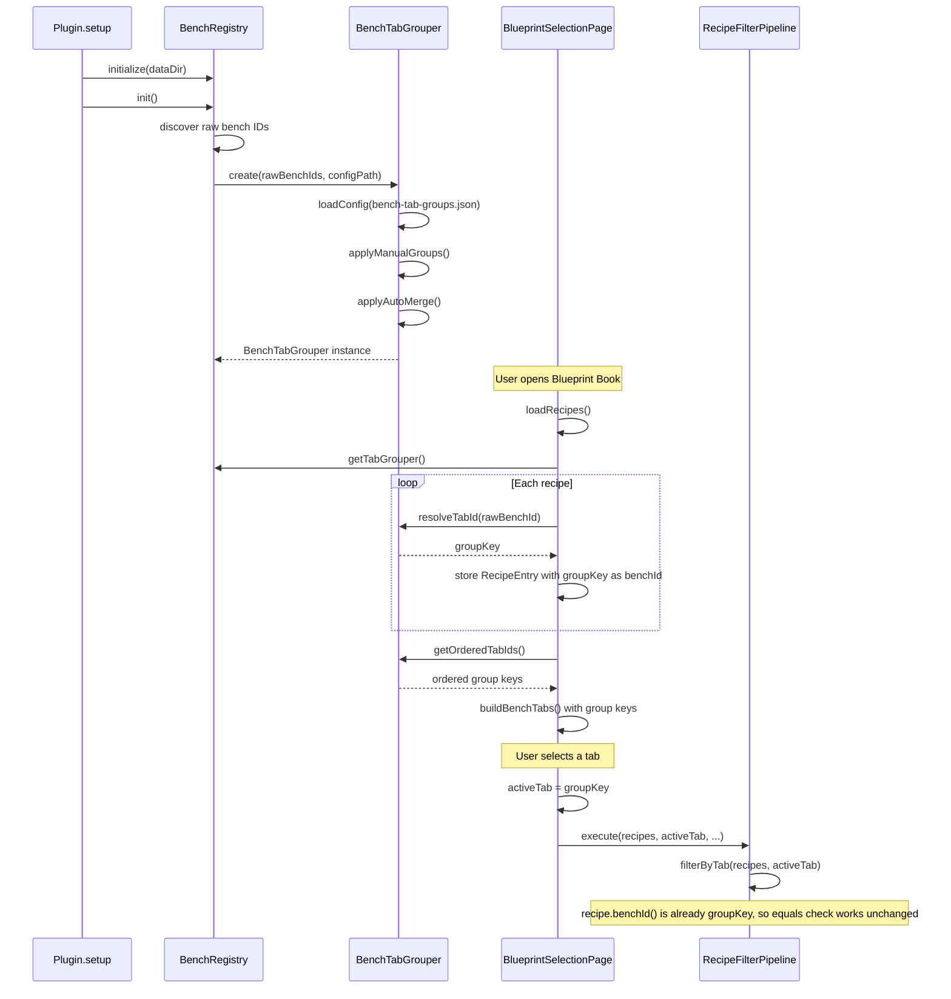

# Design: Bench Tab Grouping System

## 1. Overview

The Bench Tab Grouping system allows multiple discovered bench IDs to be combined into single UI tabs in the Stencil Crafting page. It supports two modes: **auto-merge** (benches with similar names are grouped automatically by shared prefix) and **manual merge** (explicit JSON configuration maps arbitrary bench IDs into named groups). A single new class, `BenchTabGrouper`, sits between raw bench ID discovery and tab construction, mapping raw IDs to group keys so that the existing `RecipeFilterPipeline` requires **zero changes**.

## 2. Design Priorities

1. **Simplicity** — one new class, minimal touchpoints in existing code
2. **Data-driven** — JSON config file; no recompilation to change groupings
3. **Backward compatibility** — ungrouped benches behave identically to today
4. **Testability** — `BenchTabGrouper` is a pure data transformer with no UI dependencies

## 3. Component Diagram



## 4. Responsibility Map



## 5. Sequence Diagram



## 6. JSON Config Format

File: `<pluginDataDir>/bench-tab-groups.json`

```json
{
  "autoMergeEnabled": true,
  "groups": [
    {
      "displayName": "Crafting",
      "benchIds": ["fieldcraft", "workbench"]
    },
    {
      "displayName": "Building",
      "benchIds": ["Builders", "Architectsbench"]
    }
  ]
}
```

### Field reference

| Field | Type | Default | Description |
|-------|------|---------|-------------|
| `autoMergeEnabled` | boolean | `true` | When true, benches not claimed by manual groups are auto-merged by shared prefix |
| `groups` | array | `[]` | Manual group definitions. Each bench ID may appear in at most one group |
| `groups[].displayName` | string | required | Tab tooltip text and group key |
| `groups[].benchIds` | string[] | required | Raw bench IDs to merge into this tab |

### Precedence rules

1. **Manual groups** are applied first. Any bench ID claimed by a manual group is removed from the auto-merge pool.
2. **Auto-merge** runs on remaining unclaimed bench IDs.
3. **Ungrouped** bench IDs (not matched by either) appear as individual tabs.
4. If a bench ID appears in **multiple manual groups**, the **first group wins** and a warning is logged.

## 7. Auto-Merge Algorithm

The auto-merge algorithm groups bench IDs by normalized root word:

1. **Normalize** each bench ID:
   - Replace `_` with space
   - Lowercase
   - Strip trailing tokens matching known suffixes: `"bench"`, `"misc"`, `"table"`
   - Trim whitespace
   - Result is the **root key**
2. **Group** bench IDs sharing the same root key
3. **Single-member groups** remain as individual tabs (no merge needed)
4. **Multi-member groups** become a merged tab:
   - **Group key** = the root key, title-cased (e.g., `"furniture"` → `"Furniture"`)
   - **Display name** = group key (user can override via manual config)
   - **Bench IDs** = all raw IDs in the group

### Examples

| Raw bench IDs | Root key | Merged tab |
|---------------|----------|------------|
| `Architects`, `Architectsbench` | `architects` | "Architects" |
| `Furniture_Bench`, `Furniture Misc` | `furniture` | "Furniture" |
| `Workbench` | `work` | "Workbench" (single → no merge) |
| `Stonecutter` | `stonecutter` | "Stonecutter" (single → no merge) |

## 8. Data Flow Detail

### `loadRecipes()` changes

```
BEFORE:
  benchSet.addAll(fe.benchIds())           → raw bench IDs
  primaryBench = first alphabetically      → raw bench ID
  new RecipeEntry(..., primaryBench, ...)   → stores raw bench ID
  benchIds list = sorted raw bench IDs     → used by buildBenchTabs

AFTER:
  grouper = BenchRegistry.getTabGrouper()
  benchSet.addAll(fe.benchIds())           → still collect raw IDs
  primaryBench = first alphabetically      → raw bench ID
  groupKey = grouper.resolveTabId(primaryBench)  → NEW: map to group key
  new RecipeEntry(..., groupKey, ...)       → stores GROUP KEY as benchId
  benchIds list = grouper.getOrderedTabIds() → group keys for tabs
```

### `buildBenchTabs()` changes

```
BEFORE:
  tooltip = tabDisplayName(benchId)  → replace _ with space

AFTER:
  grouper = BenchRegistry.getTabGrouper()
  tooltip = grouper.getDisplayName(tabId)  → proper display name
```

### `validateActiveTab()` changes

```
BEFORE:
  if (!benchIds.contains(activeTab)) → reset to All

AFTER:
  same logic — benchIds now contains group keys, activeTab is a group key
```

### `filterByTab()` — **NO CHANGES**

Because `RecipeEntry.benchId()` already stores the group key (mapped in `loadRecipes`), and `activeTab` is also a group key, the existing `activeTab.equals(recipe.benchId())` check works without modification.

### `BlueprintBookPrefs` — **NO CHANGES**

`activeTab` is already a string. It now stores a group key instead of a raw bench ID. Old persisted values that don't match a current group key are caught by `validateActiveTab()` and reset to "All".

## 9. Package Structure

```
src/main/java/com/CodeCreature/
├── registry/
│   ├── BenchRegistry.java          ← MODIFIED: create + expose BenchTabGrouper
│   ├── BenchTabGrouper.java        ← NEW
│   └── ...
├── ui/bench/
│   ├── BlueprintSelectionPage.java ← MODIFIED: use grouper in loadRecipes/buildBenchTabs
│   └── ...
```

## 10. Integration Changes Required

### `BenchRegistry.java`

| Change | Description |
|--------|-------------|
| Add field | `private static BenchTabGrouper tabGrouper` |
| Add to `init()` | After configs are built, create `BenchTabGrouper.create(configs.keySet(), dataDirectory.resolve("bench-tab-groups.json"))` |
| Add getter | `public static BenchTabGrouper getTabGrouper()` |
| Update `reset()` | Set `tabGrouper = null` |

### `BlueprintSelectionPage.java`

| Change | Description |
|--------|-------------|
| `loadRecipes()` | After collecting raw benchIds, get grouper. Map `primaryBench` through `grouper.resolveTabId()`. Populate `benchIds` from `grouper.getOrderedTabIds()`. |
| `buildBenchTabs()` | Use `grouper.getDisplayName(benchId)` instead of `tabDisplayName(benchId)` for tooltip |
| `tabDisplayName()` | Can remain as fallback, but primary path uses grouper |

### Files NOT changed

| File | Reason |
|------|--------|
| `RecipeFilterPipeline.java` | `filterByTab()` works unchanged — recipes already carry group keys |
| `BlueprintBookPrefs.java` | `activeTab` field is a string — works with group keys as-is |
| `BlueprintBookPrefsStore.java` | No changes needed |
| `RecipeFilterRegistry.java` | Produces raw bench IDs — grouping happens downstream |

## 11. Open Questions

1. **Suffix list**: Should the auto-merge suffix list (`bench`, `misc`, `table`) be configurable in the JSON, or is a hardcoded list sufficient? (Design assumes hardcoded for simplicity.)
2. **Tab icons**: Should groups be able to specify a custom icon? (Design assumes no — tooltip-only, matching current behavior.)
3. **Case sensitivity**: Bench IDs from recipes are mixed-case (`Furniture_Bench`, `Builders`). Auto-merge normalizes to lowercase for matching. Manual group `benchIds` should be **case-insensitive** to avoid user errors. Confirm this is acceptable.

## 12. Handoff Checklist

- [x] Component diagram included
- [x] Responsibility map included
- [x] All interfaces have Javadoc contracts
- [x] All skeleton files created with TODO markers
- [x] Integration Changes Required section populated
- [x] Open Questions section populated (even if empty)
- [x] Task Decomposition section populated

## 13. Task Decomposition

### Wave 1 (no dependencies — can run in parallel)

#### Unit: BenchTabGrouper.java

- **Methods**: `create()`, `loadConfig()`, `normalizeForAutoMerge()`, `applyManualGroups()`, `applyAutoMerge()`, `resolveTabId()`, `expandTabId()`, `getDisplayName()`, `getOrderedTabIds()`
- **Contract**: Pure data transformer — given a set of raw bench IDs and a config path, produces bidirectional mappings between raw bench IDs and group keys. Thread-safe after construction (immutable state).
- **Dependencies**: none
- **Done when**: Unit tests pass for manual merge, auto-merge, overlap handling, missing config, empty config, and single-bench-no-merge cases

#### Unit: bench-tab-groups.json (example config)

- **Files**: `<pluginDataDir>/bench-tab-groups.json`
- **Contract**: Valid JSON matching the schema. Provides at least one manual group for testing.
- **Dependencies**: none
- **Done when**: File exists and is valid JSON

### Wave 2 (depends on Wave 1)

#### Unit: BenchRegistry integration

- **Methods**: `init()` (modify), `getTabGrouper()` (add), `reset()` (modify)
- **Contract**: After `init()`, `getTabGrouper()` returns a non-null `BenchTabGrouper` built from discovered bench IDs and the config file
- **Dependencies**: Wave 1 (BenchTabGrouper must exist)
- **Done when**: `BenchRegistry.getTabGrouper()` returns valid grouper after init; reset clears it

### Wave 3 (depends on Wave 2)

#### Unit: BlueprintSelectionPage integration

- **Files**: `BlueprintSelectionPage.java`
- **Methods**: `loadRecipes()` (modify), `buildBenchTabs()` (modify)
- **Contract**: Recipes carry group keys as benchId; tabs display group keys with proper display names; filter pipeline works unchanged
- **Dependencies**: Wave 2 (BenchRegistry.getTabGrouper() must work)
- **Done when**: Blueprint book opens with grouped tabs; selecting a grouped tab shows recipes from all constituent benches; ungrouped benches appear as individual tabs; persisted activeTab validates correctly against group keys
