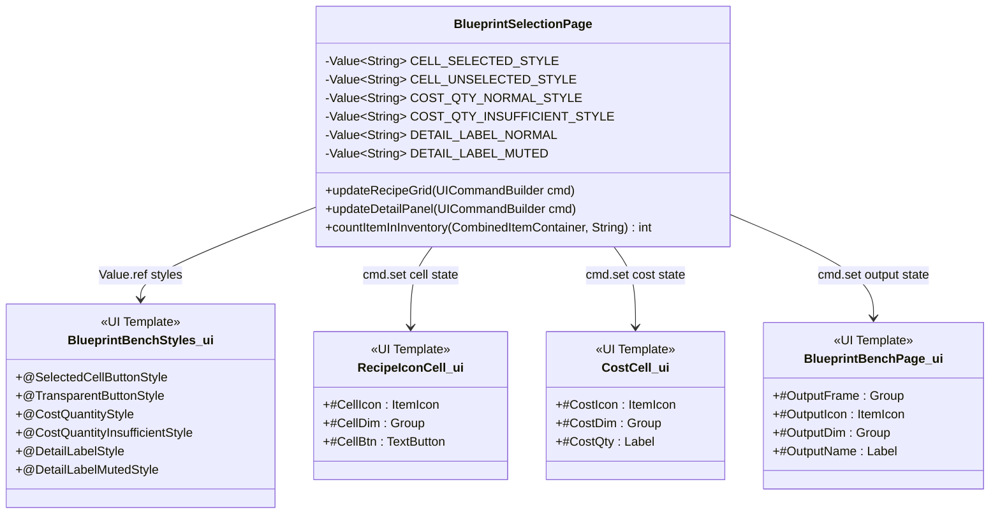
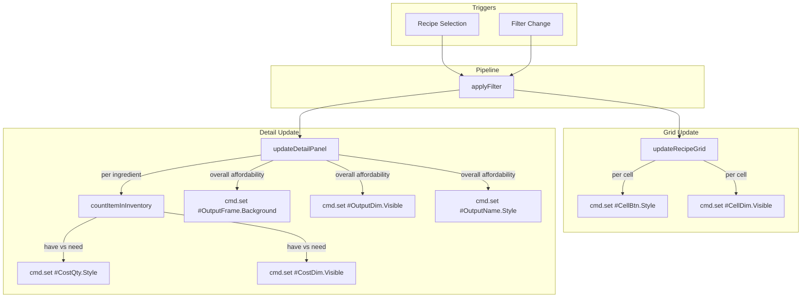
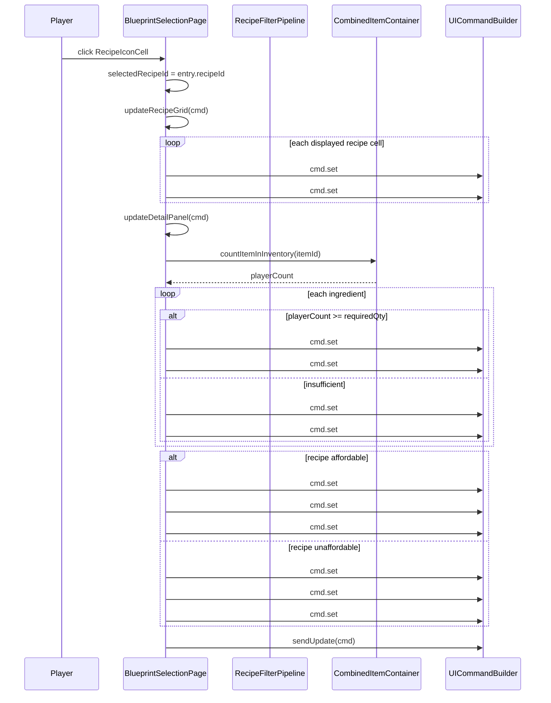

# Design: Blueprint Bench Visual States

**Feature:** F2605051400 — Blueprint Bench Visual State Enhancements  
**Stories:** S2605051405 (Selected Cell Highlight), S2605051410 (Per-Ingredient Cost Affordability), S2605051415 (Output Detail Panel States)

---

## 1. Overview

This design adds three interconnected visual state layers to the Blueprint Bench UI: (1) selected-cell highlight on the recipe icon grid, (2) per-ingredient affordability feedback on cost cells, and (3) tri-state output detail panel (empty, affordable, unaffordable). All state changes use `cmd.set()` within the existing `updateRecipeGrid()` and `updateDetailPanel()` methods — no structural changes to the build/update lifecycle.

## 2. Design Priorities

1. **Framework-native patterns** — use `cmd.set()` with `Value.ref()` for style switching, matching the existing `FILTER_ACTIVE/FILTER_INACTIVE` pattern
2. **Simplicity** — reuse existing PatchStyle assets from `Common.ui` (Tertiary_Active, Destructive, Disabled) rather than creating new image assets
3. **Testability** — the new `countItemInInventory()` helper is a pure function over `CombinedItemContainer` slots, easily testable in isolation
4. **Consistency** — visual language matches existing affordability treatment (`#CellDim` overlay, muted text colors)

## 3. Component Diagram



## 4. Responsibility Map



## 5. Sequence Diagram



## 6. Package Structure

```
src/main/resources/Common/UI/Custom/Pages/BlueprintBench/
├── BlueprintBenchPage.ui        ← MODIFIED (add #OutputFrame, #OutputDim)
├── BlueprintBenchStyles.ui      ← MODIFIED (add 3 new styles)
├── RecipeIconCell.ui            ← UNCHANGED (no template changes needed)
├── CostCell.ui                  ← MODIFIED (add #CostDim overlay)
└── ...

src/main/java/com/UnobstructedThirdPerson/placeblock/ui/
└── BlueprintSelectionPage.java  ← MODIFIED (new constants, updated methods, new helper)
```

## 7. UI Template Changes

### 7.1 RecipeIconCell.ui — NO CHANGES

The template stays as-is. The `#CellBtn` TextButton already accepts runtime `Style` changes via `cmd.set()`. The selected state is driven entirely server-side by switching between `@TransparentButtonStyle` (unselected) and `@SelectedCellButtonStyle` (selected).

### 7.2 CostCell.ui — Add `#CostDim` overlay

Add a dim overlay group between `#CostIcon` and `#CostQty`, matching the pattern used in `RecipeIconCell.ui`:

```diff
 Group {
     Background: "../../Common/BlockSelectorSlotBackground.png";
     ItemIcon #CostIcon {
         Anchor: (Full: 2);
         ShowItemTooltip: true;
     }
+    Group #CostDim {
+        Anchor: (Full: 2);
+        Background: #000000(0.5);
+        Visible: false;
+    }
 }
```

### 7.3 BlueprintBenchPage.ui — Add `#OutputFrame` ID and `#OutputDim` overlay

Add an ID to the output icon background group and insert a dim overlay:

```diff
-Group {
+Group #OutputFrame {
     Anchor: (Height: 96, Width: 96, Top: 0);
     Background: "../../Common/BlockSelectorSlotBackground.png";

     ItemIcon #OutputIcon {
         Anchor: (Full: 4);
         ShowItemTooltip: true;
     }
+    Group #OutputDim {
+        Anchor: (Full: 2);
+        Background: #000000(0.5);
+        Visible: false;
+    }
 }
```

## 8. Style Definitions

Add to `BlueprintBenchStyles.ui`:

### 8.1 `@SelectedCellButtonStyle` — Selected cell highlight

Uses `Tertiary_Active.png` (blue tint) for the selected cell button overlay. The existing `@TransparentButtonStyle` remains unchanged for unselected cells.

```ui
@SelectedCellButtonStyle = TextButtonStyle(
    Default: (Background: $C.@TertiaryActiveButtonBackground, LabelStyle: (FontSize: 1, TextColor: #000000(0.0))),
    Hovered: (Background: $C.@TertiaryActiveButtonBackground, LabelStyle: (FontSize: 1, TextColor: #000000(0.0))),
    Pressed: (Background: $C.@TertiaryActiveButtonBackground, LabelStyle: (FontSize: 1, TextColor: #000000(0.0)))
);
```

### 8.2 `@CostQuantityInsufficientStyle` — Red quantity text for unaffordable ingredients

```ui
@CostQuantityInsufficientStyle = LabelStyle(
    ...$C.@DefaultLabelStyle,
    FontSize: 11, TextColor: #ff4444,
    HorizontalAlignment: End, VerticalAlignment: End
);
```

### 8.3 `@DetailLabelMutedStyle` — Muted output name for unaffordable/empty states

```ui
@DetailLabelMutedStyle = LabelStyle(
    ...$C.@DefaultLabelStyle,
    FontSize: 16, TextColor: #6e7da1, RenderBold: true,
    HorizontalAlignment: Start, VerticalAlignment: Center
);
```

## 9. Java Constants

Add to `BlueprintSelectionPage.java` alongside existing `FILTER_ACTIVE`/`FILTER_INACTIVE`:

```java
// Story 1: Selected cell highlight
private static final Value<String> CELL_SELECTED_STYLE =
    Value.ref("Pages/BlueprintBench/BlueprintBenchStyles.ui", "SelectedCellButtonStyle");
private static final Value<String> CELL_UNSELECTED_STYLE =
    Value.ref("Pages/BlueprintBench/BlueprintBenchStyles.ui", "TransparentButtonStyle");

// Story 2: Per-ingredient cost affordability
private static final Value<String> COST_QTY_NORMAL =
    Value.ref("Pages/BlueprintBench/BlueprintBenchStyles.ui", "CostQuantityStyle");
private static final Value<String> COST_QTY_INSUFFICIENT =
    Value.ref("Pages/BlueprintBench/BlueprintBenchStyles.ui", "CostQuantityInsufficientStyle");

// Story 3: Output detail panel states
private static final Value<String> DETAIL_LABEL_NORMAL =
    Value.ref("Pages/BlueprintBench/BlueprintBenchStyles.ui", "DetailLabelStyle");
private static final Value<String> DETAIL_LABEL_MUTED =
    Value.ref("Pages/BlueprintBench/BlueprintBenchStyles.ui", "DetailLabelMutedStyle");

// Output frame background paths (string-based Background switching)
private static final String OUTPUT_BG_NORMAL = "../../Common/BlockSelectorSlotBackground.png";
private static final String OUTPUT_BG_EMPTY = "Common/Buttons/Disabled.png";
private static final String OUTPUT_BG_UNAFFORDABLE = "Common/Buttons/Destructive.png";
```

> **Note on Output Frame Background:** `Group.Background` accepts string paths directly via `cmd.set(sel + ".Background", "path.png")`. Using `PatchStyle` via `Value.ref` for `Group.Background` is unverified — use string paths as the primary approach. If Disabled.png/Destructive.png don't render correctly as Group backgrounds (they're 9-patch textures), fall back to `BlockSelectorSlotBackground.png` for all states and rely solely on `#OutputDim` visibility for the unaffordable indicator.

## 10. Server Logic Changes

### 10.1 `updateRecipeGrid()` — Add `#CellBtn.Style` per cell

**What changes:** After setting `#CellIcon.ItemId` and `#CellDim.Visible`, also set `#CellBtn.Style` based on whether the cell's recipe matches `selectedRecipeId`.

**Logic:**
```
for each visible cell:
    isSelected = (entry.recipeId equals selectedRecipeId)
    cmd.set(cellSel + " #CellBtn.Style", isSelected ? CELL_SELECTED_STYLE : CELL_UNSELECTED_STYLE)
```

**Edge case:** When hiding remaining cells (`hideRemainingCells`), also reset `#CellBtn.Style` to `CELL_UNSELECTED_STYLE` to prevent stale highlights.

### 10.2 `updateDetailPanel()` — Add per-ingredient and output-level affordability

**What changes:**

1. **Obtain inventory container** at the start of the method (same pattern as `applyFilter()`):
   ```
   Player player = playerStore.getComponent(playerRef_ref, Player.getComponentType())
   CombinedItemContainer container = player.getInventory().getCombinedBackpackStorageHotbar()
   ```

2. **Per-ingredient loop:** After setting `#CostIcon.ItemId` and `#CostQty.Text`, compute:
   ```
   int playerHas = countItemInInventory(container, itemId)
   boolean sufficient = (playerHas >= requiredQty)
   cmd.set(sel + " #CostDim.Visible", !sufficient)
   cmd.set(sel + " #CostQty.Style", sufficient ? COST_QTY_NORMAL : COST_QTY_INSUFFICIENT)
   ```

3. **Overall affordability:** After the ingredient loop, determine if the recipe is globally affordable (reuse existing `isAffordable()` or derive from per-ingredient results). Set output frame state:
   ```
   if selectedRecipeId != null and entry found:
       boolean affordable = allIngredientsAffordable  // or use isAffordable()
       cmd.set("#OutputFrame.Background", affordable ? OUTPUT_BG_NORMAL : OUTPUT_BG_UNAFFORDABLE)
       cmd.set("#OutputDim.Visible", !affordable)
       cmd.set("#OutputName.Style", affordable ? DETAIL_LABEL_NORMAL : DETAIL_LABEL_MUTED)
   else (no selection):
       cmd.set("#OutputFrame.Background", OUTPUT_BG_EMPTY)
       cmd.set("#OutputDim.Visible", false)
       cmd.set("#OutputName.Style", DETAIL_LABEL_MUTED)
   ```

4. **Hidden cost cells:** When hiding remaining cost cells, also reset their dim and style:
   ```
   cmd.set(sel + " #CostDim.Visible", false)
   cmd.set(sel + " #CostQty.Style", COST_QTY_NORMAL)
   ```

### 10.3 New helper: `countItemInInventory()`

**Purpose:** Count total quantity of a specific item ID across all slots in a `CombinedItemContainer`. No such method exists on the container API — must iterate manually.

**Contract:** Returns the total count of items matching `itemId` across all container slots. Returns 0 if `container` is null.

## 11. State Matrix

### 11.1 Recipe Icon Cell States

| Selected? | Affordable? | `#CellBtn.Style` | `#CellDim.Visible` | Visual |
|-----------|-------------|-------------------|---------------------|--------|
| No | Yes | `@TransparentButtonStyle` | `false` | Normal cell |
| No | No | `@TransparentButtonStyle` | `true` | Dimmed cell |
| Yes | Yes | `@SelectedCellButtonStyle` | `false` | Blue highlight |
| Yes | No | `@SelectedCellButtonStyle` | `true` | Blue highlight + dim overlay |

### 11.2 Cost Cell States

| Player has enough? | `#CostDim.Visible` | `#CostQty.Style` | Visual |
|--------------------|---------------------|-------------------|--------|
| Yes | `false` | `@CostQuantityStyle` | Normal icon, white text |
| No | `true` | `@CostQuantityInsufficientStyle` | Dimmed icon, red text |
| Hidden (no ingredient) | `false` | `@CostQuantityStyle` | Not visible (parent hidden) |

### 11.3 Output Detail Panel States

| State | `#OutputFrame.Background` | `#OutputDim.Visible` | `#OutputName.Style` | `#OutputName.Text` |
|-------|---------------------------|----------------------|---------------------|--------------------|
| Empty (no recipe) | `Disabled.png` | `false` | `@DetailLabelMutedStyle` | "No recipe selected" |
| Affordable | `BlockSelectorSlotBackground.png` | `false` | `@DetailLabelStyle` | Recipe name |
| Unaffordable | `Destructive.png` | `true` | `@DetailLabelMutedStyle` | Recipe name |

## 12. Skeleton Code

### 12.1 `countItemInInventory` — New helper method

```java
/**
 * Counts the total quantity of items matching {@code itemId} across all slots
 * in the given combined container.
 *
 * <p>Iterates every slot in every sub-container (backpack, storage, hotbar).
 * Uses {@link ItemStack#getItemId()} for identity comparison.
 *
 * @param container the player's combined backpack+storage+hotbar container; may be null
 * @param itemId    the item ID to count (e.g. "hytale:oak_log")
 * @return total count across all slots, or 0 if container is null
 */
private int countItemInInventory(@Nullable CombinedItemContainer container, String itemId) {
    // TODO: Iterate all slots in container, sum quantities where ItemStack.getItemId() matches itemId.
    //       CombinedItemContainer may expose sub-containers via getContainers() or provide
    //       a slot-level iteration API. Verify the exact API during implementation.
    //       Return 0 if container is null.
    throw new UnsupportedOperationException("Not yet implemented");
}
```

### 12.2 `updateRecipeGrid` — Modified method signature (existing)

```java
/**
 * Updates the recipe icon grid to reflect current filter results and selection state.
 *
 * <p>For each visible cell, sets:
 * <ul>
 *   <li>{@code #CellIcon.ItemId} — the output item of the recipe</li>
 *   <li>{@code #CellDim.Visible} — {@code true} if unaffordable</li>
 *   <li>{@code #CellBtn.Style} — {@link #CELL_SELECTED_STYLE} if this cell's recipe
 *       matches {@link #selectedRecipeId}, else {@link #CELL_UNSELECTED_STYLE}</li>
 * </ul>
 *
 * <p>Hides unused cells and unused groups. Resets {@code #CellBtn.Style} on hidden cells
 * to prevent stale highlight state.
 *
 * @param cmd the UI command builder to append set commands to
 */
private void updateRecipeGrid(UICommandBuilder cmd) {
    // TODO: Add cmd.set(cellSel + " #CellBtn.Style", ...) after existing CellIcon/CellDim sets.
    //       Compare entry.recipeId() with selectedRecipeId to choose style.
    //       Also update hideRemainingCells() to reset #CellBtn.Style.
}
```

### 12.3 `updateDetailPanel` — Modified method signature (existing)

```java
/**
 * Updates the right-column detail panel for the currently selected recipe.
 *
 * <p>Handles three states:
 * <ol>
 *   <li><b>No recipe selected:</b> empty output icon, muted label, disabled frame background</li>
 *   <li><b>Affordable recipe:</b> normal frame, no dim, normal label, per-ingredient green state</li>
 *   <li><b>Unaffordable recipe:</b> destructive frame, dim overlay, muted label,
 *       per-ingredient red/dim for insufficient materials</li>
 * </ol>
 *
 * <p>Per-ingredient affordability:
 * <ul>
 *   <li>Uses {@link #countItemInInventory} to get player's count for each ingredient</li>
 *   <li>Sets {@code #CostDim.Visible} and {@code #CostQty.Style} per cost cell</li>
 * </ul>
 *
 * <p>Output frame state:
 * <ul>
 *   <li>Sets {@code #OutputFrame.Background} to normal/empty/destructive path</li>
 *   <li>Sets {@code #OutputDim.Visible} for dim overlay</li>
 *   <li>Sets {@code #OutputName.Style} for label treatment</li>
 * </ul>
 *
 * @param cmd the UI command builder to append set commands to
 */
private void updateDetailPanel(UICommandBuilder cmd) {
    // TODO: Obtain CombinedItemContainer from player inventory (same as applyFilter pattern).
    // TODO: In the ingredient loop, call countItemInInventory() for each item, compare to required qty.
    // TODO: Set #CostDim.Visible and #CostQty.Style per cost cell based on sufficiency.
    // TODO: After ingredient loop, determine overall affordability.
    // TODO: Set #OutputFrame.Background, #OutputDim.Visible, #OutputName.Style based on state.
    // TODO: In the "no recipe" branch, set empty/disabled state on output frame.
    // TODO: When hiding unused cost cells, reset #CostDim.Visible=false and #CostQty.Style=COST_QTY_NORMAL.
}
```

### 12.4 `hideRemainingCells` — Modified method signature (existing)

```java
/**
 * Hides cells [{@code startCell}..{@code cellsPerSet[groupIdx]}) in the given group.
 * Also resets {@code #CellBtn.Style} to {@link #CELL_UNSELECTED_STYLE} on each hidden cell
 * to clear any stale selected-highlight state.
 *
 * @param cmd       the UI command builder
 * @param groupIdx  the group (set) index in the max layout
 * @param startCell the first cell index to hide within the group
 */
private void hideRemainingCells(UICommandBuilder cmd, int groupIdx, int startCell) {
    // TODO: Add cmd.set for #CellBtn.Style alongside existing .Visible=false.
}
```

## 13. Integration Changes Required

| File | Change | Details |
|------|--------|---------|
| `BlueprintBenchStyles.ui` | Add 3 style definitions | `@SelectedCellButtonStyle`, `@CostQuantityInsufficientStyle`, `@DetailLabelMutedStyle` |
| `CostCell.ui` | Add `#CostDim` group | Dim overlay between `#CostIcon` and `#CostQty` — matches `RecipeIconCell.ui` pattern |
| `BlueprintBenchPage.ui` | Add `#OutputFrame` ID, `#OutputDim` group | ID on existing output background group; dim overlay after `#OutputIcon` |
| `BlueprintSelectionPage.java` | Add 8 constants | 6 `Value.ref` + 2 string background paths |
| `BlueprintSelectionPage.java` | Add `countItemInInventory()` | New private helper method |
| `BlueprintSelectionPage.java` | Modify `updateRecipeGrid()` | Add `#CellBtn.Style` set per cell |
| `BlueprintSelectionPage.java` | Modify `hideRemainingCells()` | Reset `#CellBtn.Style` on hidden cells |
| `BlueprintSelectionPage.java` | Modify `updateDetailPanel()` | Add per-ingredient and output-level affordability logic |

No files need to be deleted.

## 14. Open Questions

1. **`CombinedItemContainer` slot iteration API:** The exact method for iterating slots (e.g., `getContainers()`, `getSlotCount()`/`getSlot(int)`, or `forEach()`) must be verified during implementation. The `countItemInInventory()` helper depends on this.

2. **`Group.Background` with PatchStyle textures:** Setting `#OutputFrame.Background` to `Disabled.png` or `Destructive.png` (which are 9-patch source images) may not render the same as a `PatchStyle` declaration. If the border/stretch behavior is wrong, fall back to `BlockSelectorSlotBackground.png` for all states and rely on `#OutputDim` alone for visual differentiation.

3. **`Label.Style` via `cmd.set()`:** Switching `Label.Style` at runtime via `Value.ref` is untested (unlike `TextButton.Style` which is confirmed). If it fails, fall back to `cmd.set("#OutputName.TextColor", ...)` and `cmd.set("#CostQty.TextColor", ...)` using raw hex values.

## 15. Handoff Checklist

- [x] Component diagram included
- [x] Responsibility map included
- [x] All interfaces have Javadoc contracts
- [x] All skeleton files created with TODO markers
- [x] Integration Changes Required section populated
- [x] Open Questions section populated
- [x] Task Decomposition section populated

## 16. Task Decomposition

### Wave 1 (no dependencies — can run in parallel)

#### Unit: BlueprintBenchStyles.ui — New style definitions
- **Changes**: Add `@SelectedCellButtonStyle`, `@CostQuantityInsufficientStyle`, `@DetailLabelMutedStyle`
- **Contract**: Define three new styles matching the specifications in Section 8
- **Dependencies**: none
- **Done when**: Styles are syntactically valid and reference correct `$C.@` variables

#### Unit: CostCell.ui — Add dim overlay
- **Changes**: Insert `#CostDim` group
- **Contract**: Add a semi-transparent dim overlay group between `#CostIcon` and the closing `}` of its parent, matching `RecipeIconCell.ui`'s `#CellDim` pattern
- **Dependencies**: none
- **Done when**: `#CostDim` is targetable via `cmd.set("#CostGrid[N] #CostDim.Visible", ...)`

#### Unit: BlueprintBenchPage.ui — Add output frame IDs and dim overlay
- **Changes**: Add `#OutputFrame` ID to output background group, add `#OutputDim` group inside it
- **Contract**: Make the output icon frame targetable for background changes and add a dim overlay for unaffordable state
- **Dependencies**: none
- **Done when**: `#OutputFrame.Background` and `#OutputDim.Visible` are targetable via `cmd.set()`

#### Unit: countItemInInventory() — New helper method
- **Changes**: Add `countItemInInventory(CombinedItemContainer, String)` to `BlueprintSelectionPage.java`
- **Contract**: Return total quantity of items with matching `itemId` across all slots in the container. Return 0 for null container.
- **Dependencies**: none (requires API discovery of `CombinedItemContainer` slot iteration)
- **Done when**: Method compiles and correctly counts items in a container

### Wave 2 (depends on Wave 1)

#### Unit: Java constants — Add Value.ref and background path constants
- **Changes**: Add `CELL_SELECTED_STYLE`, `CELL_UNSELECTED_STYLE`, `COST_QTY_NORMAL`, `COST_QTY_INSUFFICIENT`, `DETAIL_LABEL_NORMAL`, `DETAIL_LABEL_MUTED`, `OUTPUT_BG_NORMAL`, `OUTPUT_BG_EMPTY`, `OUTPUT_BG_UNAFFORDABLE`
- **Contract**: Declare static final constants referencing the new styles from Wave 1
- **Dependencies**: Wave 1 `BlueprintBenchStyles.ui` (style names must match)
- **Done when**: Constants compile and reference valid style names

#### Unit: updateRecipeGrid() + hideRemainingCells() — Selected cell highlight
- **Changes**: Add `cmd.set(#CellBtn.Style)` logic in `updateRecipeGrid()` and `hideRemainingCells()`
- **Contract**: Set `#CellBtn.Style` to `CELL_SELECTED_STYLE` when `entry.recipeId().equals(selectedRecipeId)`, else `CELL_UNSELECTED_STYLE`. Reset style on hidden cells.
- **Dependencies**: Wave 2 Java constants
- **Done when**: Clicking a recipe cell shows a visible highlight; clicking another cell moves the highlight; filtered-out cells have no stale highlight

#### Unit: updateDetailPanel() — Per-ingredient and output-level affordability
- **Changes**: Add inventory lookup, per-ingredient `#CostDim`/`#CostQty.Style` sets, output frame state management
- **Contract**: Each cost cell reflects per-ingredient affordability. Output frame reflects overall recipe affordability or empty state.
- **Dependencies**: Wave 1 `CostCell.ui`, `BlueprintBenchPage.ui`, `countItemInInventory()`; Wave 2 Java constants
- **Done when**: Selecting an affordable recipe shows normal state; selecting unaffordable recipe shows red quantities + dim overlay on insufficient ingredients + destructive output frame; deselecting shows empty state

### Wave 3 (integration — depends on Wave 2)

#### Unit: Integration validation
- **Files**: All modified files
- **Contract**: Verify all visual states work end-to-end in a running server
- **Dependencies**: All Wave 1 and Wave 2 units
- **Done when**: Full build passes (`./gradlew build`), all three stories verified in-game: (1) cell highlight moves on selection, (2) cost cells show per-ingredient red/dim, (3) output frame shows empty/affordable/unaffordable states

---

→ @Engineer implement docs/design-blueprint-bench-visual-states.md
