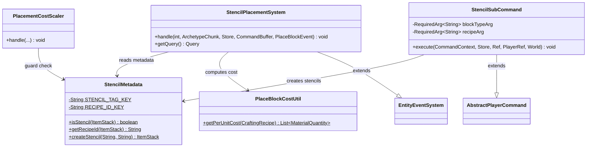
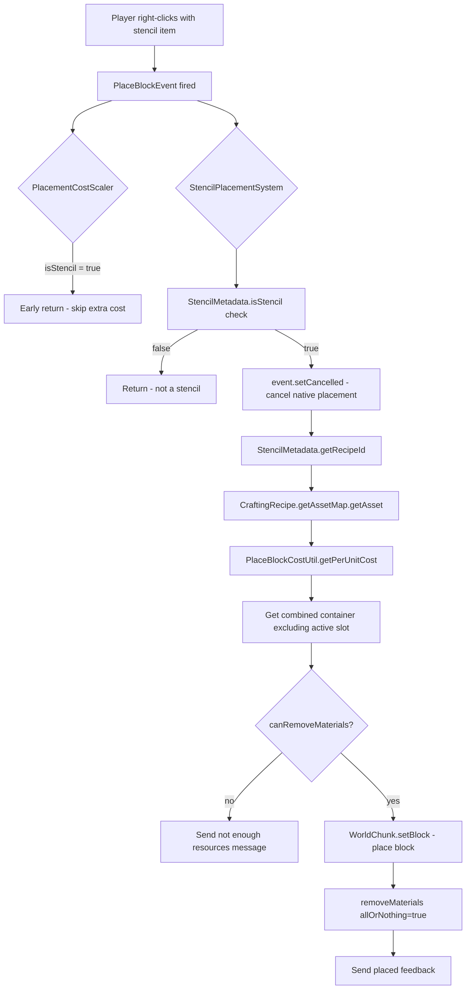
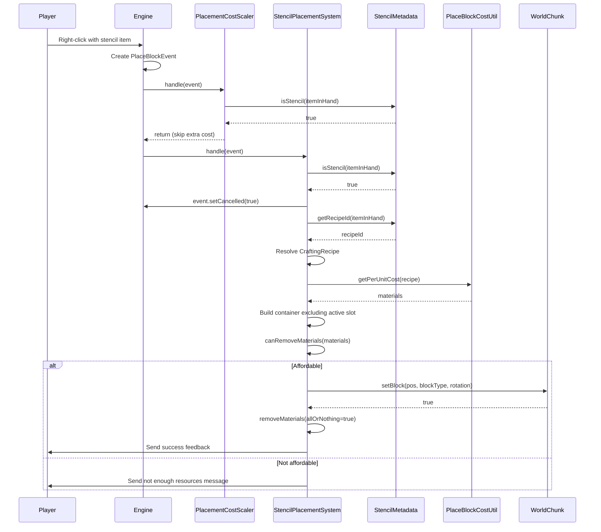

# Design: Blueprint Stencil POC

## 1. Overview

The Blueprint Stencil system provides an alternative block placement flow that intercepts `PlaceBlockEvent` for BSON-tagged block items ("stencils"), cancels the engine's native placement and item consumption, then manually places the block and atomically consumes recipe resources from the player's inventory (excluding the active hotbar slot). This coexists with the existing PlaceBlock placeholder system — no existing classes are modified except for a metadata guard in `PlacementCostScaler` and registration in the plugin `setup()`.

## 2. Design Priorities

1. **Coexistence** — must not interfere with the existing PlaceBlock placeholder system
2. **Simplicity** — minimal new classes, reuse existing utilities (`PlaceBlockCostUtil`)
3. **Atomicity** — place-then-consume with rollback on consumption failure
4. **Testability** — command-driven stencil creation for rapid POC testing

## 3. Component Diagram



## 4. Responsibility Map



## 5. Sequence Diagram



## 6. Package Structure

```
src/main/java/com/UnobstructedThirdPerson/
├── stencil/
│   ├── StencilMetadata.java          — BSON tag read/write utility
│   └── StencilPlacementSystem.java   — PlaceBlockEvent handler
├── command/placeblock/
│   ├── PlaceBlockCommand.java        — EXISTING (add stencil subcommand registration)
│   └── subcommands/
│       └── StencilSubCommand.java    — test command to create stencils
└── resourcecollection/
    └── PlacementCostScaler.java      — EXISTING (add isStencil guard)
```

## 7. Integration Changes Required

### 7.1 PlacementCostScaler — Add stencil guard (S2604301421)

Add an early-exit before the `NaturalResourceRegistry` check. Since there is no event handler priority system, the guard must be metadata-based.

**File:** `src/main/java/com/UnobstructedThirdPerson/resourcecollection/PlacementCostScaler.java`

**Import to add:**
```java
import com.UnobstructedThirdPerson.stencil.StencilMetadata;
```

**Before (lines 75-79):**
```java
        ItemStack itemInHand = event.getItemInHand();
        if (itemInHand == null) return;

        String blockTypeId = itemInHand.getBlockKey();
        if (blockTypeId == null) return;
```

**After:**
```java
        ItemStack itemInHand = event.getItemInHand();
        if (itemInHand == null) return;

        // Blueprint stencils handle their own resource consumption — skip extra cost
        if (StencilMetadata.isStencil(itemInHand)) return;

        String blockTypeId = itemInHand.getBlockKey();
        if (blockTypeId == null) return;
```

### 7.2 PlaceBlockCommand — Register StencilSubCommand

**File:** `src/main/java/com/UnobstructedThirdPerson/command/placeblock/PlaceBlockCommand.java`

**Import to add:**
```java
import com.UnobstructedThirdPerson.command.placeblock.subcommands.StencilSubCommand;
```

**Add in constructor:**
```java
this.addSubCommand(new StencilSubCommand());
```

### 7.3 UnobstructedThirdPersonPlugin.setup() — Register StencilPlacementSystem

**File:** `src/main/java/com/UnobstructedThirdPersonPlugin.java`

**Import to add:**
```java
import com.UnobstructedThirdPerson.stencil.StencilPlacementSystem;
```

**Add after `PlacementCostScaler` registration:**
```java
// Blueprint stencil placement — intercepts PlaceBlockEvent for BSON-tagged stencil items
this.getEntityStoreRegistry().registerSystem(new StencilPlacementSystem());
```

## 8. Open Questions

1. **Active-slot exclusion strategy:** The design calls for excluding the active hotbar slot from consumption candidates. Options:
   - **(a)** Iterate `getCombinedBackpackStorageHotbar()` slots manually, skip the active slot index — requires knowing the slot layout
   - **(b)** Use `getCombinedBackpackFirst()` (storage-first, hotbar-last) and hope the active slot is consumed last — unreliable
   - **(c)** After consuming, restore 1 item to the active slot if it was consumed — simpler but not truly atomic

   **Recommended:** Option (a) — iterate slots, skip active. The implementation should determine if `ItemContainer` exposes slot-level access or if a wrapper is needed. Mark this as a TODO in the skeleton.

2. **Stencil item type:** Should stencils use a specific registered item type (e.g., `"Stencil_Oak_Planks"`) or can any block item be tagged? The POC assumes any `itemTypeKey` can be used with `createStencil()` — the BSON tag is the discriminator, not the item type.

3. **Block rotation:** Should `StencilPlacementSystem` compute rotation from player yaw (like `PlaceBlockToolInteraction`) or use `event.getRotation()` directly? The skeleton uses `event.getRotation()` since the engine provides it on `PlaceBlockEvent`.

## 9. Handoff Checklist

- [x] Component diagram included
- [x] Responsibility map included
- [x] Sequence diagram included
- [x] All interfaces have Javadoc contracts
- [x] All skeleton files created with TODO markers
- [x] Integration Changes Required section populated
- [x] Open Questions section populated
