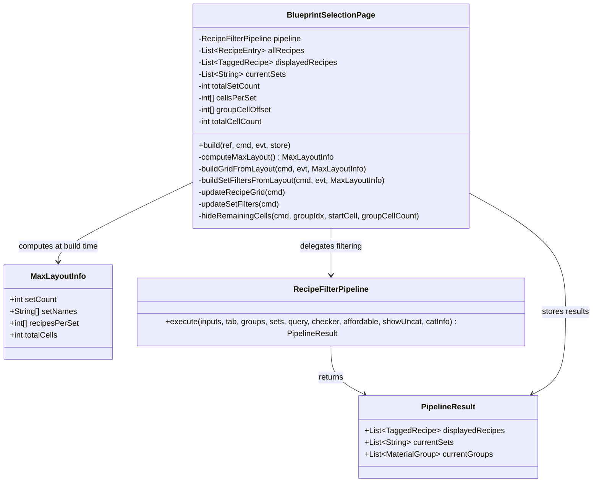
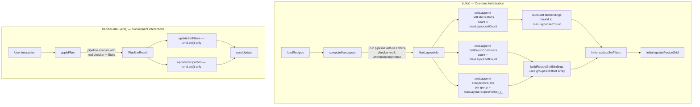
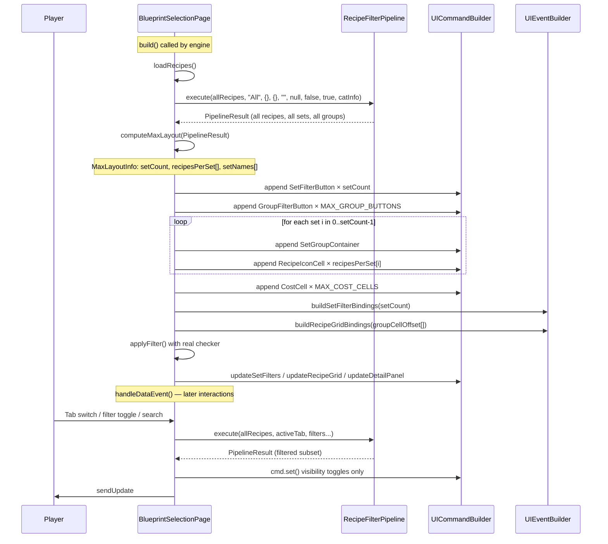
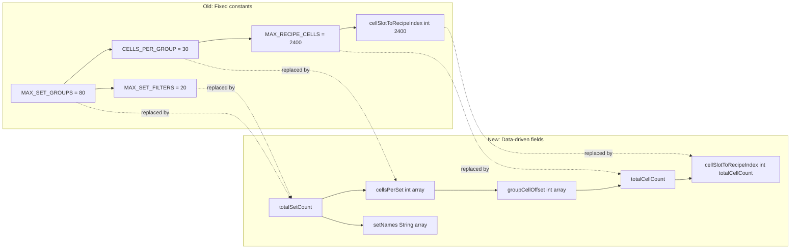

# Design: Data-Driven Grid Initialization

## 1. Overview

The Blueprint Bench UI currently pre-allocates a fixed pool of UI elements using hardcoded constants (`MAX_SET_GROUPS=80`, `CELLS_PER_GROUP=30`, `MAX_SET_FILTERS=20`), creating up to 2,400 recipe cells regardless of actual data. This wastes memory and caps visible sets at an arbitrary number. This refactor replaces the hardcoded pool with a **data-driven build**: at first load, the full filter pipeline runs with no filtering to discover the maximum set count and per-set recipe counts, then allocates exactly the right number of UI elements. Subsequent interactions only use `cmd.set()` to toggle visibility — never `cmd.append()`.

## 2. Design Priorities

1. **Correctness** — allocate exactly enough UI elements to display all recipes across all sets
2. **Performance** — zero `cmd.append()` calls after `build()`; only `cmd.set()` visibility toggles at runtime
3. **Simplicity** — minimal structural change; same pipeline, same UI templates, same event patterns
4. **Testability** — the new `computeMaxLayout()` is a pure function operating on pipeline output

## 3. Component Diagram



## 4. Responsibility Map



## 5. Sequence Diagram



## 6. Package Structure

No new files. All changes are within the existing file:

```
src/main/java/com/UnobstructedThirdPerson/placeblock/ui/
    └── BlueprintSelectionPage.java   (modified — constants replaced with data-driven fields)
```

A new inner record `MaxLayoutInfo` is added inside `BlueprintSelectionPage`.

## 7. Field Replacement: Old Constants → New Data-Driven Fields



### Constants to REMOVE

| Constant | Value | Replacement |
|---|---|---|
| `MAX_SET_FILTERS` | 20 | `totalSetCount` (computed) |
| `MAX_SET_GROUPS` | 80 | `totalSetCount` (same — one group per set) |
| `CELLS_PER_GROUP` | 30 | `cellsPerSet[i]` (variable per group) |
| `MAX_RECIPE_CELLS` | 2400 | `totalCellCount` (sum of cellsPerSet) |

### Constants to KEEP

| Constant | Value | Reason |
|---|---|---|
| `MAX_GROUP_BUTTONS` | 25 | Category icons are bounded by `ItemCategory` asset count, not recipe data. Pipeline already caps at 25 via `extractMaterialGroups(..., 25)`. Keep as-is. |
| `MAX_COST_CELLS` | 8 | Bounded by recipe ingredient count, not set/recipe scale. Keep as-is. |

### New Fields

```java
/** Computed at build time by computeMaxLayout(). */
private int totalSetCount;                // number of distinct sets
private String[] maxLayoutSetNames;       // set name for each group slot, indexed 0..totalSetCount-1
private int[] cellsPerSet;                // recipe count per set, indexed 0..totalSetCount-1
private int[] groupCellOffset;            // flat offset of each group's first cell: groupCellOffset[g] = sum(cellsPerSet[0..g-1])
private int totalCellCount;               // sum of all cellsPerSet entries
private int[] cellSlotToRecipeIndex;      // flat index → displayedRecipes index; length = totalCellCount
```

## 8. Method Impact Analysis

### Methods that reference old constants — full change list

| Method | Uses | Change Required |
|---|---|---|
| `build()` | `MAX_SET_FILTERS`, `MAX_GROUP_BUTTONS`, `MAX_SET_GROUPS`, `CELLS_PER_GROUP`, `MAX_COST_CELLS` | Replace fixed-count loops with data-driven counts from `computeMaxLayout()`. See skeleton below. |
| `buildSetFilterBindings()` | `MAX_SET_FILTERS` | Loop bound becomes `totalSetCount` |
| `buildRecipeGridBindings()` | `MAX_SET_GROUPS`, `CELLS_PER_GROUP` | Loop uses `totalSetCount` and `cellsPerSet[g]`; flat index uses `groupCellOffset[g] + c` |
| `updateSetFilters()` | `MAX_SET_FILTERS` | Loop bound becomes `totalSetCount` |
| `updateRecipeGrid()` | `MAX_SET_GROUPS`, `CELLS_PER_GROUP`, `cellSlotToRecipeIndex` | Group overflow check uses `totalSetCount`; cell overflow uses `cellsPerSet[groupIdx]`; flat index uses `groupCellOffset[groupIdx] + cellInGroup` |
| `hideRemainingCells()` | `CELLS_PER_GROUP` | New parameter `groupCellCount` replaces constant |
| `onDismiss()` | `MAX_SET_GROUPS`, `MAX_COST_CELLS` | Group hide loop uses `totalSetCount`; cost cells unchanged |
| `handleDataEvent()` | `MAX_RECIPE_CELLS` (bounds check for RecipeSelect) | Replace with `totalCellCount` |
| `cellSlotToRecipeIndex` field | `MAX_RECIPE_CELLS` | Array sized to `totalCellCount` at build time |

## 9. Skeleton Code

### `MaxLayoutInfo` — new inner record

```java
/**
 * Immutable snapshot of the maximum UI layout computed from unfiltered pipeline output.
 * Determines how many UI elements to pre-allocate during build().
 *
 * @param setCount       number of distinct sets (determines group containers and sidebar buttons)
 * @param setNames       ordered set names, indexed 0..setCount-1
 * @param recipesPerSet  number of recipes in each set, indexed 0..setCount-1
 * @param totalCells     sum of recipesPerSet (total recipe cells to allocate)
 */
private record MaxLayoutInfo(
        int setCount,
        String[] setNames,
        int[] recipesPerSet,
        int totalCells
) {}
```

### `computeMaxLayout()` — new method

```java
/**
 * Runs the pipeline with NO filtering to determine the maximum number of UI elements needed.
 *
 * <p>Called once during {@link #build}. The returned layout info drives all
 * {@code cmd.append()} calls, ensuring exactly the right number of groups,
 * cells, and sidebar buttons are pre-allocated.
 *
 * <p>Pipeline is invoked with:
 * <ul>
 *   <li>{@code activeTab = "All"} — no tab filter</li>
 *   <li>{@code activeMaterialGroups = empty} — no category filter</li>
 *   <li>{@code activeSetFilters = empty} — no set filter</li>
 *   <li>{@code searchQuery = ""} — no search filter</li>
 *   <li>{@code checker = null} — no affordability check</li>
 *   <li>{@code affordableOnly = false}</li>
 *   <li>{@code showUncategorized = true} — include uncategorized to ensure cells exist</li>
 * </ul>
 *
 * @return layout info with set counts and per-set recipe counts
 */
private MaxLayoutInfo computeMaxLayout() {
    // TODO: Convert allRecipes to InputRecipe list (same as applyFilter)
    // TODO: Call pipeline.execute with all-pass parameters
    // TODO: Walk the sorted result, counting recipes per effectiveSet
    // TODO: Build setNames[] and recipesPerSet[] arrays
    // TODO: Compute totalCells as sum of recipesPerSet
    // TODO: Return new MaxLayoutInfo(setCount, setNames, recipesPerSet, totalCells)
}
```

### Refactored `build()` — skeleton

```java
@Override
public void build(@NonNull Ref<EntityStore> ref,
                  @NonNull UICommandBuilder cmd,
                  @NonNull UIEventBuilder evt,
                  @NonNull Store<EntityStore> store) {

    this.playerRef_ref = ref;
    this.playerStore = store;

    // Load persisted preferences (unchanged)
    BlueprintBookPrefs prefs = BlueprintBookPrefsStore.load(this.playerRef.getUuid());
    // ... existing preference loading ...

    loadRecipes();

    // ── NEW: Compute data-driven layout ──
    MaxLayoutInfo maxLayout = computeMaxLayout();
    this.totalSetCount = maxLayout.setCount();
    this.cellsPerSet = maxLayout.recipesPerSet().clone();
    this.maxLayoutSetNames = maxLayout.setNames().clone();
    this.totalCellCount = maxLayout.totalCells();

    // Build groupCellOffset: flat offset of each group's first cell
    this.groupCellOffset = new int[totalSetCount];
    // TODO: groupCellOffset[0] = 0; groupCellOffset[i] = groupCellOffset[i-1] + cellsPerSet[i-1]

    // Allocate indirection map sized to actual total
    this.cellSlotToRecipeIndex = new int[totalCellCount];

    // Load main template
    cmd.append("Pages/BlueprintBook/BlueprintBookPage.ui");

    // ── Append reusable components — DATA-DRIVEN counts ──

    // Set filter sidebar buttons — one per set
    for (int i = 0; i < totalSetCount; i++) {
        cmd.append("#SetFilters", "Pages/BlueprintBook/SetFilterButton.ui");
    }

    // Material group icon buttons — keep MAX_GROUP_BUTTONS (capped by pipeline)
    for (int i = 0; i < MAX_GROUP_BUTTONS; i++) {
        cmd.append("#MaterialGroups", "Pages/BlueprintBook/GroupFilterButton.ui");
    }

    // Per-set group containers with VARIABLE cell counts
    for (int g = 0; g < totalSetCount; g++) {
        cmd.append("#RecipeGridArea", "Pages/BlueprintBook/SetGroupContainer.ui");
        for (int c = 0; c < cellsPerSet[g]; c++) {
            cmd.append("#RecipeGridArea[" + g + "] #GroupCells",
                       "Pages/BlueprintBook/RecipeIconCell.ui");
        }
    }

    // Cost cells (unchanged)
    for (int i = 0; i < MAX_COST_CELLS; i++) {
        cmd.append("#CostGrid", "Pages/BlueprintBook/CostCell.ui");
    }

    // ── Bind ALL events (one-time) — unchanged except loop bounds ──

    // ... existing SearchInput, toggle, header, GiveBlueprint bindings (unchanged) ...

    buildBenchTabs(evt);
    buildSetFilterBindings(evt);        // uses totalSetCount
    buildMaterialGroupBindings(evt);    // unchanged (MAX_GROUP_BUTTONS)
    buildRecipeGridBindings(evt);       // uses totalSetCount, cellsPerSet, groupCellOffset

    // ── Set initial state (unchanged) ──
    // ... affordability toggle, uncategorized toggle ...

    applyFilter();  // run with real checker + user's persisted filters
    updateBenchTabs(cmd);
    updateMaterialGroups(cmd);
    updateSetFilters(cmd);
    updateRecipeGrid(cmd);
    updateDetailPanel(cmd);
}
```

### Refactored `buildSetFilterBindings()` — skeleton

```java
private void buildSetFilterBindings(UIEventBuilder evt) {
    // "Clear Filters" button (unchanged)
    evt.addEventBinding(
            CustomUIEventBindingType.Activating, "#ClearSetsBtn",
            EventData.of("Action", "SetFilter:" + ALL_FILTER)
    );
    // Per-set filter buttons — loop bound = totalSetCount instead of MAX_SET_FILTERS
    for (int i = 0; i < totalSetCount; i++) {
        // TODO: Same binding logic as before, but loop to totalSetCount
    }
}
```

### Refactored `buildRecipeGridBindings()` — skeleton

```java
/**
 * Binds click events to pre-allocated recipe cells.
 *
 * <p>With variable cells per group, the flat index for cell {@code c} in group {@code g}
 * is {@code groupCellOffset[g] + c}, NOT {@code g * CELLS_PER_GROUP + c}.
 */
private void buildRecipeGridBindings(UIEventBuilder evt) {
    for (int g = 0; g < totalSetCount; g++) {
        for (int c = 0; c < cellsPerSet[g]; c++) {
            int flatIdx = groupCellOffset[g] + c;
            evt.addEventBinding(CustomUIEventBindingType.Activating,
                    "#RecipeGridArea[" + g + "] #GroupCells[" + c + "] #CellBtn",
                    EventData.of("Action", "RecipeSelect:idx:" + flatIdx));
        }
    }
}
```

### Refactored `updateSetFilters()` — skeleton

```java
private void updateSetFilters(UICommandBuilder cmd) {
    for (int i = 0; i < totalSetCount; i++) {
        String sel = "#SetFilters[" + i + "]";
        if (i < currentSets.size()) {
            // TODO: Same show logic — set Visible, Text, Style, Check.Value
        } else {
            cmd.set(sel + ".Visible", false);
        }
    }
}
```

### Refactored `updateRecipeGrid()` — skeleton

```java
private void updateRecipeGrid(UICommandBuilder cmd) {
    Arrays.fill(cellSlotToRecipeIndex, -1);

    int groupIdx = -1;
    int cellInGroup = 0;
    String currentSet = null;

    for (int recipeIdx = 0; recipeIdx < displayedRecipes.size(); recipeIdx++) {
        RecipeFilterPipeline.TaggedRecipe entry = displayedRecipes.get(recipeIdx);

        if (!entry.effectiveSet().equals(currentSet)) {
            if (groupIdx >= 0) {
                // TODO: hideRemainingCells(cmd, groupIdx, cellInGroup, cellsPerSet[groupIdx])
            }
            groupIdx++;
            if (groupIdx >= totalSetCount) break;

            // TODO: Find the correct groupIdx by matching entry.effectiveSet() to maxLayoutSetNames
            // This is needed because the filtered sets may be a subset of all sets,
            // but UI slots are allocated per the max layout. The group index in the
            // UI corresponds to the position in maxLayoutSetNames, not a sequential counter.

            currentSet = entry.effectiveSet();
            cellInGroup = 0;

            String groupSel = "#RecipeGridArea[" + groupIdx + "]";
            cmd.set(groupSel + ".Visible", true);
            cmd.set(groupSel + " #SetGroupLabel.Text",
                    RecipeFilterPipeline.setDisplayLabel(currentSet));
        }

        if (cellInGroup >= cellsPerSet[groupIdx]) continue;

        int globalIdx = groupCellOffset[groupIdx] + cellInGroup;
        // TODO: Same cell population logic — set Visible, ItemId, CellDim
        cellSlotToRecipeIndex[globalIdx] = recipeIdx;
        cellInGroup++;
    }

    // Hide remaining cells in last group
    if (groupIdx >= 0 && groupIdx < totalSetCount) {
        // TODO: hideRemainingCells(cmd, groupIdx, cellInGroup, cellsPerSet[groupIdx])
    }

    // Hide all unused groups
    for (int g = groupIdx + 1; g < totalSetCount; g++) {
        cmd.set("#RecipeGridArea[" + g + "].Visible", false);
    }
}
```

### Refactored `hideRemainingCells()` — skeleton

```java
/**
 * Hide cells [startCell..groupCellCount) in the given group.
 *
 * @param groupCellCount replaces the old CELLS_PER_GROUP constant — varies per group
 */
private void hideRemainingCells(UICommandBuilder cmd, int groupIdx, int startCell, int groupCellCount) {
    for (int c = startCell; c < groupCellCount; c++) {
        cmd.set("#RecipeGridArea[" + groupIdx + "] #GroupCells[" + c + "].Visible", false);
    }
}
```

### Refactored `onDismiss()` — skeleton

```java
@Override
public void onDismiss(@NonNull Ref<EntityStore> ref, @NonNull Store<EntityStore> store) {
    savePrefs();
    UICommandBuilder cmd = new UICommandBuilder();
    cmd.set("#OutputIcon.ItemId", "");
    for (int g = 0; g < totalSetCount; g++) {
        cmd.set("#RecipeGridArea[" + g + "].Visible", false);
    }
    for (int i = 0; i < MAX_COST_CELLS; i++) {
        cmd.set("#CostGrid[" + i + "].Visible", false);
    }
    sendUpdate(cmd, null, false);
}
```

### Refactored `handleDataEvent()` — `RecipeSelect` bounds check

```java
// In the RecipeSelect handler:
} else if (data.action != null && data.action.startsWith("RecipeSelect:idx:")) {
    int slotIdx = -1;
    try { slotIdx = Integer.parseInt(data.action.substring("RecipeSelect:idx:".length())); } catch (NumberFormatException ignored) {}
    if (slotIdx >= 0 && slotIdx < totalCellCount) {  // was: MAX_RECIPE_CELLS
        int recipeIdx = cellSlotToRecipeIndex[slotIdx];
        // ... rest unchanged ...
    }
}
```

## 10. Index Mapping Redesign

### Problem

The current `cellSlotToRecipeIndex` array is sized `MAX_SET_GROUPS * CELLS_PER_GROUP = 2400`. The flat index for cell `c` in group `g` is computed as `g * CELLS_PER_GROUP + c`. This works because every group has the same cell count.

With variable cells per group, this formula breaks. Group 0 might have 12 cells, group 1 might have 47.

### Solution: `groupCellOffset[]` array

Introduce an offset array computed at build time:

```
groupCellOffset[0] = 0
groupCellOffset[1] = cellsPerSet[0]
groupCellOffset[2] = cellsPerSet[0] + cellsPerSet[1]
...
groupCellOffset[g] = sum(cellsPerSet[0..g-1])
```

The flat index for cell `c` in group `g` becomes: `groupCellOffset[g] + c`

This is used in three places:
1. `buildRecipeGridBindings()` — to generate event action strings
2. `updateRecipeGrid()` — to map cells to `cellSlotToRecipeIndex`
3. `handleDataEvent()` — to look up the recipe from a cell click's flat index

### Set-to-Group Mapping in `updateRecipeGrid()`

The current code uses a sequential `groupIdx` counter that advances on each set boundary. This works because the pipeline sorts results by set, and the UI groups are filled sequentially.

With data-driven allocation, each UI group slot is **permanently assigned** to a specific set name (from `maxLayoutSetNames[]`). When a filtered result contains only a subset of sets, the code must either:

**Option A (Recommended): Sequential packing** — Continue using sequential `groupIdx` counter. Since every possible set has a pre-allocated group slot, and hidden groups don't take space (TopScrolling layout), simply fill groups sequentially and hide the rest. The event bindings still work because they fire flat indices that map through `cellSlotToRecipeIndex`.

This means group slot 0 might show "Wood" in one filter state and "Metal" in another, but that's fine — labels are set dynamically via `cmd.set()`.

**Option B: Fixed assignment** — Map each set to its permanent group slot using `maxLayoutSetNames[]`. This preserves visual stability (set X always maps to group slot N) but wastes screen space for hidden groups in the middle (though TopScrolling collapses them).

**Recommendation: Option A** — simpler, no wasted intermediate space, matches current sequential logic.

## 11. Integration Changes Required

| File | Change |
|---|---|
| `BlueprintSelectionPage.java` | Remove `MAX_SET_FILTERS`, `MAX_SET_GROUPS`, `CELLS_PER_GROUP`, `MAX_RECIPE_CELLS` constants. Add `totalSetCount`, `cellsPerSet`, `groupCellOffset`, `totalCellCount`, `maxLayoutSetNames` fields. Add `MaxLayoutInfo` record. Add `computeMaxLayout()` method. Refactor `build()`, `buildSetFilterBindings()`, `buildRecipeGridBindings()`, `updateSetFilters()`, `updateRecipeGrid()`, `hideRemainingCells()`, `onDismiss()`, `handleDataEvent()` as described above. |

No other files require changes. `RecipeFilterPipeline`, UI templates, and `RecipeFilterRegistry` are unchanged.

## 12. Open Questions

1. **Option A vs B for set-to-group mapping** — Recommendation is Option A (sequential packing). Confirm this is acceptable, or does the user want visual stability (Option B)?
2. **Should `showUncategorized` be `true` during `computeMaxLayout()`?** — Recommended yes, to ensure Uncategorized recipes get cell allocations even if the user's preference has it toggled off. If we don't allocate, toggling it on later would have no cells.
3. **Should `computeMaxLayout()` use `activeTab = "All"`?** — Recommended yes. If we scope to a single tab, switching tabs could encounter a set/recipe count that exceeds the allocation. The max layout must be the worst-case across all tabs, which is `"All"`.

## 13. Handoff Checklist

- [x] Component diagram included
- [x] Responsibility map included
- [x] All interfaces have Javadoc contracts
- [x] All skeleton files created with TODO markers
- [x] Integration Changes Required section populated
- [x] Open Questions section populated (even if empty)
- [x] Task Decomposition section populated

## 14. Task Decomposition

### Wave 1 (no dependencies — can run in parallel)

#### Unit: MaxLayoutInfo record + computeMaxLayout()
- **Methods**: `MaxLayoutInfo` (inner record), `computeMaxLayout()`
- **Contract**: Run unfiltered pipeline, count recipes per set, return layout dimensions
- **Dependencies**: none (uses existing `pipeline.execute()` and `allRecipes`)
- **Done when**: `computeMaxLayout()` returns correct set count and per-set recipe counts for the full unfiltered recipe list

### Wave 2 (depends on Wave 1)

#### Unit: Field migration + build() refactor
- **Methods**: Remove 4 constants, add 5 data-driven fields, refactor `build()`
- **Contract**: `build()` calls `computeMaxLayout()` and uses returned dimensions for all `cmd.append()` loops; `groupCellOffset[]` is correctly computed
- **Dependencies**: Wave 1 (MaxLayoutInfo must exist)
- **Done when**: `build()` appends exactly the right number of set groups, cells per group, and sidebar buttons based on actual data

#### Unit: buildSetFilterBindings() + buildRecipeGridBindings() refactor
- **Methods**: `buildSetFilterBindings()`, `buildRecipeGridBindings()`
- **Contract**: Event bindings use `totalSetCount` / `cellsPerSet[g]` / `groupCellOffset[g]` instead of old constants
- **Dependencies**: Wave 1 (needs `totalSetCount`, `cellsPerSet`, `groupCellOffset` fields)
- **Done when**: All pre-allocated cells and filter buttons have correct event bindings with correct flat indices

### Wave 3 (depends on Wave 2)

#### Unit: updateRecipeGrid() + hideRemainingCells() + updateSetFilters() refactor
- **Methods**: `updateRecipeGrid()`, `hideRemainingCells()`, `updateSetFilters()`
- **Contract**: Runtime update methods use data-driven fields; `hideRemainingCells()` takes per-group cell count parameter; `cellSlotToRecipeIndex` uses `groupCellOffset` for flat index computation
- **Dependencies**: Wave 2 (fields must be initialized by build)
- **Done when**: Filtering, searching, and tab switching correctly show/hide the right cells using `cmd.set()` only

#### Unit: onDismiss() + handleDataEvent() bounds fix
- **Methods**: `onDismiss()`, `handleDataEvent()` (RecipeSelect bounds check)
- **Contract**: Replace old constants with data-driven fields in dismiss cleanup and click handling
- **Dependencies**: Wave 2 (needs `totalSetCount`, `totalCellCount`)
- **Done when**: Dismissing the UI hides all data-driven groups; recipe cell clicks correctly resolve within `totalCellCount` bounds

### Wave 4 (integration — depends on Wave 3)

#### Unit: Remove dead constants + final verification
- **Files**: `BlueprintSelectionPage.java`
- **Contract**: Delete `MAX_SET_FILTERS`, `MAX_SET_GROUPS`, `CELLS_PER_GROUP`, `MAX_RECIPE_CELLS` constants. Verify no remaining references. Full build passes.
- **Dependencies**: All Wave 3 units
- **Done when**: Full build passes with zero references to removed constants
