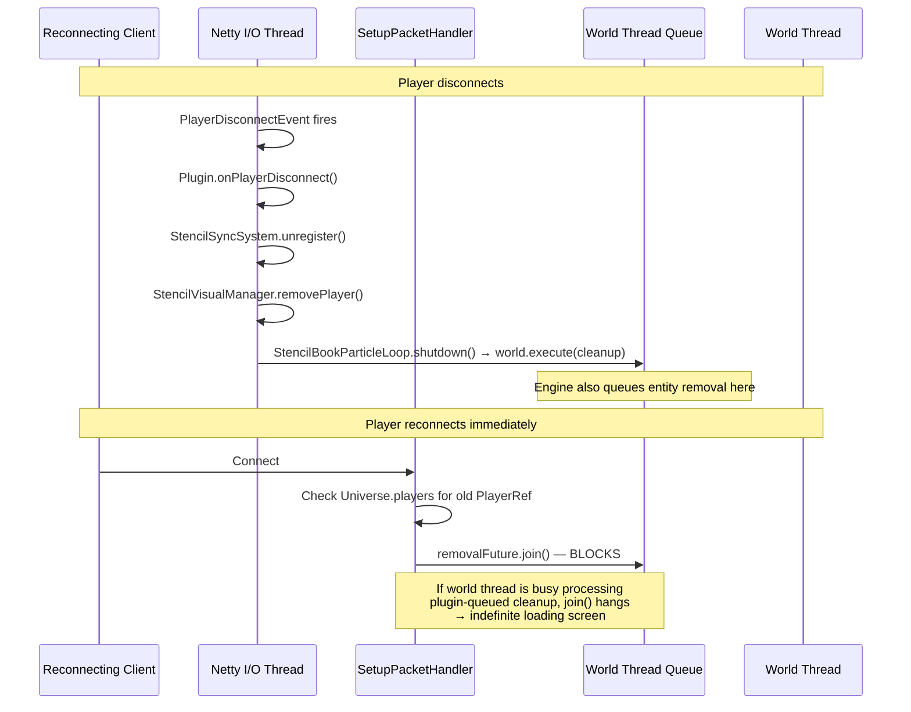
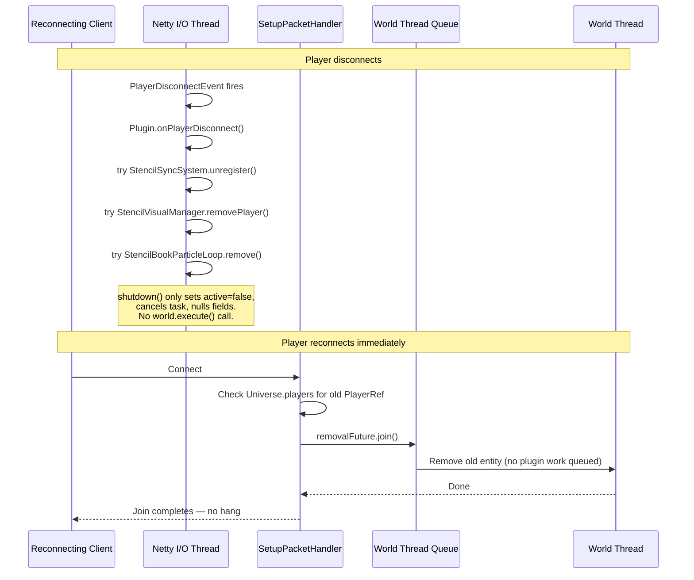
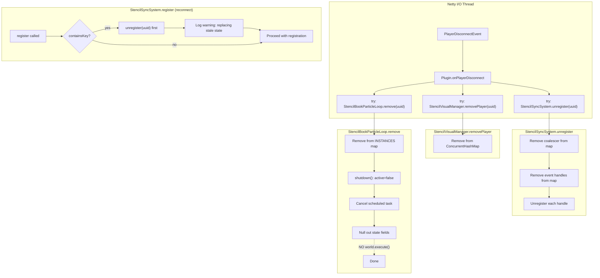

# Design: Disconnect Race Condition Fix

## 1. Overview

Three surgical fixes to prevent an indefinite loading screen hang when a player disconnects and immediately reconnects to a LAN server. The root cause is the plugin queuing work onto the world thread during disconnect cleanup, which delays the engine's entity removal future — blocking `SetupPacketHandler.removalFuture.join()` on reconnect. The core design principle is: **never queue work onto the world thread from a disconnect handler**.

## 2. Design Priorities

1. **Correctness** — eliminate the race condition that causes the loading screen hang
2. **Simplicity** — minimal, surgical changes to three methods across three files
3. **Resilience** — each cleanup call isolated so one failure doesn't cascade
4. **Zero new abstractions** — no new classes, interfaces, or patterns

## 3. Thread Model

Understanding which thread each method runs on is critical to this fix:

| Method | Thread | Notes |
|--------|--------|-------|
| `Plugin.onPlayerDisconnect()` | **Netty I/O** | Engine fires `PlayerDisconnectEvent` on Netty thread |
| `StencilSyncSystem.unregister()` | **Netty I/O** | Called from disconnect handler; operates on `ConcurrentHashMap` |
| `StencilSyncSystem.register()` | **World thread** | Called from `onPlayerReady` which runs on world thread |
| `StencilVisualManager.removePlayer()` | **Netty I/O** | ConcurrentHashMap remove — thread-safe |
| `StencilBookParticleLoop.remove()` | **Netty I/O** | ConcurrentHashMap remove + `shutdown()` |
| `StencilBookParticleLoop.shutdown()` | **Netty I/O** | Currently calls `world.execute()` — **this is the problem** |
| `StencilBookParticleLoop.executeTick()` | **World thread** | Runs inside `world.execute()` from the scheduled task |

## 4. Race Condition Analysis: Current (Broken) Flow



**The hang sequence:**
1. Engine fires `PlayerDisconnectEvent` on Netty thread
2. Plugin's `shutdown()` calls `world.execute(entityCleanupLambda)` — adds work to world queue
3. Engine queues its own entity removal via `CompletableFuture.runAsync(..., world)` — added *after* the plugin's work
4. Player reconnects; `SetupPacketHandler` finds old `PlayerRef` still in `Universe.players`
5. `removalFuture.join()` blocks until the world thread processes the engine's removal
6. But the world thread must first process the plugin's queued lambda
7. If the world thread is slow (other tasks, GC, etc.), `join()` blocks → loading screen hangs indefinitely

## 5. Fixed Flow



## 6. Responsibility Flow



## 7. Fix 1: Isolate Disconnect Cleanup Calls

**File:** `src/main/java/com/CodeCreature/Plugin.java`  
**Method:** `onPlayerDisconnect`  
**Thread:** Netty I/O

### Problem

No try-catch. If `StencilSyncSystem.unregister()` throws (e.g., a handle's `unregister()` throws), `StencilVisualManager.removePlayer()` and `StencilBookParticleLoop.remove()` never execute. This leaves stale state that blocks re-registration on reconnect.

### Current Code

```java
private static void onPlayerDisconnect(PlayerDisconnectEvent event) {
    PlayerRef playerRef = event.getPlayerRef();
    StencilSyncSystem.unregister(playerRef.getUuid());
    StencilVisualManager.removePlayer(playerRef.getUuid());
    StencilBookParticleLoop.remove(playerRef.getUuid());
}
```

### Fixed Code

```java
private static void onPlayerDisconnect(PlayerDisconnectEvent event) {
    PlayerRef playerRef = event.getPlayerRef();
    UUID uuid = playerRef.getUuid();

    try {
        StencilSyncSystem.unregister(uuid);
    } catch (Exception e) {
        DebugLogger.log(DebugLogger.Subsystem.PLUGIN, java.util.logging.Level.SEVERE,
                "[Plugin] Error in StencilSyncSystem.unregister for " + uuid + ": " + e.getMessage());
    }

    try {
        StencilVisualManager.removePlayer(uuid);
    } catch (Exception e) {
        DebugLogger.log(DebugLogger.Subsystem.PLUGIN, java.util.logging.Level.SEVERE,
                "[Plugin] Error in StencilVisualManager.removePlayer for " + uuid + ": " + e.getMessage());
    }

    try {
        StencilBookParticleLoop.remove(uuid);
    } catch (Exception e) {
        DebugLogger.log(DebugLogger.Subsystem.PLUGIN, java.util.logging.Level.SEVERE,
                "[Plugin] Error in StencilBookParticleLoop.remove for " + uuid + ": " + e.getMessage());
    }
}
```

### Required Import Addition (Plugin.java)

```java
import java.util.UUID;
```

### Thread Safety

All three methods operate on `ConcurrentHashMap` instances — safe to call from Netty thread. No world thread interaction.

---

## 8. Fix 2: Defensive StencilSyncSystem Re-registration

**File:** `src/main/java/com/CodeCreature/stencil/StencilSyncSystem.java`  
**Method:** `register`  
**Thread:** World thread (called from `onPlayerReady`)

### Problem

`register()` early-returns if the UUID already exists in `registeredPlayers`. If disconnect cleanup was partially skipped (Fix 1 handles this) or if `unregister()` ran but a concurrent call to `register()` arrives before the Netty thread finishes, the player gets silently skipped — no event listeners are registered, stencil sync is broken for the session.

### Race Window

```
T=0  Netty thread:  onPlayerDisconnect → unregister(uuid) starts
T=1  World thread:  onPlayerReady → register(uuid) — containsKey returns true (stale)
T=2  World thread:  register returns early — player has no listeners
T=3  Netty thread:  unregister completes — removes the stale handles
     Result: player has no event listeners for the entire session
```

### Current Code

```java
public static void register(PlayerRef playerRef, Player player, World world) {
    UUID uuid = playerRef.getUuid();
    if (registeredPlayers.containsKey(uuid)) {
        return; // Already registered
    }
    // ... creates coalescer, registers 3 event handles, puts in maps
}
```

### Fixed Code

```java
public static void register(PlayerRef playerRef, Player player, World world) {
    UUID uuid = playerRef.getUuid();
    if (registeredPlayers.containsKey(uuid)) {
        DebugLogger.log(DebugLogger.Subsystem.STENCIL, Level.WARNING,
                "[StencilSync] Replacing stale registration for " + uuid
                + " — previous disconnect cleanup may have been incomplete");
        unregister(uuid);
    }

    AffordabilityCoalescer coalescer = new AffordabilityCoalescer(playerRef, player);
    // ... rest of registration unchanged
```

### Thread Safety

- `registeredPlayers` is a `ConcurrentHashMap` — `containsKey` is thread-safe
- `unregister()` uses `ConcurrentHashMap.remove()` — atomic
- `register()` is only called from `onPlayerReady` (world thread), so no concurrent `register()` calls for the same UUID
- `unregister()` can run concurrently from Netty thread, but `ConcurrentHashMap` operations are individually atomic — the worst case is `unregister()` runs after `register()` replaces the entry, which correctly cleans up the new registration (player disconnected again)

### Required Import Addition (StencilSyncSystem.java)

```java
import java.util.logging.Level;
import com.CodeCreature.util.DebugLogger;
```

---

## 9. Fix 3: Remove world.execute() from StencilBookParticleLoop.shutdown()

**File:** `src/main/java/com/CodeCreature/ui/stencilbook/StencilBookParticleLoop.java`  
**Method:** `shutdown`  
**Thread:** Netty I/O (called from `remove()` via `onPlayerDisconnect`)

### Problem

`shutdown()` calls `world.execute()` to queue entity cleanup onto the world thread. This is the **direct cause** of the loading screen hang: it adds a lambda to the world thread's `LinkedBlockingDeque`, which must be processed before the engine's entity removal future can complete.

### Why Removing world.execute() Is Safe

1. **Entity is non-serialized** — created with `EntityStore.REGISTRY.getNonSerializedComponentType()`, so it won't persist to disk across server restarts
2. **Effect self-expires** — the highlight effect has a 500ms duration (`EFFECT_DURATION_MILLIS`); it will visually disappear on its own
3. **Scheduled task is cancelled** — `updateTask.cancel(false)` stops the polling loop, so no more `executeTick()` calls will fire
4. **`executeTick()` checks `active` flag** — if a tick is already in-flight when `shutdown()` runs, it will see `active=false` and clean up via `removeHighlightEntity()`
5. **Engine cleans up the entity store** — when the player's entity is removed by the engine, the associated entity store is processed, and non-serialized entities are discarded

### Current Code

```java
private void shutdown() {
    active = false;
    if (updateTask != null) {
        updateTask.cancel(false);
        updateTask = null;
    }
    try {
        world.execute(() -> {
            if (activeEntity != null && activeEntity.isValid()) {
                Store<EntityStore> store = activeEntity.getStore();
                store.removeEntity(activeEntity, RemoveReason.REMOVE);
            }
            activeEntity = null;
        });
    } catch (Exception e) {
        DebugLogger.log(STENCIL_BOOK, Level.WARNING,
                "[StencilBookParticle] Error queueing entity cleanup: " + e.getMessage());
    }
}
```

### Fixed Code

```java
private void shutdown() {
    active = false;
    if (updateTask != null) {
        updateTask.cancel(false);
        updateTask = null;
    }
    activeEntity = null;
    lastTargetBlock = null;
    lastAffordable = false;
}
```

### Thread Safety

- `active` is `volatile` — write on Netty thread is immediately visible to the scheduled executor thread and world thread
- `updateTask.cancel(false)` is thread-safe (`ScheduledFuture` contract)
- `activeEntity`, `lastTargetBlock`, `lastAffordable` are only read by `executeTick()` which runs on the world thread via `world.execute()`. After `active = false`, any in-flight `executeTick()` will see the flag and return early (or clean up the entity itself via `removeHighlightEntity()`). Future ticks are prevented by the cancelled task + the `active` check in `startUpdateLoop`'s lambda.

### Residual Entity Lifetime

If an `executeTick()` is already queued on the world thread when `shutdown()` runs:
- It will execute, see `active=false`, and call `removeHighlightEntity()` → entity is removed
- If `activeEntity` was already nulled by `shutdown()`, `removeHighlightEntity()` sees `activeEntity == null` → no-op

If no tick is in-flight:
- The highlight entity remains in the entity store as a non-serialized entity with a 500ms visual effect
- The engine removes it when processing the entity store (player entity removal cleans up associated state)
- Worst case: a ghost highlight block visible for up to 500ms — acceptable and self-resolving

---

## 10. Integration Changes Required

| File | Change | Lines |
|------|--------|-------|
| `Plugin.java` | Add `import java.util.UUID;` | Top of file |
| `Plugin.java` | Wrap each cleanup call in try-catch | `onPlayerDisconnect` method |
| `StencilSyncSystem.java` | Add `import java.util.logging.Level;` and `import com.CodeCreature.util.DebugLogger;` | Top of file |
| `StencilSyncSystem.java` | Replace early return with `unregister()` + warning log | `register` method |
| `StencilBookParticleLoop.java` | Remove `world.execute()` block, null out fields directly | `shutdown` method |

No files need to be created or deleted.

---

## 11. Open Questions

- **None.** All three fixes are fully specified. The engine behavior was confirmed via decompiled source analysis. The entity lifecycle guarantees (non-serialized, self-expiring effect) are established by the existing `spawnHighlightEntity()` code.

---

## 12. Handoff Checklist

- [x] Component diagram included (responsibility flow)
- [x] Responsibility map included
- [x] Thread safety analysis for each fix
- [x] Race condition analysis with sequence diagrams
- [x] All code changes specified as exact before/after diffs
- [x] Integration Changes Required section populated
- [x] Open Questions section populated (empty — all resolved)
- [x] Task Decomposition section populated
- [ ] No skeleton files — these are edits to existing code

---

## 13. Task Decomposition

### Wave 1 (no dependencies — can run in parallel)

#### Unit: Fix 1 — Plugin.onPlayerDisconnect isolation
- **File:** `src/main/java/com/CodeCreature/Plugin.java`
- **Changes:** Add `import java.util.UUID;`, wrap each cleanup call in try-catch with SEVERE logging
- **Contract:** Each cleanup call executes independently; one failure does not prevent the others
- **Dependencies:** none
- **Done when:** All three cleanup calls are wrapped in independent try-catch blocks with SEVERE-level logging

#### Unit: Fix 2 — StencilSyncSystem.register defensive re-registration
- **File:** `src/main/java/com/CodeCreature/stencil/StencilSyncSystem.java`
- **Changes:** Add imports, replace early return with `unregister()` call + WARNING log
- **Contract:** Stale registration is cleaned up before re-registration proceeds; never silently skipped
- **Dependencies:** none
- **Done when:** `register()` calls `unregister()` when a stale entry exists, with a WARNING log

#### Unit: Fix 3 — StencilBookParticleLoop.shutdown world.execute removal
- **File:** `src/main/java/com/CodeCreature/ui/stencilbook/StencilBookParticleLoop.java`
- **Changes:** Remove `world.execute()` block, null out fields directly
- **Contract:** `shutdown()` does not queue any work onto the world thread
- **Dependencies:** none
- **Done when:** `shutdown()` contains no `world.execute()` call; only sets `active=false`, cancels task, nulls fields

### Wave 2 (integration verification — depends on Wave 1)

#### Unit: Manual integration test
- **Steps:** Start LAN server, join, disconnect, immediately reconnect
- **Contract:** No loading screen hang; player loads in normally
- **Dependencies:** All Wave 1 fixes applied
- **Done when:** 10 consecutive disconnect/reconnect cycles complete without hang

---

→ @Engineer implement docs/design-disconnect-race-fix.md
