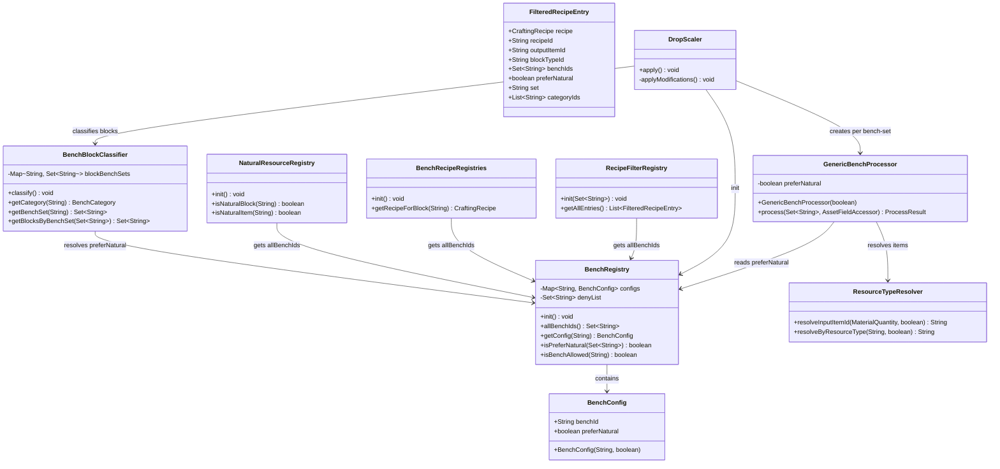
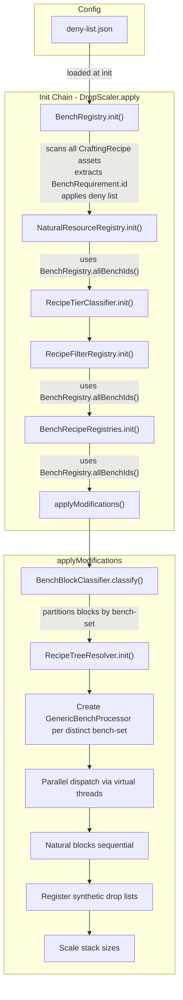
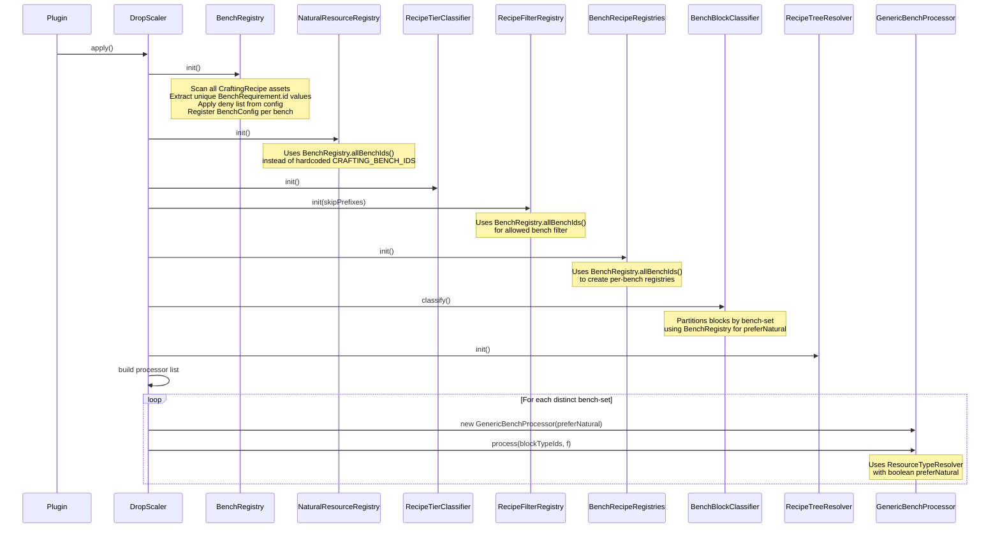

# Design: Dynamic Bench Discovery System (E2605291000)

## 1. Overview

The current plugin hardcodes bench support to `Builders` and `Furniture_Bench` via the `BenchCategory` enum. Any new bench (Workbench, Fieldcraft, future modded benches) requires manual enum expansion, new processor classes, and hardcoded string matching scattered across at least four files. A separate hardcoded set (`NaturalResourceRegistry.CRAFTING_BENCH_IDS`) further compounds the problem.

This design replaces the static `BenchCategory` enum with a runtime-discovered `BenchRegistry` that scans all `CraftingRecipe` assets, extracts unique `BenchRequirement.id` values, and registers a `BenchConfig` per bench. An opt-out deny list (loaded from `deny-list.json`) filters unwanted benches. The three concrete processor classes (`BuildersProcessor`, `FurnitureProcessor`, `OverlapProcessor`) collapse into a single `GenericBenchProcessor` parameterized by `boolean preferNatural`. All downstream consumers (`RecipeFilterRegistry`, `BenchRecipeRegistries`, `NaturalResourceRegistry`, `BenchBlockClassifier`, `ResourceTypeResolver`, `FilteredRecipeEntry`, `BlueprintSelectionPage`) switch from `BenchCategory` references to `BenchRegistry` queries.

Core design principle: **the asset data is the source of truth for bench identity — the code never enumerates bench IDs.**

## 2. Design Priorities

1. **Backward compatibility** — identical drop scaling results for Builders/Furniture with zero behavioral changes
2. **Simplicity** — fewer classes, fewer hardcoded strings, single point of truth
3. **Extensibility** — zero code changes required when Hytale adds new benches
4. **Testability** — `BenchRegistry` is injectable/resettable for unit tests
5. **Performance** — single-pass asset scan; parallel processing preserved

## 3. Component Diagram



## 4. Responsibility Map



## 5. New Classes

### 5.1 `BenchConfig` — Value object for per-bench configuration

**Package:** `com.CodeCreature.registry`

| Field | Type | Description |
|-------|------|-------------|
| `benchId` | `String` | The `BenchRequirement.id` from recipe assets |
| `preferNatural` | `boolean` | Whether `ResourceTypeResolver` should prefer natural items for this bench |

### 5.2 `BenchRegistry` — Runtime bench discovery and configuration

**Package:** `com.CodeCreature.registry`

| Method | Returns | Description |
|--------|---------|-------------|
| `init()` | `void` | Scans all `CraftingRecipe` assets, extracts unique `BenchRequirement.id`, applies deny list, registers `BenchConfig` per bench |
| `allBenchIds()` | `Set<String>` | Returns all registered (non-denied) bench IDs |
| `getConfig(String)` | `BenchConfig` | Returns config for a specific bench ID, or null |
| `isPreferNatural(Set<String>)` | `boolean` | Returns `true` if ANY bench in the set has `preferNatural=true` (overlap resolution rule) |
| `isBenchAllowed(String)` | `boolean` | Returns `true` if the bench ID is not on the deny list |

**preferNatural resolution:**
- `Furniture_Bench` → `true` (hardcoded override, preserved for backward compat)
- All other benches → `false` (default)
- Overlap sets: `true` if any bench in the set has `preferNatural=true`

**Deny list loading:**
- Reads `deny-list.json` from plugin data directory
- Falls back to empty set if file missing or malformed
- Logged at INFO level

### 5.3 `GenericBenchProcessor` — Single processor for all bench-sets

**Package:** `com.CodeCreature.scaling`

Replaces `BuildersProcessor`, `FurnitureProcessor`, `OverlapProcessor`. Extends `AbstractBenchProcessor` (which retains all processing logic). Parameterized by `boolean preferNatural` instead of a `BenchCategory` enum constant.

**Note:** The existing `AbstractBenchProcessor` currently calls `category().preferNatural()` — this will be replaced with a direct `preferNatural` field. The `BenchCategoryProcessor` interface changes its `category()` method to `preferNatural()` returning `boolean`.

## 6. Modified Classes

### 6.1 `RecipeFilterRegistry.java`

**Change:** Replace `BenchCategory.allBenchIds()` with `BenchRegistry.allBenchIds()`.

```java
// BEFORE:
Set<String> allowedBenchIds = BenchCategory.allBenchIds();
// ...
BenchCategory category = BenchCategory.fromRecipe(recipe);

// AFTER:
Set<String> allowedBenchIds = BenchRegistry.allBenchIds();
// ...
boolean preferNatural = BenchRegistry.isPreferNatural(matchedBenchIds);
```

The `BenchCategory` field in `FilteredRecipeEntry` construction is replaced with `boolean preferNatural`.

### 6.2 `FilteredRecipeEntry.java`

**Change:** Replace `@Nullable BenchCategory benchCategory` with `boolean preferNatural`.

```java
// BEFORE:
public record FilteredRecipeEntry(
    ..., @Nullable BenchCategory benchCategory, ...
) {}

// AFTER:
public record FilteredRecipeEntry(
    ..., boolean preferNatural, ...
) {}
```

### 6.3 `BenchRecipeRegistries.java`

**Change:** Replace `BenchCategory.allBenchIds()` with `BenchRegistry.allBenchIds()`.

```java
// BEFORE:
Set<String> benchIds = BenchCategory.allBenchIds();

// AFTER:
Set<String> benchIds = BenchRegistry.allBenchIds();
```

### 6.4 `BenchBlockClassifier.java`

**Change:** Replace `BenchCategory` mapping with `Set<String>` bench-set mapping. Add `getBlocksByBenchSet(Set<String>)` method.

```java
// BEFORE:
private Map<String, BenchCategory> blockCategories;
BenchCategory category = BenchCategory.fromRecipe(recipe);

// AFTER:
private Map<String, Set<String>> blockBenchSets;  // blockTypeId → bench IDs from recipe
// Classification extracts bench IDs directly from recipe BenchRequirements
// filtered through BenchRegistry.allBenchIds()
```

The `getBlocksByCategory(BenchCategory)` method is replaced by `getBlocksByBenchSet(Set<String>)` which groups blocks by their exact bench-set for processor dispatch.

**Retained for transition:** `getCategory(String)` can be kept temporarily returning null (or removed) — the only consumers are `DropScaler` (which will use `getBenchSet`) and the natural-block check (which just checks `!= null`).

### 6.5 `ResourceTypeResolver.java`

**Change:** Replace `BenchCategory` parameter with `boolean preferNatural`.

```java
// BEFORE:
public static String resolveInputItemId(MaterialQuantity input, BenchCategory category)
static String resolveByResourceType(String resId, BenchCategory category)
// category.preferNatural() used internally

// AFTER:
public static String resolveInputItemId(MaterialQuantity input, boolean preferNatural)
static String resolveByResourceType(String resId, boolean preferNatural)
// preferNatural used directly
```

### 6.6 `NaturalResourceRegistry.java`

**Change:** Replace `CRAFTING_BENCH_IDS` constant and `isCraftingBench()` method with `BenchRegistry.allBenchIds()`.

```java
// BEFORE:
private static final Set<String> CRAFTING_BENCH_IDS = Set.of(
    "Builders", "Furniture_Bench", "Workbench", "Fieldcraft");
private static boolean isCraftingBench(CraftingRecipe recipe) {
    // checks against CRAFTING_BENCH_IDS
}

// AFTER:
private static boolean isCraftingBench(CraftingRecipe recipe) {
    Set<String> allBenchIds = BenchRegistry.allBenchIds();
    BenchRequirement[] reqs = recipe.getBenchRequirement();
    if (reqs == null) return false;
    for (BenchRequirement req : reqs) {
        if (req != null && req.id != null && allBenchIds.contains(req.id)) return true;
    }
    return false;
}
```

### 6.7 `BenchCategoryProcessor.java`

**Change:** Replace `BenchCategory category()` with `boolean preferNatural()`.

```java
// BEFORE:
@Nonnull BenchCategory category();

// AFTER:
boolean preferNatural();
```

`ProcessResult` record is unchanged.

### 6.8 `AbstractBenchProcessor.java`

**Change:** Replace `category().preferNatural()` usage. Add `preferNatural` field set via constructor (used by `GenericBenchProcessor`). Remove abstract requirement for `category()`.

The abstract class becomes a concrete class `GenericBenchProcessor` (or the abstract class is kept with `GenericBenchProcessor` as the sole subclass — either works). The log message `"[" + category() + "Processor]"` changes to use a label string.

### 6.9 `DropScaler.java`

**Change:** 
1. Add `BenchRegistry.init()` as first step in `apply()`
2. Replace hardcoded processor list with dynamic construction
3. Use `BenchBlockClassifier.getDistinctBenchSets()` to get unique bench-sets
4. Create one `GenericBenchProcessor` per distinct bench-set

```java
// BEFORE:
List<BenchCategoryProcessor> processors = List.of(
    new BuildersProcessor(), new FurnitureProcessor(), new OverlapProcessor()
);
Set<String> blocks = classifier.getBlocksByCategory(proc.category());

// AFTER:
BenchRegistry.init();  // new first step
// ...
Map<Set<String>, Set<String>> benchSetToBlocks = classifier.getBlocksByDistinctBenchSet();
List<BenchCategoryProcessor> processors = new ArrayList<>();
for (var entry : benchSetToBlocks.entrySet()) {
    boolean preferNatural = BenchRegistry.isPreferNatural(entry.getKey());
    processors.add(new GenericBenchProcessor(preferNatural));
}
```

### 6.10 `BlueprintSelectionPage.java`

**No changes required.** The UI already discovers tabs dynamically from `RecipeFilterRegistry.getAllEntries()`. It reads `FilteredRecipeEntry.benchIds()` and does not access `benchCategory` for tab rendering.

### 6.11 `RecipeAffordabilityResolver.java`

**Change:** Replace `BenchCategory` parameter with `boolean preferNatural` in both public methods.

```java
// BEFORE:
public static List<ResolvedIngredient> resolveIngredientCosts(
    CraftingRecipe recipe, BenchCategory category, CombinedItemContainer container)
public static boolean isAffordableWithAutoCraft(
    CraftingRecipe recipe, BenchCategory category, CombinedItemContainer container)

// AFTER:
public static List<ResolvedIngredient> resolveIngredientCosts(
    CraftingRecipe recipe, boolean preferNatural, CombinedItemContainer container)
public static boolean isAffordableWithAutoCraft(
    CraftingRecipe recipe, boolean preferNatural, CombinedItemContainer container)
```

Internally passes `preferNatural` to `ResourceTypeResolver.resolveInputItemId()`.

### 6.12 `AutoCraftPlanner.java`

**Change:** Replace `BenchCategory` parameter with `boolean preferNatural`.

```java
// BEFORE:
public static AutoCraftPlan plan(CraftingRecipe recipe, BenchCategory category, CombinedItemContainer container)

// AFTER:
public static AutoCraftPlan plan(CraftingRecipe recipe, boolean preferNatural, CombinedItemContainer container)
```

### 6.13 `RecipeTreeResolver.java`

**Change:** Replace `BenchCategory.BUILDERS_ONLY` references with `false` (non-natural preference).

```java
// BEFORE:
String resolvedId = ResourceTypeResolver.resolveInputItemId(mq, BenchCategory.BUILDERS_ONLY);

// AFTER:
String resolvedId = ResourceTypeResolver.resolveInputItemId(mq, false);
```

### 6.14 `StencilPlacementSystem.java`

**Change:** Replace `BenchCategory.BUILDERS_ONLY` with `false` in `AutoCraftPlanner.plan()` call.

```java
// BEFORE:
AutoCraftPlan plan = AutoCraftPlanner.plan(recipe, BenchCategory.BUILDERS_ONLY, container);

// AFTER:
AutoCraftPlan plan = AutoCraftPlanner.plan(recipe, false, container);
```

### 6.15 `StencilVisualManager.java`

**Change:** Replace `BenchCategory.BUILDERS_ONLY` with `false` in affordability check.

```java
// BEFORE:
boolean affordable = RecipeAffordabilityResolver.isAffordableWithAutoCraft(recipe, BenchCategory.BUILDERS_ONLY, container);

// AFTER:
boolean affordable = RecipeAffordabilityResolver.isAffordableWithAutoCraft(recipe, false, container);
```

### 6.16 `StencilRadialMenuPage.java`

**Change:** Replace `fe.benchCategory()` with `fe.preferNatural()`, remove null-coalesce to `BenchCategory.BUILDERS_ONLY`.

```java
// BEFORE:
BenchCategory category = fe != null ? fe.benchCategory() : BenchCategory.BUILDERS_ONLY;

// AFTER:
boolean preferNatural = fe != null ? fe.preferNatural() : false;
```

### 6.17 `DetailPanelController.java`

**Change:** Same pattern as StencilRadialMenuPage.

```java
// BEFORE:
BenchCategory category = fe != null ? fe.benchCategory() : BenchCategory.BUILDERS_ONLY;

// AFTER:
boolean preferNatural = fe != null ? fe.preferNatural() : false;
```

## 7. Deleted Classes

| Class | Package | Reason |
|-------|---------|--------|
| `BenchCategory` | `com.CodeCreature.scaling` | Replaced by `BenchRegistry` + `BenchConfig` |
| `BuildersProcessor` | `com.CodeCreature.scaling` | Replaced by `GenericBenchProcessor` |
| `FurnitureProcessor` | `com.CodeCreature.scaling` | Replaced by `GenericBenchProcessor` |
| `OverlapProcessor` | `com.CodeCreature.scaling` | Replaced by `GenericBenchProcessor` |

## 8. Config Format — Deny List

File: `<pluginDataDir>/deny-list.json`

```json
{
  "deniedBenchIds": [
    "Blueprint"
  ]
}
```

**JSON Schema:**

```json
{
  "$schema": "http://json-schema.org/draft-07/schema#",
  "type": "object",
  "properties": {
    "deniedBenchIds": {
      "type": "array",
      "items": { "type": "string" },
      "description": "Bench IDs to exclude from processing. Recipes for denied benches are still discovered but not processed for drop scaling."
    }
  },
  "required": ["deniedBenchIds"]
}
```

**Behavior:**
- File missing → empty deny list (all benches included)
- File malformed → logged warning, empty deny list
- `"Blueprint"` should be in the default deny list since Blueprint recipes use the `Blueprint_` prefix skip anyway (defense in depth)
- The deny list only affects `BenchRegistry.allBenchIds()` — denied bench IDs are still discovered but excluded from the returned set

## 9. Init Order — Sequence Diagram



## 10. Migration Path

### Phase 1: BenchRegistry + BenchConfig (shippable independently)

1. Create `BenchConfig` record
2. Create `BenchRegistry` with `init()`, `allBenchIds()`, `getConfig()`, `isPreferNatural()`
3. Add deny-list config loading
4. Wire `BenchRegistry.init()` as first step in `DropScaler.apply()`
5. Update `NaturalResourceRegistry` to use `BenchRegistry.allBenchIds()` (remove `CRAFTING_BENCH_IDS`)
6. Update `RecipeFilterRegistry` to use `BenchRegistry.allBenchIds()`
7. Update `BenchRecipeRegistries` to use `BenchRegistry.allBenchIds()`

**Verification:** Run existing tests — same bench IDs discovered, same behavior.

### Phase 2: ResourceTypeResolver signature change

1. Change `resolveInputItemId` and `resolveByResourceType` to accept `boolean preferNatural`
2. Update `AbstractBenchProcessor` to pass `category().preferNatural()` (temporary bridge)

**Verification:** Same resolution results for all known benches.

### Phase 3: Dynamic processor + classifier refactor

1. Add `preferNatural` field to `AbstractBenchProcessor` / create `GenericBenchProcessor`
2. Update `BenchCategoryProcessor` interface: `category()` → `preferNatural()`
3. Update `BenchBlockClassifier` to use bench-set partitioning
4. Update `FilteredRecipeEntry`: `BenchCategory benchCategory` → `boolean preferNatural`
5. Update `RecipeFilterRegistry` to populate `preferNatural` via `BenchRegistry.isPreferNatural()`
6. Update `DropScaler.applyModifications()` to dynamically build processors

**Verification:** Full regression — identical drop lists for all existing blocks.

### Phase 4: Cleanup

1. Delete `BenchCategory.java`
2. Delete `BuildersProcessor.java`, `FurnitureProcessor.java`, `OverlapProcessor.java`
3. Remove all `BenchCategory` imports across codebase
4. Update tests

## 11. Risk Mitigations

| Risk | Mitigation |
|------|------------|
| **NPE in ResourceTypeResolver if BenchCategory is null** (known bug) | Eliminated: `preferNatural` is a primitive `boolean`, never null. Default `false` for unknown benches means safe fallback to non-natural preference. |
| **NaturalResourceRegistry.CRAFTING_BENCH_IDS is a separate hardcoded set** | Unified: `NaturalResourceRegistry.isCraftingBench()` delegates to `BenchRegistry.allBenchIds()`. Single source of truth. |
| **BenchCategory enum can't represent dynamic benches** | Eliminated: `BenchRegistry` is runtime-discovered from asset data. |
| **Backward compatibility — Builders/Furniture must behave identically** | `BenchRegistry` hardcodes `Furniture_Bench → preferNatural=true` as an override. All other benches default to `false`. Overlap resolution `true-if-any` matches the existing `BUILDERS_AND_FURNITURE.preferNatural=true` behavior. |
| **Init order dependency — BenchRegistry must init before NaturalResourceRegistry** | Explicit sequential init in `DropScaler.apply()`. `BenchRegistry.init()` is the new first step. |
| **Deny list file corruption** | Graceful fallback: malformed JSON → warning log + empty deny list. System operates as if all benches are allowed. |
| **Unknown bench with recipes referencing ResourceTypeIds** | `preferNatural=false` default means non-natural (planks) preference. Safe fallback — worst case is suboptimal drop items rather than crashes. |
| **Parallel processing correctness** | Unchanged: blocks are partitioned by bench-set (disjoint sets by design). Each `GenericBenchProcessor` instance is independent. |

## 12. Handoff Checklist

- [x] Component diagram included
- [x] Responsibility map included
- [x] All interfaces have Javadoc contracts
- [x] All skeleton files created with TODO markers
- [x] Integration Changes Required section populated (see Modified Classes §6)
- [x] Open Questions section populated
- [x] Task Decomposition section populated

## 13. Open Questions

1. **Tab display names for new benches:** Currently uses `tabId.replace('_', ' ')`. Is this acceptable for Workbench/Fieldcraft, or should `BenchConfig` include a display name? (Recommendation: defer — `replace('_', ' ')` produces reasonable names.)
2. **Processing bench recipes:** Benches with `BenchType.Processing` (stonecutter/refinery) have `null` bench IDs in their `BenchRequirement`. Should they get a `BenchConfig` entry? (Recommendation: no — they are naturally excluded since they have no `BenchRequirement.id`.)
3. **Test data:** The existing `SharedInstanceDropBugTest` references `isCraftingBench`. It needs updating but the exact mock structure depends on how `BenchRegistry` is made testable (static reset method vs. instance injection).

## 14. Task Decomposition

### Wave 1 (no dependencies — can run in parallel)

#### Unit: BenchConfig.java
- **Methods**: constructor, `benchId()`, `preferNatural()` (record)
- **Contract**: Immutable value object holding per-bench configuration
- **Dependencies**: none
- **Done when**: Record compiles, unit test verifies accessors

#### Unit: BenchRegistry.java
- **Methods**: `init()`, `allBenchIds()`, `getConfig(String)`, `isPreferNatural(Set<String>)`, `isBenchAllowed(String)`, deny-list loading
- **Contract**: Scans all CraftingRecipe assets at init time, discovers unique bench IDs, applies deny list, provides preferNatural resolution for bench-sets
- **Dependencies**: none (reads only from Hytale asset API + config file)
- **Done when**: Unit test verifies discovery of known benches, deny-list exclusion, preferNatural overlap logic (`true` if any bench in set is `true`)

#### Unit: GenericBenchProcessor.java
- **Methods**: constructor(boolean preferNatural), `preferNatural()`
- **Contract**: Extends AbstractBenchProcessor with a configurable preferNatural flag instead of a BenchCategory constant
- **Dependencies**: none (AbstractBenchProcessor already has all processing logic)
- **Done when**: Compiles, `preferNatural()` returns constructor value

### Wave 2 (depends on Wave 1)

#### Unit: ResourceTypeResolver.java (signature change)
- **Methods**: `resolveInputItemId(MaterialQuantity, boolean)`, `resolveByResourceType(String, boolean)`
- **Contract**: Replace `BenchCategory` parameter with `boolean preferNatural`. Internal logic unchanged — just reads the boolean directly instead of calling `category.preferNatural()`
- **Dependencies**: Wave 1 (GenericBenchProcessor will pass the boolean)
- **Done when**: Compiles, existing ResourceTypeResolver tests pass with boolean parameter

#### Unit: BenchCategoryProcessor.java (interface change)
- **Methods**: Replace `BenchCategory category()` with `boolean preferNatural()`
- **Contract**: Processor interface parameterized by preferNatural flag instead of enum constant
- **Dependencies**: Wave 1 (GenericBenchProcessor implements this)
- **Done when**: Interface compiles, GenericBenchProcessor implements it

#### Unit: AbstractBenchProcessor.java (refactor)
- **Methods**: Add `preferNatural` field, update `process()` to use `this.preferNatural` instead of `category().preferNatural()`, update log label
- **Contract**: Base processing logic unchanged — only the source of the preferNatural flag changes
- **Dependencies**: Wave 2 BenchCategoryProcessor interface change, ResourceTypeResolver signature change
- **Done when**: Compiles, processing logic unchanged

#### Unit: FilteredRecipeEntry.java (record change)
- **Methods**: Replace `@Nullable BenchCategory benchCategory` with `boolean preferNatural`
- **Contract**: Record field type change — no logic change
- **Dependencies**: Wave 1 BenchRegistry (provides `isPreferNatural`)
- **Done when**: Compiles, all record construction sites updated

#### Unit: RecipeAffordabilityResolver.java + AutoCraftPlanner.java (signature change)
- **Methods**: `resolveIngredientCosts(recipe, boolean, container)`, `isAffordableWithAutoCraft(recipe, boolean, container)`, `AutoCraftPlanner.plan(recipe, boolean, container)`
- **Contract**: Replace `BenchCategory` parameter with `boolean preferNatural`. Pass through to ResourceTypeResolver.
- **Dependencies**: Wave 2 ResourceTypeResolver signature change
- **Done when**: Compiles, affordability resolution unchanged

### Wave 3 (depends on Wave 2)

#### Unit: RecipeFilterRegistry.java (integration)
- **Methods**: Update `init()` to use `BenchRegistry.allBenchIds()`, populate `preferNatural` in `FilteredRecipeEntry`
- **Contract**: Same filtering behavior, same entries — only the source of allowed bench IDs and the benchCategory→preferNatural mapping changes
- **Dependencies**: Wave 2 FilteredRecipeEntry change, Wave 1 BenchRegistry
- **Done when**: Same number of entries, same bench IDs discovered

#### Unit: BenchRecipeRegistries.java (integration)
- **Methods**: Update `init()` to use `BenchRegistry.allBenchIds()`
- **Contract**: Same registries created for the same bench IDs
- **Dependencies**: Wave 1 BenchRegistry
- **Done when**: Same per-bench registries created

#### Unit: NaturalResourceRegistry.java (integration)
- **Methods**: Remove `CRAFTING_BENCH_IDS` constant, update `isCraftingBench()` to use `BenchRegistry.allBenchIds()`
- **Contract**: Same natural block classification — bench ID set is now dynamic but contains the same values
- **Dependencies**: Wave 1 BenchRegistry
- **Done when**: Same natural block types identified

#### Unit: BenchBlockClassifier.java (refactor)
- **Methods**: Replace `Map<String, BenchCategory>` with `Map<String, Set<String>>`, add `getBlocksByBenchSet(Set<String>)`, add `getDistinctBenchSets()`
- **Contract**: Blocks partitioned by their exact bench-set (e.g. `{Builders}`, `{Furniture_Bench}`, `{Builders, Furniture_Bench}`) instead of by enum constant
- **Dependencies**: Wave 1 BenchRegistry (for allBenchIds filter)
- **Done when**: Same block-to-bench mapping, new partition query works

#### Unit: DropScaler.java (orchestration)
- **Methods**: Add `BenchRegistry.init()` to `apply()`, replace hardcoded processor list with dynamic construction from `BenchBlockClassifier.getDistinctBenchSets()`
- **Contract**: Same init order (BenchRegistry first), same parallel dispatch, same results
- **Dependencies**: All Wave 2 units
- **Done when**: Full pipeline produces identical drop lists

#### Unit: Call-site updates (BenchCategory.BUILDERS_ONLY → false)
- **Files**: `RecipeTreeResolver.java`, `StencilPlacementSystem.java`, `StencilVisualManager.java`, `StencilRadialMenuPage.java`, `DetailPanelController.java`
- **Contract**: Replace `BenchCategory.BUILDERS_ONLY` with `false` and `fe.benchCategory()` with `fe.preferNatural()` at all call sites. No logic changes.
- **Dependencies**: Wave 2 (ResourceTypeResolver, RecipeAffordabilityResolver, AutoCraftPlanner, FilteredRecipeEntry signature changes)
- **Done when**: No remaining imports of `BenchCategory` in these files

### Wave 4 (cleanup — depends on Wave 3)

#### Unit: Deletion + imports cleanup
- **Files**: Delete `BenchCategory.java`, `BuildersProcessor.java`, `FurnitureProcessor.java`, `OverlapProcessor.java`. Remove all `BenchCategory` imports.
- **Contract**: No remaining references to deleted classes
- **Dependencies**: All Wave 3 units complete
- **Done when**: Full build passes, no `BenchCategory` references remain

#### Unit: Test updates
- **Files**: `SharedInstanceDropBugTest.java`, any other tests referencing `BenchCategory`
- **Contract**: Tests verify BenchRegistry-based behavior
- **Dependencies**: Wave 4 deletion
- **Done when**: All tests pass

## 15. Package Structure

```
src/main/java/com/CodeCreature/
├── crafting/
│   ├── AutoCraftPlanner.java             ← MODIFIED (BenchCategory → boolean)
│   ├── RecipeAffordabilityResolver.java  ← MODIFIED (BenchCategory → boolean)
│   └── RecipeTreeResolver.java           ← MODIFIED (BenchCategory.BUILDERS_ONLY → false)
├── registry/
│   ├── BenchConfig.java              ← NEW
│   ├── BenchRegistry.java            ← NEW
│   ├── BenchRecipeRegistries.java    ← MODIFIED
│   ├── BenchRecipeRegistry.java      ← UNCHANGED
│   ├── FilteredRecipeEntry.java      ← MODIFIED
│   └── RecipeFilterRegistry.java     ← MODIFIED
├── scaling/
│   ├── AbstractBenchProcessor.java   ← MODIFIED
│   ├── AssetFieldAccessor.java       ← UNCHANGED
│   ├── BenchBlockClassifier.java     ← MODIFIED
│   ├── BenchCategory.java            ← DELETED
│   ├── BenchCategoryProcessor.java   ← MODIFIED
│   ├── BreakBlockDiagnostic.java     ← UNCHANGED
│   ├── BuildersProcessor.java        ← DELETED
│   ├── DropScaler.java               ← MODIFIED
│   ├── FurnitureProcessor.java       ← DELETED
│   ├── GenericBenchProcessor.java    ← NEW
│   ├── NaturalResourceRegistry.java  ← MODIFIED
│   ├── OverlapProcessor.java         ← DELETED
│   ├── PlacementCostScaler.java      ← UNCHANGED
│   ├── RecipeTierClassifier.java     ← UNCHANGED
│   ├── ResourceConstants.java        ← UNCHANGED
│   └── ResourceTypeResolver.java     ← MODIFIED
├── stencil/
│   ├── StencilPlacementSystem.java   ← MODIFIED (BenchCategory.BUILDERS_ONLY → false)
│   └── StencilVisualManager.java     ← MODIFIED (BenchCategory.BUILDERS_ONLY → false)
└── ui/
    ├── bench/
    │   ├── BlueprintSelectionPage.java ← VERIFY (likely no changes)
    │   └── DetailPanelController.java  ← MODIFIED (fe.benchCategory() → fe.preferNatural())
    └── radial/
        └── StencilRadialMenuPage.java  ← MODIFIED (fe.benchCategory() → fe.preferNatural())
```
