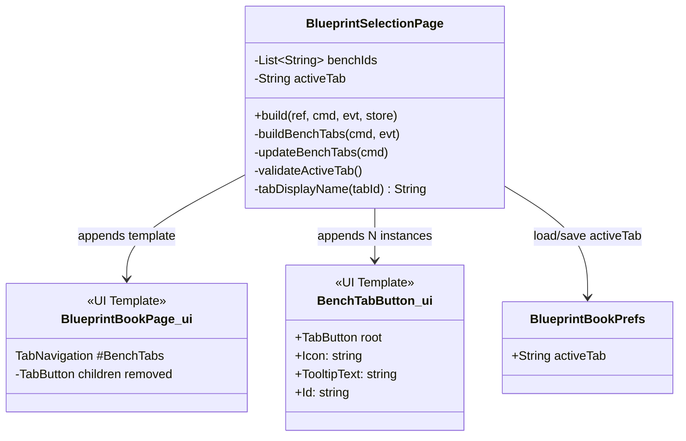
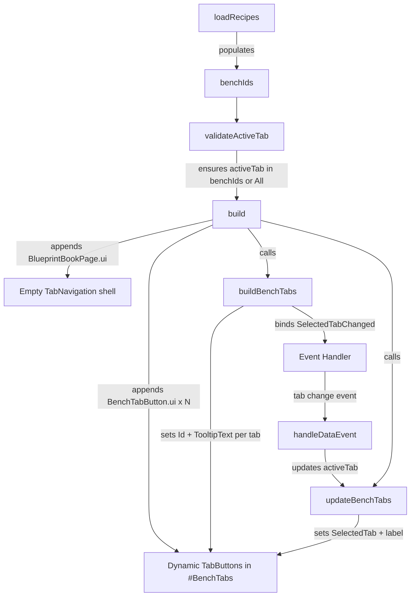
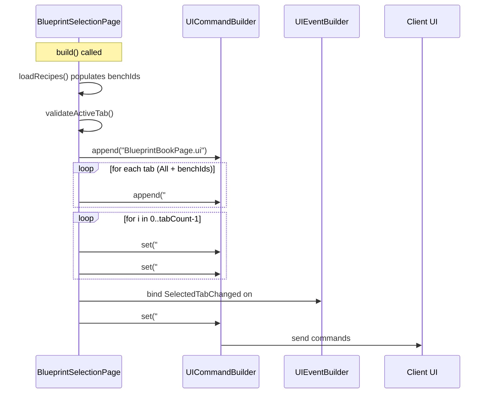

# Design: Dynamic Bench Tab Rendering

## 1. Overview

The Blueprint Bench UI currently hardcodes 3 `TabButton` children inside `#BenchTabs`, but the server discovers N bench IDs dynamically at runtime via `RecipeFilterRegistry`. This design replaces the hardcoded tabs with a reusable `BenchTabButton.ui` template that is dynamically appended in `build()`, following the exact same pattern used for `SetFilterButton.ui` in `#SetFilters`.

## 2. Design Priorities

1. **Framework-native patterns** — use the established `cmd.append()` + `cmd.set()` pattern already proven with `#SetFilters`, `#MaterialGroups`, and `#RecipeGridArea`
2. **Simplicity** — minimal file changes, no new abstractions
3. **Correctness** — validate persisted `activeTab` against live `benchIds` to prevent stale state

## 3. Component Diagram



## 4. Responsibility Map



## 5. Sequence Diagram



## 6. File Inventory

| File | Action | Summary |
|------|--------|---------|
| `src/main/resources/Common/UI/Custom/Pages/BlueprintBook/BenchTabButton.ui` | **CREATE** | Reusable tab button template |
| `src/main/resources/Common/UI/Custom/Pages/BlueprintBook/BlueprintBookPage.ui` | **MODIFY** | Remove 3 hardcoded `TabButton` children from `#BenchTabs` |
| `src/main/java/com/CodeCreature/ui/bench/BlueprintSelectionPage.java` | **MODIFY** | Append tabs dynamically, validate `activeTab`, update `buildBenchTabs` |

No other files need changes. `BlueprintBookPrefs.java` already stores `activeTab` as a `String` — no schema change needed.

## 7. BenchTabButton.ui Template — Exact Content

Create `src/main/resources/Common/UI/Custom/Pages/BlueprintBook/BenchTabButton.ui`:

```
// BenchTabButton — single bench tab button
// Reusable component: server appends N instances into #BenchTabs during build()
// Server updates via cmd.set() on indexed selectors: #BenchTabs[N].Id, #BenchTabs[N].TooltipText

TabButton {
    Icon: "../../Common/RecipesIcon.png";
    TooltipText: "";
    Id: "";
}
```

**Notes:**
- Unlike `SetFilterButton.ui`, no `Visible: false` is needed — we only append the exact number of tabs required.
- `Icon` uses the same default icon as the hardcoded tabs. If per-bench icons are added later, the server can set `#BenchTabs[i].Icon` dynamically.
- `Id` and `TooltipText` start empty and are set by the server via `cmd.set()`.

## 8. BlueprintBookPage.ui Changes — Exact Diff

Remove the three hardcoded `TabButton` children, leaving the `TabNavigation` shell empty:

**Before:**
```
    TabNavigation #BenchTabs {
        Style: $C.@TopTabsStyle;
        SelectedTab: "All";
        Anchor: (Height: 66, Left: 2, Right: 0);

        TabButton {
            Icon: "../../Common/RecipesIcon.png";
            TooltipText: "All";
            Id: "All";
        }

        TabButton {
            Icon: "../../Common/RecipesIcon.png";
            TooltipText: "Builders Bench";
            Id: "Builders";
        }

        TabButton {
            Icon: "../../Common/RecipesIcon.png";
            TooltipText: "Furniture Bench";
            Id: "Furniture_Bench";
        }
    }
```

**After:**
```
    TabNavigation #BenchTabs {
        Style: $C.@TopTabsStyle;
        SelectedTab: "All";
        Anchor: (Height: 66, Left: 2, Right: 0);
    }
```

## 9. BlueprintSelectionPage.java Changes

### 9.1 Add `validateActiveTab()` method

Add a new private method that checks whether the persisted `activeTab` still exists in the current `benchIds`:

```java
/**
 * Validates that {@link #activeTab} corresponds to a currently known bench ID.
 * Falls back to {@link #ALL_TAB} if the saved tab is stale (e.g., a bench was
 * removed from the registry since the preference was saved).
 */
private void validateActiveTab() {
    if (ALL_TAB.equals(activeTab)) return;
    if (!benchIds.contains(activeTab)) {
        DebugLogger.log(BLUEPRINT_BOOK, Level.WARNING,
                "[BlueprintBook] Saved activeTab '" + activeTab +
                "' not in current benchIds " + benchIds + "; resetting to All");
        activeTab = ALL_TAB;
    }
}
```

**Where:** After `tabDisplayName()` (around line 627).

### 9.2 Call `validateActiveTab()` after `loadRecipes()`

In `build()`, immediately after `loadRecipes()` returns (line ~258), add:

```java
        loadRecipes();
        validateActiveTab(); // ← ADD THIS LINE
```

This ensures stale prefs are corrected before any UI is built.

### 9.3 Append dynamic tab buttons in `build()`

In `build()`, after `cmd.append("Pages/BlueprintBook/BlueprintBookPage.ui")` (line ~289) and before the set filter append loop, add the tab button append loop:

```java
        // Load main template
        cmd.append("Pages/BlueprintBook/BlueprintBookPage.ui");

        // ── Append bench tab buttons dynamically ──
        // "All" tab + one tab per discovered bench ID
        int tabCount = 1 + benchIds.size();
        for (int i = 0; i < tabCount; i++) {
            cmd.append("#BenchTabs", "Pages/BlueprintBook/BenchTabButton.ui");
        }
```

### 9.4 Refactor `buildBenchTabs(UIEventBuilder evt)` → `buildBenchTabs(UICommandBuilder cmd, UIEventBuilder evt)`

Change the method signature to also accept `UICommandBuilder` so it can set properties on the appended tabs:

```java
private void buildBenchTabs(UICommandBuilder cmd, UIEventBuilder evt) {
    // Set Id and TooltipText on each dynamically appended tab button
    int tabIndex = 0;

    // Tab 0: "All"
    cmd.set("#BenchTabs[" + tabIndex + "].Id", ALL_TAB);
    cmd.set("#BenchTabs[" + tabIndex + "].TooltipText", tabDisplayName(ALL_TAB));
    tabIndex++;

    // Tabs 1..N: one per bench ID
    for (String benchId : benchIds) {
        cmd.set("#BenchTabs[" + tabIndex + "].Id", benchId);
        cmd.set("#BenchTabs[" + tabIndex + "].TooltipText", tabDisplayName(benchId));
        tabIndex++;
    }

    // Bind the tab-change event (unchanged)
    evt.addEventBinding(
            CustomUIEventBindingType.SelectedTabChanged, "#BenchTabs",
            EventData.of("@SelectedTab", "#BenchTabs.SelectedTab"),
            false
    );
}
```

### 9.5 Update the call site in `build()`

Change the existing call at line ~345 from:

```java
        buildBenchTabs(evt);
```

to:

```java
        buildBenchTabs(cmd, evt);
```

### 9.6 `updateBenchTabs()` — No changes needed

The existing implementation already works with dynamic tab IDs:

```java
private void updateBenchTabs(UICommandBuilder cmd) {
    cmd.set("#BenchTabs.SelectedTab", activeTab);
    cmd.set("#ActiveBenchLabel.Text", tabDisplayName(activeTab));
}
```

It sets `SelectedTab` to whatever `activeTab` is (now validated), and the label uses `tabDisplayName()` which works for any ID.

## 10. Tab Display Name Mapping

The existing `tabDisplayName()` method:

```java
private static String tabDisplayName(String tabId) {
    if (tabId == null) return "";
    return tabId.replace('_', ' ');
}
```

**Assessment: Sufficient for current needs.** Bench IDs from the registry (e.g., `Furniture_Bench`, `Builders`, `Workbench`, `Fieldcraft`) convert cleanly:

| Tab ID | Display Name |
|--------|-------------|
| `All` | `All` |
| `Builders` | `Builders` |
| `Furniture_Bench` | `Furniture Bench` |
| `Workbench` | `Workbench` |
| `Fieldcraft` | `Fieldcraft` |

If future bench IDs need custom display names (e.g., `FB` → `Furniture Bench`), a `Map<String, String>` override could be added, but that is out of scope for this change.

## 11. Package Structure

```
src/main/resources/Common/UI/Custom/Pages/BlueprintBook/
├── BlueprintBookPage.ui          ← MODIFY (remove hardcoded TabButtons)
├── BenchTabButton.ui              ← CREATE (new reusable template)
├── SetFilterButton.ui             (unchanged — reference pattern)
├── GroupFilterButton.ui           (unchanged)
└── SetGroupContainer.ui           (unchanged)

src/main/java/com/CodeCreature/ui/bench/
├── BlueprintSelectionPage.java    ← MODIFY (dynamic tab append + validation)
├── BlueprintBookPrefs.java       (unchanged)
└── BlueprintBookPrefsStore.java  (unchanged)
```

## 12. Integration Changes Required

| Existing File | Change |
|---------------|--------|
| `BlueprintBookPage.ui` | Remove 3 `TabButton` blocks from inside `TabNavigation #BenchTabs` |
| `BlueprintSelectionPage.java` | Add `validateActiveTab()` method |
| `BlueprintSelectionPage.java` | Add tab append loop in `build()` after main template append |
| `BlueprintSelectionPage.java` | Change `buildBenchTabs(evt)` signature to `buildBenchTabs(cmd, evt)` |
| `BlueprintSelectionPage.java` | Update call site from `buildBenchTabs(evt)` to `buildBenchTabs(cmd, evt)` |

Nothing needs to be deleted after migration — this is a clean extension of the existing pattern.

## 13. Open Questions

1. **TabNavigation accepts dynamic children?** — We assume `cmd.append("#BenchTabs", ...)` works for `TabNavigation` the same way it works for `Group` containers. This is consistent with the build-time DOM construction model (all `cmd.append()` calls run before the page is sent to the client). If `TabNavigation` rejects dynamically appended `TabButton` children, the fallback is to generate the entire `TabNavigation` block inline via string building — but this is unlikely given the framework's compositional design.

2. **Per-bench icons** — All tabs currently use `RecipesIcon.png`. If distinct bench icons are desired, the server can set `#BenchTabs[i].Icon` to a per-bench path. The `BenchTabButton.ui` template already exposes `Icon` as a settable property. This is deferred to a future enhancement.

## 14. Handoff Checklist

- [x] Component diagram included
- [x] Responsibility map included
- [x] All interfaces have doc-comment contracts
- [x] All skeleton files created with TODO markers
- [x] Integration Changes Required section populated
- [x] Open Questions section populated
- [x] Task Decomposition section populated

## 15. Task Decomposition

### Wave 1 (no dependencies — can run in parallel)

#### Unit: BenchTabButton.ui
- **Files**: `src/main/resources/Common/UI/Custom/Pages/BlueprintBook/BenchTabButton.ui`
- **Contract**: Create the reusable `TabButton` template with empty `Id` and `TooltipText` properties, using `RecipesIcon.png` as the default icon
- **Dependencies**: none
- **Done when**: File exists with valid `.ui` syntax matching the template in Section 7

#### Unit: BlueprintBookPage.ui cleanup
- **Files**: `src/main/resources/Common/UI/Custom/Pages/BlueprintBook/BlueprintBookPage.ui`
- **Contract**: Remove the 3 hardcoded `TabButton` children from `TabNavigation #BenchTabs`, leaving the container empty
- **Dependencies**: none
- **Done when**: `#BenchTabs` contains no `TabButton` children; only `Style`, `SelectedTab`, and `Anchor` properties remain

### Wave 2 (depends on Wave 1)

#### Unit: BlueprintSelectionPage.java — dynamic tab logic
- **Methods**: `validateActiveTab()` (new), modify `build()`, modify `buildBenchTabs()`
- **Contract**: Append `BenchTabButton.ui` into `#BenchTabs` for each bench ID (plus "All"), set `Id`/`TooltipText` on each, validate persisted `activeTab` against live `benchIds`
- **Dependencies**: Wave 1 (BenchTabButton.ui must exist, BlueprintBookPage.ui must have empty `#BenchTabs`)
- **Done when**: Tabs render dynamically from `benchIds`; stale `activeTab` values fall back to "All"; `SelectedTabChanged` event still fires correctly

### Wave 3 (integration — depends on Wave 2)

#### Unit: Manual verification
- **Files**: none (runtime test)
- **Contract**: Launch the Blueprint Bench UI and verify: (a) all discovered bench IDs appear as tabs, (b) tab switching works, (c) prefs persist and restore correctly, (d) stale prefs fall back to "All"
- **Dependencies**: all Wave 2 units
- **Done when**: All 4 verification criteria pass
