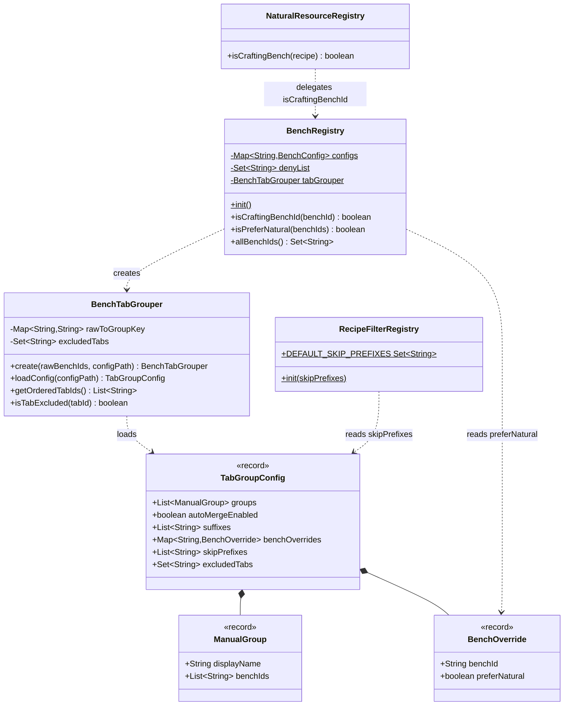
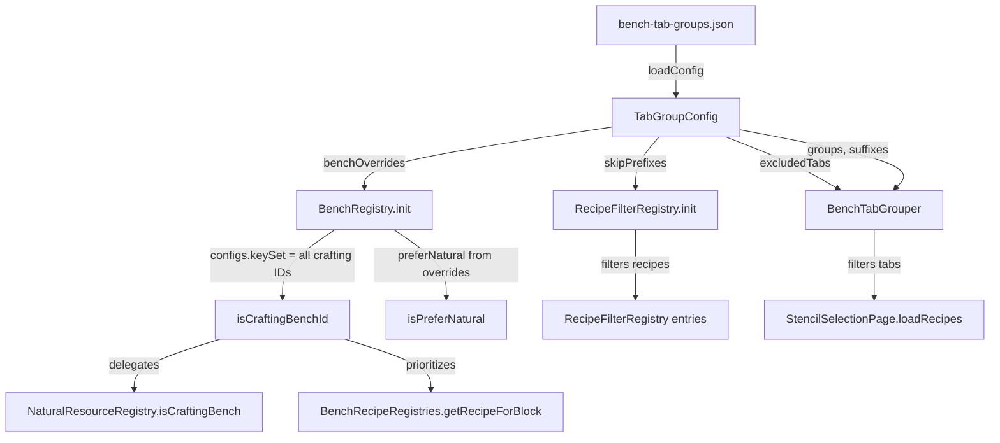
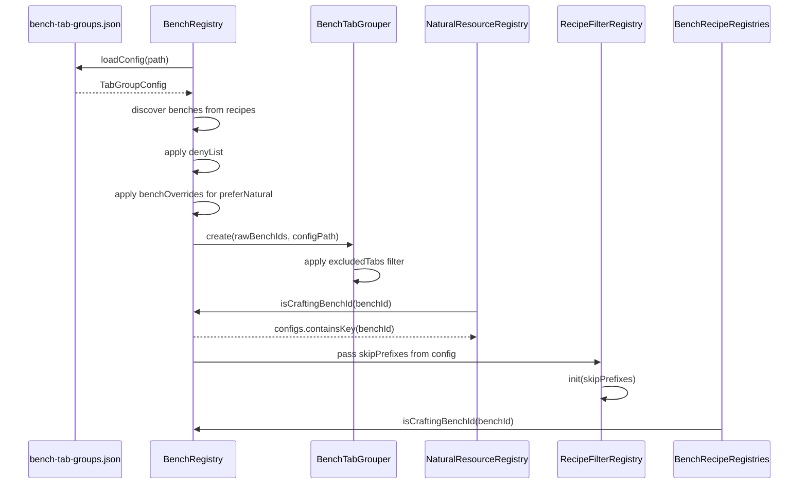

# Design: Externalize Hardcoded Bench Config

## 1. Overview

Eliminate three hardcoded lists (`CRAFTING_BENCH_IDS`, `FURNITURE_BENCH_ID`, `DEFAULT_SKIP_PREFIXES`) and one stale duplicate (`NaturalResourceRegistry.CRAFTING_BENCH_IDS`) by making the bench system fully data-driven. All new config fields are added to the existing `bench-tab-groups.json`. Missing fields fall back to current defaults — zero breaking changes for existing deployments.

## 2. Design Priorities

1. **Backward compatibility** — missing fields = current behavior
2. **Single source of truth** — one config file, one `isCraftingBenchId()` method
3. **Simplicity** — no new config files, no new classes beyond one record

## 3. Config Schema

Updated `bench-tab-groups.json`:

```json
{
  "autoMergeEnabled": true,
  "suffixes": ["bench", "misc", "table"],
  "groups": [
    { "displayName": "Crafting", "benchIds": ["fieldcraft", "workbench"] }
  ],
  "benchOverrides": {
    "Furniture_Bench": { "preferNatural": true }
  },
  "skipPrefixes": ["Stencil_", "Salvage"],
  "excludedTabs": []
}
```

| Field | Type | Default if missing | Effect |
|-------|------|--------------------|--------|
| `benchOverrides` | `Map<String, {preferNatural: bool}>` | `{"Furniture_Bench": {"preferNatural": true}}` | Per-bench flags applied during `BenchRegistry.init()`. Unknown bench IDs are logged and ignored. |
| `skipPrefixes` | `String[]` | `["Stencil_", "Salvage"]` | Recipe ID prefixes excluded from `RecipeFilterRegistry`. Replaces `DEFAULT_SKIP_PREFIXES` as init input. |
| `excludedTabs` | `String[]` | `[]` | Tab group keys hidden from `getOrderedTabIds()`. Bench remains in economy (recipes still indexed), only hidden from Stencil Book UI. |

## 4. Component Diagram



## 5. Data Flow



## 6. Init Sequence



## 7. Java Changes — File by File

### 7a. `BenchTabGrouper.java` — Config loading expansion

**`TabGroupConfig` record** — add three fields:

```java
record TabGroupConfig(
        @Nonnull List<ManualGroup> groups,
        boolean autoMergeEnabled,
        @Nonnull List<String> suffixes,
        @Nonnull Map<String, BenchOverride> benchOverrides,  // NEW
        @Nonnull List<String> skipPrefixes,                  // NEW
        @Nonnull Set<String> excludedTabs                    // NEW
) {}
```

**New record** (nested in `BenchTabGrouper` or standalone):

```java
record BenchOverride(@Nonnull String benchId, boolean preferNatural) {}
```

**`loadConfig()`** — parse three new JSON fields with defaults:
- `benchOverrides`: default `Map.of("Furniture_Bench", new BenchOverride("Furniture_Bench", true))`
- `skipPrefixes`: default `List.of("Stencil_", "Salvage")`
- `excludedTabs`: default `Set.of()`

**`create()`** — accept `TabGroupConfig` instead of just `Path` (or load internally as now). Store `excludedTabs` as instance field.

**`getOrderedTabIds()`** — filter out entries present in `excludedTabs`.

**New method**:
```java
/** Returns true if the tab group key is in the excludedTabs set. */
public boolean isTabExcluded(@Nonnull String tabId);
```

### 7b. `BenchRegistry.java` — Remove hardcoded lists

**Delete**: `CRAFTING_BENCH_IDS` constant (line 75) and `FURNITURE_BENCH_ID` constant (line 68).

**`init()`** changes:
1. Load `TabGroupConfig` via `BenchTabGrouper.loadConfig()` early (before bench discovery loop).
2. Use `config.benchOverrides()` to determine `preferNatural` instead of `FURNITURE_BENCH_ID.equals(req.id)`.
3. Store `config.skipPrefixes()` in a static field accessible to `DropScaler`.
4. Pass full config to `BenchTabGrouper.create()`.

**`isCraftingBenchId()`** — change from `CRAFTING_BENCH_IDS.contains(benchId)` to `configs.containsKey(benchId)`. Every registered (non-denied) bench is a crafting bench. Processing benches excluded via deny-list.

**New accessor**:
```java
/** Returns the skip prefixes loaded from config (for RecipeFilterRegistry). */
@Nonnull
public static List<String> getSkipPrefixes();
```

### 7c. `NaturalResourceRegistry.java` — Delete duplicate

**Delete**: `CRAFTING_BENCH_IDS` constant (line 237) and `isCraftingBench()` method (lines 238-247).

**Replace** with delegation:
```java
private static boolean isCraftingBench(@Nonnull CraftingRecipe recipe) {
    BenchRequirement[] reqs = recipe.getBenchRequirement();
    if (reqs == null) return false;
    for (BenchRequirement req : reqs) {
        if (req != null && req.id != null && BenchRegistry.isCraftingBenchId(req.id)) {
            return true;
        }
    }
    return false;
}
```

This fixes the Workbench/Fieldcraft misclassification bug.

### 7d. `DropScaler.java` — Use config-loaded skip prefixes

**Line 71** change:
```java
// Before:
RecipeFilterRegistry.init(RecipeFilterRegistry.DEFAULT_SKIP_PREFIXES);

// After:
RecipeFilterRegistry.init(new LinkedHashSet<>(BenchRegistry.getSkipPrefixes()));
```

### 7e. `RecipeFilterRegistry.java` — No structural change

`DEFAULT_SKIP_PREFIXES` can remain as a compile-time fallback constant. No signature changes needed — `init(Set<String>)` already accepts the parameter.

## 8. Risk Assessment

| Misconfiguration | Impact | Mitigation |
|-----------------|--------|------------|
| `benchOverrides` references unknown bench ID | No effect — applied only to discovered benches. Log warning. | Warn at init: "benchOverride for '%s' does not match any discovered bench" |
| `skipPrefixes` is empty `[]` | All recipes including Stencil_ and Salvage appear in UI. Cluttered but functional. | Log info at init showing active prefix count. |
| `skipPrefixes` too broad (e.g. `[""]`) | All recipes filtered — empty UI. | Validate: skip any prefix that is empty string. Log warning. |
| `excludedTabs` hides all tabs | Empty Stencil Book. Player sees "All" tab with zero entries if all groups excluded. | Log warning if `excludedTabs.size() >= orderedTabIds.size()`. |
| `excludedTabs` references nonexistent tab key | Silently ignored (set difference). | Log info listing unmatched exclusions. |
| `benchOverrides` sets `preferNatural: true` for many benches | Over-aggressive natural item preference in ResourceType resolution. Cosmetic/balance issue only. | No guard needed — admin intent. |
| JSON parse failure | Existing behavior: fall back to hardcoded defaults. No regression. | Already handled by `loadConfig()` catch blocks. |

## 9. Package Structure

No new files beyond the `BenchOverride` record. If kept as nested record in `BenchTabGrouper`:

```
src/main/java/com/CodeCreature/registry/
├── BenchConfig.java              (unchanged)
├── BenchRegistry.java            (modified — R1, R2)
├── BenchTabGrouper.java          (modified — R3, R4, new BenchOverride record)
├── RecipeFilterRegistry.java     (unchanged)
src/main/java/com/CodeCreature/scaling/
├── DropScaler.java               (modified — R3 wiring)
├── NaturalResourceRegistry.java  (modified — R1 delete duplicate)
run/mods/Crafting_StencilSystem/
├── bench-tab-groups.json         (add benchOverrides, skipPrefixes, excludedTabs)
```

## 10. Integration Changes Required

| File | Change | Details |
|------|--------|---------|
| `BenchRegistry.java` | Delete `CRAFTING_BENCH_IDS` constant | Replace with `configs.containsKey()` |
| `BenchRegistry.java` | Delete `FURNITURE_BENCH_ID` constant | Replace with `config.benchOverrides().get(req.id)` lookup |
| `BenchRegistry.java` | Add `getSkipPrefixes()` static accessor | Returns loaded skip prefixes for `DropScaler` to pass to `RecipeFilterRegistry` |
| `BenchTabGrouper.java` | Expand `TabGroupConfig` record | Add 3 new fields with defaults |
| `BenchTabGrouper.java` | Add `BenchOverride` record | Nested record for per-bench flags |
| `BenchTabGrouper.java` | Expand `loadConfig()` parser | Parse `benchOverrides`, `skipPrefixes`, `excludedTabs` |
| `BenchTabGrouper.java` | Add `excludedTabs` instance field | Filter `getOrderedTabIds()` output |
| `NaturalResourceRegistry.java` | Delete `CRAFTING_BENCH_IDS` + local `isCraftingBench()` | Delegate to `BenchRegistry.isCraftingBenchId()` |
| `DropScaler.java` | Change `RecipeFilterRegistry.init()` call | Use `BenchRegistry.getSkipPrefixes()` instead of `DEFAULT_SKIP_PREFIXES` |
| `bench-tab-groups.json` | Add new fields | Backward-compatible additions |

## 11. Open Questions

1. **Should `excludedTabs` also suppress recipes from the "All" tab?** Current design: no — "All" shows everything. Excluding from "All" would require `StencilSelectionPage` changes. Recommend: keep "All" unfiltered for v1.
2. **Should `benchOverrides` support flags beyond `preferNatural`?** The record is extensible, but only `preferNatural` is wired today. Defer additional flags until a concrete need arises.

## Handoff Checklist

- [x] Component diagram included
- [x] Responsibility map included
- [x] All interfaces have doc contracts
- [x] All skeleton files created with TODO markers (inline in design — no separate skeleton files needed; changes are modifications to existing files)
- [x] Integration Changes Required section populated
- [x] Open Questions section populated
- [x] Task Decomposition section populated

## Task Decomposition

### Wave 1 (no dependencies — can run in parallel)

#### Unit: BenchTabGrouper.java — Config expansion
- **Methods**: Expand `TabGroupConfig` record (add 3 fields), add `BenchOverride` record, expand `loadConfig()` to parse new fields with defaults
- **Contract**: Parse `benchOverrides`, `skipPrefixes`, `excludedTabs` from JSON; missing fields return hardcoded defaults matching current behavior
- **Dependencies**: none
- **Done when**: `loadConfig()` returns a `TabGroupConfig` with all 6 fields populated from JSON or defaults; existing tests still pass

#### Unit: NaturalResourceRegistry.java — Delete duplicate
- **Methods**: Delete `CRAFTING_BENCH_IDS` constant and local `isCraftingBench()` body; replace with `BenchRegistry.isCraftingBenchId()` delegation
- **Contract**: `isCraftingBench(recipe)` returns true iff any bench requirement ID is a registered (non-denied) bench
- **Dependencies**: none (already imports BenchRegistry; existing `isCraftingBenchId()` API unchanged)
- **Done when**: `CRAFTING_BENCH_IDS` no longer exists in `NaturalResourceRegistry.java`; method delegates to `BenchRegistry`

### Wave 2 (depends on Wave 1: TabGroupConfig expansion)

#### Unit: BenchRegistry.java — Externalize hardcoded lists
- **Methods**: Delete `CRAFTING_BENCH_IDS` and `FURNITURE_BENCH_ID` constants; modify `init()` to load `TabGroupConfig` early and use `benchOverrides` for `preferNatural`; change `isCraftingBenchId()` to `configs.containsKey()`; add `getSkipPrefixes()`
- **Contract**: `isCraftingBenchId()` returns true for all registered benches; `preferNatural` is config-driven; `getSkipPrefixes()` exposes loaded prefixes
- **Dependencies**: Wave 1 `TabGroupConfig` expansion (needs `benchOverrides()` and `skipPrefixes()` accessors)
- **Done when**: No hardcoded bench ID constants remain; `init()` reads overrides from config; `getSkipPrefixes()` returns config values

#### Unit: BenchTabGrouper.java — excludedTabs filtering
- **Methods**: Add `excludedTabs` instance field; modify `create()` to store it; modify `getOrderedTabIds()` to filter; add `isTabExcluded()`
- **Contract**: `getOrderedTabIds()` omits keys in `excludedTabs`; `isTabExcluded()` returns true for excluded keys
- **Dependencies**: Wave 1 `TabGroupConfig` expansion (needs `excludedTabs()` accessor)
- **Done when**: Tabs listed in `excludedTabs` config do not appear in `getOrderedTabIds()` output

### Wave 3 (integration — depends on Wave 2)

#### Unit: DropScaler.java wiring + config file update
- **Files**: `DropScaler.java`, `bench-tab-groups.json`
- **Contract**: `DropScaler.apply()` passes config-loaded skip prefixes to `RecipeFilterRegistry.init()` instead of the compile-time constant; JSON file includes new fields with current defaults
- **Dependencies**: Wave 2 `BenchRegistry.getSkipPrefixes()`
- **Done when**: Full build passes; `RecipeFilterRegistry.init()` receives prefixes from config; JSON file has all new fields
