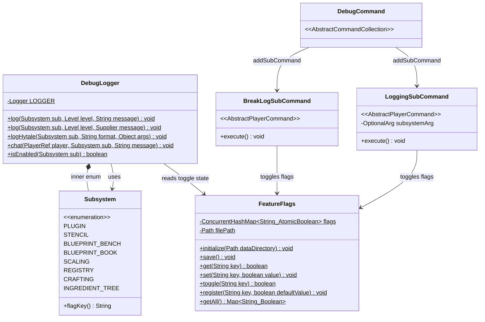
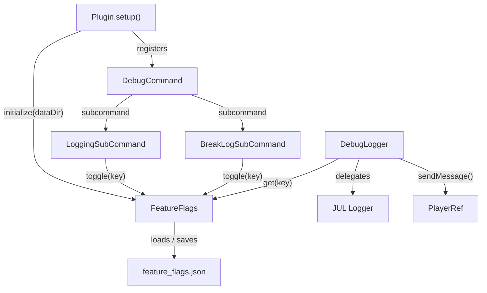
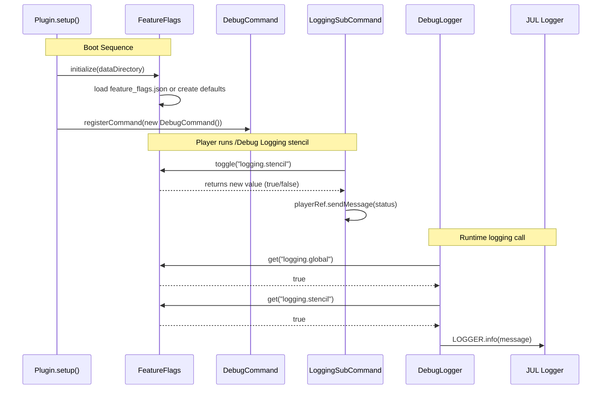

# Design: Feature Flags & Debug Logger

## 1. Overview

This design introduces a general-purpose **FeatureFlags** system backed by JSON persistence and a **DebugLogger** utility that reads its toggle state from FeatureFlags. Together, they replace ad-hoc `AtomicBoolean` toggles (like the one in `BreakBlockDiagnostic`) with a single, centralized, persisted flag store accessible from commands, ECS systems, and logging call sites.

A `/Debug` command group provides in-game control: `/Debug Logging` toggles global logging, `/Debug Logging <subsystem>` toggles per-subsystem logging, and `/Debug BreakLog` toggles the break-block diagnostic. All state flows through FeatureFlags, so every toggle is automatically persisted to `feature_flags.json` and survives server restarts.

## 2. Scope

### Files Created

| File | Purpose |
|------|---------|
| `src/main/java/com/CodeCreature/util/FeatureFlags.java` | Centralized flag store with JSON persistence |
| `src/main/java/com/CodeCreature/util/DebugLogger.java` | Logging utility gated by FeatureFlags |
| `src/main/java/com/CodeCreature/command/debug/DebugCommand.java` | `/Debug` command group |
| `src/main/java/com/CodeCreature/command/debug/LoggingSubCommand.java` | `/Debug Logging [subsystem]` |
| `src/main/java/com/CodeCreature/command/debug/BreakLogSubCommand.java` | `/Debug BreakLog` |

### Files Modified (during migration)

| File | Change |
|------|--------|
| `Plugin.java` | Add `FeatureFlags.initialize()` call and `DebugCommand` registration |
| `BreakBlockDiagnostic.java` | Replace local `AtomicBoolean` with `FeatureFlags.get("diagnostics.breakLog")` |

## 3. Class Diagram



## 4. Responsibility Map



| Class | Single Responsibility |
|-------|----------------------|
| `FeatureFlags` | Owns all runtime flag state; loads from and persists to JSON |
| `DebugLogger` | Provides gated logging methods that check FeatureFlags before delegating |
| `DebugLogger.Subsystem` | Maps logical subsystem names to their `logging.<name>` flag keys |
| `DebugCommand` | Groups debug subcommands under `/Debug` |
| `LoggingSubCommand` | Toggles `logging.global` or `logging.<subsystem>` and reports to player |
| `BreakLogSubCommand` | Toggles `diagnostics.breakLog` and reports to player |

## 5. Interface Contracts

### FeatureFlags

| Method | Description |
|--------|-------------|
| `initialize(Path dataDirectory)` | Loads `{dataDir}/feature_flags.json` via `BsonUtil.readDocumentNow`. If the file is missing or unreadable, registers all default flags and saves. Registers default keys for all known flags. Called once from `Plugin.setup()`. |
| `save()` | Writes the current flag map to `feature_flags.json` via `BsonUtil.writeDocument`. Builds a `BsonDocument` with one `BsonBoolean` entry per flag. Logs a warning on I/O failure — never throws. |
| `get(String key)` | Returns the current value of the flag. If the key is not registered, returns `true` (fail-open). Thread-safe: reads from `AtomicBoolean.get()`. |
| `set(String key, boolean value)` | Sets the flag and auto-saves. If the key is not registered, registers it first. Thread-safe: writes via `AtomicBoolean.set()`. |
| `toggle(String key)` | Flips the flag using CAS loop (matches `BreakBlockDiagnostic` pattern), auto-saves, returns the new value. |
| `register(String key, boolean defaultValue)` | Adds the key with the given default if not already present. Does not overwrite existing values (file-loaded values take precedence). |
| `getAll()` | Returns an unmodifiable `Map<String, Boolean>` snapshot of all flags. |

### DebugLogger

| Method | Description |
|--------|-------------|
| `log(Subsystem, Level, String)` | If `isEnabled(sub)` is true, logs the message via `java.util.logging.Logger` at the given level. The logger name is `"DebugLogger"`. |
| `log(Subsystem, Level, Supplier<String>)` | Lazy variant — only evaluates the supplier if logging is enabled. Use for `Level.FINE` and below to avoid string allocation. |
| `logHytale(Subsystem, String, Object...)` | If enabled, logs via `HytaleLogger.atInfo().log(format, args)` using a single shared `HytaleLogger` instance. For call sites that were already using `HytaleLogger`. |
| `chat(PlayerRef, Subsystem, String)` | If enabled, calls `playerRef.sendMessage(Message.raw(message))`. Thread-safe since `sendMessage` is thread-safe per the codebase threading model. |
| `isEnabled(Subsystem)` | Returns `FeatureFlags.get("logging.global") && FeatureFlags.get(sub.flagKey())`. Both must be true. |

### DebugLogger.Subsystem

| Value | `flagKey()` |
|-------|-------------|
| `PLUGIN` | `logging.plugin` |
| `STENCIL` | `logging.stencil` |
| `BLUEPRINT_BENCH` | `logging.blueprint_bench` |
| `BLUEPRINT_BOOK` | `logging.blueprint_book` |
| `SCALING` | `logging.scaling` |
| `REGISTRY` | `logging.registry` |
| `CRAFTING` | `logging.crafting` |
| `INGREDIENT_TREE` | `logging.ingredient_tree` |

### DebugCommand

Constructor registers `LoggingSubCommand` and `BreakLogSubCommand` as subcommands. Name: `"debug"`.

### LoggingSubCommand

- Name: `"logging"`
- Has `OptionalArg<String> subsystemArg` for the subsystem name
- If subsystem arg is **not provided**: toggles `logging.global`
- If subsystem arg **is provided**: validates against `Subsystem.values()`, toggles `logging.<subsystem>`
- Sends status message to player with `§a` (enabled) or `§c` (disabled) color

### BreakLogSubCommand

- Name: `"breaklog"`
- No arguments
- Toggles `diagnostics.breakLog` via `FeatureFlags.toggle()`
- Sends status message to player

## 6. JSON Schema

File: `{dataDirectory}/feature_flags.json`

```json
{
  "logging.global": true,
  "logging.plugin": true,
  "logging.stencil": true,
  "logging.blueprint_bench": true,
  "logging.blueprint_book": true,
  "logging.scaling": true,
  "logging.registry": true,
  "logging.crafting": true,
  "logging.ingredient_tree": true,
  "diagnostics.breakLog": false
}
```

All values are boolean. Unknown keys loaded from disk are preserved. New keys added via `register()` only appear if not already present in the file.

## 7. Skeleton Code

See the following source files (created alongside this document):

```
src/main/java/com/CodeCreature/
├── util/
│   ├── FeatureFlags.java
│   └── DebugLogger.java
└── command/
    └── debug/
        ├── DebugCommand.java
        ├── LoggingSubCommand.java
        └── BreakLogSubCommand.java
```

## 8. Migration Plan

### Plugin.java

Add two lines to `setup()`:

```java
// After BlueprintBenchPrefsStore.initialize(this.getDataDirectory()):
FeatureFlags.initialize(this.getDataDirectory());

// With the other registerCommand calls:
this.getCommandRegistry().registerCommand(new DebugCommand());
```

Add imports:
```java
import com.CodeCreature.util.FeatureFlags;
import com.CodeCreature.command.debug.DebugCommand;
```

### BreakBlockDiagnostic.java

**Remove** the local `AtomicBoolean` field and `toggle()` / `isEnabled()` methods.

**Replace** the guard in the event handler:
```java
// Before:
if (!enabled.get()) return;

// After:
if (!FeatureFlags.get("diagnostics.breakLog")) return;
```

Add import:
```java
import com.CodeCreature.util.FeatureFlags;
```

Remove import:
```java
// No longer needed:
import java.util.concurrent.atomic.AtomicBoolean;
```

## 9. Task Decomposition

### Wave 1 (no dependencies — can run in parallel)

#### Unit: FeatureFlags.java
- **Methods**: `initialize`, `save`, `get`, `set`, `toggle`, `register`, `getAll`
- **Contract**: Thread-safe flag store with BsonUtil JSON persistence
- **Dependencies**: none
- **Done when**: All methods implemented; unit test confirms load → toggle → save → reload round-trip

#### Unit: DebugLogger.java (Subsystem enum only)
- **Methods**: `Subsystem.flagKey()`
- **Contract**: Enum maps subsystem names to `logging.<name>` keys
- **Dependencies**: none
- **Done when**: `Subsystem.values()` returns all 8 entries; `flagKey()` returns correct keys

### Wave 2 (depends on Wave 1)

#### Unit: DebugLogger.java (logging methods)
- **Methods**: `log` (both overloads), `logHytale`, `chat`, `isEnabled`
- **Contract**: Gate all output on `FeatureFlags.get()` checks before delegating
- **Dependencies**: FeatureFlags (Wave 1)
- **Done when**: `isEnabled` returns false when global or subsystem flag is off; log methods produce no output when disabled

#### Unit: LoggingSubCommand.java
- **Methods**: `execute`
- **Contract**: Toggle logging flags via FeatureFlags and report status to player
- **Dependencies**: FeatureFlags (Wave 1)
- **Done when**: `/Debug Logging` toggles global; `/Debug Logging stencil` toggles subsystem; invalid subsystem names produce error message

#### Unit: BreakLogSubCommand.java
- **Methods**: `execute`
- **Contract**: Toggle `diagnostics.breakLog` via FeatureFlags and report status
- **Dependencies**: FeatureFlags (Wave 1)
- **Done when**: `/Debug BreakLog` toggles flag and sends confirmation

### Wave 3 (integration — depends on Wave 2)

#### Unit: DebugCommand.java
- **Methods**: constructor only
- **Contract**: Wire LoggingSubCommand and BreakLogSubCommand as subcommands
- **Dependencies**: LoggingSubCommand, BreakLogSubCommand (Wave 2)
- **Done when**: `/Debug` shows subcommand list; both subcommands execute correctly

#### Unit: Integration wiring
- **Files**: `Plugin.java`, `BreakBlockDiagnostic.java`
- **Contract**: Register FeatureFlags and DebugCommand in Plugin.setup(); migrate BreakBlockDiagnostic to use FeatureFlags
- **Dependencies**: All Wave 2 units
- **Done when**: Full build passes; FeatureFlags initializes on startup; `/Debug BreakLog` controls `BreakBlockDiagnostic` behavior; old `AtomicBoolean` removed

## 10. Handoff Checklist

- [x] Component diagram included
- [x] Responsibility map included
- [x] All interfaces have Javadoc-level contracts
- [x] All skeleton files created with TODO markers
- [x] Integration Changes Required section populated
- [x] Open Questions section populated (none — requirements are fully specified)
- [x] Task Decomposition section populated

## Sequence Diagram


